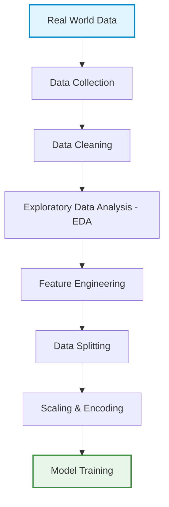

# Data Processing Pipeline

Data processing is the crucial phase of transforming raw data into a clean, structured format suitable for training machine learning models.

## The Data Pipeline Flow

---

## Key Terminology

* **Dataset**: A collection of observations (rows) gathered from the real world.
* **Sample**: A single row or observation in the dataset.
* **Feature**: The input variables (columns) used by the model to make predictions.
* **Label (Target)**: The ground truth value we want the model to predict. *(Note: A label is **not** a feature!)*

---

## Data Formats

| Type | Description | Examples |
| :--- | :--- | :--- |
| **Structured** | Highly organized, clean row/column layout. | CSV, Excel, SQL Tables |
| **Semi-Structured** | Contains tags or markers to separate data elements. | JSON, YAML, XML |
| **Unstructured** | Raw, unorganized data, typical for Deep Learning. | Videos, Images, Audio, Free Text |

---

## Pipeline Stages

### 1. Data Collection & Labeling
* Gathering data from various sources (APIs, databases, scraping, sensors).
* Labeling the data to establish ground truth for supervised learning.

### 2. Exploratory Data Analysis (EDA)
EDA helps us understand the structure, patterns, and quality of our data. Key questions to ask:
- [ ] How many classes are there? Is the dataset **balanced**?
- [ ] Are there **missing values**?
- [ ] Are there **outliers** or noise?
- [ ] Are there **duplicate** records/images?
- [ ] Are there **wrong units** or incorrect labels?

### 3. Handling Missing Values
When data is missing, we can apply the following strategies:
* **Deletion**: Remove rows or columns (use with caution, only when data is missing completely at random).
* **Imputation**:
  * **Numerical**: Fill with Mean, Median, or Interpolation.
  * **Categorical**: Fill with Mode (most frequent value).
  * **Advanced**: Predict missing values using another machine learning model.

### 4. Outliers & Noise
Identify and handle anomalous data points or noise that might skew model training.

### 5. Feature Engineering
The process of creating new features or transforming existing ones to help the model learn better.

### 6. Scaling & Encoding
* **Scaling**: Normalizing or standardizing numerical features so they share a common scale (e.g., MinMax Scaling, StandardScaler).
* **Encoding**: Converting categorical variables into numerical values.
  * *Example*: `Red` ➔ `0`, `Blue` ➔ `1` (or using One-Hot Encoding).

---

> [!CAUTION]
> ### Data Leakage
> Data leakage occurs when information from the target or test set is unintentionally shared with the model during training (e.g., scaling on the entire dataset instead of just the training split). This leads to overly optimistic performance on training/validation datasets but poor performance in production. Always split your data **before** applying transformations.

---

## Data Splitting

We typically partition our dataset into three distinct sets:

1. **Train Set (70% - 80%)**: Used to train the model weights.
2. **Validation Set (10% - 20%)**: Used to tune hyperparameters and evaluate model variants.
3. **Test Set (10%)**: Used as a final, unbiased evaluation of the final model.

*Common split ratios: `80/10/10` or `70/20/10`*

### Data Augmentation
Generating variations of existing data points (e.g., rotating, flipping, cropping images) to artificially increase dataset size and improve model **robustness**.