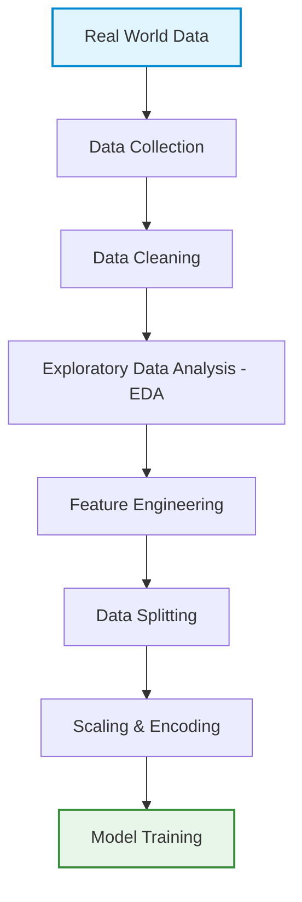

# Data Processing Pipeline

## Related Notes

- [[01 Learning/AI/ML/ML Fundamentals|Machine Learning Fundamentals]]
- [[01 Learning/AI/ML/Famous models|Famous Machine-Learning Models]]
- [[01 Learning/AI/DL/Evaluation|Model Evaluation]]

Data processing transforms raw data into a clean, consistent format suitable for training and evaluating machine-learning models.

## Data Pipeline

---

## Key Terms

- **Dataset:** A collection of observations gathered from the real world.
- **Sample:** A single observation in the dataset, often represented as a row.
- **Feature:** An input variable used by the model to make a prediction.
- **Label (target):** The ground-truth value that a supervised model should predict. A label is not an input feature.

---

## Data Formats

| Type | Description | Examples |
| :--- | :--- | :--- |
| **Structured** | Organized in a defined row-and-column schema. | CSV, Excel, SQL tables |
| **Semi-Structured** | Contains tags or markers to separate data elements. | JSON, YAML, XML |
| **Unstructured** | Data without a predefined tabular schema. | Video, images, audio, free text |

---

## Pipeline Stages

### 1. Data Collection and Labeling

- Gather data from sources such as APIs, databases, web pages, and sensors.
- Label the data to establish ground truth for supervised learning.

### 2. Exploratory Data Analysis (EDA)
EDA helps reveal the structure, patterns, and quality of the data. Key questions include:
- [ ] How many classes are there? Is the dataset **balanced**?
- [ ] Are there **missing values**?
- [ ] Are there **outliers** or noise?
- [ ] Are there **duplicate** records/images?
- [ ] Are there **wrong units** or incorrect labels?

### 3. Handling Missing Values
When data is missing, we can apply the following strategies:
- **Deletion:** Remove affected rows or columns when the loss is justified and unlikely to introduce bias.
- **Imputation:**
  - **Numerical:** Fill values using the mean, median, or interpolation.
  - **Categorical:** Fill values using the mode or an explicit `Unknown` category.
  - **Model-based:** Predict missing values with another model.

### 4. Outliers and Noise
Identify and handle anomalous data points or noise that might skew model training.

### 5. Feature Engineering
The process of creating new features or transforming existing ones to help the model learn better.

### 6. Scaling & Encoding
- **Scaling:** Normalize or standardize numerical features so that they share a comparable scale—for example, with min-max scaling or standardization.
- **Encoding:** Convert categorical variables into a numerical representation.
  - Example: encode `Red` and `Blue` with one-hot vectors. Integer encoding such as `Red` → `0`, `Blue` → `1` may imply an unintended order.

---

> [!CAUTION]
> ### Data Leakage
> Data leakage occurs when information unavailable at prediction time—such as target information or test-set statistics—enters model training. For example, fitting a scaler on the entire dataset leaks information from the validation and test sets. Split the data first, then fit transformations on the training set only.

---

## Data Splitting

We typically partition our dataset into three distinct sets:

1. **Training set (70–80%):** Used to fit model parameters.
2. **Validation set (10–20%):** Used to tune hyperparameters and compare model variants.
3. **Test set (about 10%):** Reserved for the final, unbiased evaluation.

Common split ratios include `80/10/10` and `70/20/10`.

### Data Augmentation
Data augmentation generates meaningful variations of existing samples—for example, by rotating, flipping, or cropping images—to increase effective dataset size and improve model robustness.
