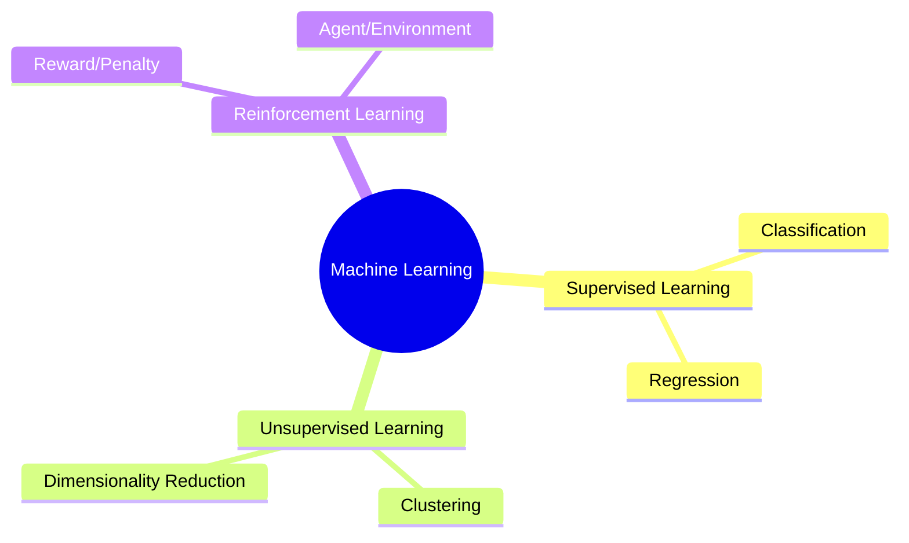

# Machine Learning Fundamentals

**Machine learning (ML)** is a branch of AI in which systems learn patterns from data to make predictions or decisions.

---

## Types of Machine Learning

Machine learning algorithms are generally categorized into three main paradigms:

---

## 1. Supervised Learning

In supervised learning, models are trained on **labeled data**.

$$\text{Input } (X) \longrightarrow \text{Model} \longrightarrow \text{Prediction } (\hat{y}) \longleftrightarrow \text{Label } (y)$$

- **Core idea:** Learn a mapping from input variables to a target output.
- **Common models:** Logistic regression, random forests, support vector machines (SVMs), and neural networks.
- **Applications:** Defect detection and weather prediction.

---

## 2. Unsupervised Learning

In unsupervised learning, the model is given **unlabeled data** and must discover hidden patterns and structures on its own.

- **Core idea:** Discover useful groupings or representations without target labels.
- **Common methods:**
  - **Clustering:** k-means and DBSCAN
  - **Dimensionality reduction:** principal component analysis (PCA) and t-SNE
- **Applications:** Customer segmentation and anomaly detection.

---

## 3. Reinforcement Learning (RL)

Reinforcement learning uses a **penalty-reward feedback loop** to train an agent to make a sequence of decisions in an environment.

- **Core idea:** Maximize cumulative reward through interaction with an environment.
- **Key components:** Agent, environment, state, action, and reward.
- **Applications:** Robotics, autonomous systems, and game-playing agents.

---

## 4. Regression vs. Classification

Within supervised learning, tasks are commonly divided according to the target variable:

| Feature | Regression | Classification |
| :--- | :--- | :--- |
| **Target Variable** | Continuous numerical value | Discrete class labels / categories |
| **Output example** | Price, temperature, age | Cat vs. dog, spam vs. not spam |
| **Algorithms** | Linear regression, regression trees | Logistic regression, classification trees, SVM |

---

> [!NOTE]
> ### Best Practices
> Before training an ML model, define the evaluation strategy and split the data into training, validation, and test sets. Fit preprocessing and feature-extraction steps using the training set only to avoid data leakage.
