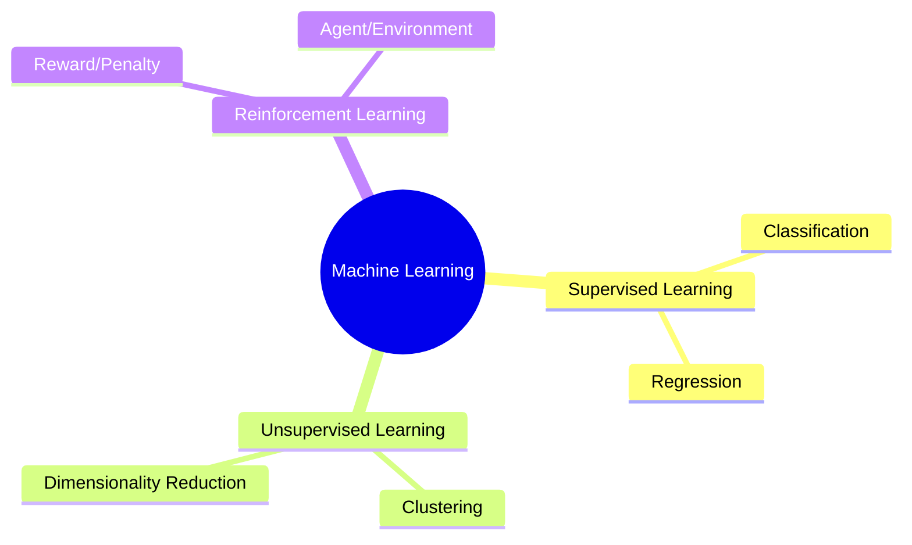

# Machine Learning Fundamentals

Machine Learning is a classic but essential branch of AI that allows systems to learn patterns from data and make predictions.

---

## Types of Machine Learning

Machine learning algorithms are generally categorized into three main paradigms:

---

## 1. Supervised Learning
In supervised learning, models are trained on **labeled data**.

$$\text{Input } (X) \longrightarrow \text{Model} \longrightarrow \text{Prediction } (\hat{y}) \longleftrightarrow \text{Label } (y)$$

* **Core Idea**: The algorithm learns a mapping function from input variables to the target output variable.
* **Common Models**:
  * Logistic Regression
  * Random Forest
  * Support Vector Machines (SVM)
  * Convolutional Neural Networks (CNN)
* **Real-World Applications**:
  * **Defect Detection**: Identifying faulty items on a production line.
  * **Weather Prediction**: Forecasting temperature based on historical conditions.

---

## 2. Unsupervised Learning
In unsupervised learning, the model is given **unlabeled data** and must discover hidden patterns and structures on its own.

* **Core Idea**: Finding inherent groupings or representations in the data without human guidance.
* **Common Models**:
  * **Clustering**: K-Means, DBSCAN
  * **Dimensionality Reduction**: Principal Component Analysis (PCA), t-SNE
* **Real-World Applications**:
  * **Customer Segmentation**: Clustering customers based on purchasing behavior.
  * **Anomaly Detection**: Identifying unusual transactions or behaviors.

---

## 3. Reinforcement Learning (RL)
Reinforcement learning uses a **penalty-reward feedback loop** to train an agent to make a sequence of decisions in an environment.

* **Core Idea**: Maximize cumulative reward through trial and error.
* **Key Components**: Agent, Environment, State, Action, Reward.
* **Real-World Applications**:
  * **Robotics**: Training robots to walk or grasp objects.
  * **Autonomous Vehicles**: Self-driving cars navigating traffic.
  * **Game AI**: Systems like AlphaGo beating human champions.

---

## 4. Regression vs. Classification

Within Supervised Learning, tasks are divided based on the nature of the target variable:

| Feature | Regression | Classification |
| :--- | :--- | :--- |
| **Target Variable** | Continuous numerical value | Discrete class labels / categories |
| **Output Example** | Price, Temperature, Age | Cat vs. Dog, Spam vs. Not Spam, Good vs. Bad |
| **Algorithms** | Linear Regression, Decision Trees | Logistic Regression, Random Forest, SVM |

---

> [!NOTE]
> ### Best Practices
> Before feeding data to any ML model, always ensure that proper **preprocessing**, **feature extraction**, and **data splitting** (Train/Validation/Test) are performed. Understanding your data and selecting the appropriate model architecture is the key to ML success.
