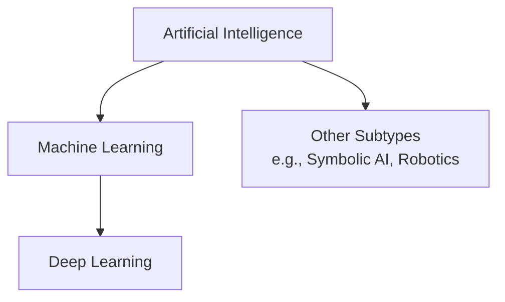

# What is Artificial Intelligence?

**Artificial Intelligence (AI)** can be defined in various ways. At its core, it refers to systems or machines that mimic human intelligence to perform tasks and can iteratively improve themselves based on the information they collect.

For me, AI is fundamentally a system capable of:
* **Rule-based decisions**
* **Planning and optimization**
* **Searching and heuristic reasoning**

---

## The AI Landscape

Artificial Intelligence is a broad field with several key subfields:

### Key Subfields:
* **Machine Learning (ML)**: Algorithms that allow computers to learn from data without being explicitly programmed.
* **Deep Learning (DL)**: A subset of ML based on artificial neural networks (neural networks with multiple layers).
* **Symbolic & Heuristic AI**: Classical rule-based systems, expert systems, and search algorithms.