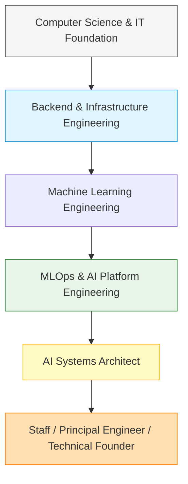

# AI Systems Architect Roadmap

This note serves as the master blueprint for transitioning from a Computer Science student into an AI Systems Architect. It maps out the long-term journey, technical pillars, recommended learning order, and the transition path to a master's degree in Japan.

## Related Notes
* **Execution Plan**: [[2026 Execution Plan]]
* **Skills Assessment**: [[Skill Matrix]]
* **Project Specifications**: [[Project Strategy]]
* **Review Cycle**: [[Weekly Review]]

---

## North Star: The Full-Lifecycle Engineer

The ultimate objective is to become an engineer capable of designing, building, deploying, monitoring, optimizing, and scaling complete Artificial Intelligence (AI) systems. 

Model training (tweaking hyperparameters in a Jupyter notebook) is only a minor fraction of a production system. A true AI Systems Architect handles the entire operational loop:

$$\text{Data Collection} \rightarrow \text{Validation} \rightarrow \text{Experimentation} \rightarrow \text{Training} \rightarrow \text{Evaluation} \rightarrow \text{Deployment} \rightarrow \text{Monitoring} \rightarrow \text{Optimization} \rightarrow \text{Scaling} \rightarrow \text{Business Impact}$$

Your strength will lie in infrastructure reliability, system observability, data pipeline efficiency, and edge/distributed systems engineering.

---

## Career Progression Path



---

## Career Positioning: Role Distinctions

It is crucial to understand the distinct roles in the industry to position yourself correctly. You should target **Backend Engineer** or **Junior Machine Learning Engineer** roles first, transition into **MLOps/AI Platform Engineering**, and eventually progress to **AI Systems Architect**.

| Role | Primary Focus | Target Phase |
| :--- | :--- | :--- |
| **Data Scientist** | Statistical analysis, hypothesis testing, model prototyping (Python/R). *Not your primary target.* | Avoid |
| **Backend Engineer** | APIs, database design, business logic, system integration, security. | Target First (Step 1) |
| **Machine Learning Engineer (MLE)** | Wrapping models in services, optimizing inference, feature engineering. | Target First (Step 1) |
| **Machine Learning Operations (MLOps) Engineer** | Automating training/deployment pipelines, model versioning, testing, and lifecycle management. | Mid-Term Target (Step 2) |
| **AI Platform Engineer** | Building internal platforms, cluster management, GPU virtualization, provisioning infrastructure for MLEs. | Mid-Term Target (Step 2) |
| **Cloud Engineer** | General infrastructure, networking, security, IAM policies, and cloud cost optimization. | Supporting Role |
| **Solutions Architect** | Mapping business requirements to cloud services, high-level cloud architecture patterns. | Supporting Role |
| **AI Systems Architect** | Designing end-to-end distributed data/inference pipelines, edge-to-cloud sync, and technical leadership. | Long-Term Goal (Step 3) |

---

## The Ten Technical Pillars

Your progression is built upon ten pillars. Each represents a domain of competence:

### 1. Software Engineering Fundamentals
* Clean code, object-oriented design, design patterns, testing paradigms (unit, integration, regression), and version control with Git.

### 2. Backend and Application Programming Interfaces (APIs)
* High-performance web frameworks, asynchronous programming, concurrency models, API protocol design (REST, gRPC, WebSockets), and security (authentication, authorization, rate limiting).

### 3. Databases and Data Engineering
* Relational databases, indexing strategies, query optimization, caching layers, schema design, and message brokers for data streaming.

### 4. Machine Learning and Deep Learning (ML/DL)
* Understanding core model architectures (Convolutional Neural Networks, Recurrent Neural Networks, Transformers), evaluation metrics (Precision, Recall, F1-Score, ROC-AUC), and model optimization frameworks.

### 5. Machine Learning Operations (MLOps)
* Model registries, data versioning, pipeline automation, continuous integration and continuous delivery (CI/CD) for machine learning, and model serving infrastructure.

### 6. Cloud and Infrastructure
* Cloud providers (AWS), containerization, orchestration, virtual networks, and Infrastructure as Code (IaC) to automate environment setups.

### 7. Observability and Reliability
* Monitoring metrics, log aggregation, distributed tracing, alerting rules, and system profiling under load.

### 8. Distributed Systems
* Data replication, consensus protocols, distributed compute engines, message queues, and horizontal scaling strategies.

### 9. Edge AI and Embedded Systems
* Deploying models to resource-constrained devices, hardware acceleration (TensorRT, ONNX Runtime), microcontroller programming (TinyML), and real-time sensor data fusion.

### 10. System Design and Technical Leadership
* End-to-end system architecture design, trade-off analysis (latency vs. accuracy, cost vs. redundancy), technical writing, and mentoring.

---

## Recommended Learning Order

Do not try to learn all tools simultaneously. Follow this prioritized sequence:

### Priority Labels
* **P0: Immediate Requirement** — Must master before graduation to secure your first practical role.
* **P1: Next 12 Months** — Core technologies for production MLOps and Master's preparation.
* **P2: Specialization** — Advanced tools to distinguish yourself as a systems engineer.
* **P3: Need-to-Know Basis** — Specialized infrastructure; learn only when a project demands it.

```
[P0: Foundations] ──> [P1: Cloud & Observability] ──> [P2: Advanced MLOps & Orchestration] ──> [P3: Distributed Scaling]
```

### Pillar Roadmap

| Pillar | Technology / Tool | Priority | Description / Use Case |
| :--- | :--- | :--- | :--- |
| **Software Eng** | Python, Git, Linux | **P0** | Basic development environment and version control. |
| **Backend** | FastAPI | **P0** | Building lightweight, high-performance APIs for model serving. |
| **Databases** | SQL, PostgreSQL | **P0** | Structured storage for metadata, audit logs, and application state. |
| **Cloud/Infra** | Docker | **P0** | Containerizing applications for consistent deployment. |
| **Software Eng** | Pytest | **P0** | Unit and integration testing of APIs and processing pipelines. |
| **Observability**| Loki, Promtail, Grafana | **P1** | Log aggregation and metric visualization (used in your AOI project). |
| **Edge AI** | ONNX, ESP32, Sensor Fusion | **P1** | Deploying models to hardware; edge data aggregation. |
| **MLOps** | DVC, Weights & Biases | **P1** | Data versioning and experimental tracking. |
| **Cloud/Infra** | AWS (Amazon Web Services) | **P1** | Basic cloud compute, storage, and networking. |
| **Cloud/Infra** | Kubernetes | **P2** | Orchestrating containerized model microservices at scale. |
| **Cloud/Infra** | Terraform (IaC) | **P2** | Declarative infrastructure provisioning. |
| **MLOps** | MLflow | **P2** | Structured model registry and lifecycle tracking. |
| **Edge AI** | TensorRT, Triton Inference Server | **P2** | High-throughput, low-latency GPU model serving. |
| **Databases** | Redis, Message Queues (RabbitMQ) | **P3** | Caching layers, event-driven task queues. |
| **Distributed** | Ray | **P3** | Distributed compute framework for scaling training/inference. |
| **Edge AI** | CUDA | **P3** | Parallel computing platform for writing custom GPU kernels. |

---

## Certification Strategy

Certifications must validate practical experience. Do not collect certificates without building projects first.

### 1. AWS Certified Solutions Architect – Associate (SAA-C03)
* **Prerequisites**: Complete the `HASC` database/backend deployment and run basic services on AWS.
* **Portfolio Evidence Required**: A fully deployed cloud architecture on AWS using ECS/EKS, RDS, and S3, documented with an architecture diagram.
* **When to sit**: Late 2026 (during your first 6 months of work).

### 2. Certified Kubernetes Administrator (CKA) or Application Developer (CKAD)
* **Prerequisites**: Containerize your `AOI` system and deploy it onto a local Kubernetes cluster (Minikube/Kind).
* **Portfolio Evidence Required**: A multi-service deployment setup showing ingress controllers, configmaps, secrets, and liveness/readiness probes.
* **When to sit**: Mid 2027 (during master's preparation).

### 3. HashiCorp Certified: Terraform Associate
* **Prerequisites**: Provision your AWS infrastructure for projects using Terraform modules rather than the AWS Console.
* **Portfolio Evidence Required**: A GitHub repository containing clean, versioned Terraform configuration files that spin up a secure virtual network and compute instances.
* **When to sit**: Late 2027.

---

## Japan Master's Degree Strategy

A master's degree in Japan is your gateway to advanced research in Edge AI, robotics, and distributed systems. 

### 1. Academic & Research Positioning
* **Core Topic**: Real-time multimodal sensor fusion on resource-constrained edge devices (using your `SilentVoix` and `TempCastML` projects as foundations).
* **Target Labs**: Look for laboratories focusing on Embedded Systems, Intelligent Robotics, Edge Computing, or Distributed Systems in top national universities (e.g., University of Tokyo, Tokyo Institute of Technology, Kyoto University, Osaka University).

### 2. The Application Pipeline

```
[English Exam Prep] ──> [Literature Review] ──> [Lab Research] ──> [Research Proposal] ──> [Contact Professors] ──> [Scholarship Application]
```

* **English Preparation (P0)**: Take the IELTS (Target: 7.0+) or TOEFL iBT (Target: 95+) by late 2026. Academic programs in Japan value high English proficiency scores.
* **Research Proposal (P1)**: Write a formal 2-page research proposal detailing:
  * Literature review (state of the art in Edge AI/Sensor Fusion).
  * The problem statement (latency vs. resource constraints in sign-language translation).
  * Proposed methodology (integrating recurrent neural networks on microcontrollers with low-latency communication).
  * Expected outcomes.
* **Professor Contact (P1)**: Reach out to professors 6 months before the application deadline. Frame your email around their recent papers and explain how your practical work (`SilentVoix`) aligns with their lab's research direction.
* **Recommendation Letters**: Maintain strong relationships with 2 university professors during your thesis defense to secure academic recommendation letters.

### 3. Japanese Language Strategy
* **Immediate Role**: Not a bottleneck for English-taught master's programs or MEXT applications.
* **Career Multiplier (P1/P2)**: Target passing JLPT N3/N2. Speaking Japanese is critical for securing high-paying R&D positions at Japanese robotics, automotive (e.g., Toyota, Nissan), or platform engineering companies post-graduation.

---

## Detailed Career Phases

### Phase 1: Now until Graduation (July 2026 – August 2026)
* **Primary Objective**: Secure graduation, write a strong thesis, and polish the backend/observability design of your flagship `AOI` project.
* **Required Technical Skills**: Python, FastAPI, SQL, basic Docker, Grafana/Loki logging.
* **Concrete Deliverables**: Completed thesis report, defended graduation project, and a working portfolio website.
* **Portfolio Evidence**: Public codebases for `AOI` and `HASC` with clean `README.md` files.
* **Career Opportunities Unlocked**: VinAI AI Real-World/AI Thực Chiến admission, entry-level Backend/ML engineer roles in Vietnam.
* **Common Distractions**: Learning Kubernetes or Terraform too early. Focus on raw programming and local containerization first.
* **Completion Criteria**: Graduation certificate received, and all four core projects documented.

### Phase 2: First 6–12 Months Post-Graduation (September 2026 – August 2027)
* **Primary Objective**: Gain practical industry experience, build production-grade MLOps pipelines, and prepare academic credentials.
* **Required Technical Skills**: Advanced Docker, AWS fundamentals, CI/CD pipelines (GitHub Actions), system testing (Pytest).
* **Concrete Deliverables**: 6+ months of documented work history, completed IELTS/TOEFL exam, and contact established with target Japanese professors.
* **Portfolio Evidence**: A fully deployed version of `AOI` running on cloud infrastructure with automated CI/CD and metrics collection.
* **Career Opportunities Unlocked**: Credibility for Master's applications, higher base salary.
* **Common Distractions**: Hopping between multiple jobs. Stick to one stable role or internship that allows you to write production code.
* **Completion Criteria**: Verified work reference letter and academic IELTS/TOEFL certificate in hand.

### Phase 3: Master's Degree in Japan (Fall 2027 – 2029)
* **Primary Objective**: Execute your research proposal, publish academic papers, and build localized networks in Japan.
* **Required Technical Skills**: C++, Edge AI runtimes (TensorRT, ONNX Runtime), RTOS (Real-Time Operating Systems), distributed model training.
* **Concrete Deliverables**: Master's thesis, at least one conference paper publication, and JLPT N2 certification.
* **Portfolio Evidence**: Edge AI repository showcasing optimized model runtimes on hardware boards (Raspberry Pi, Jetson Nano, or microcontrollers).
* **Career Opportunities Unlocked**: Access to top-tier international R&D roles in Japan (robotics, autonomous driving, automation).
* **Common Distractions**: Spending excessive time on non-technical part-time jobs. Keep your focus on research and language acquisition.
* **Completion Criteria**: Master of Science degree conferred.

---

## Review and Maintenance
Review this roadmap monthly against your [[Weekly Review]] logs to adjust timelines. Do not alter the North Star objective; only modify intermediate technologies as the ecosystem shifts.
