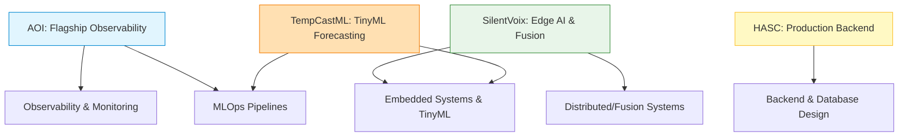

# Project Portfolio Strategy

This document outlines the scope, deliverables, and completion boundaries for your four core projects. It prevents feature creep and ensures every codebase acts as concrete evidence of your engineering capability.

## Related Notes
* **Roadmap**: [[AI Systems Architect Roadmap]]
* **Execution Plan**: [[2026 Execution Plan]]
* **Skills Assessment**: [[Skill Matrix]]
* **Review Cycle**: [[Weekly Review]]

---

## Skill Proof Mapping

This diagram maps how your projects demonstrate specific technical pillars:

---

## 1. AOI: Automated Optical Inspection (Rank 1 - Flagship)

* **Primary Career Message**: "I can build observable, reliable backend systems that monitor and process real-time AI inference events at scale."
* **Intended Audience**: MLOps hiring managers, VinAI assessors, Lead Systems Engineers.
* **Minimum Viable Final Version**: FastAPI server receiving model inference events (JSON) locally, displaying latency and anomaly alerts on a Grafana dashboard.
* **Production-Quality Improvements**:
  * Integrate structured JSON logging across the application.
  * Standardize log ingestion using Promtail and Loki.
  * Set up Prometheus metrics (inference duration histograms, error counters, request rates).
* **Required Documentation**: Setup guide (`docker-compose up`), description of metrics exposed, dashboard setup instructions.
* **Required Tests**: Pytest suite checking endpoint response codes, JSON schema validation, and error handling.
* **Required Architecture Diagram**: Ingress -> FastAPI (Model Inference Router) -> Loki/Prometheus -> Grafana stack.
* **Required Evaluation**: Load test results demonstrating API latency under mock stress (100 concurrent requests/second).
* **Required Demonstration**: Live or recorded video showing how simulating an anomaly (fake payload) triggers an alert in Grafana.
* **Metrics to Report**: P95/P99 inference latency, API error rate, CPU utilization during inference.
* **What NOT to Add**: Do not write a custom frontend, do not deploy real heavy deep learning models locally, do not support multiple database engines.
* **When to Stop**: Once Promtail, Loki, and Grafana work reliably on a local multi-container setup, the API has unit test coverage, and a load test report is documented in the README.
* **Roadmap Connection**: Direct proof of **observability and reliability** and **backend engineering** pillars.

---

## 2. SilentVoix / SignGlove: Multimodal Translation (Rank 2 - Edge AI & Research)

* **Primary Career Message**: "I can design, program, and build low-latency real-time embedded systems that run machine learning inference at the edge."
* **Intended Audience**: Japanese university professors, Edge AI researchers, hardware engineers.
* **Minimum Viable Final Version**: ESP32 reading sensor values (flex + IMU), sending them over Bluetooth/Serial to a local PC running MediaPipe, fusing the inputs, and displaying translated sign gestures in a terminal.
* **Production-Quality Improvements**:
  * Compile the gesture classification model (LSTM) into ONNX format for optimized execution.
  * Implement noise-filtering algorithms (kalman filter or moving average) on raw sensor readings.
  * Write clean, modular C++ code for the ESP32 using structured classes.
* **Required Documentation**: Pinout diagrams, bill of materials, setup instructions, mathematical model of the sensor fusion algorithm.
* **Required Tests**: Sensor calibration check tests, data pipeline integration tests.
* **Required Architecture Diagram**: Hardware Sensors -> ESP32 (Firmware) -> Bluetooth/Serial -> PC Receiver -> MediaPipe Fusion -> Inference Engine.
* **Required Evaluation**: Model accuracy evaluation metrics (Confusion Matrix, Precision-Recall curves) and latency comparison between raw and ONNX serving.
* **Required Demonstration**: Video recording demonstrating real-time hand movements translating to text on screen.
* **Metrics to Report**: Gesture classification accuracy, communication latency (sensor reading to text prediction), power consumption of the microcontroller.
* **What NOT to Add**: Do not build a complex Flutter application or a heavy backend database structure.
* **When to Stop**: Once the hardware glove successfully communicates with the receiver, executes model inference under 50ms latency, and the research proposal based on this project is drafted.
* **Roadmap Connection**: Direct proof of **Edge AI and embedded systems** and **Distributed systems** pillars for Japanese master's applications.

---

## 3. HASC Website: Industrial Product Catalog (Rank 3 - Backend & Database)

* **Primary Career Message**: "I can build secure, database-optimized, production-ready web platforms that solve real business problems."
* **Intended Audience**: Backend engineering recruiters, local businesses, family enterprise.
* **Minimum Viable Final Version**: FastAPI server integrated with a PostgreSQL database, containing user authentication (JWT) and image processing capabilities (saving optimized thumbnails).
* **Production-Quality Improvements**:
  * Set up database migrations using Alembic.
  * Optimize database queries with proper indexing and connection pooling.
  * Secure the server with CORS settings, rate limiting, and SSL configuration.
* **Required Documentation**: Database schema diagram (ERD), API specifications (Swagger docs), deployment manual via Docker Compose.
* **Required Tests**: Pytest suite covering database CRUD operations, API routes, authentication flows, and image uploading security.
* **Required Architecture Diagram**: Nginx (Reverse Proxy) -> FastAPI -> PostgreSQL architecture.
* **Required Evaluation**: Database query execution plan analysis (using EXPLAIN ANALYZE) for complex catalog filters.
* **Required Demonstration**: Screencast of the admin panel uploading a product, showing automated thumbnail generation and SQL writes.
* **Metrics to Report**: Database query response times, image optimization compression ratio.
* **What NOT to Add**: Multi-tenant infrastructure, analytics dashboards, complex search engines (Elasticsearch).
* **When to Stop**: Once database migrations are working, authentication is secure, and Docker Compose deploys Nginx, FastAPI, and PostgreSQL cleanly.
* **Roadmap Connection**: Direct proof of **backend and API** and **databases and data engineering** pillars.

---

## 4. TempCastML / Airgility: Room Comfort Forecasting (Rank 4 - TinyML)

* **Primary Career Message**: "I can collect time-series data, train forecasting models, and optimize them to run under constrained microcontroller environments."
* **Intended Audience**: IoT recruiters, TinyML engineers, hardware architects.
* **Minimum Viable Final Version**: ESP32-S3 collecting environmental data (DHT22), calling a FastAPI server to log time-series data, and executing a local quantized model (TFLite Micro) to forecast immediate changes.
* **Production-Quality Improvements**:
  * Quantize the forecasting model to 8-bit integers (INT8) to optimize memory footprint.
  * Design a database pipeline using PostgreSQL for historical climate logging.
  * Handle edge disconnectivity (ESP32 storing data offline in flash memory until reconnection).
* **Required Documentation**: Hardware layout, quantization guide, model training notebook.
* **Required Tests**: Unit tests checking data parser functions and model prediction outputs.
* **Required Architecture Diagram**: Sensor -> ESP32-S3 (Local TFLite Inference) -> FastAPI Logging Client -> PostgreSQL database.
* **Required Evaluation**: Flash and RAM memory footprints comparison (FP32 vs INT8 models).
* **Required Demonstration**: Live logs showing the ESP32 logging data and displaying forecast values on an OLED display or serial console.
* **Metrics to Report**: Mean Absolute Error (MAE) of forecasts, inference memory consumption (kB), model file size reduction.
* **What NOT to Add**: Complex UI charts, support for multiple sensor brands, remote OTA (Over-The-Air) firmware updates.
* **When to Stop**: Once the quantized model runs successfully on the microcontroller and the ESP32 can log data to FastAPI.
* **Roadmap Connection**: Proof of **Edge AI** and **databases and data engineering** pillars.

---

## Definition of Portfolio Ready

A project repository is not considered "Portfolio Ready" just because the code runs. Before sharing any project link, verify that it meets the following standards:

- [ ] **Clear Problem Statement**: The first paragraph of the README explains exactly what problem the project solves, who it is for, and why it was built.
- [ ] **Architecture Diagram**: A clear system flow diagram (drawn in Mermaid or Excalidraw) embedded in the README showing the relationship between all components.
- [ ] **Reproducible Setup**: Step-by-step setup instructions (e.g. `docker-compose up` or a simple setup script). Do not require manual environment configuration steps.
- [ ] **Automated Tests**: A pytest suite proving that API endpoints and data processing modules work as intended.
- [ ] **Evaluation Section**: Explicit metrics showing performance results (e.g., latency numbers, model accuracy metrics, load test results).
- [ ] **Limitations & Constraints**: Honest documentation of what the system *cannot* do and where it bottlenecks.
- [ ] **Interactive Demonstration**: Embedded GIFs, screenshots, or YouTube demo links showing the system in action.
- [ ] **Deployment Instructions**: Detailed steps on how to deploy the codebase to production or cloud environments.
- [ ] **Technical Decisions & Lessons Learned**: A section detailing why certain libraries/databases were chosen over others, and what design choices were made.
- [ ] **Future Roadmap**: Up to 3 realistic future enhancements.
- [ ] **Resume Bullets**: Three action-oriented, result-driven resume bullet points ready to copy-paste.
