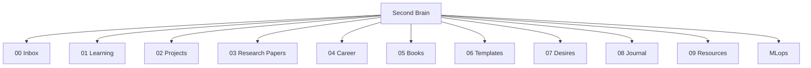

# 🧠 Second Brain - Personal Knowledge Management (PKM)

Welcome to my **Second Brain**, a digital garden built for Obsidian to capture, organize, and synthesize knowledge, ideas, projects, and learning journeys.

This vault is structured to facilitate seamless knowledge retrieval and note-taking, heavily inspired by modern productivity frameworks (like P.A.R.A. and Johnny.Decimal).

---

## 📂 Vault Structure

Here is a map of how the knowledge base is structured:



### Folder Directory Details

| Folder | Purpose | Examples / Subfolders |
| :--- | :--- | :--- |
| **`00 Inbox`** | Rapid capture of raw notes, thoughts, and links before processing. | `First words !.md` |
| **`01 Learning`** | Deep dives, educational courses, concepts, and technical skills. | `AI/`, `AI/ML/Data processing.md` |
| **`02 Projects`** | Active projects with defined deadlines and outcomes. | `AOI/`, `HASC/`, `RAInder/`, `SignGlove/` |
| **`03 Research Papers`**| Summaries, key insights, and analysis of academic papers. | Literature reviews, arXiv notes |
| **`04 Career`** | Resume versions, job hunt trackers, and professional goals. | Career roadmaps |
| **`05 Books`** | Reading logs, highlights, and book reviews. | Summaries of non-fiction & fiction |
| **`06 Templates`** | Standardized templates to maintain consistency across notes. | Daily logs, project templates |
| **`07 Desires`** | Wishlists, target acquisitions, and bucket lists. | Tool lists, gadgets, skills to acquire |
| **`08 Journal`** | Daily logs, weekly reviews, and personal reflections. | Periodic journals |
| **`09 Resources`** | General references, tools, cheat sheets, and useful utilities. | Cheat sheets, documentation bookmarks |
| **`MLops`** | Notes on MLOps pipelines, model deployment, monitoring, and infrastructure.| CI/CD pipelines, Docker, Kubernetes |

---

## 🛠️ Getting Started with Obsidian

To open this vault in Obsidian:

1. **Download & Install**: Install the latest version of [Obsidian](https://obsidian.md/).
2. **Clone the Repo**:
   ```bash
   git clone https://github.com/lystiger/Second-Brain.git
   ```
3. **Open Folder as Vault**: Open Obsidian, click on **"Open folder as vault"**, and choose the cloned `Second Brain` directory.
4. **Configuration**: Obsidian configurations are stored in the `.obsidian` directory, so your theme and general setup will automatically load.

---

## ✨ Features & Best Practices

To make notes readable, functional, and visually appealing, this vault follows these markdown guidelines:

* **Visual Charts**: Uses [Mermaid](https://mermaid.js.org/) syntax directly inside markdown to draw flows and system architectures.
* **Math Rendering**: Support for MathJax/LaTeX mathematical equations (e.g. $$\text{Input } (X) \longrightarrow \text{Model} \longrightarrow \text{Prediction } (\hat{y})$$).
* **Obsidian Callouts**: Uses Obsidian-style callouts (`> [!NOTE]`, `> [!CAUTION]`, etc.) to highlight key information or warnings.
* **Preserving Hierarchy**: Folders without files are kept tracked on Git using `.gitkeep` placeholders to preserve folder structures across workspaces.