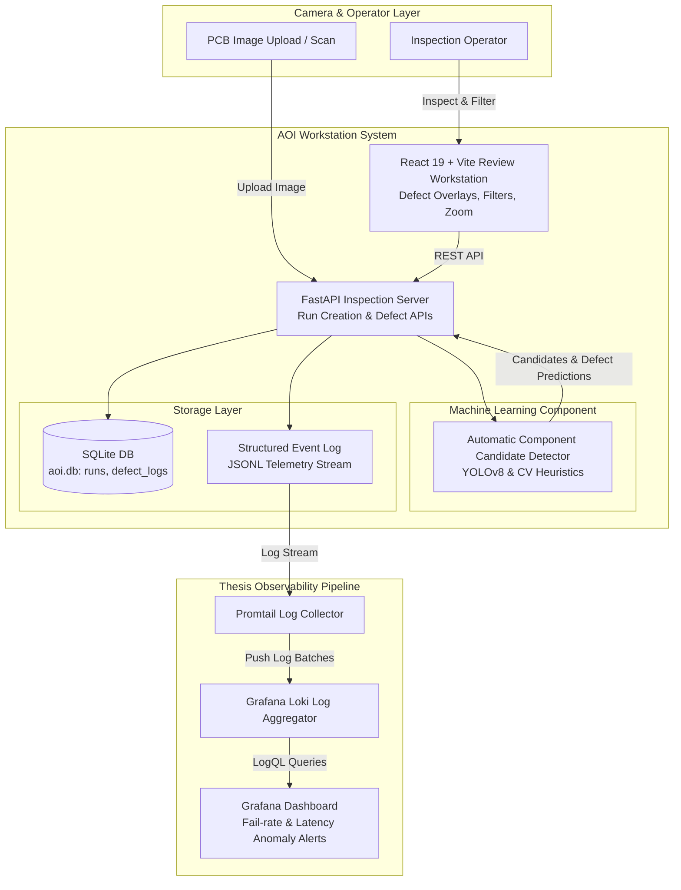
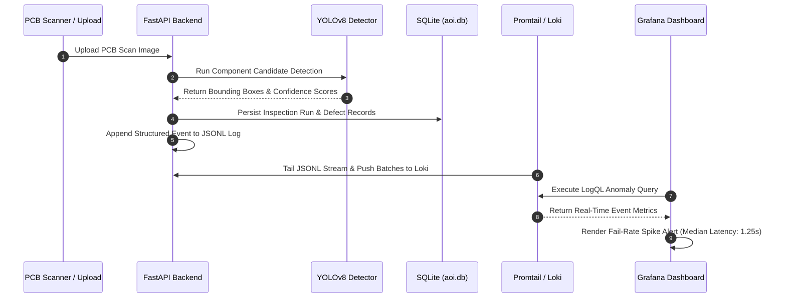

# AOI Review Workstation & Telemetry Stack

## Overview

**AOI Workstation** (`/home/lystiger/projects/AOI`) is an Automatic Optical Inspection workstation for printed circuit board (PCB) review, setup validation, defect logging, and AI inference observability. The project pairs a [[FastAPI]] backend, a [[React 19]] review web application, [[SQLite]] persistence, and a full observability stack ([[Promtail]], [[Loki]], [[Grafana]]) to monitor AI inspection runs from raw image upload to defect resolution.

Developed as an engineering thesis project, its central claim is **monitoring AI inference behavior in real-time hardware inspection workflows**. It captures structured inference events into JSONL logs, streams them through Promtail to Loki, and visualizes operational anomaly metrics (such as elevated defect rates, model confidence degradation, and latency spikes) in Grafana.

---

## System Architecture



---

## Component Details

### 1. Observability & Telemetry Engine (Primary Thesis Claim)
- **Log Stream Architecture**: Every inspection step, model prediction, bounding box confidence, and operator validation emits a structured JSONL record.
- **Log Pipeline**: `FastAPI app -> JSONL file -> Promtail container -> Loki log database -> Grafana dashboards`.
- **Measured Metrics**:
  - **1.25s median end-to-end event freshness** (from FastAPI event generation to Grafana visualization).
  - **18.6 ms – 93.9 ms median LogQL query latency**.
  - **100% ingestion reliability** (1,000 / 1,000 injected anomaly events verified in Loki).
  - Evaluated across 9 controlled anomaly patterns (fail rate spikes, model confidence drift, network latency spikes, component misalignments).

### 2. FastAPI Backend & Setup Validation
- **Run Creation**: Handles PCB scan ingestion, barcode parsing, fiducial marker alignment, and inspection run initialization.
- **Defect APIs**: Endpoints for logging defects, updating component classifications (`resistor`, `capacitor`, `connector`, `ic`, `led`), and querying run histories.
- **Database Schema**: [[SQLite]] database (`aoi.db`) storing `inspection_runs`, `defect_logs`, and asset file paths.

### 3. React 19 Review Workstation UI
- **Interactive Inspection Canvas**: Custom canvas viewer featuring zoom/pan controls, bounding box overlays, and confidence threshold sliders.
- **Setup-Stage Workflow**: Supports model selection, camera calibration, barcode scanning, and review readiness verification.

### 4. Supporting YOLOv8 ML Model Workstream
- **Object Detection Model**: Custom [[YOLOv8]] model (`yolov8s.pt`) trained on PCB component datasets (`470 train / 102 val / 100 test`).
- **Target Classes**: `resistor`, `capacitor`, `connector`, `ic`, `led`, `other`.
- **Baseline Performance**: mAP@50 = `0.1346`, precision = `0.1602`, recall = `0.2452` (with ICs achieving top AP50 of `0.461`). Serves as an internal engineering baseline for candidate detection.

---

## Data Flow & Anomaly Monitoring Workflow



---

## Key Code Snippets

### Python: FastAPI Structured JSONL Telemetry Logger (`src/telemetry.py`)
```python
import json
import time
from pathlibPath

LOG_FILE = Path("logs/inspection_events.jsonl")
LOG_FILE.parent.mkdir(parents=True, exist_ok=True)

def log_inspection_event(run_id: str, event_type: str, details: dict):
    """
    Logs structured telemetry events for Promtail ingestion into Loki.
    """
    payload = {
        "timestamp": time.time(),
        "run_id": run_id,
        "event_type": event_type,
        "details": details
    }
    with open(LOG_FILE, "a", encoding="utf-8") as f:
        f.write(json.dumps(payload) + "\n")
```

### Python: FastAPI Run Ingestion Endpoint (`src/main.py`)
```python
from fastapi import FastAPI, UploadFile, File, HTTPException
from pydantic import BaseModel
import uuid

app = FastAPI(title="AOI Workstation API")

class RunResponse(BaseModel):
    run_id: str
    status: str
    detected_components: int

@app.post("/api/runs", response_model=RunResponse)
async def create_inspection_run(file: UploadFile = File(...)):
    run_id = f"run-{uuid.uuid4().hex[:8]}"
    # Save file and process image
    contents = await file.read()
    
    # Trigger Candidate Detection
    detected_count = 14  # Candidate count from detector
    
    log_inspection_event(run_id, "RUN_CREATED", {
        "filename": file.filename,
        "detected_count": detected_count
    })
    
    return RunResponse(run_id=run_id, status="READY_FOR_REVIEW", detected_components=detected_count)
```

---

## Learnings & Engineering Decisions

1. **Observability in Hardware AI**: Standard ML monitoring focuses only on cloud API latencies. AOI manufacturing requires tracking hardware scan delays, bounding box confidence dropoffs caused by lighting shifts, and operator verification speed. Shipping structured JSONL events through [[Loki]] and [[Grafana]] provided end-to-end operational visibility.
2. **Decoupling Platform Telemetry from Model Performance**: While ML candidate detection accuracy (YOLOv8 mAP@50 of 0.1346) can be iteratively improved with larger datasets, the logging architecture is decoupled. It measures and visualizes system health independently of model weights.
3. **Lightweight Edge Storage**: [[SQLite]] provides zero-maintenance local persistence suitable for single-workstation manufacturing review setups, eliminating external database server dependencies.

---

## Related Notes & Links
- [[FastAPI]]
- [[React]]
- [[SQLite]]
- [[YOLOv8]]
- [[PyTorch]]
- [[Prometheus]]
- [[Grafana]]
- [[Docker]]
- [[OpenCV]]
- [[K3-Course-Overview|K3 AI Course]]
