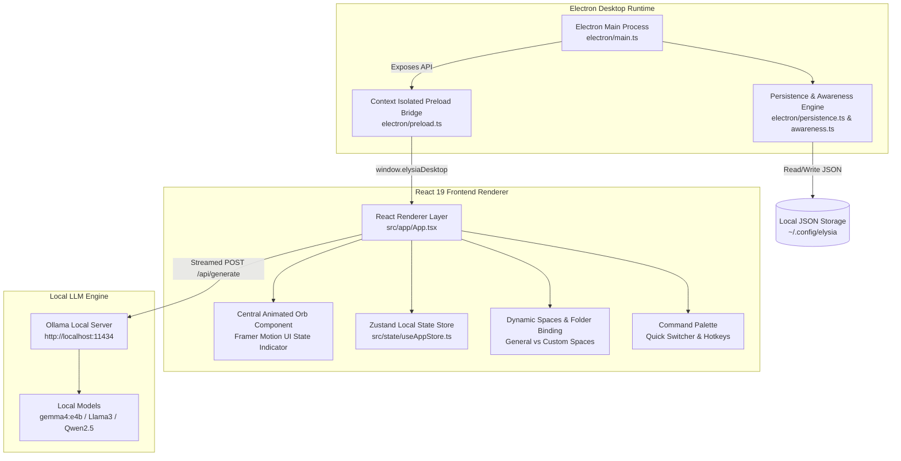
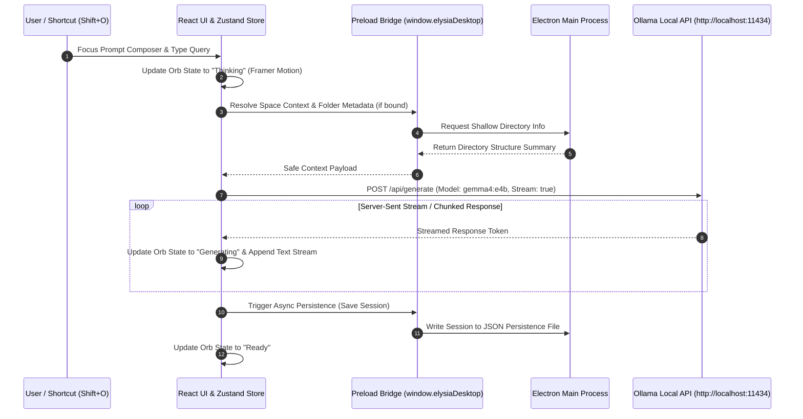

# Elysia — Local-First Ambient Desktop AI Companion

## Overview

**Elysia** (`/home/lystiger/projects/Elysia`) is a privacy-first, local desktop AI companion built with [[Electron]], [[React 19]], [[TypeScript]], [[Vite]], and [[Tailwind CSS]]. Unlike standard linear chatbots, Elysia is designed around an ambient companion presence centered around an animated glowing orb that reflects AI assistant states (Ready, Thinking, Generating, Offline).

Powered locally by [[Ollama]] (default endpoint `http://localhost:11434` running models like `gemma4:e4b`), Elysia features zero cloud latency, full offline execution, dynamic project-aware "Spaces", native local folder context binding via Electron's context-isolated IPC bridge, session persistence, and global hotkey shortcuts (`Shift+O`).

---

## System Architecture



---

## Component Details

### 1. Central Animated Companion Orb
- **Visual State Indicator**: Driven by [[Framer Motion]], the central orb smoothly transitions between assistant lifecycle states:
  - `Ready`: Soft ambient breathing pulse.
  - `Thinking`: Accelerated inner glow rotation.
  - `Generating`: Dynamic audio/text response ripple effect.
  - `Offline`: Dimmed status indicator when Ollama connection is lost.
- **Dialogue Overlay**: Hovering or speaking reveals floating current-exchange speech UI, with an expandable slide-over drawer for deep session conversation history.

### 2. Dynamic Spaces & Safe Folder Binding (Sprint 3)
- **General Space**: Permanent workspace for everyday general prompts and un-categorized assistance.
- **Custom Project Spaces**: User-created Spaces with custom descriptions, icons, context suggestions, and space-specific model selections.
- **Native Folder Binding**: Binds to a local directory on disk via Electron's dialog API.
- **Safety Boundary**: Injects only shallow folder metadata (folder name, structural summary, top-level file names) into the prompt context. It **never** reads full file contents automatically, executes terminal scripts, or alters bound folder contents.

### 3. Electron IPC & Security Architecture
- **Context Isolation**: `contextIsolation: true` and `nodeIntegration: false` enforced in Electron BrowserWindow configuration.
- **Preload API Contract**: Exposes `window.elysiaDesktop` methods for native file selection, JSON session loading/saving, and OS notification alerts.
- **Global Hotkeys**: Listens for system global shortcuts (`Shift+O`) to toggle window visibility or instantly focus the prompt composer.

### 4. Local Persistence & State Management
- **Zustand Store**: Handles client-side reactive state, active Space, current model preferences, and active conversation thread.
- **Local Persistence Engine** (`electron/persistence.ts`): Asynchronously syncs session conversations and Space metadata to local JSON stores on the filesystem.

---

## Data Flow & Workflow



---

## Key Code Snippets

### TypeScript: Electron Preload Bridge API Contract (`electron/preload.ts`)
```typescript
import { contextBridge, ipcRenderer } from 'electron';

contextBridge.exposeInMainWorld('elysiaDesktop', {
  selectFolder: async (): Promise<{ path: string; name: string } | null> => {
    return await ipcRenderer.invoke('dialog:select-folder');
  },
  getFolderMetadata: async (folderPath: string) => {
    return await ipcRenderer.invoke('fs:get-folder-metadata', folderPath);
  },
  saveState: async (key: string, data: unknown) => {
    return await ipcRenderer.invoke('storage:save', key, data);
  },
  loadState: async (key: string) => {
    return await ipcRenderer.invoke('storage:load', key);
  }
});
```

### React / Zustand: Streaming Ollama Client Integration (`src/services/ollama.ts`)
```typescript
export async function* streamOllamaCompletion(
  endpoint: string,
  model: string,
  prompt: string,
  systemContext?: string
): AsyncGenerator<string, void, unknown> {
  const response = await fetch(`${endpoint}/api/generate`, {
    method: 'POST',
    headers: { 'Content-Type': 'application/json' },
    body: JSON.stringify({
      model,
      prompt,
      system: systemContext || 'You are Elysia, an ambient local AI companion.',
      stream: true
    })
  });

  if (!response.ok || !response.body) {
    throw new Error(`Ollama connection error: ${response.statusText}`);
  }

  const reader = response.body.getReader();
  const decoder = new TextDecoder();

  while (true) {
    const { done, value } = await reader.read();
    if (done) break;
    const chunk = decoder.decode(value, { stream: true });
    const lines = chunk.split('\n').filter(Boolean);
    for (const line of lines) {
      const json = JSON.parse(line);
      if (json.response) {
        yield json.response;
      }
    }
  }
}
```

---

## Learnings & Engineering Decisions

1. **Ambient Companion UX vs. Conversational Chatbot**: Standard chat feeds create cognitive fatigue. Shifting to a breathing Framer Motion orb with collapsible sidebars makes the AI feel like a persistent desktop daemon rather than an intrusive messaging application.
2. **Context Isolation & Security**: Desktop AI applications often over-privilege LLMs by allowing arbitrary disk access. Elysia enforces strict isolation: native folder binding extracts only shallow metadata (folder name and structure), preventing un-sanitized file content injection or unintended filesystem mutation.
3. **Local-First Reliability**: Direct client-side streaming from local [[Ollama]] instances eliminates cloud API latency, recurring subscription costs, and data privacy leaks.

---

## Related Notes & Links
- [[Electron]]
- [[React]]
- [[TypeScript]]
- [[Vite]]
- [[Tailwind CSS]]
- [[Zustand]]
- [[Ollama]]
- [[Framer Motion]]
- [[Playwright]]
- [[K3 AI Program]]
