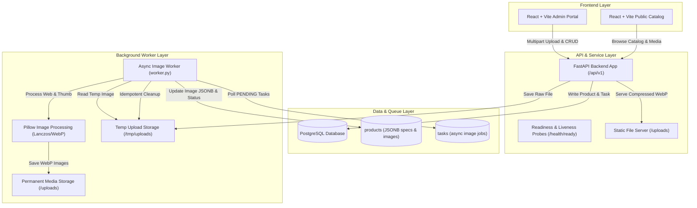
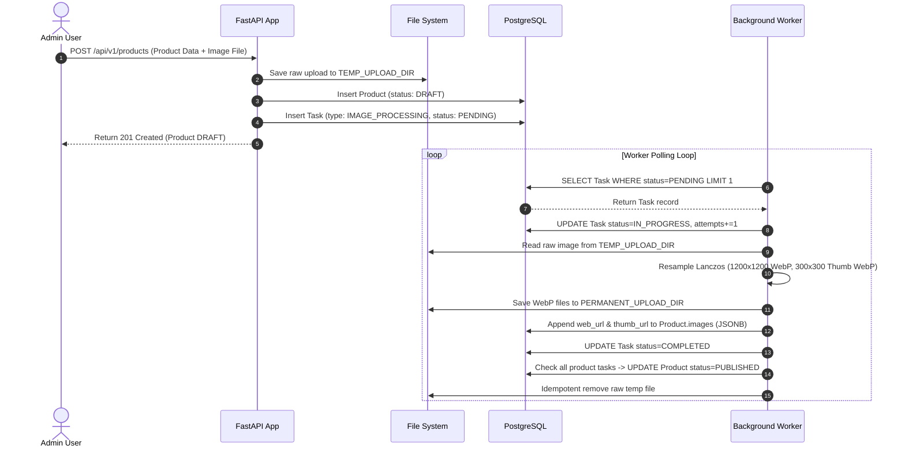

# HASC - Industrial Product Catalog & Asynchronous Image Processing Platform

## Overview
**HASC** (HASC VN Industrial Supplier Platform) is an enterprise-grade industrial product catalog system designed to replace legacy static vendor websites with a high-performance, dynamic digital catalog. The platform enables administrators to manage high-specification industrial machinery and component catalogs with complex polymorphic technical attributes, multi-language localization (Vietnamese and English), and high-resolution media uploads.

A core technical highlight of HASC is its custom **PostgreSQL-backed Asynchronous Task Queue** for background image processing. High-resolution raw product uploads undergo asynchronous Lanczos resampling, WebP compression, thumbnail generation, and state-driven product status progression (`DRAFT` to `PUBLISHED`).

---

## System Architecture

The system follows a decoupled architecture comprising an asynchronous [[FastAPI]] web application, a [[PostgreSQL]] relational database with [[SQLAlchemy]] async ORM and [[Alembic]] schema migrations, an embedded or standalone background media processing worker using [[Pillow]], and dual [[React]] + [[Vite]] frontends (Admin Management Portal & Public Catalog).



---

## Component Details

### 1. Database & Domain Models
- **Polymorphic Product Model (`Product`)**: Stores core metadata alongside custom industrial specifications in `JSONB` format. Products maintain a state enum (`DRAFT`, `PUBLISHED`, `FAILED`) and a list of processed image artifacts.
- **Category Model (`Category`)**: Features bilingual localized names (`name_vi`, `name_en`) and slug routes for hierarchical industrial category navigation.
- **Task Queue Model (`Task`)**: A database-backed job queue storing task type (`IMAGE_PROCESSING`), execution status (`PENDING`, `IN_PROGRESS`, `COMPLETED`, `FAILED`), retry counters (`attempts`, `max_attempts`), failure logs (`error_message`), and task metadata payload (`product_id`, `original_image_path`).

### 2. FastAPI Application Engine
- **Lifespan Task Execution**: Uses FastAPI's `asynccontextmanager` lifespan handler to start an embedded `asyncio.create_task(worker_main())` when `RUN_EMBEDDED_WORKER=True`, ensuring lightweight development deployments without requiring external task brokers like Celery or Redis.
- **Robust Readiness & Liveness Probes**:
  - `/health/live`: Lightweight process liveness verification.
  - `/health/ready`: Performs live database `SELECT 1` connectivity checks and filesystem write probes (`.readiness_probe_*`) on upload directories before signaling HTTP 200/503 status to orchestrators.

### 3. Asynchronous Image Worker Pipeline
- **Image Optimization Engine**: Converts heavy original assets into optimized `.webp` formats using Lanczos resampling (`Image.Resampling.LANCZOS`):
  - **Web Image**: Resized to maximum 1200x1200px at 85% WebP quality.
  - **Thumbnail**: Resized to 300x300px at 85% WebP quality.
- **Idempotent Temp File Handling**: Raw upload originals remain stored in temporary storage during job execution. Original files are safely unlinked in a `finally` block **only after** the task reaches a terminal state (`COMPLETED` or max-retried `FAILED`), preserving the original for retries upon transient failures.
- **Automatic Status Progression**: Once all pending image tasks associated with a product complete successfully, `check_and_update_product_status` transitions the product from `DRAFT` to `PUBLISHED`.

---

## Data Flow



---

## Key Code Snippets

### Lifespan & Enterprise Readiness Probes (`backend/app/main.py`)
```python
@asynccontextmanager
async def lifespan(app: FastAPI):
    worker_task = None
    if settings.RUN_EMBEDDED_WORKER:
        from app.worker import worker_main
        worker_task = asyncio.create_task(worker_main())
    yield
    if worker_task is not None:
        worker_task.cancel()
        try:
            await worker_task
        except asyncio.CancelledError:
            pass

@app.get("/health/ready")
async def health_ready():
    checks = {
        "database": _bool_status(await _check_database()),
        "uploads_writable": _bool_status(_check_upload_dir_writable(settings.UPLOAD_DIR)),
        "temp_uploads_writable": _bool_status(_check_upload_dir_writable(settings.TEMP_UPLOAD_DIR)),
    }
    ready = all(value == "ok" for value in checks.values())
    payload = {"status": "ready" if ready else "not ready", "checks": checks}
    if not ready:
        return JSONResponse(status_code=status.HTTP_503_SERVICE_UNAVAILABLE, content=payload)
    return payload
```

### Background Task Execution & Idempotent Cleanup (`backend/app/worker.py`)
```python
async def process_image_task(db: AsyncSession, task: DBTask):
    original_image_path = (task.metadata_ or {}).get("original_image_path")
    is_terminal = False
    try:
        task.status = TaskStatus.IN_PROGRESS
        task.attempts = (task.attempts or 0) + 1
        await db.commit()

        web_url, thumb_url = _process_image_file(
            Path(original_image_path), task.metadata_["product_id"], task.metadata_["original_filename"]
        )

        db_product = await db.get(DBProduct, task.metadata_["product_id"])
        current_images = list(db_product.images or [])
        current_images.append({"original_name": task.metadata_["original_filename"], "web_url": web_url, "thumb_url": thumb_url})
        db_product.images = current_images
        flag_modified(db_product, "images")

        task.status = TaskStatus.COMPLETED
        task.completed_at = datetime.now()
        await db.commit()
        is_terminal = True
    except Exception as e:
        await db.rollback()
        task.error_message = str(e)
        if task.attempts < task.max_attempts:
            task.status = TaskStatus.PENDING
        else:
            task.status = TaskStatus.FAILED
            is_terminal = True
        await db.commit()
    finally:
        if is_terminal:
            _safe_remove_file(original_image_path)
```

---

## Learnings & Architectural Takeaways

1. **DB-Backed Light Queue Pattern**: For applications with moderate background workloads, leveraging [[PostgreSQL]] transactional task tables avoids the operational overhead of managing external brokers (Redis/RabbitMQ) while providing ACID-compliant task persistence.
2. **Resilient Temp Cleanup Strategy**: Cleaning up raw temp uploads only upon reaching terminal states (`COMPLETED` or max-retried `FAILED`) ensures zero file loss during worker process crashes or transient I/O glitches.
3. **Structured Readiness Probes**: Testing write permissions on media mounts during readiness checks prevents silent upload failures in containerized deployments (`Docker`, `Railway`).
4. **Integration Ecosystem**: Related to [[FastAPI]], [[PostgreSQL]], [[SQLAlchemy]], [[Alembic]], [[Pillow]], [[Docker]], and [[K3 AI Program]].
