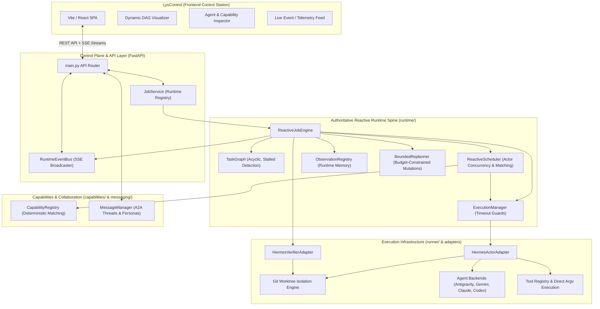

# LysStack / Hermes Lab & LysControl

## Overview
**LysStack** (orchestration control plane hosted in `Hermes-lab`) paired with **LysControl** (operator-facing React/Vite control station) is an advanced agentic orchestration ecosystem. 

Unlike traditional fixed DAGs or sequential loop pipelines, LysStack operates on a **Reactive Runtime Spine** where a job dynamically unfolds from goals into an incremental task graph, evaluated by an event-driven scheduler, executed across isolated Git worktrees and agent personas, enriched with structured observations, verified by multi-command pipelines, and adapted via bounded replanning.

---

## System Architecture



---

## Reactive Runtime Spine Mechanics

LysStack replaces static pipelines with a closed-loop reactive lifecycle:

```text
User Goal / Sprint Spec
         ↓
    Job Record
         ↓
      PLANNING
         ↓
  Initial Task Graph
         ↓
Event-Driven Scheduler ←←←←←←←←←←←←←←←←←←←←←←←←←←←←←←←←←←←←←←←←
         ↓                                                    ↑
Agent / Tool Execution                                        ↑
         ↓                                                    ↑ (FIRST_COMPLETED)
Observation & Artifact Discovery                              ↑
         ↓                                                    ↑
     VERIFYING                                                ↑
         ↓                                                    ↑
Verification Outcome ──[PASSED]──────→ COMPLETED              ↑
         │                                                    ↑
   [REPAIRABLE / REPLAN]                                      ↑
         ↓                                                    ↑
Bounded Dynamic Replanner ──[Mutations: Add/Supersede Task]───┘
         │
  [Budget Exhausted / Fatal] ────────→ BLOCKED
```

### Key Subsystems:
1. **`ReactiveJobEngine`**: Authoritative production lifecycle state machine (`CREATED` → `PLANNING` → `EXECUTING` → `VERIFYING` → `REPAIRING` → `COMPLETED`/`BLOCKED`).
2. **`TaskGraph`**: Incremental DAG with cycle rejection, duplicate protection, safe superseding, and graph deadlock (`is_stalled()`) detection.
3. **`ReactiveScheduler`**: Capability-aware actor dispatch with per-actor concurrency limits, cleanly separating `ACTOR_BUSY` (deferral) from `NO_CAPABLE_ACTOR` (blocking).
4. **`ExecutionManager`**: Async timeout wrapper generating `TIMED_OUT` runs and structured failures without crashing the scheduler.
5. **`ObservationRegistry`**: Captures structured runtime memory (test results, stdout, diffs, metrics) for planner and verifier context.
6. **`BoundedReplanner`**: Dynamic graph mutation strictly constrained by `max_replans_per_job`, `max_tasks_per_job`, and `max_task_attempts`.
7. **`HermesActorAdapter` & `HermesVerifierAdapter`**: Low-level infrastructure adapters isolating Git worktrees, tool execution, agent CLIs, and multi-command verification test suites.

---

## Project Evolution & Phases

| Phase / Sprint | Focus & Milestone | Key Deliverables |
|---|---|---|
| **Sprint 01–02** | Initial Scaffolding & Git Worktrees | FastAPI control plane, `/health`, `/version`, Git worktree isolation per sprint |
| **Sprint 03–04** | Agent Adapters & Backends | First-class adapters (Antigravity, Claude, Codex), subprocess & Herdr backends |
| **Sprint 05–06 / Phase 5** | Three-Agent Delivery & Verification | Antigravity (Scaffold) → Claude (Harden) → Codex (Verify), generic Playwright/npm/pytest pipeline, external repository support, Control REST API |
| **Phase 6 & 6.1** | A2A Messaging & Persona Threads | Agent-to-Agent communication protocol, conversation threads, persona context, SSE live event bus |
| **Phase 7** | Capability-Aware Delegation | Open-string capability registry, deterministic matching, tool actors, LysControl capability views |
| **Phase 8** | Reactive Runtime Spine | Dynamic `TaskGraph`, event-driven `ReactiveScheduler`, `ExecutionManager`, `ObservationRegistry`, `BoundedReplanner` |
| **Phase 8.1** | Runtime Integration & Invariant Hardening | `ReactiveJobEngine` production authority, infrastructure adapters, cycle/duplicate rejection, deadlock stalled detection, `FIRST_COMPLETED` reactivity, concurrency limits, 100% test coverage |
| **Phase 8.1.2** | Real E2E Infrastructure & Integration Hardening | Spec path resolution, normalized `TaskNode` metadata, authoritative integration worktree on `target_branch`, task commit merge & sync from integration HEAD, direct integration verification, fail-closed error guards, full `ToolPolicy` enforcement, real multi-phase E2E suite |

---

## Runtime Invariants & Safety Guarantees

1. **Acyclic Graph Integrity**: `add_dependency` validates reachability, rejecting cycles with `ValueError`.
2. **Deterministic Deadlock Detection**: Stalled dependency graphs immediately transition to `BLOCKED` or trigger replans without waiting for step timeouts.
3. **Safe Mutation**: Tasks with active dependents cannot be deleted; they must be superseded via `supersede_task()`.
4. **Terminal State Immutability**: Terminal states (`BLOCKED`, `COMPLETED`, `CANCELLED`) guard against illegal state transitions back into active states.
5. **Actor Concurrency Safety**: When an actor reaches max concurrency, tasks remain `READY` and are deferred without false blocking.

---

## Related Notes
- [[Multi-Agent]] — Multi-agent orchestration strategies & patterns
- [[K3 Day 09 - Multi-Agent Systems & A2A Collaboration]] — Multi-agent design principles
- [[Aider]] — Terminal-based AI pair programming tool
- [[Ollama]] — Local LLM inference server
- [[Sentinel]] — Local-first SQLite project memory CLI
- [[feynman]] — Open-source AI research agent CLI
