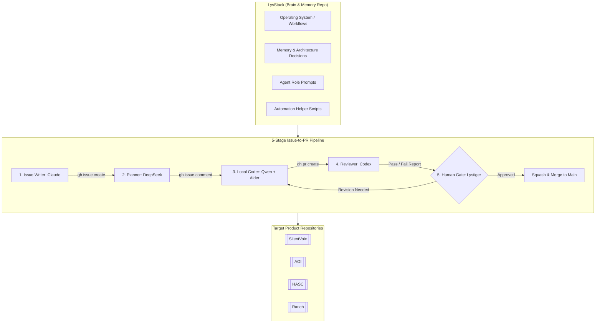
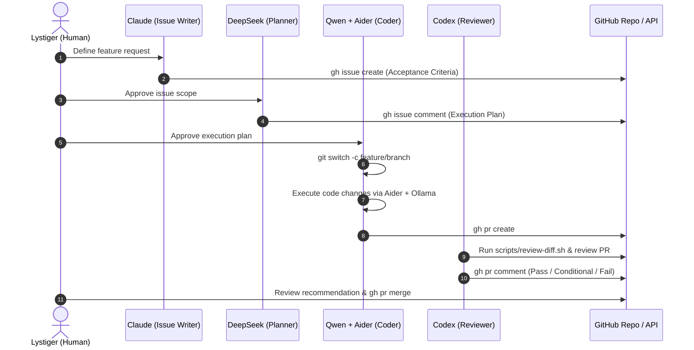

# LysStack

## Overview
**LysStack** is an [[Agent Infrastructure]] and multi-agent orchestration ecosystem designed to preserve long-term project memory, coordinate LLM coding agents, standardize prompt contracts, and execute an automated 5-stage **GitHub Issue-to-PR** workflow. 

Operating under the foundational philosophy **"AI assists. Humans decide."**, LysStack enforces human-in-the-loop oversight where AI subagents generate issues, plan implementation, write code, and perform code reviews, but final merge authority remains strictly with the human owner ([[Lystiger]]). Unlike heavy agent frameworks such as [[CrewAI]], [[AutoGen]], or [[LangGraph]], LysStack keeps a lightweight, markdown-first config repository model that governs target product repositories like [[SilentVoix]], [[AOI]], and [[HASC]].

---

## System Architecture

LysStack functions as the central "brain and operating system" repository. It separates workflow planning and memory governance from target product codebases. 



---

## Component Details

### 1. 5-Stage GitHub Issue-to-PR Pipeline
Each stage in the software delivery pipeline is assigned to a specialized AI model best suited for that role:
- **Stage 1: Issue Writer ([[Claude]])**: Inspects requirements and creates structured GitHub issues with clear non-goals, architectural bounds, and testable acceptance criteria using `gh issue create`.
- **Stage 2: Implementation Planner ([[DeepSeek]])**: Reads the issue and posts an ordered step-by-step technical execution plan, identifying affected files, risk factors, and target verification test commands via `gh issue comment`.
- **Stage 3: Local Coder ([[Qwen]] + [[Aider]])**: Spawns Aider hooked to a local `qwen2.5-coder` model served via [[Ollama]]. Executes incremental file edits on a git feature branch, runs verification tests, and submits a pull request with `gh pr create`.
- **Stage 4: Code Reviewer ([[Codex]])**: Runs diff extraction with `scripts/review-diff.sh`, evaluates the PR against every acceptance criterion, checks for security regressions/leaked secrets, and posts a Pass/Conditional/Fail recommendation.
- **Stage 5: Human Merge Gate ([[Lystiger]])**: Human owner reviews the Codex analysis and manually executes squash-merge. Auto-merging by agents is strictly prohibited by repo rules.

### 2. Memory & Decision Vault
LysStack maintains persistent operational memory across project lifecycles:
- `memory/decisions.md`: Architecture Decision Records (ADRs) logging why specific stacks or constraints were chosen.
- `memory/lessons.md`: Cumulative insights gained from project execution.
- `memory/principles.md`: Core software engineering standards.
- `memory/mistakes.md`: Failure modes and anti-patterns to avoid.

---

## Data Flow



---

## Key Code Snippets

### Aider + Local Qwen Launcher (`scripts/start-qwen-aider.sh`)
This shell script configures and launches Aider tied to a local Ollama instance running Qwen2.5-Coder without exposing API keys:

```bash
#!/usr/bin/env bash
# start-qwen-aider.sh - Launch Aider with local Qwen model for LysStack pipeline
set -euo pipefail

QWEN_MODEL="${QWEN_MODEL:-ollama/qwen2.5-coder:7b}"
OLLAMA_API_BASE="${OLLAMA_API_BASE:-http://localhost:11434}"

if ! command -v aider >/dev/null 2>&1; then
  echo "Error: 'aider' is not installed or not on PATH." >&2
  exit 1
fi

if ! git rev-parse --is-inside-work-tree >/dev/null 2>&1; then
  echo "Warning: not inside a git repository." >&2
fi

echo "Starting Aider with model ${QWEN_MODEL} at ${OLLAMA_API_BASE}"
export OLLAMA_API_BASE

exec aider --model "${QWEN_MODEL}" "$@"
```

### GitHub Command Execution Flow (`operating_system/github-issue-to-pr.md`)
```bash
# Stage 1: Issue creation
gh issue create --title "Add CSV export" --body-file issue.md --label feature

# Stage 2: Plan posting
gh issue comment 42 --body-file plan.md

# Stage 3: Coding & PR creation
git switch -c feature/42-csv-export
~/projects/LysStack/scripts/start-qwen-aider.sh
git push -u origin feature/42-csv-export
gh pr create --fill --base main

# Stage 4: Reviewing diff
~/projects/LysStack/scripts/review-diff.sh main > review.txt
gh pr comment 43 --body-file review.txt

# Stage 5: Human merge
gh pr merge 43 --squash
```

---

## Learnings & Best Practices
1. **Model Specialization Over Single-Agent Monoliths**: Splitting tasks into specialized roles (Claude for spec writing, DeepSeek for planning, Qwen for coding, Codex for review) yields far higher quality than relying on a single prompt.
2. **Local-First Privacy**: Using local Qwen2.5-Coder via [[Ollama]] keeps codebase changes private and minimizes token costs during intense iterative coding sessions.
3. **Hard Human Gates**: Enforcing human approval at Stage 5 prevents rogue AI merges and keeps overall code quality and architecture aligned with human intent.

---

## Related Notes
- [[Multi-Agent]] — Multi-agent orchestration strategies & patterns
- [[K3 Day 09 - Multi-Agent Systems & A2A Collaboration]] — Multi-agent design principles from K3 AI Program
- [[GitHub CLI]] — Terminal workflow for issue and pull request automation
- [[Aider]] — Terminal-based AI pair programming tool
- [[Ollama]] — Local LLM inference server
- [[feynman]] — Open-source AI research agent CLI
- [[Sentinel]] — Local-first SQLite project memory CLI
