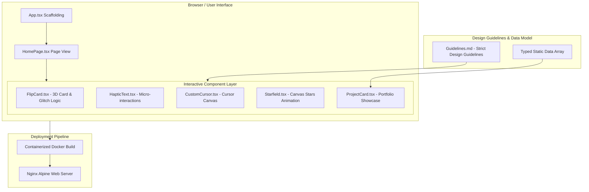
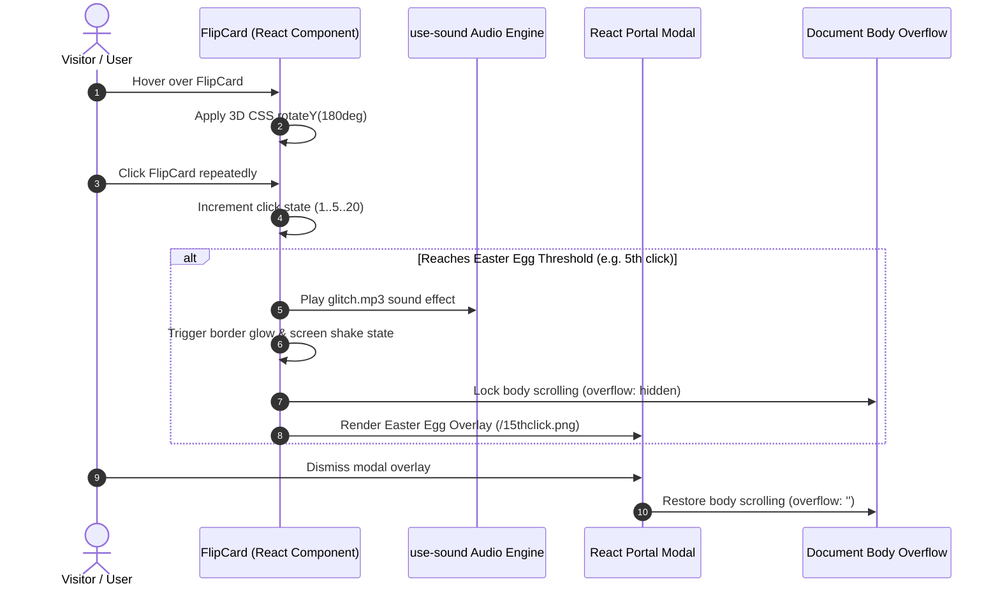

# Lysfolio

## Overview
**Lysfolio** is a modern, production-grade personal engineering portfolio and interactive web application designed to showcase software development projects, technical skills, and research work. Built with [[React 19]], [[TypeScript]], [[Vite]], and [[Tailwind CSS]], Lysfolio also serves as an intentional **AI coding stress-test environment** designed to test AI agents' ability to generate high-fidelity, polished, production-ready frontend visual components without introducing code rot or architectural degradation.

Key visual features include a custom interactive **3D FlipCard** (`FlipCard.tsx`), interactive haptic text components (`HapticText.tsx`), custom mouse cursor dynamics (`CustomCursor.tsx`), dynamic starfields (`Starfield.tsx`), interactive project cards (`ProjectCard.tsx`), and hidden easter egg interactions backed by audio feedback via `use-sound`.

---

## System Architecture



---

## Component Details

### 1. 3D Flip Card Component (`FlipCard.tsx`)
- **3D Transform & Physics**: Uses [[Framer Motion]] with 3D perspective (`perspective: 1000px`) and `backfaceVisibility: hidden` to create real-time card flips on hover.
- **Glitch & Easter Egg Engine**: Tracks cumulative click counts. At specific thresholds (5th, 12th, and 20th clicks), it triggers neon border glows, screen shaking animations, sound effects via `use-sound`, and modal popups rendering secret terminal diagnostics.
- **Portal Rendering**: Uses React `createPortal` to lock document body scrolling and project overlays seamlessly above the UI stack.

### 2. Custom Cursor & Visual Micro-Interactions
- **`CustomCursor.tsx`**: Implements custom cursor tracking with spring physics to maintain smooth, delay-free cursor trailing.
- **`HapticText.tsx`**: Provides haptic-style visual text feedback on hover.
- **`Starfield.tsx`**: Canvas-based background component generating responsive particle stars and space ambiance.

---

## Data Flow



---

## Key Code Snippets

### 3D Card Flip & Glitch State Engine (`src/components/FlipCard.tsx`)
```tsx
import React, { useState, useEffect, useRef } from 'react';
import { motion, AnimatePresence } from 'framer-motion';
import { createPortal } from 'react-dom';
import useSound from 'use-sound';

const FlipCard: React.FC = () => {
  const [isFlipped, setIsFlipped] = useState(false);
  const [clicks, setClicks] = useState(0);
  const [popupImg, setPopupImg] = useState<string | null>(null);
  const [playGlitch] = useSound('/glitch.mp3', { volume: 0.5 });

  const handleCardClick = () => {
    setClicks((prev) => prev + 1);
  };

  useEffect(() => {
    if (clicks === 5) {
      setPopupImg('/15thclick.png');
      playGlitch();
    }
  }, [clicks, playGlitch]);

  return (
    <div className="w-full max-w-md h-96 mx-auto" style={{ perspective: '1000px' }}>
      <motion.div
        className="relative w-full h-full cursor-pointer"
        style={{ transformStyle: 'preserve-3d' }}
        whileHover={{ rotateY: 180 }}
        onClick={handleCardClick}
      >
        <motion.div className="absolute inset-0 backface-hidden rounded-lg bg-slate-900/40 backdrop-blur-xl p-6">
          <h3 className="text-xl font-bold">Quick Facts</h3>
          <p><strong>Name:</strong> Hung Anh Do</p>
        </motion.div>
      </motion.div>
    </div>
  );
};
```

### Docker & Nginx Deployment Configuration (`Dockerfile`)
```dockerfile
FROM node:20-alpine AS builder
WORKDIR /app
COPY package*.json ./
RUN npm ci
COPY . .
RUN npm run build

FROM nginx:alpine
COPY --from=builder /app/dist /usr/share/nginx/html
COPY nginx.conf /etc/nginx/conf.d/default.conf
EXPOSE 80
CMD ["nginx", "-g", "daemon off;"]
```

---

## Learnings & Best Practices
1. **Strict Design Guidelines Prevent AI Entropy**: Establishing rigid visual guidelines (`Guidelines.md`) capping container widths (`max-w-5xl`), forbidding unnecessary neon gradients, and mandating explicit spacing scales keeps AI-generated UI updates clean and predictable.
2. **React 19 Capability**: Upgrading to [[React 19]] alongside Vite provides near-instant HMR (Hot Module Replacement) and optimized component bundling.
3. **Decoupled Data and View**: Storing portfolio items as strongly-typed arrays inside `src/data/` ensures component rendering logic remains pure and easy to refactor without breaking content contracts.

---

## Related Notes
- [[React 19]] — Next-generation UI rendering framework
- [[TypeScript]] — Strongly-typed JavaScript extension
- [[Vite]] — Ultra-fast frontend build tool and dev server
- [[Tailwind CSS]] — Utility-first CSS framework
- [[Framer Motion]] — Animation library for React
- [[Docker]] — Application containerization platform
- [[Nginx]] — High-performance HTTP server
