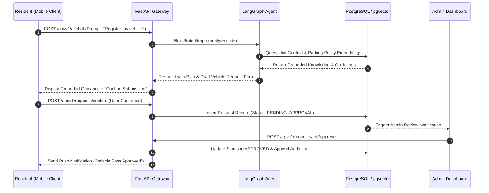

# MoveInMate AI (P-016)

## Overview

**MoveInMate AI** (`/home/lystiger/projects/P-016`) is an AI-powered resident onboarding and property-service assistant platform developed for the Vietnam Housing Hackathon 2026 (VHR-16, Team Quatre). Demonstrated using Vinhomes Ocean Park 1 as its inaugural community target, MoveInMate turns fragmented move-in procedures (resident registration, vehicle card requests, utility setup, rules compliance, document submissions) into a single personalized, auditable workflow.

Built as a modular monolith in [[FastAPI]] and [[Python]], MoveInMate pairs a stateful [[LangGraph]] agent with strict human-in-the-loop (HITL) governance, [[Supabase]] Auth (JWT + RLS), and [[PostgreSQL]] + [[pgvector]] knowledge retrieval. The AI provides grounded guidance and pre-fills request templates, but **never** self-approves protected actions or overrides management authorization.

---

## System Architecture

```mermaid
flowchart TB
    subgraph Client Tier
        Mobile[Resident Mobile App<br/>React Native + Expo]
        ResWeb[Resident Web Client<br/>React]
        AdminWeb[Property Management Admin<br/>React Dashboard]
    end

    subgraph FastAPI Modular Monolith [/src]
        API[FastAPI Gateway & Router<br/>/api/v1/ai/chat]
        IAM[Identity & Access Module]
        Property[Property & Occupancy Module]
        Onboarding[Onboarding & Checklists Module]
        Requests[Service Requests & Approvals]
        Agent[LangGraph Agent Scaffold<br/>analyze -> respond]
        Audit[Audit & Observability Engine]
    end

    subgraph Supabase Platform
        SupaAuth[Supabase Auth & RLS]
        DB[(PostgreSQL + pgvector<br/>Vector Store & Audit Log)]
        Storage[Private Document Storage]
    end

    LLM[Configured LLM Provider<br/>OpenAI / Ollama / Anthropic]
    Telemetry[LangSmith / OpenTelemetry]

    Mobile -->|HTTPS + JWT| API
    ResWeb -->|HTTPS + JWT| API
    AdminWeb -->|HTTPS + JWT| API

    API --> SupaAuth
    API --> IAM
    API --> Agent
    
    Agent --> LLM
    Agent --> DB
    Agent --> Telemetry
    
    IAM --> DB
    Property --> DB
    Onboarding --> DB
    Requests --> DB
    Audit --> DB
    Requests --> Storage
```

---

## Component Details

### 1. LangGraph Stateful Agent Workflow
- **Two-Node Graph Scaffold**: Consists of an `analyze` node (intent classification, context retrieval, parameter validation) and a `respond` node (generating grounded answers with citations or formatting service request payloads).
- **Domain Guardrails**: The agent operates inside strict domain boundaries. It accesses published property knowledge and user occupancy context but is prohibited from self-executing sensitive database mutations without explicit user confirmation and administrative sign-off.

### 2. FastAPI Modular Monolith Backend
- **10 Logical Modules**:
  1. *Identity & Access*: Auth validation & role-based access control.
  2. *Property & Occupancy*: Multi-property community data models.
  3. *Resident & Household*: Relationship mapping (Owner, Tenant, Household Member).
  4. *Onboarding*: Deterministic dynamic onboarding checklists tailored by household type.
  5. *Requests & Approvals*: Structured workflow for access cards, parking, and rules exceptions.
  6. *Private Documents*: Document ingestion & secure URL signing.
  7. *Knowledge & Announcements*: Vector embeddings and property policy retrieval.
  8. *Conversation & Bounded AI*: Chat thread execution & prompt templates.
  9. *Notifications*: In-app and push notification queues.
  10. *Audit & Observability*: Append-only event history and PII-redacted logging.

### 3. Data Persistence & Supabase Integration
- **PostgreSQL + pgvector**: Stores transactional records alongside vector embeddings of property handbooks, resident guidelines, and official announcements.
- **Row Level Security (RLS)**: Restricts data visibility strictly to authenticated residents belonging to specific unit numbers.

---

## Data Flow & Human-in-the-Loop Workflow



---

## Key Code Snippets

### Python: FastAPI AI Chat Contract Schema (`src/api/v1/ai.py`)
```python
from pydantic import BaseModel, Field
from typing import List, Optional

class Citation(BaseModel):
    document_id: str
    title: str
    section: str
    content_snippet: str

class AIChatRequest(BaseModel):
    prompt: str = Field(..., min_length=1, max_length=2000)
    household_id: str
    conversation_id: Optional[str] = None

class AIChatResponse(BaseModel):
    conversation_id: str
    answer: str
    citations: List[Citation] = []
    requires_confirmation: bool = False
    action_payload: Optional[dict] = None
```

### Python: LangGraph Agent Graph Setup (`src/agents/workflow.py`)
```python
from langgraph.graph import StateGraph, END
from typing import TypedDict, Annotated

class AgentState(TypedDict):
    prompt: str
    household_id: str
    retrieved_docs: list
    response: str

def analyze_node(state: AgentState) -> AgentState:
    # Resolve intent and fetch vector embeddings from pgvector
    query_text = state["prompt"]
    # Simulated vector retrieval / domain lookup
    state["retrieved_docs"] = [{"title": "Vinhomes Vehicle Policy", "snippet": "Max 2 cars per unit."}]
    return state

def respond_node(state: AgentState) -> AgentState:
    # Grounded response synthesis
    docs = state["retrieved_docs"]
    state["response"] = f"Based on {docs[0]['title']}, residents can register up to 2 vehicles."
    return state

builder = StateGraph(AgentState)
builder.add_node("analyze", analyze_node)
builder.add_node("respond", respond_node)
builder.set_entry_point("analyze")
builder.add_edge("analyze", "respond")
builder.add_edge("respond", END)
graph = builder.compile()
```

---

## Learnings & Engineering Decisions

1. **AI as Assistant, Not Authority**: Large Language Models must not be given un-checked database update permissions in property management. Isolating the AI to guidance and form pre-filling, while forcing explicit user confirmation and admin approval, guarantees zero unauthorized state changes.
2. **Modular Monolith over Microservices**: For early-stage hackathon projects, microservice overhead slows velocity. Organizing code into 10 strict domain modules inside a single FastAPI application provided clean boundaries while maintaining fast unit testing (`pytest`) and linting (`ruff`).
3. **Data Redaction & Auditability**: All chat sessions and agent tool invocations pass through an audit middleware that redacts sensitive PII (resident phone numbers, identity card numbers) before writing telemetry to disk.

---

## Related Notes & Links
- [[FastAPI]]
- [[LangGraph]]
- [[Python]]
- [[Supabase]]
- [[PostgreSQL]]
- [[pgvector]]
- [[Pydantic]]
- [[Docker]]
- [[React Native]]
- [[Ruff]]
- [[Pytest]]
- [[K3-Course-Overview|K3 AI Course]]
