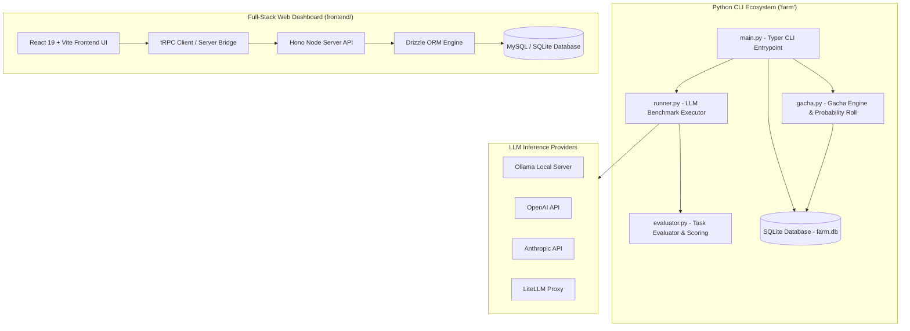
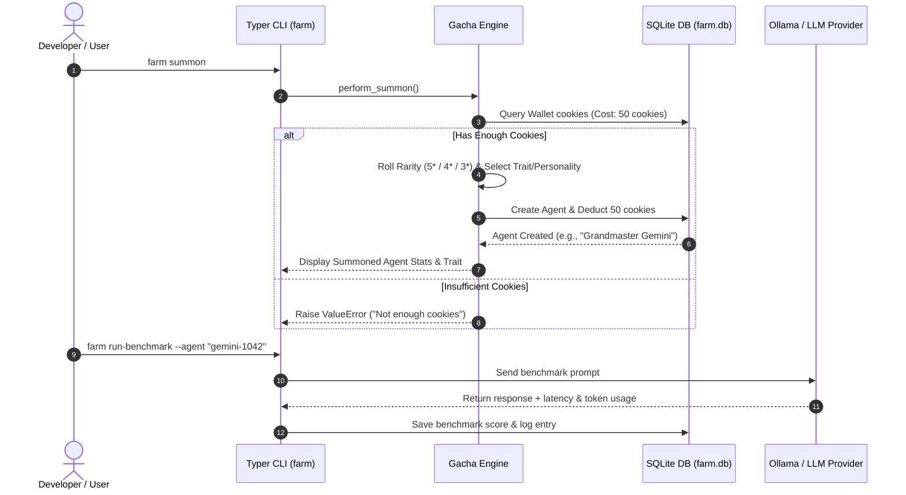

# Ranch

## Overview
**Ranch** (also known internally as `llm-farm`) is an interactive, gamified LLM evaluation, observability, and management platform. It transforms standard model benchmarking into a **gacha-style agent management system**, where developers summon, level up, and deploy LLM sub-agents (e.g., [[Gemini]], [[Kimi]], [[Codex]]) powered by local inference engines like [[Ollama]] or cloud LLM APIs.

The system features a dual architecture: a high-performance **Python 3.11 CLI** (`farm`) backed by [[SQLite]] and [[SQLAlchemy]] for command-line model management and benchmarking, and a full-stack **React 19 + Hono + tRPC** web dashboard (`frontend/`) complete with real-time analytics powered by [[Recharts]], [[Drizzle ORM]], and [[Tailwind CSS]].

---

## System Architecture



---

## Component Details

### 1. Gacha Summon & Agent Management Engine (`gacha.py`)
- **Rarity Tier Distribution**: Implements weighted probability rolls for 3-star (75%), 4-star (20%), and 5-star (5% grandmaster) agents.
- **Traits & Personalities**: Assigns unique operational traits (e.g., *Scholar* token reduction, *Energetic* energy recovery, *Swift* minimum latency) and personality prompts tailored to provider backends.
- **Economy Engine**: Consumes in-game "cookies" from user wallets for summons, maintaining energy limits and token budgets per agent.

### 2. Python CLI Suite (`src/farm/`)
- **`main.py`**: [[Typer]] command-line application exposing `farm summon`, `farm roster`, `farm benchmark`, and `farm status`.
- **`runner.py`**: Executes structured benchmark prompts against registered LLM providers and collects latency, token count, and evaluation scores.
- **`models.py`**: [[SQLAlchemy]] ORM schema mapping `Agent`, `Wallet`, `Task`, `Benchmark`, and `Log` entries.

### 3. Full-Stack Web Frontend (`frontend/`)
- Built using **[[React 19]]**, **[[Vite]]**, **[[Hono]]**, and **[[tRPC]]** for type-safe end-to-end client-server RPC calls.
- Employs **[[Drizzle ORM]]**, **[[Radix UI]]** primitives, **[[Tailwind CSS]]**, and **[[Recharts]]** to display agent telemetry, energy status, and benchmark score leaderboards.

---

## Data Flow



---

## Key Code Snippets

### Gacha Roll & Summon Logic (`src/farm/gacha.py`)
```python
import random
from sqlalchemy.orm import Session
from .models import Agent, Wallet

SUMMON_COST = 50
RARITY_RATES = {5: 0.05, 4: 0.20, 3: 0.75}

class GachaEngine:
    def __init__(self, db: Session):
        self.db = db

    def perform_summon(self) -> Agent:
        wallet = self.db.query(Wallet).first()
        if not wallet or wallet.cookies < SUMMON_COST:
            raise ValueError("Not enough cookies")

        # Roll Rarity
        roll = random.random()
        cumulative = 0
        rarity = 3
        for r, rate in sorted(RARITY_RATES.items(), reverse=True):
            cumulative += rate
            if roll <= cumulative:
                rarity = r
                break
        
        provider = random.choice(["gemini", "kimi", "codex"])
        agent_id = f"{provider}-{random.randint(1000, 9999)}"
        new_agent = Agent(
            id=agent_id,
            name=f"{rarity}-Star {provider.capitalize()}",
            provider=provider,
            rarity=rarity,
            energy=100
        )
        wallet.cookies -= SUMMON_COST
        self.db.add(new_agent)
        self.db.commit()
        return new_agent
```

### Pyproject Configuration (`pyproject.toml`)
```toml
[project]
name = "llm-farm"
version = "0.1.0"
description = "A CLI-based observability and management system for AI models"
requires-python = ">=3.11"
dependencies = [
    "typer[all]",
    "rich",
    "sqlalchemy",
    "pydantic",
    "python-dotenv",
]

[project.scripts]
farm = "farm.main:app"
```

---

## Learnings & Best Practices
1. **Gamification Boosts Observability Engagement**: Framing model benchmarking and LLM energy management through gacha mechanics makes routine evaluation fun and engaging.
2. **Hybrid CLI and Web UI Architecture**: Providing both a light [[Typer]] terminal CLI and a rich [[React 19]] + [[tRPC]] web dashboard caters to both rapid terminal testing and detailed visual analytics.
3. **Provider Abstraction**: Wrapping model backends ([[Ollama]], [[OpenAI]], [[LiteLLM]]) behind a standardized agent contract ensures seamlessly interchangeable benchmarks.

---

## Related Notes
- [[Python 3.11]] — Core backend runtime
- [[Typer]] — Fast, intuitive CLI building framework for Python
- [[SQLAlchemy]] — Python SQL toolkit and ORM
- [[SQLite]] — Lightweight, self-contained SQL database engine
- [[React 19]] — Modern web user interface framework
- [[tRPC]] — End-to-end typesafe API framework
- [[Hono]] — Fast, lightweight web framework for Node.js
- [[Drizzle ORM]] — TypeScript ORM for SQL databases
- [[Ollama]] — Local LLM runner
- [[LysStack]] — Multi-agent engineering workflow system
