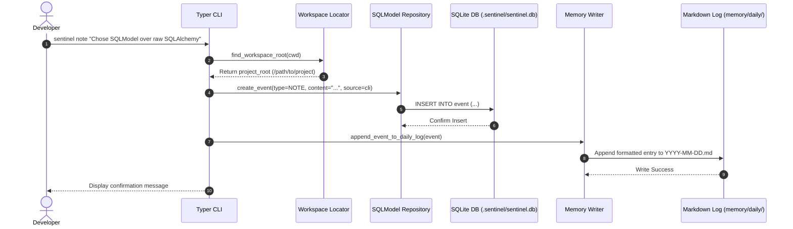

# Sentinel - Local-First Developer Project Memory & Audit CLI

## Overview
**Sentinel** is a local-first AI project-memory command-line interface (CLI) for software developers. Operating as a project's "external brain," Sentinel captures development decisions, notes, terminal commands, git events, and test outcomes into a local, queryable [[SQLite]] database (`.sentinel/sentinel.db`) and renders them into human-readable Markdown files (`memory/daily/YYYY-MM-DD.md`) that can be reviewed, grepped, and committed to source control.

Designed with a strict **Local-First** philosophy, Sentinel requires no external cloud services, vector databases, API keys, or heavy LLM dependencies—delivering zero-latency operation and absolute data privacy.

---

## System Architecture

Sentinel follows a clean layered Python architecture consisting of a [[Typer]] + [[Rich]] CLI application layer, an upward workspace traversal engine, a [[SQLModel]] database repository layer, and a deterministic Markdown memory generator.

```mermaid
graph TD
    subgraph CLI Layer (apps/cli/main.py)
        CLI["Typer CLI Commands"]
        InitCmd["sentinel init"]
        NoteCmd["sentinel note <content>"]
        StatusCmd["sentinel status"]
        SummCmd["sentinel summarize today"]
        RichTable["Rich Console & Table Renderer"]
        CLI --- RichTable
    end

    subgraph Core Engine Layer (sentinel_core/)
        WorkspaceLoc["Workspace Locator (workspace.py)"]
        DBEngine["SQLite Engine & Migration (db.py)"]
        EventRepo["Event Repository (repositories.py)"]
        MemoryWriter["Markdown Log Writer (writer.py)"]
        Summarizer["Rule-Based Daily Summarizer (summarizer.py)"]
    end

    subgraph Data Model Layer (sentinel_core/events/)
        EventModel["Event SQLModel Schema"]
        EventTypeEnum["EventType Enum (NOTE, DECISION, TEST, GIT...)"]
        EventModel --- EventTypeEnum
    end

    subgraph Local Storage & Memory Layer
        DBFile[(".sentinel/sentinel.db (SQLite Database)")]
        DailyLog["memory/daily/YYYY-MM-DD.md"]
        DailySummary["memory/daily/YYYY-MM-DD-summary.md"]
    end

    CLI --> WorkspaceLoc
    WorkspaceLoc --> DBEngine
    NoteCmd --> EventRepo
    EventRepo --> EventModel
    EventModel --> DBFile
    NoteCmd --> MemoryWriter
    MemoryWriter --> DailyLog
    SummCmd --> Summarizer
    Summarizer --> DailySummary
```

---

## Component Details

### 1. Event Data Model (`sentinel_core/events/models.py`)
Every project activity is modeled as an immutable `Event` record in [[SQLModel]]:
- **`id`**: Auto-incrementing primary key integer.
- **`timestamp`**: ISO-8601 timestamp representing exact local occurrence time.
- **`project`**: Project workspace name resolved from root directory.
- **`type`**: Strongly-typed `EventType` enum:
  - `NOTE`: Developer thoughts and observations.
  - `DECISION`: Architectural and design choices.
  - `TERMINAL_COMMAND`: Recorded terminal executions.
  - `TEST_FAILURE` / `TEST_SUCCESS`: Automated test suite outcomes.
  - `GIT_COMMIT` / `FILE_CHANGED`: Version control events.
  - `AI_SUMMARY`: Daily rollups.
- **`source`**: Event origin tag (`cli`, `git_hook`, `pytest_plugin`).
- **`content`**: Human-readable main text payload.
- **`metadata_json`**: Optional JSON blob for structured metadata expansion.

### 2. Upward Workspace Locator (`sentinel_core/storage/workspace.py`)
Modeled after `git`, Sentinel locates its active workspace by walking upward from the current working directory until it detects a `.sentinel/` directory. This enables developers to execute `sentinel` commands seamlessly from any deep subdirectory within a repository.

### 3. CLI Command Suite (`apps/cli/main.py`)
- **`sentinel init`**: Bootstrap command that creates `.sentinel/sentinel.db` and sets up the `memory/` directory tree (`daily/`, `decisions/`, `tasks/`).
- **`sentinel note <text>`**: Records a new note event in the SQLite database and appends it to today's `memory/daily/YYYY-MM-DD.md` log.
- **`sentinel status`**: Renders a [[Rich]] terminal card displaying total event counts, today's activity count, and a formatted table of recent events.
- **`sentinel summarize today`**: Executes a deterministic, rule-based summary algorithm that aggregates event counts by type, spotlights major decisions, and generates `memory/daily/YYYY-MM-DD-summary.md`.

### 4. Memory Writer & Summarizer (`sentinel_core/memory/`)
- **`writer.py`**: Formats incoming events into clean Markdown entries and appends them to daily log files, ensuring version-controllable project documentation.
- **`summarizer.py`**: Rule-based aggregator that constructs structured summaries without relying on external LLM APIs, guaranteeing fast, deterministic execution.

---

## Data Flow



---

## Key Code Snippets

### Upward Workspace Traversal (`sentinel_core/storage/workspace.py`)
```python
from pathlib import Path
from typing import Optional

def find_workspace_root(start_path: Optional[Path] = None) -> Path:
    """Walk up from start_path to find the nearest directory containing '.sentinel'."""
    current = (start_path or Path.cwd()).resolve()
    for parent in [current, *current.parents]:
        if (parent / ".sentinel").is_dir():
            return parent
    raise RuntimeError("Not a sentinel workspace (or any parent directory): .sentinel not found. Run 'sentinel init' first.")
```

### Note Recording CLI Handler (`apps/cli/main.py`)
```python
import typer
from sentinel_core.storage.workspace import find_workspace_root
from sentinel_core.storage.db import get_session
from sentinel_core.storage.repositories import EventRepository
from sentinel_core.events.models import EventType
from sentinel_core.memory.writer import append_to_daily_log

app = typer.Typer(help="Sentinel: Local-first AI project memory CLI")

@app.command()
def note(content: str = typer.Argument(..., help="The note content to record")):
    root = find_workspace_root()
    project_name = root.name
    with get_session(root) as session:
        repo = EventRepository(session)
        event = repo.add_event(
            project=project_name,
            event_type=EventType.NOTE,
            source="cli",
            content=content
        )
        append_to_daily_log(root, event)
        typer.echo(f"Recorded note #{event.id} in project '{project_name}'.")
```

---

## Learnings & Architectural Takeaways

1. **Local-First Developer Ergonomics**: Storing state locally in [[SQLite]] and rendering into Markdown delivers instant responsiveness, full offline capabilities, and git-native team sharing.
2. **Upward Directory Traversal**: Emulating `git` directory traversal (`.sentinel/` discovery) provides intuitive CLI usability regardless of working directory depth.
3. **Deterministic Summarization First**: Rule-based summary generators provide immediate utility without introducing external API costs, rate limits, or network dependencies.
4. **Integration Ecosystem**: Related to [[Typer]], [[SQLModel]], [[SQLite]], [[Rich]], [[Python]], [[LysStack]], and [[K3 AI Program]].
