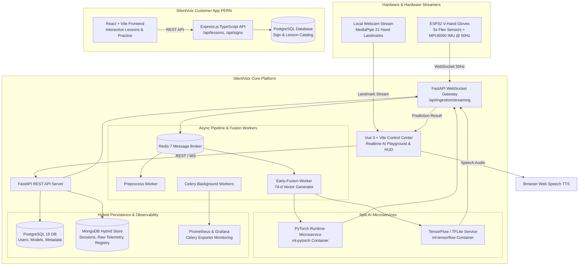
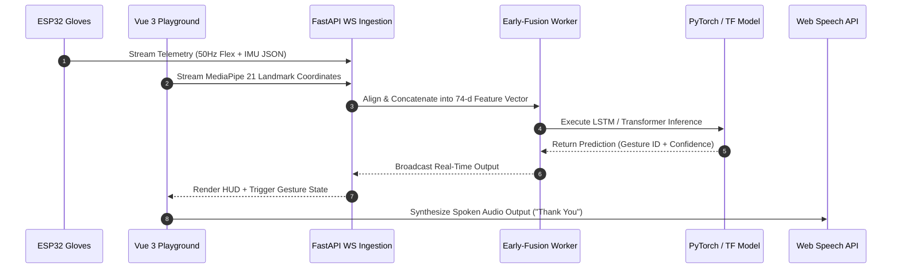

# SilentVoix Platform & Customer App

## Overview

**SilentVoix** is an end-to-end multimodal sign-language AI ecosystem consisting of two complementary platforms:

1. **SilentVoix V-Hand AI Platform** (`/home/lystiger/projects/SilentVoix`): A real-time sign-language recognition platform and multi-format AI playground. It streams flex sensor + IMU motion data from custom ESP32 wearable gloves (**V-Hand**) at 50 Hz alongside video landmark tracking via [[MediaPipe]] / [[OpenCV]]. It supports hot-swapping and live inference across multi-format machine learning models (`.pth`, `.tflite`, `.keras`, `.h5`, `.pt`), backed by split PyTorch/TensorFlow runtime services, [[Redis]] + [[Celery]] async workers, and a hybrid [[PostgreSQL]] + [[MongoDB]] database architecture.
2. **silentVoix-customer** (`/home/lystiger/projects/silentVoix-customer`): A PERN-stack ([[PostgreSQL]], [[Express]], [[React]], [[Node.js]] + [[TypeScript]]) web application for sign-language learners. It features interactive lessons in English and Vietnamese, real-time local webcam practice (`getUserMedia`), sign dictionary lookups, and progress tracking.

Developed as a third-year engineering platform (USTH, Jan–Mar 2026), SilentVoix runs completely on local hardware without cloud dependencies, providing real-time gesture classification, early-fusion feature vector processing, and instant browser Text-to-Speech (TTS).

---

## System Architecture



---

## Component Details

### 1. V-Hand Hardware & ESP32 Sensor Streaming
- **Hardware Spec**: Custom wearable glove featuring 5 analog flex sensors per hand and an MPU6050 6-DOF Inertial Measurement Unit (accelerometer + gyroscope).
- **Communication**: ESP32 microcontrollers package sensor values and stream serialized JSON packets over WebSocket at 50 Hz.
- **Ingestion Engine**: Handled by `api/ingestion/streaming/collector.py` with sliding window buffers, zero-drop packet queues, and automatic timestamp sync.

### 2. Multi-Format Model Playground & Validation
- **Supported Formats**: PyTorch (`.pth`, `.pt`), TensorFlow / Keras (`.h5`, `.keras`), and TensorFlow Lite (`.tflite`).
- **Runtime Preflight Validator** (`api/core/runtime_preflight.py`): Performs dummy tensor passes, verifies input dynamic shapes, checks output logits compatibility, and registers metadata before hot-swapping models into production.
- **Split Microservices**: Isolates PyTorch dependencies in `ml-pytorch` and TensorFlow in `ml-tensorflow` Docker containers to prevent version locks and CUDA memory fragmentation.

### 3. Early-Fusion Engine (74-Dimensional Vector)
- **Feature Vector**: Combines 21 3D hand keypoints from [[MediaPipe]] (63 coordinates) with normalized glove sensor telemetry (5 flex values + 6 IMU motion axes) to form a unified 74-dimensional input tensor per frame.
- **Worker Execution**: `worker-early-fusion` processes synchronized frames, feeds the temporal LSTM classifier, and handles graceful degraded modes when either camera vision or glove stream drops.

### 4. Vue 3 Control Center (`vue-next`)
- **Realtime HUD**: Renders live MediaPipe hand skeletons over HTML5 Canvas, displays FPS, signal health, confidence scores, and hot-swappable model selection.
- **Workspaces**: Dedicated views for AI Playground, Sensor Dataset Capture, Model Library Management, CSV Pipeline Compatibility Checks, and System Telemetry.

### 5. PERN Customer Educational Portal (`silentVoix-customer`)
- **Frontend**: Built with [[React]], [[TypeScript]], and [[Vite]], featuring bilingual (`EN` / `VI`) sign-language courses, difficulty levels, and interactive video playback.
- **Webcam Practice**: Uses `getUserMedia` for local in-browser camera streaming while watching demo tutorial videos.
- **Backend API**: [[Express]] API server with PostgreSQL schema mapping for signs, categories, and progress logging.

---

## Data Flow & Workflow



---

## Key Code Snippets

### Python: Early-Fusion Vector Concatenation (`api/processors/fusion.py`)
```python
import numpy as np

def build_early_fusion_vector(cv_landmarks: list[dict], sensor_data: dict) -> np.ndarray:
    """
    Concatenates 21 3D CV landmarks (63-d) and glove sensor readings (11-d)
    into a unified 74-dimensional vector for temporal model inference.
    """
    coords = []
    for lm in cv_landmarks[:21]:
        coords.extend([lm.x, lm.y, lm.z])
    
    if len(coords) < 63:
        coords.extend([0.0] * (63 - len(coords)))

    flex_values = sensor_data.get("flex", [0.0] * 5)
    imu_motion = sensor_data.get("imu", [0.0] * 6)  # accel x,y,z + gyro x,y,z
    
    fusion_vec = np.array(coords + flex_values + imu_motion, dtype=np.float32)
    assert fusion_vec.shape[0] == 74, f"Expected 74-d vector, got {fusion_vec.shape[0]}"
    return fusion_vec
```

### TypeScript: Customer App Lesson Route (`silentVoix-customer/backend/src/routes/lessons.ts`)
```typescript
import { Router, Request, Response } from 'express';
import { pool } from '../db';

const router = Router();

router.get('/', async (req: Request, res: Response) => {
  const lang = (req.query.lang as string) || 'en';
  try {
    const query = `
      SELECT id, title_${lang} AS title, description_${lang} AS description, 
             category, difficulty, video_url, tags 
      FROM lessons 
      ORDER BY id ASC`;
    const { rows } = await pool.query(query);
    res.json({ success: true, data: rows });
  } catch (err) {
    res.status(500).json({ success: false, error: (err as Error).message });
  }
});

export default router;
```

---

## Learnings & Engineering Decisions

1. **Split Runtime Microservices**: Coupling PyTorch and TensorFlow into a single Python process leads to massive image sizes, dependency hell, and CUDA allocator conflicts. Isolating runtimes behind light REST/gRPC wrappers inside dedicated Docker containers (`ml-pytorch` vs `ml-tensorflow`) stabilized memory usage.
2. **Hybrid Storage Strategy**: Operational metadata (users, model metadata, execution logs) benefits from [[PostgreSQL]]'s strict ACID guarantees, whereas streaming telemetry sessions, unparsed sensor dumps, and raw model evaluation payloads fit naturally in [[MongoDB]].
3. **Robustness of Multimodal Fusion**: Pure computer vision fails in poor lighting or when hands occlude each other; pure flex sensors fail on subtle spatial hand position differences. Fusing 21 CV landmarks with 11 sensor axes yields 87%+ accuracy even under degraded camera conditions.

---

## Related Notes & Links
- [[FastAPI]]
- [[PyTorch]]
- [[TensorFlow]]
- [[Vue 3]]
- [[React]]
- [[Node.js]]
- [[Express]]
- [[PostgreSQL]]
- [[MongoDB]]
- [[Redis]]
- [[Celery]]
- [[Docker]]
- [[MediaPipe]]
- [[OpenCV]]
- [[K3-Course-Overview|K3 AI Course]]
