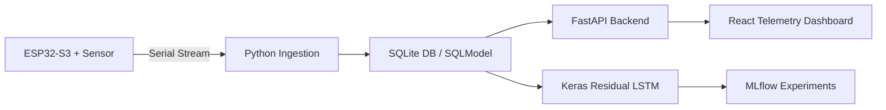

# TempCastML - Edge-ML Telemetry & Time-Series Temperature Forecasting Platform

## Overview
**TempCastML** is an edge-ML research system combining hardware sensing on an [[ESP32]] microcontroller, automated Python serial ingestion, [[TensorFlow]] / [[Keras]] LSTM time-series forecasting, [[MLflow]] experiment tracking, and a [[React]] telemetry command center dashboard.

For full architectural details, model loss comparisons, persistence baseline evaluation benchmarks, and training pipeline code, refer to the primary project workspace note:

👉 **[[🚀 Projects/TempCastML/TempCastML|TempCastML Master Workspace Note]]**

---

## Technical Highlights
- **Hardware Sensing & Ingestion**: ESP32-S3 microcontroller + DHT sensor streaming serial data to Python cleaning pipeline and [[SQLite]] storage via [[SQLModel]].
- **FastAPI Endpoint Engine**: High-throughput REST API with [[SlowAPI]] rate limiting, exposing `/sensor/latest`, `/sensor/history`, and `/predict/` forecast endpoints.
- **Machine Learning Architecture**: Built using [[TensorFlow]] / [[Keras]] featuring multivariate residual LSTM models with cyclic time encodings and [[MLflow]] experiment tracking.
- **Strict Quality Gates**: Microcontroller TinyML compilation is gated behind benchmark evaluations comparing models against persistence baselines across chronological test splits.
- **React Command Center**: Built with [[React]] 19 and [[Vite]] 7 featuring thermal-gradient charts powered by [[Recharts]].

---

## Key References & Related Notes
- Workspace Note: [[🚀 Projects/TempCastML/TempCastML|TempCastML Documentation]]
- Tech Stack: [[ESP32]], [[TensorFlow]], [[Keras]], [[FastAPI]], [[SQLModel]], [[SQLite]], [[React]], [[Vite]], [[MLflow]], [[Python]]
- Learning References: [[K3-Course-Overview|K3 AI Course]]
