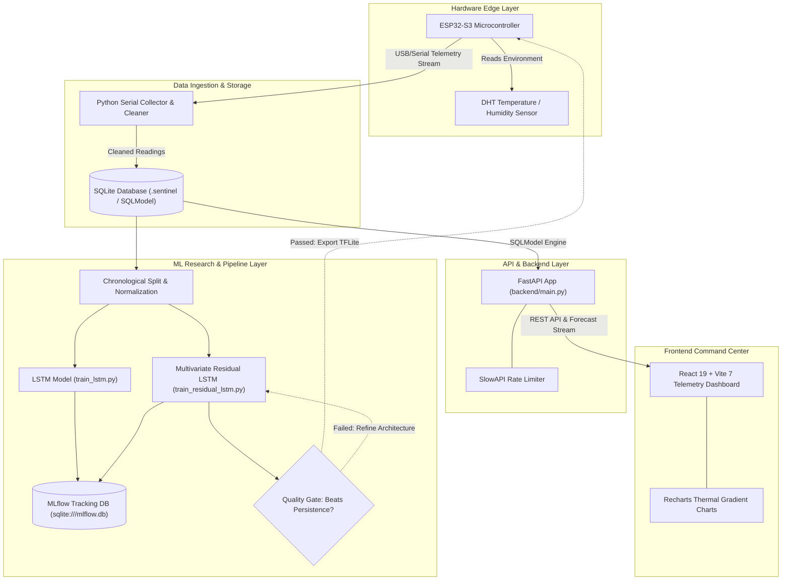
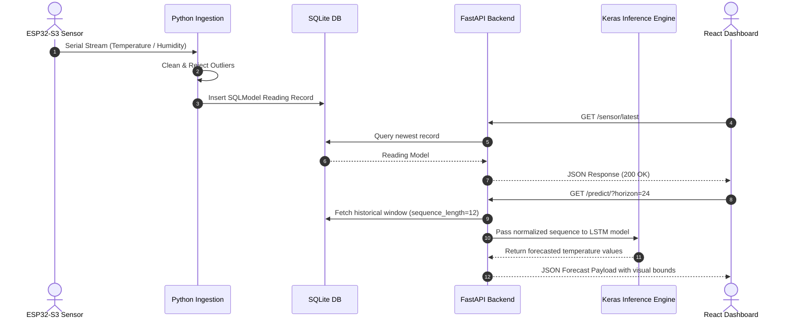

# TempCastML - Edge-ML Telemetry & Time-Series Temperature Forecasting Platform

## Overview
**TempCastML** is an end-to-end Edge-ML research system designed for real-time indoor environmental telemetry collection, short-term temperature time-series forecasting, and live telemetry visualization. The platform spans hardware sensing on an [[ESP32]] microcontroller, Python ingestion services, [[TensorFlow]] / [[Keras]] LSTM model research pipelines, [[MLflow]] experiment tracking, and a bespoke [[React]] telemetry command center dashboard.

The overarching objective is deployment of lightweight **TinyML / TFLite** models onto edge devices. TempCastML strictly enforces **quality gate engineering**: model export and edge compilation are intentionally blocked until trained neural network models demonstrably beat simple persistence baselines across chronological test windows.

---

## System Architecture

The project bridges hardware sensing with cloud/local machine learning research and real-time visualization.



---

## Component Details

### 1. Hardware & Ingestion Layer
- **Microcontroller**: [[ESP32]]-S3 board with DHT environmental sensor executing C++ / Arduino firmware (`low-level code/`).
- **Serial Ingestion Pipeline**: Python collector script reads serial streams (`/dev/ttyUSB0` or `COM4`), cleans raw readings, rejects outlier sensor glitches, and enriches telemetry with OpenWeatherMap outdoor API context before persisting into [[SQLite]].

### 2. API & Database Engine
- **ORM & Database**: Built using [[SQLModel]] (combining [[Pipedream/FastAPI]] pydantic models with [[SQLAlchemy]] ORM) over an [[SQLite]] database.
- **REST Endpoints**:
  - `GET /sensor/latest`: Fetches the latest timestamped telemetry reading.
  - `GET /sensor/history`: Query parameter `limit=N` returns historical time-series sequences.
  - `GET /predict/`: Executes model inference for target horizon (`horizon=24`).
  - `POST /sensor/`: Manual endpoint for ingesting `{ device_id, temperature_c }` payloads.
- **Security & Performance**: [[SlowAPI]] middleware prevents endpoint abuse.

### 3. ML Research & Evaluation Engine
- **Architecture**: Implemented in [[TensorFlow]] / [[Keras]] with reproducible seed initialization:
  - `train_lstm`: One-step temperature-only baseline.
  - `train_residual_lstm`: Direct multivariate residual forecasting using indoor/outdoor conditions and cyclical time features (`sin`/`cos` hour encodings).
- **Experiment Tracking**: Integrated with [[MLflow]] (`sqlite:///backend/AI/mlflow.db`), tracking loss curves, hyperparameter configs, residual distribution plots, and predictions CSV artifacts.
- **Benchmarking Results**:
  - 30-minute horizon: Residual LSTM MAE 0.177°C vs Persistence MAE 0.104°C.
  - 60-minute horizon: Residual LSTM MAE 0.354°C vs Persistence MAE 0.173°C.
  - Evaluation proves persistence is extremely strong in stationary indoor environments, driving the requirement for event-triggered residual forecasting.

### 4. Telemetry Command Center Frontend
- **Tech Stack**: Built with [[React]] 19, [[Vite]] 7, [[Recharts]], and Tailwind CSS design tokens.
- **UI Features**: Bespoke dark command center aesthetic with live animated pulse readouts, thermal-gradient forecast visualization, unit conversion toggles (°C / °F / K), 12/24h time format switches, and connection health indicators.

---

## Data Flow



---

## Key Code Snippets

### Keras LSTM Architecture Builder (`backend/AI/lstm_model.py`)
```python
import tensorflow as tf
from backend.AI.training_config import TrainingConfig

def configure_tensorflow(seed: int):
    tf.keras.utils.set_random_seed(seed)
    try:
        tf.config.experimental.enable_op_determinism()
    except Exception:
        pass
    return tf

def build_lstm_model(config: TrainingConfig):
    tf = configure_tensorflow(config.seed)
    model = tf.keras.Sequential(
        [
            tf.keras.layers.Input(
                shape=(config.sequence_length, len(config.feature_columns))
            ),
            tf.keras.layers.LSTM(config.lstm_units),
            tf.keras.layers.Dropout(config.dropout),
            tf.keras.layers.Dense(1),
        ],
        name="tempcast_lstm",
    )
    model.compile(
        optimizer=tf.keras.optimizers.Adam(learning_rate=config.learning_rate),
        loss="mse",
        metrics=["mae"],
    )
    return model
```

---

## Learnings & Architectural Takeaways

1. **The Persistence Baseline Paradox**: In stationary indoor temperature forecasting, simple persistence ($y_{t+h} = y_t$) often outperforms deep learning models across full datasets due to long unchanged intervals. Models must be evaluated specifically during **change events**.
2. **Strict Chronological Data Splitting**: Random k-fold cross-validation causes severe temporal data leakage in time-series forecasting. Training splits must maintain strict chronological boundaries with sequence gap rejection.
3. **Quality-Gated Edge Deployment**: Blocking [[TinyML]] / TFLite micro-compilation until a model passes rigorous benchmark quality gates prevents deploying unvalidated models to constrained microcontrollers.
4. **Integration Ecosystem**: Related to [[TensorFlow]], [[Keras]], [[ESP32]], [[FastAPI]], [[SQLModel]], [[SQLite]], [[React]], [[MLflow]], and [[K3-Course-Overview|K3 AI Course]].
