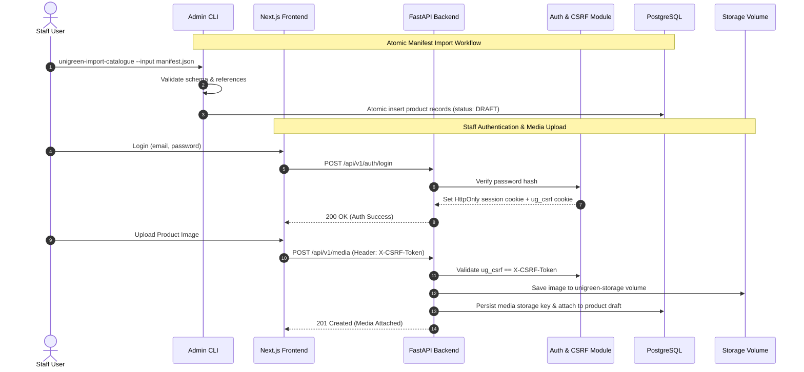

# Unigreen - Bilingual B2B Catalogue & Quotation-to-Order Platform

## Overview
**Uni-Green** is an enterprise bilingual B2B product catalogue and quotation-to-order platform designed for international commerce. Built as a high-performance **Modular Monolith**, Uni-Green serves localized public web experiences in Vietnamese and English (`/vi` and `/en` routes) while providing staff members with secure administrative workspaces for product sheet management, atomic catalogue imports, media attachment, and quotation fulfillment.

The platform emphasizes strict architectural boundaries, contract-driven frontend development using exported OpenAPI specifications, robust double-submit CSRF security for session-authenticated administrative operations, and storage volume abstractions for seamless cloud migration.

---

## System Architecture

Uni-Green's backend is structured as a **Modular Monolith** in [[FastAPI]] using Python 3.12 and managed via `uv`. The database layer relies on [[SQLModel]] and [[PostgreSQL]] with [[Alembic]] migrations. The public web client is built with [[Next.js]] 15 App Router and [[React]] 19.

```mermaid
graph TD
    subgraph Client Layer
        PublicWeb["Next.js 15 App Router (Public i18n: /vi & /en)"]
        StaffWeb["Staff Management Portal"]
        AdminCLI["Staff CLI (unigreen-create-admin / import)"]
    end

    subgraph API Gateway & Security Layer
        FastAPI["FastAPI Modular Monolith Engine"]
        CSRFMiddleware["CSRF Middleware (ug_csrf vs X-CSRF-Token)"]
        AuthMiddleware["Session Auth Middleware (HttpOnly Cookies)"]
        FastAPI --- CSRFMiddleware
        FastAPI --- AuthMiddleware
    end

    subgraph Backend Monolith Modules (src/unigreen/)
        CatalogueMod["catalogue Module (Domain, Repositories, Schemas)"]
        AuthMod["auth Module (Tokens, Password Hashing, Session Store)"]
        MediaMod["media Module (Variant Processing & Image Pipeline)"]
        AuditMod["audit Module (Audit Logging & Trail)"]
        StaffMod["staff Module (CLI & Staff Workspaces)"]
        WorkerMod["worker Module (Async Media Tasks)"]
    end

    subgraph Data & Storage Layer
        PostgreSQL[("PostgreSQL Database")]
        StorageInit["storage-init Volume Prep Service"]
        StorageVol[("unigreen-storage Shared Volume")]
    end

    PublicWeb -->|REST API Requests| FastAPI
    StaffWeb -->|Session Auth + CSRF| FastAPI
    AdminCLI -->|Direct DB Migration & Import| PostgreSQL
    
    FastAPI --> CatalogueMod
    FastAPI --> AuthMod
    FastAPI --> MediaMod
    FastAPI --> AuditMod
    FastAPI --> StaffMod
    
    CatalogueMod --> PostgreSQL
    AuthMod --> PostgreSQL
    AuditMod --> PostgreSQL
    
    MediaMod --> StorageInit
    StorageInit --> StorageVol
    WorkerMod --> StorageVol
```

---

## Component Details

### 1. Modular Monolith Architecture (`backend/src/unigreen/`)
The backend is organized into explicit domain modules, avoiding premature microservice separation while preserving clean boundary isolation:
- **`catalogue`**: Handles bilingual product records (`name_vi`, `name_en`), hierarchical category trees, draft publication states, and controlled manifest importers. Public endpoints strictly expose approved, published products.
- **`auth`**: Manages staff authentication using opaque, revocable session identifiers stored in `HttpOnly` cookies. Enforces double-submit anti-CSRF protection where state-changing requests (`POST`, `PUT`, `DELETE`) must echo the `ug_csrf` cookie in the `X-CSRF-Token` header.
- **`media`**: Manages image original ingestion and automatic derivative variant generation. Media paths are stored strictly as abstract storage keys (`UNIGREEN_STORAGE_ROOT`), isolating backend code from underlying storage adapters (filesystem volume vs S3).
- **`staff`**: Houses CLI commands for bootstrap administrative setup (`unigreen-create-admin`) and bulk catalogue manifest validation/import (`unigreen-import-catalogue`).
- **`audit`**: Records immutable audit trails for administrative operations and publishing lifecycle changes.

### 2. Contract-Driven Development & Tooling
- **API Schema Exporter**: `scripts/export_openapi.py` serializes the FastAPI OpenAPI spec into `contracts/openapi.json`, ensuring the [[Next.js]] frontend and API clients remain synchronized with backend schema changes.
- **Modern Python Toolchain**: Uses `uv` for dependency resolution, `mypy` for static type checking, `ruff` for linting, and `pytest` for test execution.
- **Docker Compose Setup**: Uses multi-stage container builds with a dedicated `storage-init` one-shot container that configures filesystem permissions on `unigreen-storage` before non-root application and worker processes launch.

### 3. Next.js 15 Public Client (`frontend/`)
- **i18n Localization**: Middleware automatically detects locale and routes visitors (`/` redirects to `/vi`). Supports dynamic language switching between Vietnamese and English.
- **Quotation Workflow**: Allows B2B buyers to compile product request lists and submit quotation inquiries directly to staff account managers.

---

## Data Flow



---

## Key Code Snippets

### Contract Exporter Script (`backend/scripts/export_openapi.py`)
```python
import json
import sys
from pathlib import Path
from unigreen.main import app

def export_openapi(output_path: Path) -> None:
    openapi_schema = app.openapi()
    output_path.parent.mkdir(parents=True, exist_ok=True)
    output_path.write_text(json.dumps(openapi_schema, indent=2))
    print(f"Exported OpenAPI contract to {output_path}")

if __name__ == "__main__":
    out = Path(sys.argv[1]) if len(sys.argv) > 1 else Path("contracts/openapi.json")
    export_openapi(out)
```

### CLI Command Registration (`backend/src/unigreen/staff/cli.py`)
```python
import typer
from unigreen.catalogue.importer import import_catalogue_manifest
from unigreen.db import get_sync_db_session

cli = typer.Typer(name="unigreen-staff", help="Uni-Green administration CLI")

@cli.command("unigreen-import-catalogue")
def import_catalogue(
    input_file: Path = typer.Option(..., "--input", "-i", help="Path to manifest JSON"),
    check_only: bool = typer.Option(False, "--check", help="Dry run validation"),
):
    with get_sync_db_session() as session:
        summary = import_catalogue_manifest(session, input_file, dry_run=check_only)
        typer.echo(f"Import finished. Processed: {summary.processed_count}, Drafts: {summary.created_count}")
```

---

## Learnings & Architectural Takeaways

1. **Modular Monolith Discipline**: Structuring Python applications into explicit domain packages (`catalogue`, `auth`, `media`, `audit`) provides microservice-like boundaries without network latency or deployment complexities.
2. **Double-Submit Cookie Defense**: Combining `HttpOnly` session cookies with matching `X-CSRF-Token` headers effectively neutralizes Cross-Site Request Forgery vulnerabilities in web administration portals.
3. **Storage Key Abstraction**: Persisting abstract storage keys rather than direct file paths or S3 URLs allows changing storage providers (local volume vs S3 bucket) without modifying database records.
4. **Integration Ecosystem**: Related to [[FastAPI]], [[SQLModel]], [[PostgreSQL]], [[Alembic]], [[Next.js]], [[React]], [[TypeScript]], [[Docker]], [[uv]], and [[K3 AI Program]].
