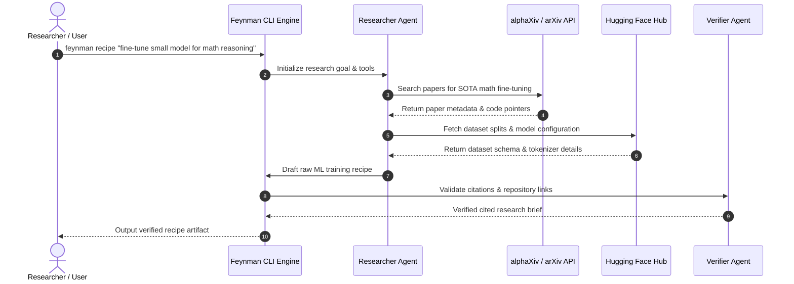

# feynman

## Overview
**feynman** is an open-source, research-first AI agent CLI ecosystem built on top of the [[Pi Agent Framework]] (`@mariozechner/pi-coding-agent`) and [[alphaXiv]] (`@companion-ai/alpha-hub`). Designed for machine learning researchers and software engineers, **feynman** automates academic paper retrieval, literature syntheses, paper-vs-codebase audits, ML training recipe extraction, and experiment replication across local containers and serverless cloud GPUs.

Key features include multi-agent deep research capabilities, automated peer review simulation, source-grounded citation verification, and modular skill exports to platforms like [[Codex]] (`~/.codex/skills/feynman`) and [[OpenCode]] (`.opencode/skills/feynman`).

---

## System Architecture

```mermaid
graph TD
    CLI[Feynman CLI Interface] --> Router{Command Router & Workflow Engine}
    
    subgraph Workflows ["Slash Commands & Workflows"]
        DR[/deepresearch]
        LIT[/lit]
        REV[/review]
        AUD[/audit]
        REC[/recipe]
        REP[/replicate]
    end

    Router --> Workflows

    subgraph Agents ["Specialized Bundled Agents"]
        RA[Researcher Agent]
        RVA[Reviewer Agent]
        WA[Writer Agent]
        VA[Verifier Agent]
    end

    Workflows --> Agents

    subgraph Integrations ["External Knowledge & Compute Providers"]
        AX[alphaXiv API - Paper Search & Code Read]
        HF[Hugging Face Hub API - Datasets & Specs]
        WEB[Web Search - Exa / Perplexity / Gemini]
        DOC[Docker - Local Container Execution]
        MOD[Modal / RunPod - Cloud GPU Compute]
    end

    Agents --> Integrations
```

---

## Component Details

### 1. Workflow Command Suite
- `/deepresearch <topic>`: Spawns parallel sub-agents to query academic paper databases and web sources, synthesizing multi-page evidence-grounded reports.
- `/lit <topic>`: Conducts literature reviews, highlighting academic consensus, key methodologies, conflicting findings, and open questions.
- `/review <artifact>`: Simulates structured peer review with severity-graded feedback (Major/Minor issues, methodology flaws) and revision plans.
- `/audit <item>`: Compares claims made in arXiv papers directly against public GitHub repositories to spot unmentioned hacks, performance gaps, or code discrepancies.
- `/recipe <task>`: Extracts ranked, actionable machine learning training recipes, pinpointing required datasets, hyperparameter configurations, loss functions, and code implementations.
- `/replicate <paper>`: Generates containerized code environments to replicate paper benchmarks on local [[Docker]] or remote cloud GPUs ([[Modal]], [[RunPod]]).

### 2. Multi-Agent System Core
- **Researcher**: Gathers primary source material across arXiv, alphaXiv, web search, and code repositories.
- **Reviewer**: Provides critical evaluation of draft findings and paper claims.
- **Writer**: Compiles structured markdown reports formatted with standard academic headings.
- **Verifier**: Performs automated link-checking, verifies inline citations, and strips broken URLs.

---

## Data Flow



---

## Key Code Snippets

### Package & Module Setup (`package.json`)
```json
{
  "name": "@companion-ai/feynman",
  "version": "0.2.54",
  "description": "Research-first CLI agent built on Pi and alphaXiv",
  "type": "module",
  "bin": {
    "feynman": "bin/feynman.js"
  },
  "dependencies": {
    "@clack/prompts": "^1.3.0",
    "@companion-ai/alpha-hub": "^0.1.3",
    "@mariozechner/pi-ai": "^0.73.0",
    "@mariozechner/pi-coding-agent": "^0.73.0",
    "@sinclair/typebox": "^0.34.49",
    "dotenv": "^17.4.2"
  }
}
```

### Skill Library Distribution Script (`README.md`)
Feynman allows exporting its specialized research skills directly to external AI agent frameworks:

```bash
# Install skills only for Codex CLI
curl -fsSL https://feynman.is/install-skills | bash -s -- --codex

# Install skills into local repository for Claude / local agents
curl -fsSL https://feynman.is/install-skills | bash -s -- --repo

# OpenCode local project installation
curl -fsSL https://feynman.is/install-skills | bash -s -- --opencode
```

---

## Learnings & Best Practices
1. **Source-Grounded AI Research**: Requiring explicit URL verification via a dedicated Verifier agent completely eliminates hallucinated citations in generated literature reviews.
2. **Modular Skill Ecosystem**: Structuring tools into standalone skill modules enables easy portability across different AI coding environments like Codex, OpenCode, and Feynman itself.
3. **Decoupled Heavy Compute**: Offloading model training and heavy benchmarks to cloud platforms like [[Modal]] and [[RunPod]] keeps local CLI footprints minimal while allowing scale-on-demand GPU compute.

---

## Related Notes
- [[Pi Agent Framework]] — Underlying agent engine built by Mario Zechner
- [[alphaXiv]] — Open academic paper search & code inspection platform
- [[Hugging Face Hub]] — Model & dataset registry integration
- [[Modal]] — Serverless GPU infrastructure provider
- [[RunPod]] — On-demand GPU cloud compute
- [[LysStack]] — AI orchestration system
- [[Docker]] — Isolated container execution environment
