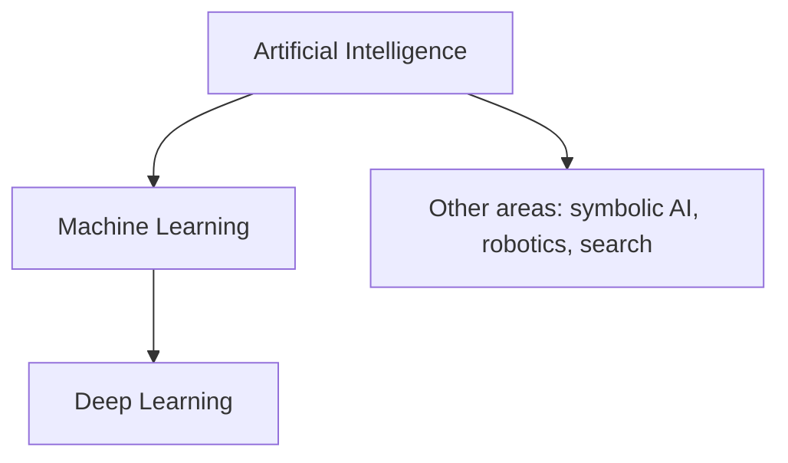

# What Is Artificial Intelligence?

## Related Notes

- [[🧠 Learning/AI/ML/ML Fundamentals|Machine Learning Fundamentals]]
- [[🧠 Learning/AI/DL/Deep Learning Chapter 1|Neural Networks]]
- [[💼 Career/AI Systems Architect Roadmap|AI Systems Architect Roadmap]]
- [[README|Vault Map]]

**Artificial intelligence (AI)** is the broad field of building systems that can perform tasks associated with intelligent behavior, such as reasoning, learning, perception, planning, and decision-making.

I think of AI as systems capable of:

- **Rule-based decision-making**
- **Planning and optimization**
- **Search and heuristic reasoning**
- **Learning patterns from data**

## The AI Landscape

AI contains several overlapping subfields:

### Key Subfields

- **Machine learning (ML):** Methods that learn patterns from data to make predictions or decisions.
- **Deep learning (DL):** A subset of ML based on multilayer artificial neural networks.
- **Symbolic and heuristic AI:** Rule-based systems, expert systems, knowledge representation, and search algorithms.
