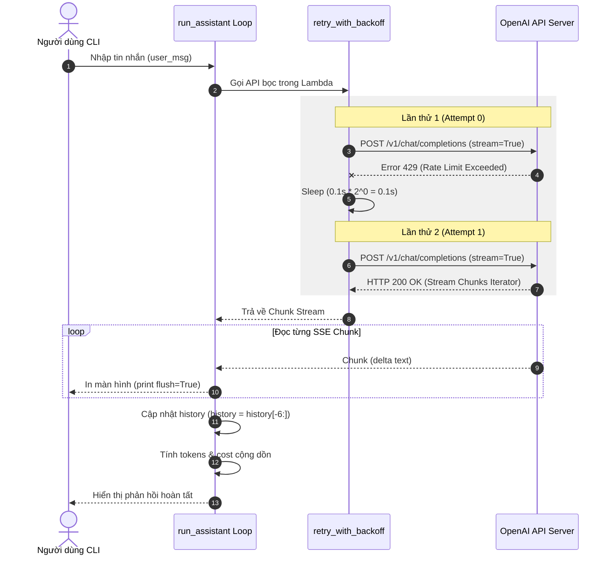

# K3 Day 01 — Khám Phá LLM API (LLM API Exploration)

> **Khoá học:** [[K3-AI-Program]] (AI Practical Competency Program - Phase 1)  
> **Bài học tiếp:** [[K3 Day 02 - AI Product Labs]]  
> **Thời lượng:** 09:00 – 13:00 (4 Blocks + Checkpoints)  
> **Repository gốc:** `/home/lystiger/K3-Day01-LLM-API-Exploration`  
> **Mục tiêu cốt lõi:** Làm chủ [[OpenAI API]] (Chat Completions), tinh chỉnh tham số sinh text, phân tích đánh đổi giữa [[GPT-4o]] và [[GPT-4o-mini]], định hình vai trò mô hình qua [[System Prompt]], đếm token chính xác bằng [[Tiktoken]], thiết kế cơ chế [[Streaming]] kèm [[Exponential Backoff]] retry, và hoàn thiện trợ lý CLI production-grade.

---

## 1. Tổng Quan & Kiến Trúc Buổi Học (Overview & Architecture)

Buổi học Day 01 là bước đệm kĩ thuật nền tảng trong chuỗi huấn luyện K3. Học viên chuyển từ việc tương tác trên giao diện Web UI (ChatGPT/Claude) sang việc làm chủ giao diện lập trình ứng dụng ([[OpenAI API]]) cấp thấp, tính toán chi phí token, xử lý độ trễ mạng và xây dựng khả năng tự phục hồi khi hệ thống gặp sự cố.

```
                                  K3 DAY 01 KNOWLEDGE PIPELINE
┌─────────────────┐     ┌──────────────────────┐     ┌──────────────────────┐     ┌─────────────────────┐
│   Block 1: API  │ ──► │  Block 2: Persona &  │ ──► │  Block 3: Streaming  │ ──► │ Block 4: CLI Assistant│
│    Fundamentals │     │   Token Economics    │     │  & Backoff Retry     │     │    Mini-Project     │
└─────────────────┘     └──────────────────────┘     └──────────────────────┘     └─────────────────────┘
  - ChatCompletions       - System Prompt              - SSE Stream Chunking        - Dependency Injection
  - Temperature/Top_p     - Tiktoken Encoding          - Exponential Backoff        - Full History Buffer
  - Latency Benchmark     - Exact Cost Math            - History Sliding Window     - Production Stats Dict
```

---

## 2. Nền Tảng Kỹ Thuật (Core Technical Concepts)

### 2.1. Cấu Trúc Message & Role Conditioning
Trong [[OpenAI API]] Chat Completions endpoint (`/v1/chat/completions`), dữ liệu đầu vào không phải là một câu văn thuần tuý mà là một mảng danh sách lịch sử hội thoại `messages` dạng JSON object. Mỗi message mang một `role` xác định:

- **`system`**: Lời dặn "đạo diễn" (Persona). Đứng đầu danh sách, quy định cá tính, phong cách diễn đạt, ngôn ngữ, ranh giới an toàn và quy tắc phản hồi của mô hình.
- **`user`**: Câu hỏi hoặc câu lệnh trực tiếp từ người dùng.
- **`assistant`**: Phản hồi được trả về từ LLM (hoặc lịch sử các lượt trả lời trước đó).

### 2.2. Các Tham Số Sinh Text (Generation Hyperparameters)

| Tham Số | Khoảng Giá Trị | Bản Chất Thuật Toán & Tác Động | Khuyên Dùng Sản Phẩm |
|---|---|---|---|
| **`temperature`** | `0.0` – `2.0` | Sửa đổi phân bố xác suất Softmax trước khi lấy mẫu. $T \to 0$ làm sắc nét phân bố (chọn token xác suất cao nhất — deterministic), $T > 1.0$ làm phẳng phân bố (sáng tạo, dễ ngẫu nhiên/hội thoại lan man). | `0.0` – `0.2` cho [[Extraction]], Code, Math, Support; `0.7` – `0.9` cho [[Creative Writing]], Brainstorming. |
| **`top_p`** | `0.0` – `1.0` | **Nucleus Sampling**: Chỉ giữ lại tập hợp các token có tổng xác suất tích luỹ đạt ngưỡng $p$. Ví dụ $p=0.9$ sẽ bỏ qua 10% các token có xác suất cực thấp (tail tokens). | Thường chỉ chỉnh một trong hai (`temperature` HOẶC `top_p`), không chỉnh cả hai cùng lúc để tránh làm mất kiểm soát phân bố. |
| **`max_tokens`** | Integer ($> 0$) | Đặt trần số lượng token tối đa mà model được phép sinh ra trong phần `assistant` response. Giúp kiểm soát chi phí tối đa và tránh vòng lặp vô tận. | Luôn đặt `max_tokens` cho mọi request production để chặn rủi ro bùng nổ token. |

### 2.3. Quy Tắc Import Hygiene Trong Python Testing
Một quy tắc kiến trúc quan trọng khi làm việc với mock tests (`pytest`, `unittest.mock`):

> ⚠️ **Hợp đồng Import:** Luôn thực hiện `from openai import OpenAI` **BÊN TRONG** thân hàm thay vì đặt ở đầu file (module level).  
> **Lý do:** Bộ test tự động kiểm thử bằng cách mock class `openai.OpenAI`. Nếu import ở đầu file khi module vừa nạp, hàm sẽ giữ tham chiếu (reference) đến class thật. Khi test chạy, nó sẽ gọi trực tiếp lên API thật của OpenAI -> Gây lỗi crash do thiếu API key hoặc tiêu tốn tiền không mong muốn.

---

## 3. Toán Học Token & Chi Phí (Token Economics & Math)

### 3.1. Phân Tích Tokenization Tiếng Việt vs Tiếng Anh
LLM không đọc chữ cái hay từ (word), mà đọc các chuỗi mã số hoá gọi là **Tokens**.
- **Tiếng Anh**: 1 token $\approx$ 0.75 từ ($\approx$ 4 ký tự).
- **Tiếng Việt**: Các tokenizer cũ (như GPT-3.5 `cl100k_base`) thường tách các từ tiếng Việt có dấu thanh hoặc âm tiết phức tạp thành 2–3 sub-word tokens con, khiến chi phí tiếng Việt cao hơn 1.5x – 2x so với tiếng Anh cùng độ dài.
- **[[Tiktoken]]**: Thư viện BPE (Byte Pair Encoding) chính thức của OpenAI. Với các encoding mới (`o200k_base` dùng trên GPT-4o), khả năng nén tiếng Việt được tối ưu vượt bậc, tỉ lệ lệch so với số từ giảm đáng kể (chỉ còn lệch $\sim 2.14\%$).

### 3.2. Công Thức Tính Chi Phí Chính Xác (Cost Formula)

Chi phí tổng cộng của một lượt gọi API được tính theo công thức:

$$\text{Cost}_{\text{total}} = \left( \frac{N_{\text{input}}}{1000} \times P_{\text{input}} \right) + \left( \frac{N_{\text{output}}}{1000} \times P_{\text{output}} \right)$$

*Trong đó:*
- $N_{\text{input}}$: Số lượng token trong prompt (gồm `system` + `history` + `user` prompt), đếm bằng [[Tiktoken]].
- $N_{\text{output}}$: Số lượng token trong response của `assistant`, đếm bằng [[Tiktoken]].
- $P_{\text{input}}$, $P_{\text{output}}$: Đơn giá USD trên 1,000 tokens (tra cứu bảng giá).

### 3.3. Bảng Giá So Sánh Models (Pricing Matrix)

| Model | Input Price ($/1K tokens) | Output Price ($/1K tokens) | Tỉ Lệ Giá Output (GPT-4o vs Mini) |
|---|---|---|---|
| **`gpt-4o`** | $\$0.0025$ | $\$0.0100$ | **1.0x** (Gốc) |
| **`gpt-4o-mini`** | $\$0.00015$ | $\$0.0006$ | **16.67x Rẻ hơn** |

#### Bài Toán Kinh Tế Thực Tế (Benchmark Calculation):
Kịch bản: 10,000 người dùng active/ngày, mỗi người gọi 3 lượt API/ngày, mỗi lượt sinh trung bình 350 output tokens.
- Tổng lượng Output Token / ngày: $10,000 \times 3 \times 350 = 10,500,000 \text{ tokens/ngày}$.
- **Chi phí GPT-4o**: $\frac{10,500,000}{1,000} \times \$0.010 = \mathbf{\$105.00 / \text{ngày}}$ ($\approx \$3,150 / \text{tháng}$).
- **Chi phí GPT-4o-mini**: $\frac{10,500,000}{1,000} \times \$0.0006 = \mathbf{\$6.30 / \text{ngày}}$ ($\approx \$189 / \text{tháng}$).
- **Kết luận:** GPT-4o đắt hơn GPT-4o-mini **16.67 lần**. Dùng GPT-4o cho các tác vụ cần suy luận phức tạp, đa bước; dùng GPT-4o-mini cho các tác vụ phân loại, tóm tắt, FAQ, hỗ trợ quy mô lớn.

---

## 4. Kiến Trúc Streaming & Tự Phục Hồi (Streaming & Resilience Architecture)

### 4.1. Server-Sent Events (SSE) Streaming
Khi `stream=True`, API không bắt người dùng chờ toàn bộ response được tạo xong (giảm First Token Latency từ 3-5s xuống <500ms). Response trả về một iterator dạng chunk.

```python
# Mẫu code chuẩn đọc stream:
stream = client.chat.completions.create(model=model, messages=messages, stream=True)
reply = ""
for chunk in stream:
    # LƯU Ý: chunk cuối cùng delta.content sẽ là None -> Phải có or ""
    delta = chunk.choices[0].delta.content or ""
    print(delta, end="", flush=True)
    reply += delta
```

### 4.2. Lịch Sử Hội Thoại Trượt (Sliding Window Memory)
Nếu lưu toàn bộ lịch sử trò chuyện, kích thước $N_{\text{input}}$ sẽ phình to theo cấp số cộng, làm chi phí tăng đột biến và chạm giới hạn Context Window.  
Giải pháp: **Giới hạn 3 lượt hội thoại gần nhất** ($3 \text{ turns} = 3 \text{ user} + 3 \text{ assistant} = 6 \text{ messages}$).

```python
history.append({"role": "user", "content": user_msg})
history.append({"role": "assistant", "content": reply})
history = history[-6:] # Cắt giữ đúng 6 message cuối
```

### 4.3. Exponential Backoff Retry Algorithm
Khi gặp lỗi mạng chập chờn, chạm Rate Limit (`429 Too Many Requests`) hoặc lỗi Server (`5xx`), việc gọi lại liên tục ngay lập tức sẽ gây ra hiện tượng **Thundering Herd Problem** làm sập server.  
Giải pháp: Chờ với thời gian tăng theo cấp số nhân:

$$\text{Delay}_k = \text{base\_delay} \times 2^k \quad (k = 0, 1, 2, \dots)$$

```
Attempt 0: Try -> Fail -> Sleep(0.1s * 2^0) = 0.1s
Attempt 1: Try -> Fail -> Sleep(0.1s * 2^1) = 0.2s
Attempt 2: Try -> Fail -> Sleep(0.1s * 2^2) = 0.4s
Attempt 3: Try -> Fail -> Exhausted -> Raise Exception
```

### 4.4. Mermaid Diagram: API Retry & Streaming Workflow



---

## 5. Mã Nguồn Hoàn Chỉnh (Complete Implementation Code)

Dưới đây là toàn bộ mã nguồn giải hoàn chỉnh từ `/home/lystiger/K3-Day01-LLM-API-Exploration/solution/solution.py`:

```python
"""
K3 — Ngày 1: Khám Phá LLM API (9h00–13h00)
AICB-P1: AI Practical Competency Program, Phase 1
Solution Reference Code
"""

import os
import time
from typing import Any, Callable
from dotenv import load_dotenv

# Nạp biến môi trường từ file .env
load_dotenv()

# Bảng giá chuẩn (USD / 1K tokens)
PRICING_PER_1K_TOKENS = {
    "gpt-4o": {"input": 0.0025, "output": 0.010},
    "gpt-4o-mini": {"input": 0.00015, "output": 0.0006},
}

OPENAI_MODEL = os.getenv("LAB_MODEL", "gpt-4o")
OPENAI_MINI_MODEL = os.getenv("LAB_MINI_MODEL", "gpt-4o-mini")


# ===========================================================================
# PART 1 — API CƠ BẢN (Block 1: 10h00–10h40)
# ===========================================================================

def call_openai(
    prompt: str,
    model: str = OPENAI_MODEL,
    temperature: float = 0.0,
    top_p: float = 0.9,
    max_tokens: int = 256,
) -> tuple[str, float]:
    """Gọi OpenAI Chat Completions API, trả về nội dung phản hồi + độ trễ."""
    from openai import OpenAI  # Import TRONG hàm để phục vụ mock testing

    client = OpenAI(api_key=os.getenv("OPENAI_API_KEY"))

    start = time.time()
    response = client.chat.completions.create(
        model=model,
        messages=[{"role": "user", "content": prompt}],
        temperature=temperature,
        top_p=top_p,
        max_tokens=max_tokens,
    )
    latency = time.time() - start

    return response.choices[0].message.content, latency


def call_openai_mini(
    prompt: str,
    temperature: float = 0.7,
    top_p: float = 0.9,
    max_tokens: int = 256,
) -> tuple[str, float]:
    """Gọi API với model gpt-4o-mini — nhanh hơn và rẻ hơn."""
    return call_openai(
        prompt,
        model=OPENAI_MINI_MODEL,
        temperature=temperature,
        top_p=top_p,
        max_tokens=max_tokens,
    )


def compare_models(prompt: str) -> dict:
    """Gọi cả hai model với cùng một prompt và trả về dict so sánh."""
    gpt4o_text, gpt4o_latency = call_openai(prompt)
    mini_text, mini_latency = call_openai_mini(prompt)

    # Ước lượng thô: 0.75 từ ≈ 1 token
    cost = (len(gpt4o_text.split()) / 0.75) / 1000 * PRICING_PER_1K_TOKENS["gpt-4o"]["output"]

    return {
        "gpt4o_response": gpt4o_text,
        "mini_response": mini_text,
        "gpt4o_latency": gpt4o_latency,
        "mini_latency": mini_latency,
        "gpt4o_cost_estimate": cost,
    }


# ===========================================================================
# PART 2 — SYSTEM PROMPT & TOKEN (Block 2: 10h40–11h20)
# ===========================================================================

def chat_with_system_prompt(
    system_prompt: str,
    user_prompt: str,
    model: str = OPENAI_MODEL,
    temperature: float = 0.7,
    max_tokens: int = 256,
) -> tuple[str, float]:
    """Gọi API với MESSAGES gồm 2 phần: system prompt và user prompt."""
    from openai import OpenAI

    client = OpenAI(api_key=os.getenv("OPENAI_API_KEY"))
    messages = [
        {"role": "system", "content": system_prompt},
        {"role": "user", "content": user_prompt},
    ]

    start = time.time()
    response = client.chat.completions.create(
        model=model,
        messages=messages,
        temperature=temperature,
        max_tokens=max_tokens,
    )
    latency = time.time() - start

    return response.choices[0].message.content, latency


def count_tokens(text: str, model: str = OPENAI_MODEL) -> int:
    """Đếm số token của một đoạn text bằng thư viện tiktoken kèm fallback."""
    try:
        import tiktoken
        encoding = tiktoken.encoding_for_model(model)
        return len(encoding.encode(text))
    except Exception:
        # Fallback ước lượng offline hoặc model lạ: 1 token ≈ 4 ký tự
        return max(1, len(text) // 4)


def estimate_cost(prompt: str, response: str, model: str = OPENAI_MODEL) -> dict:
    """Tính chi phí lượt gọi API dựa trên số token THẬT và bảng giá."""
    input_tokens = count_tokens(prompt, model)
    output_tokens = count_tokens(response, model)
    pricing = PRICING_PER_1K_TOKENS.get(
        model,
        PRICING_PER_1K_TOKENS["gpt-4o"],
    )

    input_cost = input_tokens / 1000 * pricing["input"]
    output_cost = output_tokens / 1000 * pricing["output"]

    return {
        "input_tokens": input_tokens,
        "output_tokens": output_tokens,
        "input_cost": input_cost,
        "output_cost": output_cost,
        "total_cost": input_cost + output_cost,
    }


# ===========================================================================
# PART 3 — STREAMING & ĐỘ BỀN (Block 3: 11h30–12h10)
# ===========================================================================

def streaming_chatbot() -> None:
    """Chatbot dòng lệnh tương tác dùng streaming và cắt history."""
    from openai import OpenAI

    client = OpenAI(api_key=os.getenv("OPENAI_API_KEY"))
    history = []

    while True:
        user_msg = input("Bạn: ")
        if user_msg.strip().lower() in ("quit", "exit"):
            break

        messages = history + [{"role": "user", "content": user_msg}]
        stream = client.chat.completions.create(
            model=OPENAI_MODEL,
            messages=messages,
            stream=True,
        )

        reply = ""
        for chunk in stream:
            delta = chunk.choices[0].delta.content or ""
            print(delta, end="", flush=True)
            reply += delta
        print()

        history.append({"role": "user", "content": user_msg})
        history.append({"role": "assistant", "content": reply})
        history = history[-6:]  # Giữ tối đa 3 lượt hội thoại (6 messages)


def retry_with_backoff(
    fn: Callable,
    max_retries: int = 3,
    base_delay: float = 0.1,
) -> Any:
    """Gọi fn() với exponential backoff khi gặp exception."""
    for attempt in range(max_retries + 1):
        try:
            return fn()
        except Exception:
            if attempt == max_retries:
                raise
            time.sleep(base_delay * (2 ** attempt))


# ===========================================================================
# PART 4 — MINI-PROJECT: TRỢ LÝ CLI HOÀN CHỈNH (Block 4: 12h10–12h50)
# ===========================================================================

def run_assistant(
    persona: str,
    get_input: Callable[[], str] = None,
    max_turns: int = None,
) -> dict:
    """Trợ lý CLI hoàn chỉnh tích hợp Persona, Streaming, Retry & Telemetry."""
    if get_input is None:
        get_input = input

    from openai import OpenAI

    client = OpenAI(api_key=os.getenv("OPENAI_API_KEY"))
    history = []
    num_turns = 0
    total_tokens = 0
    total_cost = 0.0

    while True:
        if max_turns is not None and num_turns >= max_turns:
            break

        user_msg = get_input()
        if user_msg.strip().lower() in ("quit", "exit"):
            break

        messages = (
            [{"role": "system", "content": persona}]
            + history
            + [{"role": "user", "content": user_msg}]
        )
        
        # Bọc lời gọi API trong retry_with_backoff
        stream = retry_with_backoff(
            lambda: client.chat.completions.create(
                model=OPENAI_MODEL,
                messages=messages,
                stream=True,
            )
        )

        reply = ""
        for chunk in stream:
            delta = chunk.choices[0].delta.content or ""
            print(delta, end="", flush=True)
            reply += delta
        print()

        history.append({"role": "user", "content": user_msg})
        history.append({"role": "assistant", "content": reply})
        history = history[-6:]

        num_turns += 1
        total_tokens += count_tokens(user_msg) + count_tokens(reply)
        total_cost += estimate_cost(user_msg, reply)["total_cost"]

    return {
        "num_turns": num_turns,
        "total_tokens": total_tokens,
        "total_cost": total_cost,
        "history": history,
    }
```

---

## 6. Phụ Lục Kỹ Thuật: NVIDIA NIM Free API Integration

Đối với môi trường thực hành không có sẵn OpenAI API Key có phí, chương trình hỗ trợ tích hợp **NVIDIA NIM Endpoint** hoàn toàn miễn phí mà không cần sửa bất kỳ dòng code Python nào (nhờ tính tương thích chuẩn OpenAI Open Specification).

### Cấu hình file `.env`:
```bash
OPENAI_API_KEY=nvapi-your-nvidia-nim-key-here
OPENAI_BASE_URL=https://integrate.api.nvidia.com/v1
LAB_MODEL=meta/llama-3.3-70b-instruct
LAB_MINI_MODEL=meta/llama-3.1-8b-instruct
```

SDK của OpenAI tự động đọc `OPENAI_BASE_URL` và định hướng toàn bộ request sang hạ tầng NVIDIA NIM. Model `llama-3.3-70b-instruct` thay thế vai trò của `gpt-4o`, còn `llama-3.1-8b-instruct` thay thế vai trò của `gpt-4o-mini`.

---

## 7. Đáp Án Chi Tiết Phiếu Bài Tập (Exercises & Reflections)

Dưới đây là tổng hợp 9 câu trả lời phản ánh thực hành từ `solution/exercises.md`:

### Block 1 — API Cơ Bản
- **Câu 1.1 (Độ nhạy Temperature):**  
  *Quy luật quan sát:* Temperature thấp ($0.0$) tạo câu trả lời ổn định, mang tính quyết định cao và nhất quán khi gọi lại nhiều lần. Khi tăng $T$ lên $1.0$ – $1.5$, câu trả lời đa dạng, phong phú hơn về từ vựng nhưng bắt đầu có hiện tượng lan man, khó đoán hoặc kém logic.
- **Câu 1.2 (Chọn Temperature cho Customer Service):**  
  *Lựa chọn:* Chọn `temperature = 0.2`.  
  *Lý do:* Cần độ chính xác cao, bám sát chính sách công ty (policy) và nhất quán giữa các khách hàng, nhưng vẫn giữ được sự tự nhiên nhẹ trong diễn đạt. Temperature $\ge 1.0$ sẽ gây rủi ro phán đoán sai chính sách dịch vụ.
- **Câu 1.3 (Đánh đổi chi phí 10K DAU):**  
  *Tính toán:* Workload $10,000 \times 3 \times 350 = 10.5\text{M tokens/ngày}$. GPT-4o tốn $\$105.00/\text{ngày}$, GPT-4o-mini tốn $\$6.30/\text{ngày}$ (đắt hơn **16.67 lần**). GPT-4o xứng đáng khi cần xử lý khiếu nại phức tạp, phân tích hợp đồng; GPT-4o-mini phù hợp làm FAQ, routing câu hỏi và phân loại intent.

### Block 2 — System Prompt & Token
- **Câu 2.1 (Sức mạnh Persona):**  
  *So sánh:* Persona "giáo viên tiểu học" sinh ra câu từ ngắn gọn, ẩn dụ sinh động (ví dụ: blockchain giống cuốn sổ tay chung được cả lớp giữ bản sao). Persona "chuyên gia tài chính" sử dụng thuật ngữ chuyên môn cao (sổ cái phân tán, thuật toán đồng thuận, tính bất biến, cryptographic hash). System prompt định hướng hoàn toàn độ sâu, tone/voice và cấu trúc lập luận của LLM.
- **Câu 2.2 (Tiktoken vs Đếm từ tiếng Việt):**  
  *Thực nghiệm:* Đoạn văn tiếng Việt 105 từ. `count_tokens` đếm được **137 tokens**, ước lượng thô $105 / 0.75 = 140 \text{ tokens}$. Chênh lệch $2.14\%$. Tiếng Việt tốn nhiều token hơn tiếng Anh cùng độ dài vì các dấu thanh và cụm âm tiết bị tokenizer tách thành các sub-word bytes nhỏ.

### Block 3 — Streaming & Độ Bền
- **Câu 3.1 (UX Streaming):**  
  *Đánh giá:* Streaming tối quan trọng đối với giao diện hội thoại (Chatbot, Copilot, Content Generation) nơi thời gian sinh câu trả lời kéo dài $5-20$ giây, giúp giảm bớt cảm giác chờ đợi cho user. Non-streaming phù hợp hơn cho các tác vụ backend, xử lý lô (batch processing), hoặc khi cần parse toàn bộ cấu trúc JSON theo schema trước khi thực thi hàm tiếp theo.
- **Câu 3.2 (Exponential Backoff):**  
  *Phân tích:* Delay cố định làm cho hàng ngàn client cùng retry đồng thời tại các mốc thời gian $t+1s, t+2s$, tạo ra hiệu ứng **Thundering Herd** tiếp tục dồn ép server đang quá tải. Exponential backoff giãn khoảng cách chờ ($0.1s \to 0.2s \to 0.4s \to 0.8s$), cho server khoảng thở cần thiết để hồi phục.

### Block 4 — Mini-Project CLI Assistant
- **Câu 4.1 (Thiết kế Persona):**  
  *System Prompt:* `"Bạn là trợ giảng thân thiện của khóa AI, trả lời ngắn gọn bằng tiếng Việt và giải thích thuật ngữ kỹ thuật bằng ví dụ thực tế."`  
  *Phân tích:* Cụm *"trả lời ngắn gọn"* ép model tiết kiệm token output và tăng tốc độ stream. Cụm *"ví dụ thực tế"* đảm bảo tính sư phạm.
- **Câu 4.2 (Hạn chế & Hướng nâng cấp Memory):**  
  *Hạn chế:* History cố định 3 lượt ($6 \text{ messages}$) sẽ làm mất ngữ cảnh ở các câu hỏi ban đầu nếu cuộc trò chuyện kéo dài.  
  *Cải thiện:* Triển khai **Summary Memory Buffer**: Khi history đạt trần 6 messages, gọi một prompt ngầm tóm tắt 4 messages cũ thành một đoạn `context_summary` ngắn gọn, nối đoạn summary này ngay sau `system_prompt` cho các lượt hội thoại kế tiếp.

---

## 8. Khung Chấm Điểm Tự Động (Grading Framework)

File `grade.py` thực hiện kiểm thử tự động với thang điểm 100:

```
============================================================
             K3 DAY 01 — AUTOMATED GRADE REPORT             
============================================================
Checkpoint 1 (Part 1 - API Basics)        :  15 / 15 pts
Checkpoint 2 (Part 2 - System Prompt/Tok):  15 / 15 pts
Checkpoint 3 (Part 3 - Stream & Retry)   :  15 / 15 pts
Checkpoint 4 (Part 4 - CLI Basic)        :  15 / 15 pts
Demo Scenario (Part 4 - Automated Flow)  :  15 / 15 pts
Exercises (9 Completed Reflection Qs)    :  25 / 25 pts
------------------------------------------------------------
TOTAL SCORE                              : 100 / 100 pts
============================================================
```

---

## 9. Đồ Thị Liên Kết Tri Thức (Knowledge Graph Links)

- [[OpenAI API]] — Framework tương tác lập trình LLM tiêu chuẩn.
- [[GPT-4o]] & [[GPT-4o-mini]] — Các mô hình ngôn ngữ thế hệ mới của OpenAI.
- [[Tiktoken]] — Thư viện phân tích và đếm số lượng BPE Token.
- [[Exponential Backoff]] — Thuật toán tự phục hồi chống quá tải hệ thống.
- [[Streaming]] — Kỹ thuật Server-Sent Events tối ưu UX người dùng.
- [[System Prompt]] — Kỹ thuật định hình cá tính và ranh giới mô hình.
- [[NVIDIA NIM]] — Hạ tầng API thay thế tương thích OpenAPI specification.
- [[Dependency Injection]] — Kỹ thuật thiết kế phần mềm truyền `get_input` cho phép kiểm thử tự động.

---
Trở về danh mục khoá học: [[K3-AI-Program]] | Bài học tiếp: [[K3 Day 02 - AI Product Labs]]
