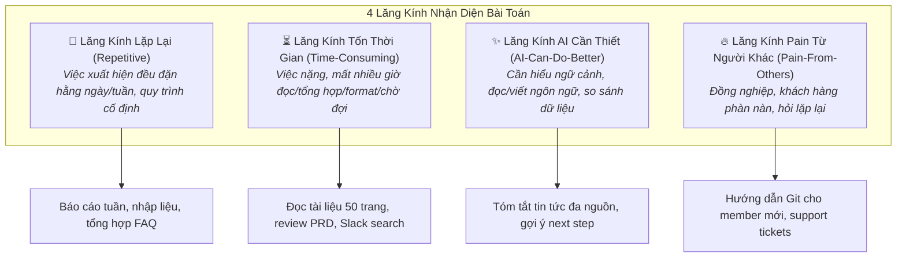
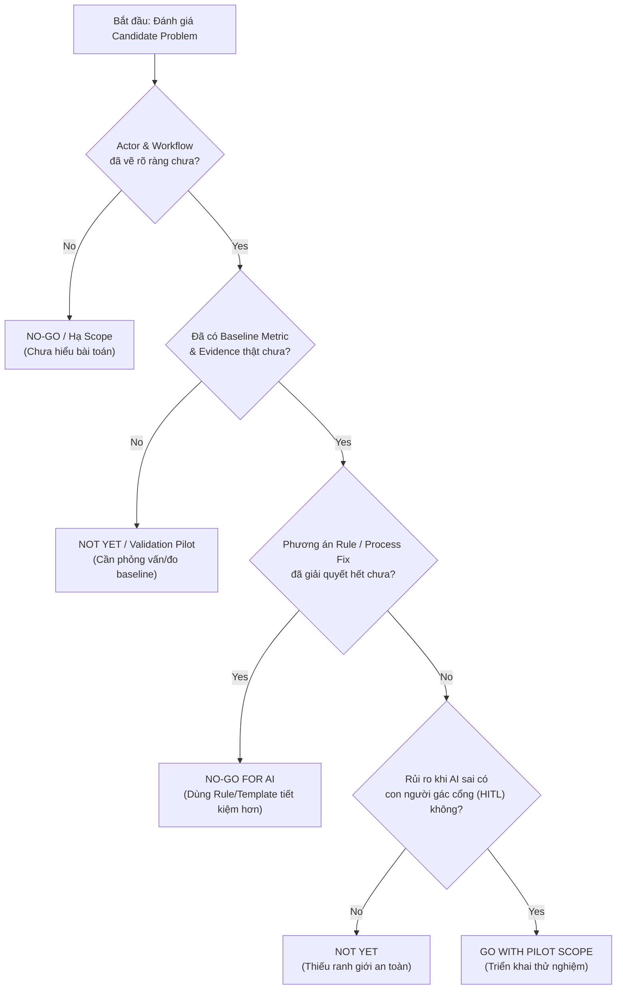

# K3 Day 02 — Tìm Đúng Bài Toán Cho AI (AI Product Labs)

> **Khoá học:** [[K3-AI-Program]] (AI Practical Competency Program - Phase 1)  
> **Bài học trước:** [[K3 Day 01 - LLM API Exploration]] | **Bài học tiếp:** [[K3 Day 03 - Chatbot vs ReAct Agent]]  
> **Thời lượng:** 4 Tiếng (7 Phân đoạn - 7 Phases Laboratory Framework)  
> **Repository gốc:** `/home/lystiger/K3-Day02-AI-Product-Labs`  
> **Mục tiêu cốt lõi:** Chuyển đổi tư duy từ Solution-First (thấy AI ngầu là xây) sang **Problem-First** (tập trung vào Actor, Bottleneck, Metric, Workflow). Xây dựng [[Problem Statement Framework]] chuẩn xác, thiết kế [[As-Is vs To-Be Workflow]], định giá độ phù hợp AI qua [[AI Feasibility Framework]] (phân định [[Rule-based System]], [[Workflow Automation]], [[Autonomous Agent]]), và đưa ra quyết định sản phẩm nghiêm túc theo [[Go / Not Yet / No-Go Decision Framework]].

---

## 1. Triết Lý & Nguyên Tắc Thiết Kế Sản Phẩm AI (Core Principles)

Sản phẩm AI thất bại phần lớn không phải vì thuật toán hay API kém, mà vì **giải sai bài toán** hoặc **dùng AI cho bài toán lẽ ra chỉ cần Rule/Checklist**. Day 02 thiết lập 6 nguyên tắc bất biến cho một AI Product Engineer / AI Product Manager:

1. **Problem first, not AI first:** Đừng bắt đầu bằng "xây chatbot" hay "dùng agent". Bắt đầu bằng **Actor** (người gặp vấn đề), **Workflow** (quy trình), **Bottleneck** (điểm nghẽn), và **Metric** (thước đo).
2. **Cá nhân scan rộng, nhóm hội tụ:** Mở rộng lăng kính quan sát 5+ đến 10+ bài toán thực tế trước khi ép chọn 1 bài toán để đào sâu.
3. **Vẽ workflow trước khi chọn công nghệ:** Nếu chưa vẽ được sơ đồ bước nghẽn và tính được thời gian lãng phí, **nghiêm cấm** đưa AI vào thiết kế.
4. **Không cần AI vẫn là kết luận xuất sắc:** Nếu phân tích ra bài toán giải quyết 80% bằng Rule hoặc sửa quy trình thủ công (Process Fix) vừa tiết kiệm chi phí vừa không có rủi ro Hallucination, đó là một kết luận sản phẩm có giá trị cao.
5. **AI hỗ trợ, không thay thế quyết định:** Dùng AI làm đối tác phản biện (Skeptical PM), vẽ lại flow, tra cứu giải pháp. Con người tự kiểm tra chứng cứ và tự chịu trách nhiệm.
6. **Tự làm trước, AI sau:** Những phần thể hiện tư duy cốt lõi (Pitch, Challenge, Reflection cá nhân) phải do học viên tự tư duy, không để AI viết thay.

---

## 2. Khung Lab 7 Phân Đoạn (The 7-Phase Lab Framework)

Quy trình làm việc 4 tiếng trong phòng Lab sản phẩm AI tuân theo tiến trình 7 bước chặt chẽ:

```
                                 THE 7-PHASE AI PRODUCT LAB FUNNEL
┌───────────────────┐     ┌───────────────────┐     ┌───────────────────┐     ┌───────────────────┐
│ Phase 0: Worked   │ ──► │ Phase 1: Indiv.   │ ──► │ Phase 2: Top 3    │ ──► │ Phase 3: Group    │
│    Example        │     │  Problem Scan     │     │  Cards & Workflows│     │    Convergence    │
└───────────────────┘     └───────────────────┘     └───────────────────┘     └───────────────────┘
  - Weekly Report Case      - 4 Lenses Scan           - Card Template           - 9-12 Candidates
  - Before/After Metric     - Real Symptoms           - Current/Future Draft    - 4-Step Filter Funnel
                                                                                        │
┌───────────────────┐     ┌───────────────────┐     ┌───────────────────┐               │
│ Phase 7: Indiv.   │ ◄── │ Phase 6: AI Fit & │ ◄── │ Phase 5: Workflow │ ◄─────────────┘
│    Reflection     │     │ Go/No-Go Decision │     │  & PS v0/v1       │
└───────────────────┘     └───────────────────┘     └───────────────────┘
  - AI Usage Audit          - Ambiguity Matrix        - Detailed Step Table
  - Meta-Cognition          - Rule vs Agent Trade-off - Metric Impact & Boundary
```

---

### Phase 1 — Phân Kỳ Cá Nhân: 4 Lăng Kính Problem Scanning

Học viên phải quan sát thực tế xung quanh (học tập, làm việc, dự án nhóm) để đưa ra ít nhất 5 (tối ưu 8–10+) vấn đề thật thông qua **4 Lăng Kính (4 Scanning Lenses)**:



---

### Phase 2 — Thẻ Bài Toán (Problem Card Template) & Workflow Ban Đầu

Mỗi học viên chọn Top 3 bài toán từ bước Scan và đóng gói vào cấu trúc chuẩn **Problem Card**:

```text
┌─────────────────────────────────────────────────────────────────────────────┐
│ PROBLEM CARD TEMPLATE                                                       │
├─────────────────────────────────────────────────────────────────────────────┤
│ Problem 1 câu: [Mô tả vấn đề trong 1 câu ngắn gọn, chứa bottleneck]         │
│ Actor:         [Ai là người chịu ảnh hưởng trực tiếp?]                      │
│ Bối cảnh:      [Xảy ra khi nào, tần suất ra sao?]                           │
│ Current Flow:  [1. Step A -> 2. Step B -> 3. Step C -> 4. Step D]           │
│ Bottleneck:    [Bước nào tốn nhiều thời gian nhất / dễ gây lỗi nhất?]       │
│ Impact:        [Thiệt hại đo bằng thời gian, chi phí, hoặc cơ hội]         │
│ Success Metric:[Con số hiện tại -> Con số mục tiêu kỳ vọng]                 │
│ Non-AI Fix:    [Nếu giải bằng Template/Checklist/Rule thì thế nào?]         │
│ Quick Gut:     [ ] No AI  [ ] Rule  [ ] Workflow Automation  [ ] Agent     │
└─────────────────────────────────────────────────────────────────────────────┘
```

---

### Phase 3 — Hội Tụ Nhóm (Group Convergence: 9-12 Candidates $\to$ 1)

Nhóm 3–4 học viên tập hợp từ 9 đến 12 Candidate Problem Cards của các cá nhân. **Không được bầu chọn (vote) cảm tính ngay**, mà phải thực hiện qua 4 bước:

1. **Pitching**: Mỗi cá nhân pitch 3 cards (1–2 phút/card: Actor, Bottleneck, Impact).
2. **Clustering**: Gom các bài toán có nét tương đồng vào các cụm chủ đề (VD: Cụm Reporting, Cụm Search, Cụm Review Code, Cụm Onboarding).
3. **Shortlisting**: Lọc ra Top 3 candidates dựa trên 7 tiêu chí cứng (Actor rõ, Workflow vẽ được, Bottleneck cụ thể, Metric đo được, So sánh được Rule/Workflow/Agent, Scope làm được trong Lab, Nhóm hiểu Domain).
4. **Scoring Matrix**: Chấm điểm từ 1–5 cho từng tiêu chí để tạo sự đồng thuận dựa trên bằng chứng.

---

### Phase 4 — Kiểm Chứng Nhanh (Validation) & Research Giải Pháp Đã Có

Trước khi thiết kế giải pháp, nhóm phải bước ra khỏi "chân không" (vacuum) bằng hai hoạt động:

#### 1. Quick Validation Options:
- **Option A (Quick Interviews):** Phỏng vấn 2–3 người thật gặp vấn đề để đo baseline thời gian và xác nhận điểm đau.
- **Option B (Micro Survey / Poll):** Poll 5–10 người trên Discord/lớp học để kiểm tra tần suất.

#### 2. Research Benchmark Table:
Tìm kiếm 2–3 giải pháp/công cụ/pattern đã tồn tại trên thị trường để tìm ra khoảng trống (gaps):

| Nguồn / Tool Benchmark | Link Nguồn | Phần Họ Đã Giải Quyết | Điểm Mạnh | Khoảng Trống / Rủi Ro | Bài Học Cho Nhóm |
|---|---|---|---|---|---|
| **Jira Reports** | *atlassian.com* | Tự động tổng hợp số liệu sprint | Chuẩn xác với data có cấu trúc | Không tự viết được narrative/insight | Rule đủ cho bước lấy số |
| **Slack AI** | *slack.com* | Summary cuộc trò chuyện | Recap câu hỏi nhanh | Chỉ nằm trong Slack, không đọc Sheets | Chỉ dùng làm 1 nguồn input |
| **Fellow.ai** | *fellow.ai* | AI Meeting notes & Action items | Cấu trúc meeting notes tốt | Không trực tiếp xử lý data Jira | Pattern: AI Draft -> Human Edit |

---

### Phase 5 — Sơ Đồ Quy Trình As-Is vs To-Be & Khung Problem Statement

#### 1. Bảng So Sánh Chi Tiết Các Bước Quy Trình:

| Bước | Quy Trình Hiện Tại (As-Is Workflow) | Quy Trình Tương Lai (To-Be Workflow) | Loại Xử Lý (Rule / AI / Human) | Boundary & Fallback |
|---|---|---|---|---|
| 1 | Export dữ liệu thủ công từ Jira (10') | Script tự động pull data via API (2') | **Rule / Script** | Fallback: Lấy file CSV nếu API error |
| 2 | Đọc dữ liệu rải rác từ Google Sheets (10') | Clean & Cấu trúc dữ liệu tự động (1') | **Rule / Script** | Báo lỗi nếu thiếu field bắt buộc |
| 3 | Đọc recap trên kênh Slack (15') | AI tóm tắt các điểm thảo luận chính (1') | **AI Workflow** | Chỉ dùng thông tin có trong Slack |
| 4 | Viết đoạn văn tổng hợp Narrative (25') **[BOTTLENECK]** | AI nháp bản thảo Narrative đầu tiên (1') | **AI Workflow** | AI KHÔNG tự gửi, bắt buộc PM review |
| 5 | Review & Format báo cáo (10') | PM kiểm tra, chỉnh sửa & phê duyệt (15') | **Human-in-the-Loop** | PM tự viết lại nếu AI draft kém |
| 6 | Gửi email cho Ban giám đốc (5') | PM bấm nút gửi báo cáo (2') | **Human Action** | Quyền quyết định cuối thuộc về người |

#### 2. Khung Problem Statement v0 vs v1 (Standard Formula):

$$\text{Problem Statement} = \text{Actor} + \text{Context} + \text{Current Workflow} + \text{Bottleneck} + \text{Impact} + \text{Metric Target} + \text{Boundary}$$

| Field | Bản Nháp v0 (Chưa chuẩn) | Bản Đã Tinh Chỉnh v1 (Production-Grade) |
|---|---|---|
| **Actor** | "Nhân viên công ty SaaS" (Quá chung) | "Junior Product Manager chịu trách nhiệm gửi Weekly Report cho CEO và EM." |
| **Bottleneck** | "Viết báo cáo lâu và mệt" | "Bước 4: Viết narrative từ dữ liệu thô mất 25 phút/lần và thường xuyên bị trệch hướng (blank page)." |
| **Impact** | "Mất thời gian" | "Tốn 90 phút/tuần/PM ($3\text{ PMs} = 270\text{ phút/tuần}$). Báo cáo trễ làm Ban giám đốc thiếu context trước cuộc họp." |
| **Metric** | "Làm báo cáo nhanh hơn" | "Giảm tổng thời gian quy trình từ **90 phút xuống dưới 30 phút/báo cáo**. Giữ tỉ lệ câu hỏi vặn lại từ CEO = 0." |
| **Boundary** | "AI tự làm hết" | "AI KHÔNG tự gửi email, KHÔNG tự suy đoán số liệu ngoài dữ liệu được cung cấp. PM bắt buộc review trước khi gửi." |

---

### Phase 6 — Khung Phân Định Độ Phù Hợp AI & Quyết Định Go / No-Go

#### 1. Ma Trận Độ Mơ Hồ vs Độ Phức Tạp (Ambiguity vs Complexity Matrix):

```
                     MA TRẬN ĐỘ PHÙ HỢP AI (AI FEASIBILITY MATRIX)
                     
                     High ┌──────────────────────────┬──────────────────────────┐
                          │  CHỈ NÊN DÙNG WORKFLOW   │  CÂN NHẮC AGENT TỰ TRỊ   │
                          │  CÓ AI HỖ TRỢ TRỢ LỰC    │  NẾU CÓ BOUNDARY CHẶT    │
                          │  (Ví dụ: AI Draft Report)│  (Ví dụ: Multi-Agent Hub)│
          ĐỘ MƠ HỒ        ├──────────────────────────┼──────────────────────────┤
       (Ambiguity)        │    ƯU TIÊN DÙNG RULE /   │   DÙNG WORKFLOW AUTOMATION│
                          │     PROCESS FIX THUỒNG   │   KẾT HỢP NHIỀU API/RULE │
                          │  (Ví dụ: Form/Checklist) │  (Ví dụ: ETL Data Pipeline)│
                      Low └──────────────────────────┴──────────────────────────┘
                                                 Low                        High
                                                ĐỘ PHỨC TẠP (Complexity)
```

- **Độ Mơ Hồ (Ambiguity):**  
  - *Thấp*: Có đáp án đúng/sai rõ ràng (VD: Phân loại theo 5 danh mục cố định, parse ngày tháng).  
  - *Cao*: Có nhiều cách trả lời chấp nhận được, phụ thuộc ngữ cảnh (VD: Viết bài văn tổng hợp, đánh giá độ sẵn sàng phỏng vấn).
- **Độ Phức Tạp (Complexity):**  
  - *Thấp*: 1–2 bước xử lý, ít nguồn dữ liệu.  
  - *Cao*: Quy trình 5+ bước nối tiếp nhau, tương tác nhiều hệ thống/APIs.

#### 2. Tiêu Chí Chọn Mức Độ Giải Pháp (Rule vs Workflow vs Agent):

| Mức Độ Giải Pháp | Khi Nào Nên Chọn? | Ưu Điểm | Rủi Ro & Chi Phí |
|---|---|---|---|
| **[[Rule-based System]]** | Bài toán có $80\%$ trường hợp đi theo quy tắc cố định, độ mơ hồ thấp. | Rẻ, tốc độ tính bằng millisecond, $100\%$ chính xác, không rủi ro hallucination. | Cứng nhắc, không xử lý được ngôn ngữ tự nhiên không cấu trúc. |
| **[[Workflow Automation]]** | Bài toán có luồng đi tuyến tính cố định, nhưng có 1–2 bước cần xử lý ngôn ngữ tự nhiên (độ mơ hồ cao). | Tối ưu giữa tự động hoá và tính linh hoạt, kiểm soát được luồng thực thi. | Cần thiết kế Human-in-the-Loop để kiểm soát output của AI. |
| **[[Autonomous Agent]]** | Quy trình cần tự lập kế hoạch động (dynamic planning), tự chọn công cụ (tool calling) và thay đổi luồng đi theo môi trường. | Linh hoạt tối đa, xử lý bài toán phức tạp không có luồng cố định. | Phức tạp, đắt đỏ, latency cao, khó kiểm soát hành vi (unpredictable behavior). |

#### 3. Khung Quyết Định Go / Not Yet / No-Go (Decision Tree):



---

## 3. Các Case Studies Sản Phẩm Thực Tế (Real-World Case Studies)

### Case Study 1: Báo Cáo Tuần Cho PM (Weekly Report Generator)
- **Actor:** Junior Product Manager tại công ty SaaS 50 người.
- **As-Is Workflow (90 phút):** Export Jira (10') $\to$ Lấy số từ Sheets (10') $\to$ Đọc Slack (15') $\to$ Tổng hợp Docs (15') $\to$ **Viết narrative (25' - Bottleneck)** $\to$ Review (10') $\to$ Gửi Email (5').
- **To-Be Workflow (21 phút):** Auto-pull data (2') $\to$ AI cấu trúc data (1') $\to$ AI draft narrative (1') $\to$ **PM review & edit (15' - Human Boundary)** $\to$ PM gửi (2').
- **Lựa chọn:** **Workflow Automation** (Rule trích xuất data + AI viết nháp + PM duyệt).
- **Quyết định:** **GO** với scope thử nghiệm 2 tuần.

---

### Case Study 2: Hướng Dẫn Thành Viên Mới Trên GitHub (GitHub Onboarding)
- **Actor:** Tuấn Anh (Tech Lead dự án phần mềm).
- **Bottleneck:** Mỗi khi có dev mới, mất 30–60 phút giải thích repository structure, branching strategy, Git workflow, CI requirements. Dev mới vẫn commit lầm vào `main`, mở PR thiếu template.
- **As-Is Workflow (30-60 phút support):** Lead giải thích repo $\to$ Lead hướng dẫn Git/SSH $\to$ Dev làm thử $\to$ Lead phát hiện lỗi quy trình $\to$ Dev sửa lại.
- **To-Be Workflow (<15 phút support):** Dev làm theo Checklist $\to$ **Rules/Git Hooks** chặn commit `main` & check PR template $\to$ AI Assistant giải thích cấu trúc code & câu hỏi FAQ $\to$ Lead chỉ review kiến trúc cuối cùng.
- **Lựa chọn:** **Rule-based + AI Assistance** (Dùng Branch Protection Rules làm nòng cốt, AI làm trợ lý giải thích).
- **Quyết định:** **GO WITH PILOT**.

---

### Case Study 3: Bộ Chuẩn Bị Phỏng Vấn Tự Động (AI Interview Prep Pack)
- **Actor:** Lý & Hùng Anh (Sinh viên năm cuối / Fresher đã nhận email mời phỏng vấn).
- **Trigger:** Nhận thư mời phỏng vấn chính thức từ nhà tuyển dụng.
- **Bottleneck:** Mở hàng chục tab tìm hiểu công ty, thông tin rải rác, không biết nguồn nào đáng tin, khó kết nối yêu cầu JD với kinh nghiệm trong CV.
- **To-Be Workflow:** Nhập Email + JD + CV + Company URL $\to$ Rule trích xuất logistics $\to$ Crawler thu thập trang About/Careers công khai $\to$ AI tạo Briefing kèm URL nguồn $\to$ AI map JD ↔ CV Evidence $\to$ **Ứng viên kiểm tra & luyện tập (Human Boundary)**.
- **Lựa chọn:** **Rule + Controlled Retrieval + AI Workflow**.
- **Quyết định:** **NOT YET** cho sản phẩm hoàn chỉnh (do chưa có baseline metric thực tế); **GO** cho bản Prototype thử nghiệm với 5 ứng viên.

---

## 4. Tiêu Chí Đánh Giá & Quy Định Chấm Điểm (Grading Rubric)

Tổng điểm môn học: **100 Điểm** (60 Điểm Nhóm + 40 Điểm Cá Nhân) + Tối đa **+10 Điểm Bonus**.

```
                                  GRADING SCORE BREAKDOWN
┌──────────────────────────────────────────────┐ ┌──────────────────────────────────────────────┐
│        DỰ ÁN NHÓM (GROUP SCORE): 60%         │ │       CÁ NHÂN (INDIVIDUAL SCORE): 40%        │
├──────────────────────────────────────────────┤ ├──────────────────────────────────────────────┤
│ 1. Sơ đồ Workflow As-Is / To-Be      : 15 pts│ │ 1. Scan 5+ Problems & Top 3 Cards    : 12 pts│
│ 2. Problem Statement + Metric Target : 20 pts│ │ 2. Thảo luận Pitch & Challenge Nhóm  : 12 pts│
│ 3. Đánh giá AI Fit (Rule/WF/Agent)   : 15 pts│ │ 3. Bài Reflection Cá Nhân Phản Tư    : 10 pts│
│ 4. Chất lượng quyết định Go/No-Go    : 10 pts│ │ 4. Vấn đáp hiểu bài cá nhân          :  6 pts│
└──────────────────────────────────────────────┘ └──────────────────────────────────────────────┘
```

### Bảng Xếp Loại Kết Quả (Performance Tiers):

| Mức Xếp Loại | Tổng Điểm | Đánh Giá Sản Phẩm |
|---|---|---|
| **Rất Tốt (Outstanding)** | `90` – `100` | Lập luận chặt chẽ, có bằng chứng thực tế, hiểu rõ ranh giới AI, reflection cá nhân sâu sắc. |
| **Hiểu Đầy Đủ (Good)** | `80` – `89` | Workflow, Problem Statement và AI Fit nhất quán, metric & boundary rõ ràng. |
| **Hiểu Khá (Fair)** | `65` – `79` | Đạt đa số yêu cầu, logic rõ nhưng thiếu bằng chứng nghiên cứu hoặc so sánh phương án thay thế chưa sâu. |
| **Vừa Đủ Pass (Bare Pass)**| `50` – `64` | Đủ phần cơ bản nhưng nhiều chỗ mơ hồ, metric chưa có con số baseline. |
| **Không Pass (Fail)** | `< 50` | Bài làm bị Solution-First (chưa có problem/workflow đã đòi dùng Agent). |

---

## 5. Mẫu Phản Tư Cá Nhân (Individual Reflection Audit)

Bài Reflection của học viên phải trả lời trung thực các câu hỏi meta-cognition (tự soi chiếu):

1. **Tôi đã đóng góp gì trong nhóm?** (Ghi rõ vai trò trong các bước Scan, Pitch, Challenge, Workflow, Decision).
2. **Tôi đã dùng AI như thế nào?**  
   - *AI hữu ích ở đâu:* Cấu trúc thông tin, chuyển text thành sơ đồ Mermaid, đóng vai Skeptical PM để đặt câu hỏi phản biện.  
   - *AI sai/hời hợt ở đâu:* AI dễ bịa ra số liệu metric "giảm 50%" khi chưa có dữ liệu thật; AI có xu hướng xúi giục dùng Agent quá sớm.  
   - *Tôi đã sửa gì bằng nhận định bản thân:* Đưa các con số về dạng mục tiêu giả thuyết, giật cấp độ giải pháp từ Agent xuống Workflow/Rule, chốt quyết định Not Yet khi thiếu bằng chứng.
3. **Bài học lớn nhất rút ra:**  
   - Một bài toán hay không phải bài toán nghe "ngầu" nhất, mà là bài toán có Actor rõ và Bottleneck đo đếm được.  
   - Quyết định **Not Yet** hay **No-Go** xuất sắc không kém gì quyết định **Go**.

---

## 6. Đồ Thị Liên Kết Tri Thức (Knowledge Graph Links)

- [[Problem Statement Framework]] — Khung định hình bài toán sản phẩm chuẩn mực.
- [[As-Is vs To-Be Workflow]] — Phương pháp thiết kế quy trình trước và sau khi tối ưu.
- [[AI Feasibility Framework]] — Khung ma trận đánh giá độ mơ hồ & độ phức tạp để chọn công nghệ.
- [[Rule-based System]] — Hệ thống xử lý theo quy tắc cố định, $100\%$ chính xác.
- [[Workflow Automation]] — Quy trình tự động hoá kết hợp các bước xử lý ngôn ngữ của AI.
- [[Autonomous Agent]] — Hệ thống agent tự trị có khả năng tự lập kế hoạch và gọi công cụ.
- [[Go / Not Yet / No-Go Decision Framework]] — Cây quyết định đầu tư sản phẩm AI.
- [[Human-in-the-Loop]] — Kỹ thuật giữ con người trong vòng kiểm soát chất lượng và phê duyệt.
- [[STAR Method]] — Phương pháp cấu trúc câu chuyện kinh nghiệm (Situation, Task, Action, Result).
- Trở về danh mục khoá học: [[K3-AI-Program]] | Bài học trước: [[K3 Day 01 - LLM API Exploration]] | Bài học tiếp: [[K3 Day 03 - Chatbot vs ReAct Agent]]
