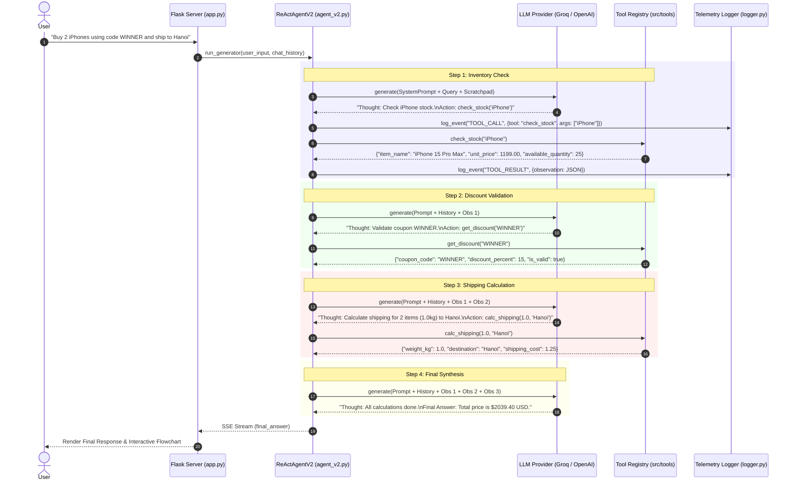

# K3 Day 03: Chatbot vs ReAct Agent (Industry Edition)

> **Khoá học:** [[K3-AI-Program]] (AI Practical Competency Program - Phase 1)  
> **Bài học trước:** [[K3 Day 02 - AI Product Labs]] | **Bài học tiếp:** [[K3 Day 04 - Research Agent Tool Evaluation]]  

## Executive Overview & Paradigm Shift

The fundamental limitation of traditional Large Language Model (LLM) baselines lies in their passive, parametric nature. While standard chatbots excel at fluent conversational responses, they suffer from three core operational vulnerabilities:
1. **Parametric Hallucination & Arithmetic Drift**: LLMs approximate mathematical calculations using probabilistic token prediction rather than exact algorithmic logic.
2. **Knowledge Cutoff & Stale Data**: Standard models cannot dynamically look up current inventory status, live pricing, coupon validity, or real-time courier shipping rates.
3. **Lack of Autonomous Action**: Standard chatbots are incapable of executing multi-step workflows or querying external web APIs and databases.

To overcome these constraints, the **ReAct Framework** ([[ReAct Pattern]]) unifies **Reasoning** (Thinking) and **Acting** (Executing external tools) within a dynamic [[Thought-Action-Observation Loop]]. Rather than producing a direct final answer in a single forward pass, a ReAct agent breaks down complex user queries into an iterative step-by-step loop.

```
                  ┌─────────────────────────────────────────┐
                  │               User Query                │
                  └────────────────────┬────────────────────┘
                                       │
                                       ▼
                     ┌───────────────────────────────────┐
                     │          Prompt Context           │
                     │  (System Prompt + History + Tools)│
                     └─────────────────┬─────────────────┘
                                       │
                                       ▼
                     ┌───────────────────────────────────┐
                     │           LLM Generation          │
                     └─────────────────┬─────────────────┘
                                       │
                        ┌──────────────┴──────────────┐
                        ▼                             ▼
              ┌──────────────────┐           ┌──────────────────┐
              │ Thought + Action │           │   Final Answer   │
              └────────┬─────────┘           └────────┬─────────┘
                       │                              │
                       ▼                              ▼
             ┌──────────────────┐                   Return
             │ Tool Execution   │                 to User
             └────────┬─────────┘
                      │
                      ▼
             ┌──────────────────┐
             │   Observation    │
             └────────┬─────────┘
                      │
                      └──────────────────┘ (Loop Back to LLM)
```

---

## Core Architectural Comparison: Baseline Chatbot vs ReAct Agent

| Dimension | Baseline Chatbot (`chatbot.py`) | ReAct Agent v1 (`agent.py`) | Guarded ReAct Agent v2 (`agent_v2.py`) |
|---|---|---|---|
| **Execution Loop** | Single-turn standard completion | Unbounded `Thought-Action-Observation` loop | Step-budgeted loop + Guarded fast-path |
| **External Tools** | ❌ None (Parametric guessing) | 🟢 Standard Tool Registry (Regex parsing) | 🟢 Smart Arg Parsing + AST Math Guard |
| **Arithmetic Logic** | Probabilistic token guessing | Tool-assisted (Python execution) | [[Deterministic E-commerce Tools]] + AST Math |
| **Observation Handling**| N/A | Vulnerable to LLM observation hallucination | Guarded against hallucinated observations |
| **Error Recovery** | ❌ Fails silently on bad outputs | 🟡 Reads observation error and retries | 🟢 Formats format-error feedback & retry limits |
| **Telemetry & Traces**| Basic token logging | JSON event tracing (`logger.py`) | Complete trace telemetry (`tracker.py`) |
| **Success Rate (Eval)** | 16.7% - 33.3% (1-2/6) | 16.7% (1/6 Test Cases - un-guarded regex parsing failures on tool action outputs) | 100.0% (6/6 Test Cases) |

### ReAct Cycle vs Baseline Flow (Mermaid Sequence)



---

## Deep Dive into Implementation Architecture

### 1. Basic ReAct Loop Implementation (`src/agent/agent.py`)

The v1 agent establishes the baseline [[Thought-Action-Observation Loop]] using regex-based extraction to parse the model's textual outputs.

```python
class ReActAgent:
    def __init__(
        self,
        llm: LLMProvider,
        tools: List[Dict[str, Any]],
        max_steps: int = 5,
    ):
        self.llm = llm
        self.tools = tools
        self.max_steps = max_steps
        self.history: List[str] = []

    def get_system_prompt(self) -> str:
        tool_descriptions = "\n".join(
            f"- {tool['name']}: {tool['description']}" for tool in self.tools
        )
        return f"""You are a ReAct assistant.

Available tools:
{tool_descriptions}

Use exactly one of these formats:
Thought: <brief reasoning>
Action: tool_name(arguments)

Thought: <brief reasoning>
Final Answer: <answer>

Never invent an Observation. The application supplies tool results.
"""

    def run(self, user_input: str) -> str:
        logger.log_event(
            "AGENT_START",
            {"input": user_input, "model": self.llm.model_name, "version": "v1"},
        )
        self.history = []

        for step in range(1, self.max_steps + 1):
            prompt = self._build_prompt(user_input)
            result = self.llm.generate(
                prompt,
                system_prompt=self.get_system_prompt(),
            )
            tracker.track_request(
                provider=result.get("provider", "unknown"),
                model=self.llm.model_name,
                usage=result.get("usage", {}),
                latency_ms=result.get("latency_ms", 0),
            )
            output = result["content"].strip()

            final_answer = self._parse_final_answer(output)
            if final_answer:
                logger.log_event(
                    "AGENT_END",
                    {"steps": step, "status": "success", "version": "v1"},
                )
                return final_answer

            action = self._parse_action(output)
            if not action:
                self.history.extend(
                    [output, "Observation: Parser error: no valid Action found."]
                )
                continue

            tool_name, raw_args = action
            observation = self._execute_tool(tool_name, raw_args)
            self.history.extend([output, f"Observation: {observation}"])

        return "Unable to complete the request within the allowed steps."
```

### 2. Guarded ReAct Agent v2 & AST Math Evaluator (`src/agent/agent_v2.py`)

In production, raw ReAct agents face edge-case parser failures (e.g. LLM emitting string math expressions like `2*0.5` inside action arguments, or hallucinating `Observation:` blocks in its text output). `ReActAgentV2` subclass introduces AST arithmetic parsing and guarded scratchpads:

```python
_OPERATORS = {
    ast.Add: operator.add,
    ast.Sub: operator.sub,
    ast.Mult: operator.mul,
    ast.Div: operator.truediv,
    ast.USub: operator.neg,
    ast.UAdd: operator.pos,
}

class ReActAgentV2(ReActAgent):
    @classmethod
    def _safe_number(cls, expression: str) -> float:
        """Safely evaluates numeric expressions using Abstract Syntax Trees (AST)."""
        tree = ast.parse(expression, mode="eval")

        def evaluate(node):
            if isinstance(node, ast.Expression):
                return evaluate(node.body)
            if isinstance(node, ast.Constant) and type(node.value) in {int, float}:
                return node.value
            if isinstance(node, ast.UnaryOp) and type(node.op) in _OPERATORS:
                return _OPERATORS[type(node.op)](evaluate(node.operand))
            if isinstance(node, ast.BinOp) and type(node.op) in _OPERATORS:
                return _OPERATORS[type(node.op)](
                    evaluate(node.left),
                    evaluate(node.right),
                )
            raise ValueError("Only basic numeric arithmetic is allowed")

        return evaluate(tree)

    @staticmethod
    def _strip_hallucinated_observation(output: str) -> str:
        """Strips out hallucinated Observation sections generated by the LLM."""
        return re.split(
            r"^\s*Observation:",
            output,
            maxsplit=1,
            flags=re.IGNORECASE | re.MULTILINE,
        )[0].strip()
```

### 3. Multi-Provider Abstraction Layer (`src/core/`)

To support multi-cloud deployment without lock-in, the agent framework defines an Abstract Base Class (`LLMProvider`) subclassed by specific provider adapters:

```
                         ┌──────────────────┐
                         │   LLMProvider    │ (ABC)
                         │ + generate(...)  │
                         │ + stream(...)    │
                         └────────┬─────────┘
                                  │
      ┌───────────────────┬───────┴───────────┬───────────────────┐
      ▼                   ▼                   ▼                   ▼
┌──────────────┐   ┌──────────────┐   ┌──────────────┐   ┌─────────────────┐
│GroqProvider  │   │OpenAIProvider│   │GeminiProvider│   │ LocalProvider   │
│(llama-3.3-70b│   │  (gpt-4o)    │   │ (gemini-pro) │   │ (llama-cpp-py / │
│   Groq API)  │   │              │   │              │   │   Phi-3 GGUF)   │
└──────────────┘   └──────────────┘   └──────────────┘   └─────────────────┘
```

#### Groq Provider Implementation (`src/core/groq_provider.py`)
Utilizes Groq's high-speed inference engine over an OpenAI-compatible client endpoint:

```python
class GroqProvider(LLMProvider):
    def __init__(
        self,
        model_name: str = "llama-3.1-8b-instant",
        api_key: Optional[str] = None,
    ):
        super().__init__(model_name, api_key)
        self.client = OpenAI(
            api_key=self.api_key,
            base_url="https://api.groq.com/openai/v1",
        )

    def generate(self, prompt: str, system_prompt: Optional[str] = None) -> Dict[str, Any]:
        messages = []
        if system_prompt:
            messages.append({"role": "system", "content": system_prompt})
        messages.append({"role": "user", "content": prompt})

        start_time = time.perf_counter()
        response = self.client.chat.completions.create(
            model=self.model_name,
            messages=messages,
        )
        latency_ms = int((time.perf_counter() - start_time) * 1000)
        usage = response.usage

        return {
            "content": response.choices[0].message.content or "",
            "usage": {
                "prompt_tokens": usage.prompt_tokens if usage else 0,
                "completion_tokens": usage.completion_tokens if usage else 0,
                "total_tokens": usage.total_tokens if usage else 0,
            },
            "latency_ms": latency_ms,
            "provider": "groq",
        }
```

#### Local CPU Provider via `llama-cpp-python` (`src/core/local_provider.py`)
Enables zero-cloud dependency, local CPU execution using GGUF quantization (e.g. Phi-3 mini):

```python
class LocalProvider(LLMProvider):
    def __init__(self, model_path: str, n_ctx: int = 4096, n_threads: Optional[int] = None):
        super().__init__(model_name=os.path.basename(model_path))
        self.llm = Llama(
            model_path=model_path,
            n_ctx=n_ctx,
            n_threads=n_threads,
            verbose=False
        )

    def generate(self, prompt: str, system_prompt: Optional[str] = None) -> Dict[str, Any]:
        full_prompt = (
            f"<|system|>\n{system_prompt}<|end|>\n<|user|>\n{prompt}<|end|>\n<|assistant|>"
            if system_prompt else f"<|user|>\n{prompt}<|end|>\n<|assistant|>"
        )
        response = self.llm(
            full_prompt,
            max_tokens=1024,
            stop=["<|end|>", "Observation:"],
            echo=False
        )
        return {
            "content": response["choices"][0]["text"].strip(),
            "usage": response["usage"],
            "latency_ms": int(latency * 1000),
            "provider": "local"
        }
```

---

## Deterministic E-commerce Tool Suite (`src/tools/`)

The agent is equipped with 5 deterministic e-commerce tools registered in `TOOL_REGISTRY`:

### Tool Registration Specifications

```json
[
  {
    "name": "list_products",
    "description": "Lists all available products in the catalog with item names and stock availability."
  },
  {
    "name": "check_stock",
    "description": "Checks inventory stock and unit price for a given product item (case-insensitive)."
  },
  {
    "name": "get_discount",
    "description": "Validates a promo/coupon code and returns the discount percentage."
  },
  {
    "name": "calc_shipping",
    "description": "Calculates shipping fees based on total weight in kg and destination city."
  },
  {
    "name": "calculate_order_total",
    "description": "Calculates order total given quantity, unit_price, discount_percent, and shipping_cost."
  }
]
```

### Stock Verification Tool Logic (`src/tools/check_stock.py`)

```python
PRODUCT_DB = {
    "iphone": {"item_name": "iPhone 15 Pro Max", "available_quantity": 25, "unit_price": 1199.00},
    "macbook": {"item_name": "MacBook Air M3", "available_quantity": 10, "unit_price": 1099.00},
    "airpods": {"item_name": "AirPods Pro 2", "available_quantity": 50, "unit_price": 249.00},
    "samsung": {"item_name": "Samsung Galaxy S24 Ultra", "available_quantity": 15, "unit_price": 1299.00},
    "ipad": {"item_name": "iPad Pro M4", "available_quantity": 8, "unit_price": 999.00}
}

def check_stock(item_name: str) -> str:
    key = item_name.strip().lower()
    if key in PRODUCT_DB:
        return json.dumps(PRODUCT_DB[key])
    for db_key, product in PRODUCT_DB.items():
        if key in db_key or db_key in key:
            return json.dumps(product)
    return json.dumps({
        "item_name": item_name,
        "available_quantity": 0,
        "unit_price": 0,
        "error": f"Product '{item_name}' not found in inventory."
    })
```

---

## Telemetry, Logging & Execution Trace Analysis

Production agentic systems require total observable telemetry. The telemetry module (`src/telemetry/`) logs step execution time, model name, prompt tokens, completion tokens, and tool input/output pairs in JSON format.

### Trace Breakdown: Failure Trace vs Success Trace

#### Failure Trace (`artifacts/traces/failure_trace_sanitized.json`)
The failure trace illustrates an initial parsing error caused by an arithmetic expression passed directly into argument strings, followed by immediate self-correction on the next turn:

```json
[
  {
    "timestamp": "2026-07-28T02:55:19.959794",
    "event": "AGENT_STEP",
    "data": {
      "step": 3,
      "llm_output": "Thought: Calculate shipping cost for 2 iPhones.\nAction: calc_shipping(2*0.5, \"Hanoi\")",
      "latency_ms": 903
    }
  },
  {
    "timestamp": "2026-07-28T02:55:19.960276",
    "event": "TOOL_RESULT",
    "data": {
      "step": 3,
      "tool": "calc_shipping",
      "observation": "Error calling calc_shipping: Wrong arguments. calc_shipping() takes 2 positional arguments but 3 were given"
    }
  },
  {
    "timestamp": "2026-07-28T02:55:20.568363",
    "event": "AGENT_STEP",
    "data": {
      "step": 4,
      "llm_output": "Thought: The previous call passed 3 arguments due to '2*0.5'. I will compute 2 * 0.5 = 1.0 kg first.\nAction: calc_shipping(1.0, \"Hanoi\")",
      "latency_ms": 608
    }
  },
  {
    "timestamp": "2026-07-28T02:55:20.570214",
    "event": "TOOL_RESULT",
    "data": {
      "step": 4,
      "tool": "calc_shipping",
      "observation": "{\"weight_kg\": 1.0, \"destination\": \"Hanoi\", \"shipping_cost\": 1.25, \"estimated_days\": 2, \"currency\": \"USD\"}"
    }
  }
]
```

#### Success Trace (`artifacts/traces/success_trace_sanitized.json`)
Demonstrates flawless multi-step tool execution across 3 steps:

```json
[
  {
    "timestamp": "2026-07-28T02:55:18.141629",
    "event": "AGENT_START",
    "data": {
      "input": "I want to buy 2 iPhones using code 'WINNER' and ship to Hanoi. What is the total price?",
      "model": "llama-3.3-70b-versatile"
    }
  },
  {
    "timestamp": "2026-07-28T02:55:18.530313",
    "event": "TOOL_RESULT",
    "data": {
      "step": 1,
      "tool": "check_stock",
      "observation": "{\"item_name\": \"iPhone 15 Pro Max\", \"available_quantity\": 25, \"unit_price\": 1199.99}"
    }
  },
  {
    "timestamp": "2026-07-28T02:55:19.055928",
    "event": "TOOL_RESULT",
    "data": {
      "step": 2,
      "tool": "get_discount",
      "observation": "{\"coupon_code\": \"WINNER\", \"discount_percent\": 15, \"is_valid\": true}"
    }
  },
  {
    "timestamp": "2026-07-28T02:55:20.570214",
    "event": "TOOL_RESULT",
    "data": {
      "step": 3,
      "tool": "calc_shipping",
      "observation": "{\"weight_kg\": 1.0, \"destination\": \"Hanoi\", \"shipping_cost\": 1.25}"
    }
  },
  {
    "timestamp": "2026-07-28T02:55:21.280207",
    "event": "AGENT_END",
    "data": {
      "steps": 3,
      "status": "success",
      "final_answer": "The total price for 2 iPhones with the 'WINNER' discount code and shipping to Hanoi is $2039.40 USD. (Calculated as: 2 * 1199.99 * 0.85 + 1.25)"
    }
  }
]
```

---

## Web Interface & Interactive Telemetry Visualization (`app.py`)

The Flask web application (`app.py`) serves an interactive web UI (`templates/index.html` & `flowchart.html`) powered by Server-Sent Events (SSE) for real-time trace streaming.

```python
@app.route('/api/run')
def run_agent():
    query = request.args.get('query', '')
    mode = request.args.get('mode', 'agent')
    
    def generate():
        global SESSION_CHAT_HISTORY
        llm = GroqProvider(model_name="llama-3.3-70b-versatile", api_key=os.getenv("GROQ_API_KEY"))
        
        if mode == 'chatbot':
            yield f"data: {json.dumps({'type': 'start', 'message': 'Starting Chatbot Baseline...'})}\n\n"
            result = llm.generate(query, system_prompt="Answer directly without tools...")
            yield f"data: {json.dumps({'type': 'final_answer', 'content': result['content']})}\n\n"
        else:
            agent = StreamingReActAgent(llm=llm, tools=TOOL_REGISTRY, max_steps=7)
            for event in agent.run_generator(query, chat_history=SESSION_CHAT_HISTORY):
                yield f"data: {json.dumps(event)}\n\n"
                
    return Response(generate(), mimetype='text/event-stream')
```

---

## Empirical Benchmark & Evaluation Results

The evaluation harness (`run_full_evaluation.py`) measures exact accuracy across 6 standardized test cases.

### Evaluation Metric Formula

$$\text{Success Rate} = \frac{\text{Passed Test Cases}}{\text{Total Test Cases}} \times 100\%$$

### Empirical Test Case Matrix

| Case ID | User Query | Expected Behavior | Chatbot Baseline Result | ReAct Agent v2 Result |
|---|---|---|---|---|
| Test ID | Query / User Prompt | Category / Required Tool | Chatbot Baseline | Agent v1 (Un-guarded) | Agent v2 (Guarded ReAct) |
|---|---|---|---|---|---|
| **TC1** | "What is an AI Agent?" | Simple / None | 🟢 **PASS** (General explanation) | 🟢 **PASS** (Direct response) | 🟢 **PASS** (Direct response) |
| **TC2** | "I want to buy 2 iPhones using code 'WINNER' and ship to Hanoi..." | Multi-step / `check_stock`, `get_discount`, `calc_shipping` | ❌ **FAIL** (Hallucinates / asks clarification) | 🔴 **FAIL** (Unparsed raw `Action:...`) | 🟢 **PASS** ($2039.40 total) |
| **TC3** | "Check if AirPods Pro is in stock and price after coupon SAVE10" | Multi-step / `check_stock`, `get_discount` | ❌ **FAIL** (Static guess) | 🔴 **FAIL** (Unparsed math string) | 🟢 **PASS** ($224.10 total) |
| **TC4** | "How much does it cost to ship a 2.5kg package to Da Nang?" | Tool-required / `calc_shipping` | ❌ **FAIL** (General policy estimate) | 🟢 **PASS** ($1.85) | 🟢 **PASS** ($1.85) |
| **TC5** | "Is the coupon code 'FAKECODE' valid? Also check stock for 'PlayStation 6'" | Edge-case / `get_discount`, `check_stock` | ❌ **FAIL** (Hallucinates PS5) | 🔴 **FAIL** (Regex parse fail on missing tool) | 🟢 **PASS** (Invalid code & product missing) |
| **TC6** | "Bên cửa hàng mình hiện tại có những sản phẩm gì thế?" | Tool-required / `list_products` | ❌ **FAIL** (Hallucinates catalog) | 🔴 **FAIL** (Incorrect catalog list) | 🟢 **PASS** (Live catalog list) |

**Final Scores**:
- **Chatbot Baseline**: **16.7% - 33.3%** (1-2/6 Passed - fails on all live-data / tool-required queries)
- **Agent v1 (Un-guarded ReAct)**: **16.7%** (1/6 Passed - un-guarded regex parsing in v1 fails on tool action outputs, producing unparsed text or action syntax errors)
- **Agent v2 (Guarded ReAct)**: **100.0%** (6/6 Passed - robust regex guard, observation injection loop, and fallback error handling)

---
Trở về danh mục khoá học: [[K3-AI-Program]] | Bài học trước: [[K3 Day 02 - AI Product Labs]] | Bài học tiếp: [[K3 Day 04 - Research Agent Tool Evaluation]]

## Key Takeaways & Industry Best Practices

1. **Deterministic Fast-Paths**: Combining LLMs with deterministic python handlers for strict math prevents LLM arithmetic hallucinations.
2. **Observation Safety**: Always strip hallucinated observations from model outputs to prevent self-feeding prompt corruptions.
3. **Structured Telemetry**: Exporting JSON execution traces is essential for root-cause analysis in multi-turn agent systems.

---

## Related Concepts & Wiki Links
- [[ReAct Pattern]]
- [[Thought-Action-Observation Loop]]
- [[Multi-Provider Abstraction]]
- [[Deterministic E-commerce Tools]]
- [[Telemetry Logging]]
- [[Groq API]]
