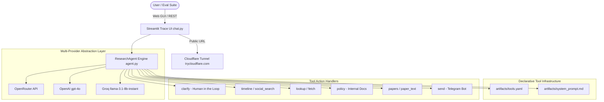
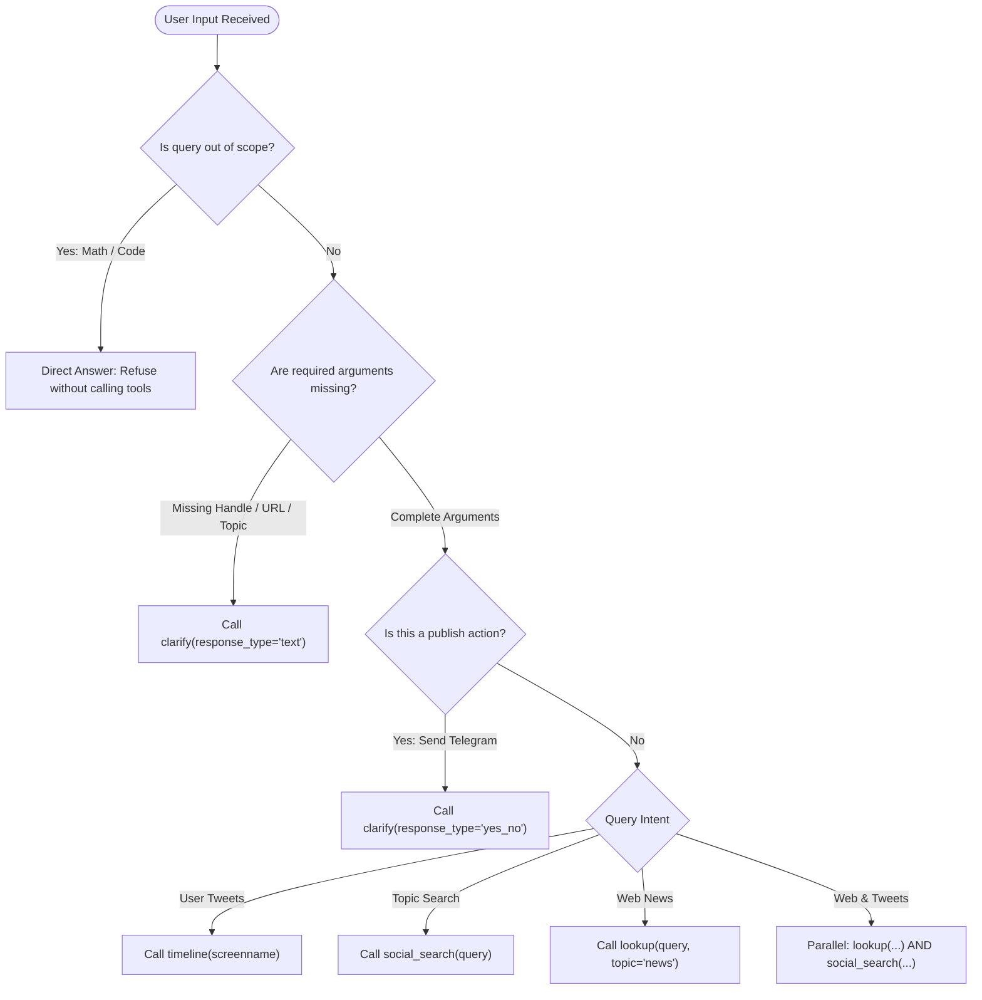

# K3 Day 04 — Research Agent Tool Evaluation

> **Khoá học:** [[K3-AI-Program]] (AI Practical Competency Program - Phase 1)  
> **Bài học trước:** [[K3 Day 03 - Chatbot vs ReAct Agent]] | **Bài học tiếp:** [[K3 Days 05-06 - Theoretical LLM and AI Foundations]]  

## Executive Overview & Mission

Building production-grade [[Research Agent]] systems requires moving beyond ad-hoc manual testing to an [[Evidence-Driven Optimization]] lifecycle. In multi-tool agent environments, prompt adjustments must be systematically benchmarked against fixed evaluation suites to quantify improvements and prevent hidden regressions.

Day 04 introduces an empirical tool evaluation harness for a multi-provider Research Agent. Across four iterative release versions (**v0** through **v3**), agent performance is tracked using automated grading scripts against both baseline evaluation benchmarks (`eval_base.json`) and team-authored test suites (`eval_group.json`).

```
┌─────────────────┐      ┌──────────────────┐      ┌──────────────────┐
│  v0 Baseline    │─────►│  v1 Boundary Fix │─────►│  v2 Precision    │
│  Accuracy: 31.6%│      │  Accuracy: 50.0% │      │  Accuracy: 72.2% │
└─────────────────┘      └──────────────────┘      └────────┬─────────┘
                                                            │
                                                            ▼ (Over-Prompting)
                                                   ┌──────────────────┐
                                                   │  v3 Regression   │
                                                   │  Accuracy: 50.0% │
                                                   └──────────────────┘
```

---

## Research Agent System Topology & Architecture

The Research Agent system comprises a multi-provider execution engine, declarative tool definitions, an interactive Streamlit UI, and a Cloudflare Tunnel proxy for remote evaluation.



---

## Declarative Tool Definition Architecture (`artifacts/tools.yaml`)

Tools are declared using standard JSON schema formats parsed by `tools.py` into OpenAI function-call parameters:

```yaml
tools:
  - name: clarify
    description: "Gửi một câu hỏi làm rõ hoặc xin xác nhận từ người dùng. Dùng response_type='text' khi thiếu thông tin. Dùng response_type='yes_no' để xin xác nhận trước khi gửi dữ liệu."
    parameters:
      type: object
      properties:
        question: {type: string, description: "Nội dung câu hỏi làm rõ"}
        response_type: {type: string, enum: [text, yes_no, choice], default: "text"}
      required: [question]

  - name: timeline
    description: "Lấy danh sách các bài đăng gần đây của một tài khoản Twitter/X cụ thể theo handle (screenname). Ví dụ: sama, elonmusk, karpathy."
    parameters:
      type: object
      properties:
        screenname: {type: string, description: "Tên handle của tài khoản Twitter"}
        limit: {type: integer, default: 5}
      required: [screenname]

  - name: lookup
    description: "Tra cứu thông tin trên internet và tin tức báo chí trực tuyến."
    parameters:
      type: object
      properties:
        query: {type: string, description: "Từ khóa tìm kiếm trên web"}
        topic: {type: string, enum: [general, news], default: "general"}
        timeframe: {type: string, enum: [day, week, month, year], default: "week"}
      required: [query]

  - name: send
    description: "Gửi một đoạn văn bản xuất bản lên kênh Telegram."
    parameters:
      type: object
      properties:
        text: {type: string, description: "Nội dung cần gửi"}
        confirmed: {type: boolean, default: false}
      required: [text]
```

---

## Tool Routing & Boundary Decision Tree

To avoid improper tool invocations or missing required arguments, system instructions enforce strict boundary rules:



### System Prompt Boundary Rules (`artifacts/system_prompt.md`)

```markdown
You are an expert, precision-driven Research Agent with strict tool execution rules.

### 🛑 CRITICAL BOUNDARY RULES
1. **Missing Parameters (`clarify`)**:
   - If user asks for tweets of an account but handle is missing: MUST call `clarify(question="...", response_type="text")`.
   - If user asks to summarize an article but URL is missing: MUST call `clarify(question="...", response_type="text")`.

2. **Publishing Confirmation (`clarify`)**:
   - Before publishing/sending to Telegram: MUST call `clarify(question="...", response_type="yes_no")`. DO NOT call `send` directly.

3. **Out of Scope & Refusals (`no_tool`)**:
   - For queries about yourself: Answer directly without tools.
   - For out-of-scope tasks (math calculus, Python code): Refuse directly without tools.

### 🔧 TOOL SELECTION & PARAMETER RULES
- **`timeline`**: Map names to Twitter handles: "Sam Altman" -> `sama`, "Elon Musk" -> `elonmusk`.
- **Parallel Tool Calling**: When query asks for BOTH web news AND tweets: Call BOTH `lookup(...)` AND `social_search(...)` simultaneously.
```

---

## Iterative Evidence-Driven Optimization Pipeline (v0 to v3)

Every prompt change is tracked in `artifacts/version_log.csv` and benchmarked against `analysis/base_runs.csv`.

### Version Performance Matrix

| Version | Author | Key Artifact Changed | Hypothesis & Strategy | Case Accuracy | Routing Acc | Args Acc | Run File Log |
|---|---|---|---|---:|---:|---:|---|
| **v0** | Baseline | Initial Starter | Default starter prompt guessing missing args and calling tools for everything | **31.58%** | 42.1% | 31.6% | `runs/v0_B_base_groq_...json` |
| **v1** | Đỗ Hùng Anh | `system_prompt.md` & `tools.yaml` | Enforce `clarify` for missing handles/URLs & ask confirmation before send; add `weather` tool | **50.00%** | 61.1% | 50.0% | `runs/v1_B_base_groq_...json` |
| **v2** | Đỗ Hùng Anh | `system_prompt.md` | Add explicit critical boundary matrix & rules for parallel tool calls | **72.22%** | **83.3%** | **72.2%** | `runs/v2_B_base_groq_...json` |
| **v3** | Đỗ Hùng Anh | `system_prompt.md` | Refine strict tool selection rules & parameter carry-over context | **50.00%** ⚠️ | 61.1% | 50.0% | `runs/v3_B_base_groq_...json` |

### Prompt Over-Engineering Case Study (v3 Regression)

> [!WARNING]
> **Key Finding**: In version **v3**, attempting to over-constrain the LLM by introducing overly complex system prompt instructions caused a **22.22% drop in accuracy** (falling back from 72.22% to 50.00%). The model (`llama-3.1-8b-instant`) failed function call validation when forced into conflicting rules, causing Groq `BadRequestError: 400 - tool call validation failed` exceptions.

```json
{
  "error": {
    "message": "tool call validation failed: attempted to call tool 'no_tool' which was not in request.tools",
    "type": "invalid_request_error",
    "code": "tool_use_failed"
  }
}
```

---

## Evaluation Framework & Taxonomy (`starter_v0/data/`)

The evaluation framework scores agents across three distinct dimensions:
1. [[Tool Routing Accuracy]]: Was the correct tool selected?
2. [[Argument Accuracy]]: Were parameters correctly parsed and mapped?
3. [[Multi-Turn Conversational Accuracy]]: Did the agent retain context across user clarification turns?

### Failure Classification Taxonomy

```
                          ┌───────────────────────────┐
                          │   Failure Taxonomies      │
                          └─────────────┬─────────────┘
                                        │
        ┌───────────────────┬───────────┴───────┬───────────────────┐
        ▼                   ▼                   ▼                   ▼
┌──────────────┐    ┌──────────────┐    ┌──────────────┐    ┌──────────────┐
│  wrong_tool  │    │wrong_arg_val │    │ missing_info │    │provider_error│
│(Selects wrong│    │(Correct tool,│    │(Fails to call│    │ (API limit / │
│    action)   │    │ wrong param) │    │  clarify)    │    │ 400 Bad Req) │
└──────────────┘    └──────────────┘    └──────────────┘    └──────────────┘
```

### Benchmark Cases (`starter_v0/data/eval_base.json`)

```json
{
  "cases": [
    {
      "id": "R01_user_tweets_routing",
      "query": "Tweet mới nhất của Sam Altman là gì?",
      "failure_type": "wrong_tool",
      "expect": {"tool_calls": [{"name": "timeline", "args": {"screenname": "sama"}}]}
    },
    {
      "id": "R08_out_of_scope",
      "query": "Giải giúp mình bài toán tích phân này: int x^2 dx",
      "failure_type": "out_of_scope",
      "expect": {"no_tool": true, "behavior": "refuse"}
    },
    {
      "id": "R12_confirm_before_send",
      "query": "Đăng bản tin này lên Telegram giúp mình.",
      "failure_type": "wrong_boundary",
      "expect": {"tool_calls": [{"name": "clarify", "args": {"response_type": "yes_no"}}]}
    }
  ]
}
```

---

## Interactive Streamlit Interface & Cloudflare Tunnel (`starter_v0/chat.py`)

The agent interactive shell handles multi-round tool loops and generates complete session transcripts:

```python
def run_model_tool_loop(
    *,
    provider: Any,
    messages: list[dict[str, str]],
    tools: list[dict[str, Any]],
    model: str | None,
    max_tool_rounds: int,
) -> dict[str, Any]:
    working_messages = list(messages)
    rounds: list[dict[str, Any]] = []

    for round_index in range(1, max_tool_rounds + 1):
        response = provider.complete(working_messages, tools, model=model, temperature=0.0)
        calls = response.tool_calls
        if not calls:
            return {"status": "answered", "assistant_text": response.text, "rounds": rounds}

        for call in calls:
            event = execute_tool_call(call)
            result = event.get("result", {})
            if isinstance(result, dict) and result.get("awaiting_user"):
                return {"status": "waiting_for_user", "assistant_text": result.get("question")}

    return {"status": "max_tool_rounds", "rounds": rounds}
```

### Cloudflare Tunnel Command

```bash
# Launch Streamlit web UI and export public URL via Cloudflare Tunnel
streamlit run starter_v0/chat.py -- --provider openrouter --version v2 &
cloudflared tunnel --url http://localhost:8501
```

---

## Key Synthesis & Takeaways for [[Tool Evaluation Suite]]

1. **System Prompt Bounds**: Clear boundary rules (missing parameters, confirmation prior to external publishing) double evaluation scores from 31.6% to 72.2%.
2. **Avoid Over-Prompting**: Smaller models (8B parameters) degrade when given contradictory or overly strict system instructions.
3. **Automated Evidence Evaluation**: Tracking every run ID in `version_log.csv` ensures reproducible, regression-free AI engineering.

---
Trở về danh mục khoá học: [[K3-AI-Program]] | Bài học trước: [[K3 Day 03 - Chatbot vs ReAct Agent]] | Bài học tiếp: [[K3 Days 05-06 - Theoretical LLM and AI Foundations]]

---

## Related Concepts & Wiki Links
- [[Research Agent]]
- [[Evidence-Driven Optimization]]
- [[Tool Evaluation Suite]]
- [[Tool Routing Accuracy]]
- [[Argument Accuracy]]
- [[Multi-Turn Conversational Accuracy]]
- [[Streamlit Trace UI]]
- [[Cloudflare Tunnel]]
