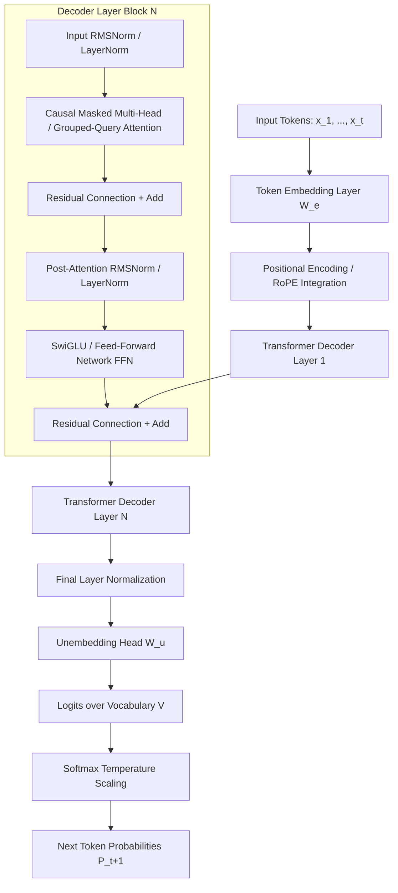
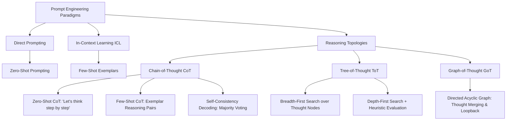
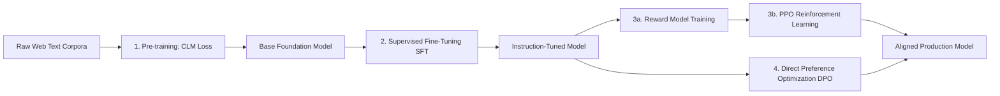
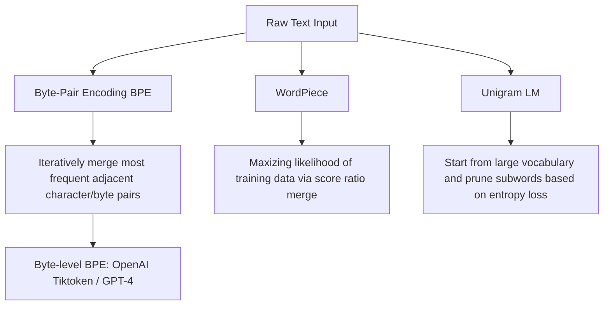

# K3 Days 05-06 — Theoretical LLM and AI Foundations

> **Khoá học:** [[K3-AI-Program]] (AI Practical Competency Program - Phase 1)  
> **Bài học trước:** [[K3 Day 04 - Research Agent Tool Evaluation]]  

> [!abstract] Executive Summary
> This note synthesizes the theoretical and architectural foundations of Large Language Models (LLMs) covered in **Days 05–06** of the **K3 AI Program**. It covers four interconnected pillars:
> 1. **[[Transformer Architecture]]**: Deep-dive into [[Self-Attention Mechanism]], [[Multi-Head Attention]], [[Positional Encoding]] (RoPE/ALiBi), and [[KV Cache]] memory dynamics.
> 2. **Prompt Engineering & [[In-Context Learning]] (ICL)**: Formal theories of zero-shot/few-shot prompting, [[Chain-of-Thought]] (CoT), [[Tree-of-Thought]] (ToT), [[Graph-of-Thought]] (GoT), and the implicit gradient descent mechanism of ICL.
> 3. **Alignment & Training Paradigms**: Mathematical formulation of [[Pre-training]] (CLM loss), [[Supervised Fine-Tuning]] (SFT), [[RLHF]] (PPO objective), and [[Direct Preference Optimization]] (DPO).
> 4. **Tokenization & Context Dynamics**: [[Byte-Pair Encoding]] (BPE) subword mechanics, [[Context Window Scaling]] (NTK-aware, YaRN), and [[Attention Decay]] / [[Lost in the Middle]] contextual phenomena.

---

## 1. Transformer Architecture & Mechanistic Foundations

The modern AI paradigm is built upon the **[[Transformer Architecture]]** introduced by Vaswani et al. (2017). While the original architecture utilized an Encoder-Decoder layout for neural machine translation, modern autoregressive LLMs (such as GPT-4, LLaMA, Mistral, and Claude) predominantly adopt a **Decoder-Only** topology optimized for causal language modeling.



### 1.1 Architectural Taxonomy: Encoder-Decoder vs. Encoder-Only vs. Decoder-Only

| Topology | Attention Masking | Representative Models | Primary Use Cases |
| :--- | :--- | :--- | :--- |
| **Encoder-Only** | Bidirectional (Full Attention Matrix) | BERT, RoBERTa, DeBERTa | Feature Extraction, Text Classification, Named Entity Recognition, Sentence Embeddings |
| **Encoder-Decoder** | Cross-Attention + Bidirectional Encoder & Causal Decoder | T5, BART, Whisper | Sequence-to-Sequence (Translation, Summarization, Audio Transcription) |
| **Decoder-Only** | Unidirectional / Causal Masking ($S_{ij} = -\infty$ for $j > i$) | GPT-3/4, LLaMA 1/2/3, Mistral, Qwen | Autoregressive Text Generation, Reasoning, [[In-Context Learning]], Agentic Execution |

### 1.2 The [[Self-Attention Mechanism]]

The fundamental building block of the Transformer is the **Scaled Dot-Product Attention**. Given an input sequence representation matrix $X \in \mathbb{R}^{n \times d_{model}}$, the sequence is projected into three distinct vector spaces via learned projection matrices $W^Q, W^K \in \mathbb{R}^{d_{model} \times d_k}$ and $W^V \in \mathbb{R}^{d_{model} \times d_v}$:

$$Q = X W^Q, \quad K = X W^K, \quad V = X W^V$$

The attention weights measure the pairwise compatibility between Query $Q$ and Key $K$. The inner product $Q K^T$ is scaled by $\sqrt{d_k}$ to prevent variance explosion in high dimensions, which would push the Softmax function into regions with vanishingly small gradients:

$$\text{Attention}(Q, K, V) = \text{softmax}\left(\frac{Q K^T}{\sqrt{d_k}} + M\right) V$$

where $M \in \mathbb{R}^{n \times n}$ represents the **Causal Attention Mask**:

$$M_{ij} = \begin{cases} 0 & \text{if } j \le i \\ -\infty & \text{if } j > i \end{cases}$$

```latex
\text{Attention}(Q,K,V) = \text{softmax}\left(\frac{QK^T}{\sqrt{d_k}}\right)V
```

### 1.3 [[Multi-Head Attention]] (MHA), Multi-Query Attention (MQA), and [[Grouped-Query Attention]] (GQA)

To allow the model to jointly attend to information from different representation subspaces at different positions, **[[Multi-Head Attention]] (MHA)** splits Query, Key, and Value projections into $h$ independent heads:

$$\text{MHA}(Q, K, V) = \text{Concat}(\text{head}_1, \text{head}_2, \dots, \text{head}_h) W^O$$

$$\text{head}_i = \text{Attention}(Q W_i^Q, K W_i^K, V W_i^V)$$

#### Memory Bottlenecks & Attention Variants
In large-scale autoregressive inference, storing Key-Value tensors across $h$ heads creates severe memory bandwidth bottlenecks. Modern architectures employ alternative attention variants:

1. **Multi-Head Attention (MHA)**: $h_Q = h_K = h_V$. Highest capacity, highest KV cache memory usage.
2. **Multi-Query Attention (MQA)**: $h_Q = h$, $h_K = h_V = 1$. Single Key-Value head shared across all Query heads. Reduces KV cache memory by factor of $h$, but may slightly degrade model capacity.
3. **[[Grouped-Query Attention]] (GQA)**: $h_Q = h$, $h_K = h_V = g$ (where $1 < g < h$). Queries are grouped into $g$ partitions, each sharing one KV head. Used in LLaMA-2-70B and LLaMA-3 to achieve near-MHA capacity with MQA-like inference memory speeds.

```
MHA:  [Q1 Q2 Q3 Q4]   [K1 K2 K3 K4]   [V1 V2 V3 V4]  (1:1 KV ratio)
MQA:  [Q1 Q2 Q3 Q4]   [  K_shared  ]   [  V_shared  ]  (N:1 KV ratio)
GQA:  [Q1 Q2] [Q3 Q4]  [  K1  ] [  K2  ]  [  V1  ] [  V2  ]  (Grouped KV ratio)
```

### 1.4 [[Positional Encoding]]: Absolute, Relative, RoPE, and ALiBi

Because Self-Attention is inherently permutation-invariant, positional information must be injected into token representations.

#### Absolute Sinusoidal Positional Encoding (Vaswani et al., 2017)
Adds fixed trigonometric functions directly to input embeddings:

$$PE_{(pos, 2i)} = \sin\left(\frac{pos}{10000^{2i/d_{model}}}\right), \quad PE_{(pos, 2i+1)} = \cos\left(\frac{pos}{10000^{2i/d_{model}}}\right)$$

#### Rotary Position Embedding ([[Rotary Position Embedding (RoPE)|RoPE]]) (Su et al., 2021)
RoPE encodes relative position by rotating Query and Key vectors in 2D complex planes. For a 2D vector $x = (x_1, x_2)^T$ at sequence position $m$, RoPE applies an orthogonal rotation matrix $R_{\Theta, m}^2$:

$$R_{\Theta, m}^2 x = \begin{pmatrix} \cos m\theta & -\sin m\theta \\ \sin m\theta & \cos m\theta \end{pmatrix} \begin{pmatrix} x_1 \\ x_2 \end{pmatrix}$$

By construction, the inner product between Query at position $m$ and Key at position $n$ depends purely on relative distance $(m - n)$:

$$\langle R_{\Theta, m}^d q, R_{\Theta, n}^d k \rangle = q^T R_{\Theta, n - m}^d k$$

#### Attention with Linear Biases (ALiBi) (Press et al., 2022)
ALiBi removes positional embeddings entirely and adds a static distance penalty bias directly to attention logits:

$$\text{Attention Logit}_{ij} = \frac{q_i k_j^T}{\sqrt{d_k}} - m \cdot |i - j|$$

where $m$ is a head-specific non-learnable slope scalar. ALiBi enables smooth length extrapolation to sequences longer than those seen during training.

### 1.5 Autoregressive Decoding & [[KV Cache]] Dynamics

During token generation, an LLM outputs one token at a time. Without optimization, computing token $t_{N+1}$ requires re-running the full Transformer forward pass over all pre-existing tokens $t_1, \dots, t_N$, resulting in an inefficient quadratic $O(N^2)$ computation per step.

#### [[KV Cache]] Mechanics
Because Key ($K$) and Value ($V$) representations for historical tokens $t_1, \dots, t_N$ do not change during autoregressive decoding, they can be calculated once and stored in GPU VRAM as the **KV Cache**. At step $N+1$, only the Query vector $q_{N+1}$ is calculated for the new token, and new $k_{N+1}, v_{N+1}$ vectors are appended to the cache:

$$K_{\text{cached}}^{(N+1)} = \text{Concat}\left(K_{\text{cached}}^{(N)}, k_{N+1}\right), \quad V_{\text{cached}}^{(N+1)} = \text{Concat}\left(V_{\text{cached}}^{(N)}, v_{N+1}\right)$$

#### KV Cache VRAM Footprint Formula
The GPU VRAM required to hold the KV Cache for a model can be calculated using the following mathematical formula:

$$\text{KV Cache Size (Bytes)} = 2 \times b \times s \times l \times h_{KV} \times d_{head} \times p$$

Where:
- $b$ = Batch size
- $s$ = Sequence length (prompt + generated tokens)
- $l$ = Number of Transformer layers
- $h_{KV}$ = Number of Key-Value heads (equals $h$ for MHA, $1$ for MQA, $g$ for GQA)
- $d_{head}$ = Projection dimension per head ($d_{model} / h$)
- $p$ = Precision in bytes (2 bytes for FP16/BF16, 1 byte for INT8)

> [!example] Numerical Example: LLaMA-2-70B Inference
> For LLaMA-2-70B ($l=80, h_Q=64, h_{KV}=8 \text{ (GQA)}, d_{head}=128$), running a batch size $b=8$ with context length $s=4096$ in BF16 ($p=2$ bytes):
> $$\text{Size} = 2 \times 8 \times 4096 \times 80 \times 8 \times 128 \times 2 = 10,737,418,240 \text{ Bytes} \approx 10.74 \text{ GB}$$
> Notice that GQA reduces this memory requirement from $85.9 \text{ GB}$ (which MHA would consume) down to $10.74 \text{ GB}$, fitting comfortably within GPU memory limits.

---

## 2. Prompt Engineering & In-Context Learning Theory

Prompting acts as the interface through which users activate latent capabilities learned by the LLM during pre-training.



### 2.1 Taxonomy of Prompting Paradigms

1. **[[Zero-shot Prompting]]**: Querying the model without providing example input-output pairs. The model relies entirely on parametric memory activated by instructions.
2. **[[Few-shot Prompting]]**: Including $k$ demonstration pairs $\{(x_1, y_1), (x_2, y_2), \dots, (x_k, y_k)\}$ inside the prompt context before presenting the target input $x_{target}$.

### 2.2 Reasoning Chains: [[Chain-of-Thought]] (CoT) and Complex Topologies

Complex reasoning problems (math, logic, multi-hop extraction) suffer when models attempt to output the final answer $y$ directly in a single step $P(y \mid x)$.

#### [[Chain-of-Thought]] (CoT) Decomposition
CoT decomposes the conditional output probability by introducing intermediate reasoning steps $z_1, z_2, \dots, z_m$:

$$P(y \mid x) = \sum_{z} P(y \mid x, z_1, \dots, z_m) \prod_{i=1}^{m} P(z_i \mid x, z_{<i})$$

- **Zero-Shot CoT**: Elicited by appendage phrases such as `"Let's think step by step."` (Kojima et al., 2022).
- **Few-Shot CoT**: Providing manual step-by-step reasoning demonstrations (Wei et al., 2022).
- **Self-Consistency CoT**: Sampling $N$ independent CoT reasoning paths at temperature $T > 0$ and selecting the final answer via majority voting over outputs $\{y^{(1)}, y^{(2)}, \dots, y^{(N)}\}$.

#### [[Tree-of-Thought]] (ToT) & [[Graph-of-Thought]] (GoT)
For tasks requiring exploration, backtracking, and lookahead:

- **[[Tree-of-Thought]] (ToT)** (Yao et al., 2023): Frames problem solving as search over a tree of thoughts. Each node represents a partial solution $z_{1:i}$. The model acts as both **thought generator** and **state evaluator** (scoring states $v \in [0, 1]$ or `valid/invalid`). Search algorithms like Breadth-First Search (BFS) or Depth-First Search (DFS) steer execution.
- **[[Graph-of-Thought]] (GoT)** (Besta et al., 2023): Generalizes ToT to a Directed Acyclic Graph (DAG), enabling thought aggregation, branch merging, and cyclic refinement loops.

```
ToT Search:                         GoT Topology:
       [Root Input]                        [Root Input]
      /     |      \                      /            \
  [Node A] [Node B] [Node C]          [Thought A]    [Thought B]
   /    \      |                       \            /
[A1]   [A2]  [B1]                      [Merged Thought C]
```

### 2.3 Mechanistic Theory of [[In-Context Learning]] (ICL)

Why does providing examples in context allow an LLM to learn new tasks without parameter updates?

#### 1. ICL as Implicit Gradient Descent (Dai et al., 2022 / Von Oswald et al., 2023)
Theoretical analyses demonstrate that self-attention layers on demonstration vectors compute updates functionally equivalent to explicit backpropagation steps. The prompt context acts as an implicit parameter modification matrix $\Delta W$:

$$W_{\text{effective}} = W_{0} + \Delta W(X_{\text{context}})$$

#### 2. Task Vector Activation (Hendel et al., 2023)
Demonstration pairs format latent representations into a compressed "Task Vector" located in the intermediate activations of deep Transformer layers. Injecting or shifting this vector steers model output without requiring demonstration tokens.

#### 3. Demonstration Sensitivity Dynamics
ICL performance depends heavily on structural properties:
- **Demonstration Order**: Permuting prompt examples can cause performance shifts of up to 40% due to recency bias and attention weight distributions.
- **Label Permutation Robustness**: Min et al. (2022) discovered that providing incorrect ground-truth labels in few-shot exemplars often causes minimal degradation; the model primarily learns the *input format space*, *output label space*, and *mapping syntax* from the context.

---

## 3. Alignment & Training Paradigms

Building production-ready AI systems requires a multi-stage training pipeline to transform raw statistical language estimators into helpful, honest, and harmless assistants.



### 3.1 [[Pre-training]] Stage

Pre-training trains a Transformer model on multi-terabyte datasets using **Causal Language Modeling (CLM)** (Next-Token Prediction).

#### Mathematical Objective
The model parameters $\theta$ are optimized by minimizing the negative log-likelihood over token sequence $X = (x_1, x_2, \dots, x_T)$:

$$\mathcal{L}_{CLM}(\theta) = -\sum_{t=1}^{T} \log P_\theta(x_t \mid x_1, x_2, \dots, x_{t-1})$$

```latex
\mathcal{L}_{CLM}(\theta) = -\sum_{t=1}^T \log P_\theta(x_t \mid x_{<t})
```

### 3.2 [[Supervised Fine-Tuning]] (SFT) & Instruction Tuning

Base models complete text but lack instruction-following discipline. **SFT** trains the model on curated prompt-response dataset pairs $\mathcal{D}_{SFT} = \{(x^{(i)}, y^{(i)})\}_{i=1}^N$.

#### Loss Masking
To prevent the model from wasting capacity learning to predict the prompt text $x$, the loss is computed strictly over the response tokens $y$:

$$\mathcal{L}_{SFT}(\theta) = -\sum_{i=1}^{N} \sum_{t=1}^{|y^{(i)}|} \log P_\theta(y_t^{(i)} \mid x^{(i)}, y_{<t}^{(i)})$$

### 3.3 Reinforcement Learning from Human Feedback ([[RLHF]])

SFT models may hallucinate, exhibit bias, or produce unsafe answers. **[[RLHF]]** aligns outputs with human preferences (Helpful, Honest, Harmless).

#### 1. Preference Dataset Collection
Human annotators evaluate model response pairs $(y_w, y_l)$ given prompt $x$, where $y_w$ is the preferred response (winner) and $y_l$ is the dispreferred response (loser):

$$\mathcal{D}_{\text{pref}} = \{(x, y_w, y_l)\}$$

#### 2. Reward Model (RM) Training
A reward model $r_\phi(x, y) \in \mathbb{R}$ is trained via the Bradley-Terry preference model loss:

$$\mathcal{L}_{RM}(\phi) = -\mathbb{E}_{(x, y_w, y_l) \sim \mathcal{D}_{\text{pref}}} \left[ \log \sigma \left( r_\phi(x, y_w) - r_\phi(x, y_l) \right) \right]$$

#### 3. Policy Optimization via Proximal Policy Optimization ([[PPO]])
The policy $\pi_\theta$ is updated to maximize expected reward while penalized by a Kullback-Leibler (KL) divergence term relative to the initial reference model $\pi_{\text{ref}}$ to prevent reward hacking:

$$\text{objective}(\theta) = \mathbb{E}_{(x, y) \sim \mathcal{D}} \left[ r_\phi(x, y) - \beta D_{KL}\left(\pi_\theta(y \mid x) \parallel \pi_{\text{ref}}(y \mid x)\right) \right]$$

where $D_{KL}(P \parallel Q) = \sum P(y \log(P/Q))$.

### 3.4 [[Direct Preference Optimization]] (DPO)

Standard [[RLHF]] with [[PPO]] is complex, unstable, and computationally expensive because it requires loading four neural networks into VRAM simultaneously (Policy Model, Reference Model, Reward Model, Value Model).

Rafailov et al. (2023) introduced **[[Direct Preference Optimization]] (DPO)**, proving mathematically that the optimal reward function $r(x, y)$ can be reparameterized directly through the language model policy:

$$r(x, y) = \beta \log \frac{\pi_\theta(y \mid x)}{\pi_{\text{ref}}(y \mid x)} + \beta \log Z(x)$$

Substituting this transformation into the Bradley-Terry preference objective yields the closed-form **DPO Loss Objective**:

$$\mathcal{L}_{DPO}(\theta; \pi_{\text{ref}}) = -\mathbb{E}_{(x, y_w, y_l) \sim \mathcal{D}_{\text{pref}}} \left[ \log \sigma \left( \beta \log \frac{\pi_\theta(y_w \mid x)}{\pi_{\text{ref}}(y_w \mid x)} - \beta \log \frac{\pi_\theta(y_l \mid x)}{\pi_{\text{ref}}(y_l \mid x)} \right) \right]$$

```latex
\mathcal{L}_{DPO}(\theta; \pi_{ref}) = -\mathbb{E}_{(x, y_w, y_l) \sim \mathcal{D}} \left[ \log \sigma \left( \beta \log \frac{\pi_\theta(y_w \mid x)}{\pi_{ref}(y_w \mid x)} - \beta \log \frac{\pi_\theta(y_l \mid x)}{\pi_{ref}(y_l \mid x)} \right) \right]
```

> [!tip] Advantages of DPO over RLHF/PPO
> - **No Separate Reward Model**: Eliminates the need to train or host an auxiliary reward network.
> - **Training Stability**: Reduces preference tuning to a single classification-like loss function, avoiding RL policy gradient instability.
> - **Memory Efficiency**: Cuts inference VRAM consumption during alignment fine-tuning by up to 50%.

### 3.5 Preference Optimization Frontiers: KTO, ORPO, and IPO

| Algorithm | Key Innovation | Data Requirement | Mathematical Difference |
| :--- | :--- | :--- | :--- |
| **[[Direct Preference Optimization|DPO]]** | Re-parameterizes reward via policy ratio | Pairwise Preferences $(x, y_w, y_l)$ | Standard Bradley-Terry loss |
| **KTO** (Kahneman-Tversky Optimization) | Utility function based on Prospect Theory | Unpaired binary signals (Prompt + Single Output + binary Pass/Fail) | Maximizes value function for individual outputs |
| **ORPO** (Odds Ratio Preference Optimization) | Combines SFT cross-entropy loss with an odds-ratio penalty in a single step | Pairwise Preferences $(x, y_w, y_l)$ | No reference model $\pi_{\text{ref}}$ required |
| **IPO** (Identity Preference Optimization) | Adds regularization directly to target log-likelihood differences | Pairwise Preferences $(x, y_w, y_l)$ | Prevents policy over-fitting to noisy human preference labels |

---

## 4. Tokenization & Context Window Dynamics

Text cannot be processed directly by neural networks; it must first be tokenized into discrete numerical identifiers.

### 4.1 Subword Tokenization Algorithms

Standard tokenizers strike a balance between vocabulary size $|V|$ and sequence length using subword algorithms.



#### [[Byte-Pair Encoding]] (BPE) Iterative Algorithm
1. Initialize vocabulary $V$ with all unique individual characters/bytes.
2. Tokenize corpus into individual characters.
3. Count frequencies of all adjacent token pairs $(t_i, t_j)$.
4. Merge the most frequent pair $(t_A, t_B) \to t_{new}$ and add $t_{new}$ to $V$.
5. Repeat until target vocabulary size $|V_{target}|$ or merge limit is reached.

#### Byte-Level Fallback (Tiktoken / cl100k_base / o200k_base)
Modern LLMs use **Byte-Level BPE**, operating on raw UTF-8 bytes rather than Unicode characters. This guarantees that any arbitrary string (including foreign code points, emojis, and raw binary) can be tokenized without producing `<unk>` (Unknown Token) errors.

### 4.2 [[Context Window Scaling]] Techniques

Standard models trained on context length $L_{train}$ degrade when evaluating long contexts $L_{eval} > L_{train}$ due to phase shifts in [[Rotary Position Embedding (RoPE)|RoPE]] rotational frequencies.

#### 1. Position Interpolation (PI) (Chen et al., 2023)
Linearly downscales position indices $m \to m \cdot \frac{L_{train}}{L_{eval}}$, mapping long sequences into the original frequency range:

$$R_{\Theta, m}' = R_{\Theta, m \cdot (L_{train} / L_{eval})}$$

#### 2. NTK-Aware Scaling (Neural Tangent Kernel)
High-frequency dimensions encode local token order, while low-frequency dimensions encode global sequence relationships. NTK-aware scaling changes the base frequency parameter $\Theta \to \Theta'$ rather than scaling positions uniformly:

$$\Theta' = \Theta \cdot S^{\frac{d}{d-2}}$$

where $S = \frac{L_{eval}}{L_{train}}$ is the context expansion scale factor.

#### 3. YaRN (Yet Another RoPE Extension) (Peng et al., 2023)
Combines NTK scaling with dynamic temperature correction of attention Softmax values, preserving local precision while extending context bounds to 128k+ tokens.

### 4.3 [[Attention Decay]] & [[Lost in the Middle]] Dynamics

Increasing the context window length mathematically does not guarantee that the LLM effectively retrieves information from the middle of long contexts.

```
Retrieval Accuracy (%)
100% |  \                                                    /
     |   \                                                  /
 50% |    \________________________________________________/
  0% +-------------------------------------------------------->
     Beginning of Context         Middle of Context        End of Context
     (Primacy Bias)             (Degraded Attention)      (Recency Bias)
```

#### Mechanistic Causes of the U-Shaped Curve (Liu et al., 2023)
1. **Primacy Bias**: The initial sequence tokens act as **[[Attention Sinks]]** (Xiao et al., 2023), absorbing excess softmax attention weight regardless of semantic content.
2. **Recency Bias**: Causal masking creates higher attention density at the end of the context window because generated tokens directly border recent history.
3. **Information Overcrowding**: Intermediate tokens experience positional entropy accumulation, decreasing key-query dot product margins.

---

## 5. Architectural & Paradigm Synthesis Matrix

| Theoretical Dimension | Key Component / Metric | Mathematical / Structural Driver | Production Impact |
| :--- | :--- | :--- | :--- |
| **Attention Architecture** | [[Grouped-Query Attention|GQA]] | $h_{Q} > h_{KV}$ ratio | Reduces [[KV Cache]] memory footprint by 8x during auto-regressive decoding. |
| **Positional Encoding** | [[Rotary Position Embedding (RoPE)|RoPE]] / ALiBi | Rotational complex matrices $R_{\Theta, m}^d$ | Enables relative distance modeling and context window extension via scaling algorithms. |
| **Prompting Strategy** | [[Tree-of-Thought|ToT]] / [[Graph-of-Thought|GoT]] | State search space exploration (BFS/DFS) | Maximizes complex reasoning performance by replacing linear prediction with path evaluation. |
| **In-Context Learning** | Implicit Gradient Descent | Task vector generation in hidden layers | Allows zero-parameter adaptation; highly sensitive to demonstration ordering. |
| **Model Alignment** | [[Direct Preference Optimization|DPO]] | Closed-form policy transformation | Eliminates auxiliary reward model complexity and stabilizes preference optimization. |
| **Context Dynamics** | [[Lost in the Middle]] | U-shaped attention softmax weight distribution | Requires hybrid document re-ordering and prompt restructuring for long-context RAG. |

---

## 6. Cross-References & Related Notes

- [[Transformer Architecture]] - Core mechanics of Scaled Dot-Product Attention, Encoder-Decoder topologies, and Feed-Forward Networks.
- [[Self-Attention Mechanism]] - Deep dive into Query, Key, and Value vector spaces.
- [[KV Cache]] - Memory estimation formulas, flash attention integration, and KV cache quantization techniques.
- [[In-Context Learning]] - Detailed empirical analysis of few-shot prompt behaviors.
- [[Chain-of-Thought]] - Implementations of step-by-step reasoning patterns in complex prompt pipelines.
- [[Tree-of-Thought]] - Graph search algorithms for multi-step algorithmic LLM solvers.
- [[Pre-training]] - Self-supervised dataset filtering and causal language modeling.
- [[Supervised Fine-Tuning]] - SFT dataset design, instruction formatting, and loss masking.
- [[RLHF]] - PPO-based alignment, reward model calibration, and human preference datasets.
- [[Direct Preference Optimization]] - Derivation of DPO closed-form preference loss and comparison with ORPO/KTO.
- [[Byte-Pair Encoding]] - Subword tokenization mechanics, vocabulary construction, and Tiktoken byte fallback.
- [[Context Window Scaling]] - RoPE scaling, NTK-aware interpolation, and YaRN context extension algorithms.
- [[Attention Decay]] - Contextual degradation, attention sinks, and lost-in-the-middle context reordering.

---
Trở về danh mục khoá học: [[K3-AI-Program]] | Bài học trước: [[K3 Day 04 - Research Agent Tool Evaluation]]
