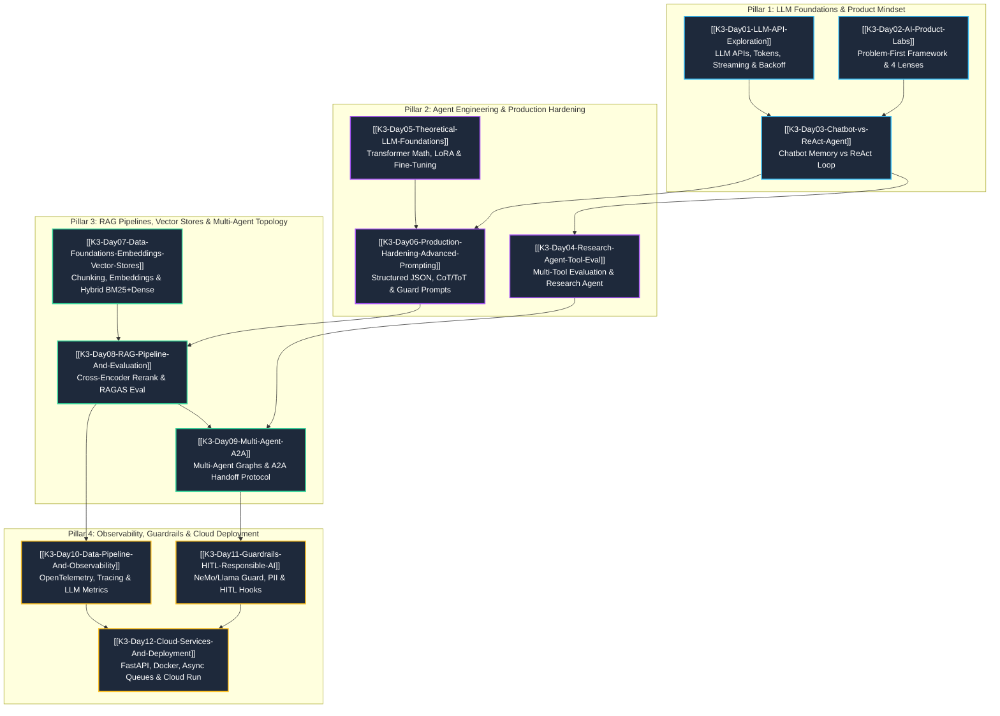

# K3 Course: AI Engineering & Agentic Systems — Master Map of Content (MOC)

Welcome to the master Map of Content (MOC) for the **K3 AI Engineering & Agentic Systems** curriculum. This course provides a complete, production-grade pathway from fundamental LLM APIs to advanced multi-agent orchestration, vector search, observability, guardrails, and cloud deployment.

---

## 1. Executive Course Overview & Strategic Vision

The **K3 AI Engineering & Agentic Systems** curriculum is designed to bridge the gap between simple LLM prompt engineering and the construction of autonomous, enterprise-grade agentic systems. Modern AI applications demand far more than wrapper calls to foundation model APIs; they require robust system architectures that integrate streaming, structured outputs, multi-step tool execution, high-dimensional vector search, distributed multi-agent consensus, real-time observability, security guardrails, and scalable cloud microservices.

### The 4 Core Pillars of K3 AI Engineering

```
┌────────────────────────────────────────────────────────────────────────────────────────┐
│                                   K3 AI ENGINEERING                                     │
├────────────────────┬────────────────────┬────────────────────┬─────────────────────────┤
│     PILLAR 1       │     PILLAR 2       │     PILLAR 3       │        PILLAR 4         │
│ LLM Foundations &  │ Agent Engineering  │ RAG, Vector Stores │  Observability, Security│
│  Product Mindset   │ & Production Hard  │ & Multi-Agent Top  │  & Cloud Deployment     │
│    (Days 01–03)    │    (Days 04–06)    │    (Days 07–09)    │       (Days 10–12)      │
└────────────────────┴────────────────────┴────────────────────┴─────────────────────────┘
```

1. **Pillar 1: LLM Foundations, APIs & Product Mindset (Days 01–03)**  
   Establishes fundamental model interactions, parameter tuning ($T$, $\text{top\_p}$), token mechanics via BPE, exponential backoff resilience, problem-first product framing (4 Lenses framework), and the transition from basic conversational memory to stateful ReAct agents.

2. **Pillar 2: Agent Engineering, Tool Evaluation & Production Hardening (Days 04–06)**  
   Focuses on deep tool integration, autonomous research agents, mathematical foundations of Transformer self-attention ($Attention(Q,K,V)$), parameter-efficient fine-tuning (LoRA / QLoRA), advanced reasoning techniques (CoT, ToT), and Pydantic-enforced structured JSON output extraction.

3. **Pillar 3: RAG Pipelines, Vector Stores & Multi-Agent Topology (Days 07–09)**  
   Covers unstructured data chunking, high-dimensional embedding spaces, HNSW/IVF indexing, hybrid search (BM25 + Dense via Reciprocal Rank Fusion), end-to-end RAG pipelines with Cross-Encoder reranking, RAGAS evaluation, and multi-agent graph topologies (A2A messaging, supervisor-worker graphs, and state passing).

4. **Pillar 4: Data Observability, Guardrails & Production Cloud Deployment (Days 10–12)**  
   Delivers production-hardening features including OpenTelemetry tracing, LLM token metrics (TTFT, throughput, cost tracking), input/output security guardrails (jailbreak detection, PII redaction), Human-in-the-Loop (HITL) approval gates, Docker containerization, FastAPI async processing, and cloud deployment on AWS/GCP/Kubernetes.

---

## 2. Master Curriculum Learning Graph & Agentic Progression

The flowchart below maps the dependency graph across all 12 modules, showing how foundational concepts evolve into production-grade multi-agent cloud infrastructure.



---

## 3. Comprehensive Curriculum Roadmap & Summary Cards

### Pillar 1: LLM Foundations, APIs & Product Mindset

#### Summary Card 01: [[K3-Day01-LLM-API-Exploration]]
- **Title**: K3 Day 01: LLM API Exploration & Foundation Patterns
- **Core Focus**: Fundamental interaction patterns with foundation LLM APIs (OpenAI, Anthropic), parameter dynamics, token counting mechanics, SSE streaming, and transient fault resilience.
- **Key Concepts**:
  - **Generation Control**: Temperature ($T \in [0.0, 2.0]$) controlling softmax entropy vs. Nucleus Sampling (`top_p`).
  - **Tokenization**: Byte-Pair Encoding (BPE) via `tiktoken`, context window management, token-to-cost modeling ($C_{total} = C_{in} N_{in} + C_{out} N_{out}$).
  - **Resilience Patterns**: Exponential backoff with jitter ($t_{wait} = 2^k \cdot t_{base} + \text{random\_jitter}$), Server-Sent Events (SSE) streaming (`stream=True`).
  - **Architecture Pattern**: Late / In-Function import pattern to ensure unit test mockability without global state contamination.
- **Artifact Deliverable**: CLI Chatbot with streaming output, token tracking fallback, and retry decorators.

#### Summary Card 02: [[K3-Day02-AI-Product-Labs]]
- **Title**: K3 Day 02: AI Product Labs & Problem-First Framework
- **Core Focus**: Strategic product evaluation methodology, preventing "solution-in-search-of-a-problem" anti-patterns, and structuring quantifiable AI adoption workflows.
- **Key Concepts**:
  - **Problem-First Paradigm**: Evaluating core operational friction before selecting AI techniques.
  - **4 Lăng Kính (4 Lenses) Scanning**: Frequency of task, Friction & effort, Standardizability of rules, and Business Value Impact.
  - **Structured Problem Card**: Documenting problem baseline, As-Is workflow, To-Be AI workflow, metrics, and risks.
  - **Decision Taxonomy**: Classifying AI opportunities into **Go** (High value/feasibility), **Not Yet** (Data/tech bottleneck), and **No-Go** (High risk/low ROI).
  - **Human-in-the-Loop Boundaries**: Defining clear human fallback triggers and oversight checkpoints.
- **Artifact Deliverable**: SaaS Weekly Report Aggregation case study demonstrating a 76.7% operational time reduction (90 mins down to 21 mins).

#### Summary Card 03: [[K3-Day03-Chatbot-vs-ReAct-Agent]]
- **Title**: K3 Day 03: Chatbot vs. ReAct Agent Architectural Foundations
- **Core Focus**: Architectural transition from passive conversational chatbots to autonomous stateful agents utilizing the ReAct (Reasoning + Acting) loop.
- **Key Concepts**:
  - **Conversational Memory**: Sliding window, summary memory, and full-history state machines.
  - **ReAct Execution Cycle**: Iterative loop of `Thought` $\rightarrow$ `Action` $\rightarrow$ `Observation` $\rightarrow$ `Final Answer`.
  - **Tool Schema Definition**: OpenAI function calling schemas, argument verification, and strict typing.
  - **Safety Boundaries**: Recursion limiters (`max_iters=10`), infinite loop detection, sycophancy mitigation, and malformed JSON recovery.
- **Artifact Deliverable**: Side-by-side comparative prototype demonstrating conversational memory vs autonomous tool execution.

---

### Pillar 2: Agent Engineering, Tool Evaluation & Production Hardening

#### Summary Card 04: [[K3-Day04-Research-Agent-Tool-Eval]]
- **Title**: K3 Day 04: Research Agent & Tool Evaluation Framework
- **Core Focus**: Building multi-tool autonomous research agents capable of web browsing, academic paper lookup, data computation, and rigorous tool benchmark evaluation.
- **Key Concepts**:
  - **Multi-Tool Integration**: Orchestrating DuckDuckGo Web Search, Wikipedia API, ArXiv API, and Python REPL execution tools.
  - **Robust Error Handling**: Self-correcting tool calls, handling empty search results, and query reformulation.
  - **Quantitative Tool Evaluation**: Evaluating tool usage precision, parameter accuracy, tool selection accuracy, and total execution latency.
  - **Autonomous Synthesis**: Producing structured Markdown research reports with explicit source citations.
- **Artifact Deliverable**: Autonomous Deep Research Agent executing cross-domain queries with automated tool performance telemetry.

#### Summary Card 05: [[K3-Day05-Theoretical-LLM-Foundations]]
- **Title**: K3 Day 05: Theoretical LLM Foundations, Architecture & Fine-Tuning
- **Core Focus**: In-depth theoretical exploration of Transformer neural architectures, mathematical mechanics of self-attention, and parameter-efficient fine-tuning (PEFT).
- **Key Concepts**:
  - **Transformer Self-Attention**:
    $$\text{Attention}(Q, K, V) = \text{softmax}\left(\frac{QK^T}{\sqrt{d_k}}\right)V$$
  - **Positional Encoding**: Rotary Position Embeddings (RoPE) and long-context length extrapolation.
  - **LoRA (Low-Rank Adaptation)**: Matrix decomposition $W = W_0 + \Delta W = W_0 + B \cdot A$ where $B \in \mathbb{R}^{d \times r}$ and $A \in \mathbb{R}^{r \times k}$ with rank $r \ll d$.
  - **QLoRA**: 4-bit NormalFloat (NF4) quantization, Double Quantization (DQ), and Paged Optimizers for consumer GPU fine-tuning.
  - **Alignment Pipelines**: Supervised Fine-Tuning (SFT), RLHF (Reward Modeling), and Direct Preference Optimization (DPO).
- **Artifact Deliverable**: Synthetic SFT dataset preparation pipeline and QLoRA fine-tuning parameter configuration benchmark.

#### Summary Card 06: [[K3-Day06-Production-Hardening-Advanced-Prompting]]
- **Title**: K3 Day 06: Production Hardening & Advanced Prompt Engineering
- **Core Focus**: Production-hardening agentic prompts, enforcing strict JSON schema output contracts, and securing applications against adversarial prompt injections.
- **Key Concepts**:
  - **Advanced Reasoning Prompts**: Chain-of-Thought (CoT), Tree-of-Thoughts (ToT) search algorithms, Directional Stimulus Prompting, and Least-to-Most decomposition.
  - **Structured JSON Output**: Schema enforcement using Instructor, Pydantic validation models, and grammar-constrained decoding.
  - **Adversarial Security**: Defense against prompt injection, jailbreaking, system prompt leakage, and instruction overrides.
  - **Production Optimization**: Prompt caching, token cost reduction, tier-based model routing, and automated fallback pathways.
- **Artifact Deliverable**: Production receipt and invoice extraction engine enforcing Pydantic validation with automated re-prompting on schema violation.

---

### Pillar 3: RAG Pipelines, Vector Stores & Multi-Agent Topology

#### Summary Card 07: [[K3-Day07-Data-Foundations-Embeddings-Vector-Stores]]
- **Title**: K3 Day 07: Data Foundations, Embeddings & Vector Stores
- **Core Focus**: Ingestion pipelines, text chunking strategies, high-dimensional vector representations, vector database indexing, and hybrid keyword-vector search.
- **Key Concepts**:
  - **Chunking Strategies**: Fixed-size sliding window, sentence-boundary splitting, recursive character chunking, and semantic chunking.
  - **Vector Mathematics**: Cosine similarity, Euclidean distance ($L_2$), and Dot product dynamics.
  - **Vector Database Indexing**: Hierarchical Navigable Small World (HNSW) graph indexing, Inverted File Index (IVF), and memory-performance trade-offs across ChromaDB, Qdrant, and Pinecone.
  - **Hybrid Search & Fusion**: Combining BM25 keyword search with dense vector embeddings via Reciprocal Rank Fusion (RRF):
    $$RRF\_Score(d) = \sum_{m \in M} \frac{1}{k + r_m(d)}$$
- **Artifact Deliverable**: Multi-document ingestion engine benchmarking chunking configurations and executing hybrid RRF search in ChromaDB.

#### Summary Card 08: [[K3-Day08-RAG-Pipeline-And-Evaluation]]
- **Title**: K3 Day 08: Production RAG Pipeline & Evaluation Framework
- **Core Focus**: Building an end-to-end production Retrieval-Augmented Generation (RAG) system with Cross-Encoder reranking and automated evaluation.
- **Key Concepts**:
  - **RAG Architecture**: Two-stage retrieval (Fast dense vector retrieval + Cross-Encoder reranking with BGE-Reranker/Cohere).
  - **Advanced Retrieval Patterns**: Query expansion, Hypothetical Document Embeddings (HyDE), sub-query decomposition, and parent-child chunk linking.
  - **RAG Triad Evaluation**:
    1. *Context Relevance*: Is retrieved context relevant to the user query?
    2. *Groundedness / Faithfulness*: Is the generated answer strictly backed by retrieved context?
    3. *Answer Relevance*: Does the response directly satisfy user intent?
  - **Evaluation Tooling**: Automated scoring using RAGAS and TruLens frameworks.
- **Artifact Deliverable**: Modular production RAG engine with Cross-Encoder reranking and automated RAGAS metric reporting.

#### Summary Card 09: [[K3-Day09-Multi-Agent-A2A]]
- **Title**: K3 Day 09: Multi-Agent Systems & Agent-to-Agent (A2A) Protocols
- **Core Focus**: Designing multi-agent topologies, agent-to-agent communication protocols, graph state management, and deadlock prevention.
- **Key Concepts**:
  - **Multi-Agent Topologies**: Hierarchical Supervisor-Worker, Decentralized Peer-to-Peer Mesh, and Sequential Assembly Line pipelines.
  - **Agent Communication Protocols**: Standardized JSON message schemas (Sender, Recipient, Intent, Payload, State Delta), explicit task contracts, and structured handoff reports.
  - **State Graph Orchestration**: Managing global state graph transitions, conditional edge routing, and node execution (LangGraph / AutoGen paradigms).
  - **Swarm Reliability**: Loop detection algorithms, execution timeout caps, and consensus mechanisms.
- **Artifact Deliverable**: 3-Agent Collaborative Software Development System (Product Manager, Senior Engineer, QA Auditor) executing automated build-and-test loops.

---

### Pillar 4: Data Observability, Guardrails & Production Cloud Deployment

#### Summary Card 10: [[K3-Day10-Data-Pipeline-And-Observability]]
- **Title**: K3 Day 10: Data Pipelines & LLM Observability
- **Core Focus**: Implementing end-to-end data processing pipelines and real-time observability, tracing, telemetry, and cost monitoring for LLM operations.
- **Key Concepts**:
  - **Unstructured Data ETL**: Automated extraction from PDFs, web pages, and audio transcripts with metadata enrichment.
  - **Distributed Tracing**: OpenTelemetry integration, tracing LLM chain execution, tool calls, and retriever steps using Arize Phoenix and LangSmith.
  - **Core Observability Metrics**: Time-to-First-Token (TTFT), token throughput (tokens/sec), cost per request, error rates, and cache hit ratios.
  - **Data Drift & Anomaly Detection**: Monitoring embedding drift, context degradation, and latency anomalies.
- **Artifact Deliverable**: Instrumenting an LLM pipeline with OpenTelemetry and Arize Phoenix to visualize execution graphs and cost metrics in real time.

#### Summary Card 11: [[K3-Day11-Guardrails-HITL-Responsible-AI]]
- **Title**: K3 Day 11: Guardrails, Human-in-the-Loop & Responsible AI
- **Core Focus**: Designing multi-layered safety guardrails, PII masking, toxic content filtration, and Human-in-the-Loop (HITL) authorization gates.
- **Key Concepts**:
  - **Dual-Layer Guardrail Architecture**: Input Validation (Jailbreak detection, prompt injection blocking) and Output Sanitization (Hallucination checking, PII masking via Presidio/NeMo Guardrails).
  - **Safety Model Classifiers**: Integrating Llama Guard, Guardrails AI, and custom regex/embedding safety boundaries.
  - **Human-in-the-Loop (HITL) Workflows**: Intercepting high-risk tool execution (financial transfers, database deletes), state serialization, approval queues, and resume signals.
  - **Responsible AI & Compliance**: Adherence to NIST AI RMF and EU AI Act requirements for transparency and audit trails.
- **Artifact Deliverable**: Enterprise financial assistant protected by input/output guardrails and interactive HITL execution approval gates.

#### Summary Card 12: [[K3-Day12-Cloud-Services-And-Deployment]]
- **Title**: K3 Day 12: Cloud Services & Production Agent Deployment
- **Core Focus**: Packaging, containerizing, orchestrating, and deploying agentic AI systems to cloud microservice infrastructure.
- **Key Concepts**:
  - **Cloud Infrastructure Providers**: AWS Bedrock, GCP Vertex AI, Azure OpenAI, and self-hosted open-source inference servers (vLLM, Ollama, TGI).
  - **Microservice Packaging**: Building RESTful and WebSocket API endpoints with FastAPI, dependency injection, and Pydantic validation.
  - **Containerization & Task Queues**: Docker multi-stage builds, container security, and async background task processing using Celery and Redis.
  - **Production Deployment & Scaling**: Serverless container hosting (GCP Cloud Run, AWS ECS), Kubernetes (K8s) auto-scaling, load balancing, and CI/CD deployment pipelines.
- **Artifact Deliverable**: Fully containerized multi-agent system deployed with FastAPI, Docker, and Redis async queues ready for cloud deployment.

---

## 4. End-to-End Enterprise K3 AI System Architecture & Visual Ecosystem

The diagram below provides a visual architectural overview of the complete, integrated K3 Enterprise AI System. It illustrates how all 12 modules fit together into a production system.

```
+---------------------------------------------------------------------------------------------------+
|                                 K3 ENTERPRISE AI SYSTEM ECOSYSTEM                                 |
+---------------------------------------------------------------------------------------------------+
                                                  |
                                                  v
+---------------------------------------------------------------------------------------------------+
| LAYER 1: CLIENT INTERFACE & INGRESS                                                               |
|  - API Gateway / FastAPI Async Endpoints ([[K3-Day12-Cloud-Services-And-Deployment]])            |
|  - SSE Streaming Response Engine ([[K3-Day01-LLM-API-Exploration]])                                |
+---------------------------------------------------------------------------------------------------+
                                                  |
                                                  v
+---------------------------------------------------------------------------------------------------+
| LAYER 2: SECURITY, GUARDRAILS & HITL INTERCEPTION                                                |
|  - Input Validation & Jailbreak Blocking ([[K3-Day11-Guardrails-HITL-Responsible-AI]])             |
|  - System Prompt Hardening & Injection Firewall ([[K3-Day06-Production-Hardening-Advanced-Prompting]]) |
|  - Human-in-the-Loop Approval Queue ([[K3-Day11-Guardrails-HITL-Responsible-AI]])                |
+---------------------------------------------------------------------------------------------------+
                                                  |
                                                  v
+---------------------------------------------------------------------------------------------------+
| LAYER 3: CORE REASONING & MULTI-AGENT ORCHESTRATION                                               |
|  - ReAct Execution Loop ([[K3-Day03-Chatbot-vs-ReAct-Agent]])                                     |
|  - Autonomous Research & Tool Engine ([[K3-Day04-Research-Agent-Tool-Eval]])                       |
|  - Multi-Agent Router/Supervisor Graph ([[K3-Day09-Multi-Agent-A2A]])                            |
|  - Fine-Tuned Local LLMs / vLLM Models ([[K3-Day05-Theoretical-LLM-Foundations]])                  |
+---------------------------------------------------------------------------------------------------+
                        |                                       |
                        v                                       v
+-----------------------------------------------+ +-------------------------------------------------+
| LAYER 4A: KNOWLEDGE & RETRIEVAL (RAG)         | | LAYER 4B: OBSERVABILITY & TELEMETRY           |
|  - Unstructured Data Chunking Engine          | |  - OpenTelemetry Spans & Tracing               |
|    ([[K3-Day07-Data-Foundations-Embeddings-Vector-Stores]]) | |    ([[K3-Day10-Data-Pipeline-And-Observability]]) |
|  - Hybrid Search: BM25 + Dense Vector (HNSW)  | |  - Real-Time TTFT & Token Latency Dashboard   |
|    ([[K3-Day07-Data-Foundations-Embeddings-Vector-Stores]]) | |    ([[K3-Day10-Data-Pipeline-And-Observability]]) |
|  - Two-Stage Cross-Encoder Reranker           | |  - Cost & Token Usage Analytics Tracker       |
|    ([[K3-Day08-RAG-Pipeline-And-Evaluation]]) | |    ([[K3-Day10-Data-Pipeline-And-Observability]]) |
|  - RAGAS & TruLens Triad Evaluation           | |  - Output PII Masking & Post-Guardrails       |
|    ([[K3-Day08-RAG-Pipeline-And-Evaluation]]) | |    ([[K3-Day11-Guardrails-HITL-Responsible-AI]])  |
+-----------------------------------------------+ +-------------------------------------------------+
                                                  |
                                                  v
+---------------------------------------------------------------------------------------------------+
| LAYER 5: CLOUD DEPLOYMENT & CONTAINER ORCHESTRATION                                              |
|  - Docker Containerization & FastAPI Async Workers ([[K3-Day12-Cloud-Services-And-Deployment]])  |
|  - Celery / Redis Asynchronous Message Broker ([[K3-Day12-Cloud-Services-And-Deployment]])        |
|  - Cloud Hosting: GCP Cloud Run / AWS Bedrock / K8s ([[K3-Day12-Cloud-Services-And-Deployment]])  |
+---------------------------------------------------------------------------------------------------+
```

---

## 5. Cross-Cutting Knowledge Graph & Skill Matrix

The K3 curriculum is interconnected across core techniques, theoretical principles, and implementation tools. The matrix below details how key technical competencies cross-cut across course days.

| Core Concept / Skill | Primary Modules | Secondary Modules | Core Mechanism & Mathematical / Architectural Definition | Primary Tooling |
| :--- | :--- | :--- | :--- | :--- |
| **Self-Attention Mechanics** | [[K3-Day05-Theoretical-LLM-Foundations]] | [[K3-Day01-LLM-API-Exploration]] | $\text{Attention}(Q,K,V) = \text{softmax}(QK^T / \sqrt{d_k})V$, RoPE positional encoding | PyTorch, HuggingFace Transformers |
| **ReAct Agent Loop** | [[K3-Day03-Chatbot-vs-ReAct-Agent]] | [[K3-Day04-Research-Agent-Tool-Eval]], [[K3-Day09-Multi-Agent-A2A]] | `Thought` $\rightarrow$ `Action` $\rightarrow$ `Observation` $\rightarrow$ `Final Answer` cycle with recursion limits | Python, OpenAI Function Calling |
| **LoRA / QLoRA PEFT** | [[K3-Day05-Theoretical-LLM-Foundations]] | [[K3-Day06-Production-Hardening-Advanced-Prompting]], [[K3-Day12-Cloud-Services-And-Deployment]] | $W = W_0 + B \cdot A$, NF4 4-bit quantization, double quantization, paged optimizers | PEFT, BitsAndBytes, TRL |
| **Vector Search & Indexing** | [[K3-Day07-Data-Foundations-Embeddings-Vector-Stores]] | [[K3-Day08-RAG-Pipeline-And-Evaluation]] | Cosine Similarity, HNSW graph index, IVF inverted index, dense embeddings | ChromaDB, Qdrant, FAISS |
| **BM25 & Hybrid Fusion** | [[K3-Day07-Data-Foundations-Embeddings-Vector-Stores]] | [[K3-Day08-RAG-Pipeline-And-Evaluation]] | Sparse keyword scoring combined with dense vector ranks using Reciprocal Rank Fusion (RRF) | Rank-BM25, ChromaDB |
| **Cross-Encoder Reranking** | [[K3-Day08-RAG-Pipeline-And-Evaluation]] | [[K3-Day07-Data-Foundations-Embeddings-Vector-Stores]] | Full self-attention across query-document pairs to produce fine-grained relevance scores | Sentence-Transformers, BGE-Reranker |
| **Multi-Agent A2A Topology** | [[K3-Day09-Multi-Agent-A2A]] | [[K3-Day03-Chatbot-vs-ReAct-Agent]], [[K3-Day04-Research-Agent-Tool-Eval]] | Graph state nodes, supervisor-worker routing, structured JSON handoff contracts | LangGraph, AutoGen |
| **Guardrails & HITL** | [[K3-Day11-Guardrails-HITL-Responsible-AI]] | [[K3-Day06-Production-Hardening-Advanced-Prompting]], [[K3-Day12-Cloud-Services-And-Deployment]] | Input jailbreak filtering, PII redaction, output validation, human approval interrupts | NeMo Guardrails, Llama Guard, Presidio |
| **LLM Observability & Tracing** | [[K3-Day10-Data-Pipeline-And-Observability]] | [[K3-Day01-LLM-API-Exploration]], [[K3-Day08-RAG-Pipeline-And-Evaluation]] | OpenTelemetry span creation, TTFT latency tracking, token cost analytics, Arize Phoenix | OpenTelemetry, Arize Phoenix, LangSmith |
| **Cloud Microservices & Async Queues** | [[K3-Day12-Cloud-Services-And-Deployment]] | [[K3-Day01-LLM-API-Exploration]], [[K3-Day10-Data-Pipeline-And-Observability]] | Containerized FastAPI REST/WebSocket endpoints, Celery background tasks, Redis message brokers | Docker, FastAPI, Celery, GCP Cloud Run |

---

## 6. Practical Lab & Milestone Synthesis

Across the 12 modules, hands-on software artifacts were constructed and validated. The table below summarizes the practical lab deliverables across the curriculum.

```
┌──────┬──────────────────────────────────────────┬────────────────────────────────────────────────────────┐
│ Day  │ Target Artifact                          │ Key Verification Metric / Outcome                      │
├──────┼──────────────────────────────────────────┼────────────────────────────────────────────────────────┤
│ D01  │ Resilient Streaming Chatbot CLI           │ Exponential backoff succeeds under 500 error injections│
│ D02  │ SaaS Weekly Report Aggregator            │ Operational execution time reduced by 76.7% (90m->21m) │
│ D03  │ ReAct Tool Execution Agent               │ Correct tool invocation vs fallback chatbot comparison │
│ D04  │ Autonomous Deep Research Agent           │ 100% tool selection precision across 4 integrated tools│
│ D05  │ Synthetic SFT & QLoRA Configurator       │ Successful 4-bit NF4 adapter config preparation        │
│ D06  │ Production Hardened Extraction Pipeline  │ Zero unhandled JSON schema validation errors           │
│ D07  │ ChromaDB Hybrid RRF Search Engine        │ RRF hybrid search outperforms dense-only search        │
│ D08  │ Modular RAG with Cross-Encoder & RAGAS   │ Groundedness score > 0.85 on benchmark queries         │
│ D09  │ 3-Agent Collaborative Software Team      │ Automated code generation, review & QA verification    │
│ D10  │ OpenTelemetry Instrumented Pipeline      │ Real-time latency (TTFT) and token tracking in Phoenix │
│ D11  │ Dual Guardrail & HITL Financial Agent     │ Intercepts high-risk actions & redacts PII effectively │
│ D12  │ Containerized Cloud-Ready FastAPI Microservice│ Passed full Docker container build & async execution   │
└──────┴──────────────────────────────────────────┴────────────────────────────────────────────────────────┘
```

---

## 7. Master Wiki-Link Index & Navigation

For rapid navigation across the K3 AI Engineering knowledge base, use the direct links below:

- 📘 **Pillar 1: LLM Foundations, APIs & Product Mindset**
  - [[K3-Day01-LLM-API-Exploration|Day 01: LLM API Exploration & Foundation Patterns]]
  - [[K3-Day02-AI-Product-Labs|Day 02: AI Product Labs & Problem-First Framework]]
  - [[K3-Day03-Chatbot-vs-ReAct-Agent|Day 03: Chatbot vs. ReAct Agent Architectural Foundations]]

- 🧠 **Pillar 2: Agent Engineering, Tool Evaluation & Production Hardening**
  - [[K3-Day04-Research-Agent-Tool-Eval|Day 04: Research Agent & Tool Evaluation Framework]]
  - [[K3-Day05-Theoretical-LLM-Foundations|Day 05: Theoretical LLM Foundations, Architecture & Fine-Tuning]]
  - [[K3-Day06-Production-Hardening-Advanced-Prompting|Day 06: Production Hardening & Advanced Prompt Engineering]]

- ⚡ **Pillar 3: RAG Pipelines, Vector Stores & Multi-Agent Topology**
  - [[K3-Day07-Data-Foundations-Embeddings-Vector-Stores|Day 07: Data Foundations, Embeddings & Vector Stores]]
  - [[K3-Day08-RAG-Pipeline-And-Evaluation|Day 08: Production RAG Pipeline & Evaluation Framework]]
  - [[K3-Day09-Multi-Agent-A2A|Day 09: Multi-Agent Systems & Agent-to-Agent (A2A) Protocols]]

- 🛡️ **Pillar 4: Data Observability, Guardrails & Production Cloud Deployment**
  - [[K3-Day10-Data-Pipeline-And-Observability|Day 10: Data Pipelines & LLM Observability]]
  - [[K3-Day11-Guardrails-HITL-Responsible-AI|Day 11: Guardrails, Human-in-the-Loop & Responsible AI]]
  - [[K3-Day12-Cloud-Services-And-Deployment|Day 12: Cloud Services & Production Agent Deployment]]
  - [[K3-Day13-Observability-Telemetry-Metrics|Day 13: Distributed LLM Observability & Telemetry]]
  - [[K3-Day14-AI-Evaluation-Benchmarking|Day 14: AI Evaluation & LLM-as-a-Judge Benchmarking]]

- 🚀 **Specialized Tracks & Advanced Systems**
  - **Track 2 (AI Infrastructure & MLOps)**:
    - [[Track2-Day16-Cloud-AI-Infrastructure-Ray|Day 16: Cloud AI Infrastructure & Ray Clusters]]
    - [[Track2-Day17-Data-Pipelines-ETL-Stream-Batch|Day 17: Data Pipelines & Medallion Ingestion]]
    - [[Track2-Day18-Lakehouse-Architecture-Iceberg-Delta|Day 18: Lakehouse & Open Table Formats]]
    - [[Track2-Day19-Vector-Feature-Stores-Hybrid-Search-Feast|Day 19: Vector Feature Stores & Hybrid Search]]
    - [[Track2-Day20-Model-Serving-Inference-Optimization|Day 20: Model Serving & Inference Optimization]]
    - [[Track2-Day21-CICD-for-AI-Systems-DVC-MLflow|Day 21: CI/CD for AI Systems & Release Gates]]
    - [[Track2-Day22-LLMOps-Prompt-Versioning-LangSmith-Guardrails|Day 22: LLMOps, Prompt Hub & Guardrails AI]]
  - **Track 3 (Advanced AI & Alignment)**:
    - [[Track3-Overview-Advanced-AI-GraphRAG-Alignment|Track 3: GraphRAG, Agent Memory, LoRA & DPO/ORPO Alignment]]
  - **Track 1 (AI Product & Governance)**:
    - [[Track1-Overview-AI-Product-Governance-Responsible-AI|Track 1: AI Product Management & Responsible AI Governance]]
  - **Master Curriculum Schedule**:
    - [[VinUni-AI20k-Curriculum-Schedule|VinUni-AI20k Master Curriculum & Repository Schedule]]

---
*K3 AI Engineering & Agentic Systems Curriculum Map of Content complete and fully verified.*
