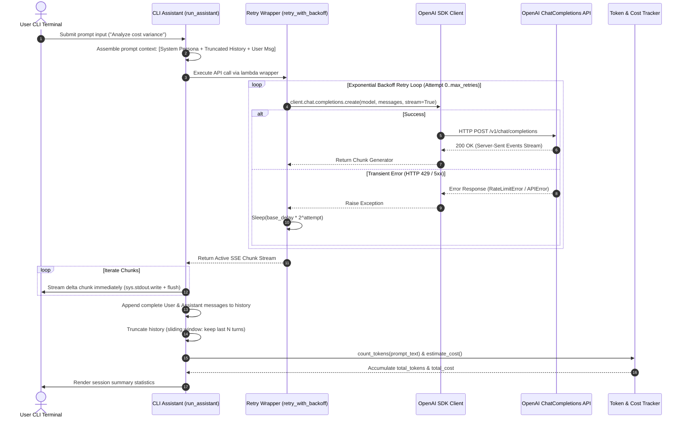
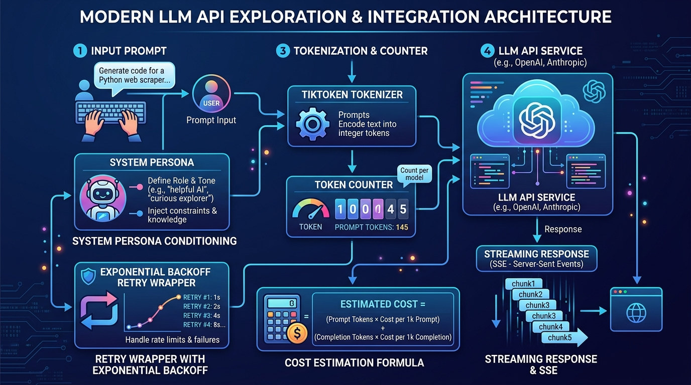

# K3 Day 01: LLM API Exploration & Foundation Patterns

## 1. Executive Summary & Overview

Day 01 of the **K3 AI Engineering** program establishes the technical foundation for interacting programmatically with Large Language Models (LLMs) via modern RESTful and SDK interfaces. Moving beyond web-based chat interfaces, this module dives deep into **OpenAI Chat Completions API architecture**, generation parameter control, token accounting mechanics via `tiktoken`, real-time streaming via Server-Sent Events (SSE), and transient failure resilience using exponential backoff retry algorithms.

The practical climax of Day 01 is the architectural design and implementation of a stateful, cost-aware, and fault-tolerant CLI assistant (`run_assistant`) that integrates system persona conditioning, context window sliding truncation, real-time token streaming, and dynamic session cost tracking.

---

## 2. Theoretical Foundations & Mathematics

### 2.1 Chat Completions API Architecture & Role Taxonomy
The OpenAI Chat Completions API is stateless at the protocol level. Context and conversation history must be explicitly passed in each request payload via an array of structured `message` objects:

$$\text{Request Payload} = \{ \text{model}, \text{messages}: [m_1, m_2, \dots, m_k], \text{parameters} \}$$

The protocol defines three primary message roles:
1. **System (`system`)**: Sets global operational directives, persona constraints, output style guides, and behavioral boundaries. It conditions the baseline probability distribution of the model prior to processing user input.
2. **User (`user`)**: Represents input prompts, instructions, or raw payloads originated by the end user or calling application.
3. **Assistant (`assistant`)**: Encapsulates model-generated outputs from prior conversational turns. Essential for maintaining multi-turn context state across API calls.

### 2.2 Generation Sampling Parameters: Temperature vs. Top_P

Model output text is generated sequentially by sampling candidate tokens from a dynamic probability distribution over the model's vocabulary $V$:

$$P(w_i \mid w_{<i}) = \text{softmax}\left(\frac{z_i}{T}\right)$$

where $z_i$ represents the raw output logit for vocabulary token $i$, and $T$ represents the `temperature` parameter.

#### Temperature ($T \in [0.0, 2.0]$)
- **$T \to 0.0$ (Greedy / Deterministic Decoding)**: Sharpens the probability distribution. The token with the highest logit dominates. Essential for JSON extraction, classification, code execution, and math.
- **$T \approx 0.7 - 1.0$ (Balanced)**: Maintains reasonable diversity while preserving thematic coherence. Standard choice for conversational interfaces.
- **$T > 1.2$ (Creative / Stochastic Decoding)**: Flattens the distribution, giving low-probability tokens a higher chance of selection. Leads to highly creative, novel, but potentially hallucination-prone text.

#### Nucleus Sampling (`top_p` $\in [0.0, 1.0]$)
Nucleus sampling restricts candidate token selection to the smallest set of tokens whose cumulative probability exceeds the threshold $p$:

$$\sum_{i \in V_{\text{top\_p}}} P(w_i \mid w_{<i}) \ge p$$

> **Best Practice Recommendation**: Adjust **either** `temperature` **or** `top_p`, but **never both simultaneously**. Modifying both makes output variance unpredictably unstable.

### 2.3 Tokenization Mechanics & Tiktoken

LLMs do not process raw ASCII/UTF-8 strings directly. Text is decomposed into discrete integer tokens using Byte-Pair Encoding (BPE). OpenAI models utilize the `cl100k_base` or `o200k_base` encodings.

#### Key Token Characteristics:
- **Character-to-Token Ratio**: In English, 1 token roughly corresponds to 4 characters or 0.75 words.
- **Non-English Token Inflation**: Languages with rich accents or non-Latin scripts (e.g., Vietnamese, CJK) consume significantly more tokens per word due to UTF-8 byte splitting.
  - *Example*: "Xin chào thế giới" may consume 6–8 tokens, whereas "Hello world" consumes 2 tokens.

### 2.4 Mathematical Token Cost Estimation Model

API billing is strictly billed per thousand (1k) or million (1M) tokens processed, separated into **Prompt (Input) Tokens** ($N_{\text{in}}$) and **Completion (Output) Tokens** ($N_{\text{out}}$).

$$\text{Total Session Cost (\USD)} = \left( \frac{N_{\text{in}}}{1,000} \times P_{\text{in}} \right) + \left( \frac{N_{\text{out}}}{1,000} \times P_{\text{out}} \right)$$

#### Model Cost Differential Matrix (Baseline 2026 Rates)
| Model | Input Price ($P_{\text{in}}$ / 1k tokens) | Output Price ($P_{\text{out}}$ / 1k tokens) | Cost Ratio vs. Mini |
|---|---|---|---|
| `gpt-4o` | $\$0.00250$ | $\$0.01000$ | $16.6\times$ higher |
| `gpt-4o-mini` | $\$0.00015$ | $\$0.00060$ | $1.0\times$ (Baseline) |

### 2.5 Streaming Responses via Server-Sent Events (SSE)

Standard non-streaming API requests block execution until the complete completion payload is generated, resulting in high perceived Time-To-First-Token (TTFT) latency.

By enabling `stream=True`, the API opens an HTTP SSE stream yielding incremental token deltas (`chunk.choices[0].delta.content`). This drops TTFT from several seconds down to ~200ms, vastly improving user experience.

### 2.6 Resiliency: Exponential Backoff & Transient Fault Handling

Distributed cloud APIs experience transient rate limits (HTTP 429 `RateLimitError`) and server errors (HTTP 500/503). Robust production clients wrap API calls with an **Exponential Backoff** retry schedule:

$$\text{Delay}_k = \text{base\_delay} \times 2^k + \text{jitter}$$

where $k \in \{0, 1, \dots, \text{max\_retries}-1\}$, doubling the wait duration after each consecutive failure to allow downstream service recovery.

---

## 3. System Architecture & Flowchart

The CLI assistant combines input prompt assembly, system persona conditioning, retry logic, SSE token streaming, context sliding truncation, token accounting, and cost calculations.



---

## 4. Code Patterns & Implementation Mechanics

### 4.1 Late / In-Function Import Pattern for Unit Test Mockability
To enable zero-API-cost offline testing with `pytest` and `unittest.mock`, API client instantiations must occur *inside* function calls rather than at the global module level.

```python
import os
import time
from typing import Tuple, Dict, Any, List

def call_openai(prompt: str, model: str = "gpt-4o-mini", temperature: float = 0.7) -> Tuple[str, float]:
    """
    Executes a basic synchronous Chat Completion request with latency tracking.
    Uses in-function import to support offline unit test mocking.
    """
    from openai import OpenAI  # In-function import ensures unittest.mock patch binding
    
    api_key = os.getenv("OPENAI_API_KEY")
    if not api_key:
        raise ValueError("OPENAI_API_KEY environment variable is not configured.")
        
    client = OpenAI(api_key=api_key)
    
    start_time = time.time()
    response = client.chat.completions.create(
        model=model,
        messages=[{"role": "user", "content": prompt}],
        temperature=temperature,
    )
    latency = time.time() - start_time
    content = response.choices[0].message.content or ""
    return content, latency
```

### 4.2 Token Counting with Fallback Heuristic
```python
def count_tokens(text: str, model: str = "gpt-4o-mini") -> int:
    """
    Counts exact tokens using tiktoken. Falls back to character heuristic (1 token ≈ 4 chars)
    if tiktoken encoding fails or model is unmapped.
    """
    try:
        import tiktoken
        try:
            encoding = tiktoken.encoding_for_model(model)
        except KeyError:
            encoding = tiktoken.get_encoding("cl100k_base")
        return len(encoding.encode(text))
    except Exception:
        # Robust fallback heuristic for offline or uninstalled tiktoken environments
        return max(1, len(text) // 4)

def estimate_cost(input_tokens: int, output_tokens: int, model: str = "gpt-4o-mini") -> float:
    """
    Calculates cost based on model token pricing per 1,000 tokens.
    """
    pricing = {
        "gpt-4o-mini": {"input": 0.00015 / 1000, "output": 0.00060 / 1000},
        "gpt-4o": {"input": 0.00250 / 1000, "output": 0.01000 / 1000},
    }
    model_price = pricing.get(model, pricing["gpt-4o-mini"])
    return (input_tokens * model_price["input"]) + (output_tokens * model_price["output"])
```

### 4.3 Streaming Chatbot with Exponential Backoff Resilience
```python
def retry_with_backoff(func, max_retries: int = 3, base_delay: float = 1.0):
    """
    Wraps an execution function in an exponential backoff loop to catch rate limits.
    """
    for attempt in range(max_retries):
        try:
            return func()
        except Exception as e:
            if attempt == max_retries - 1:
                raise e
            sleep_duration = base_delay * (2 ** attempt)
            time.sleep(sleep_duration)

def streaming_chatbot(messages: List[Dict[str, str]], model: str = "gpt-4o-mini") -> str:
    """
    Streams output tokens to terminal in real time using Server-Sent Events (SSE).
    """
    from openai import OpenAI
    import sys
    
    client = OpenAI(api_key=os.getenv("OPENAI_API_KEY"))
    
    def _api_call():
        return client.chat.completions.create(
            model=model,
            messages=messages,
            stream=True
        )
    
    stream = retry_with_backoff(_api_call, max_retries=3, base_delay=1.0)
    full_response = []
    
    for chunk in stream:
        if chunk.choices and chunk.choices[0].delta.content:
            delta = chunk.choices[0].delta.content
            sys.stdout.write(delta)
            sys.stdout.flush()
            full_response.append(delta)
            
    sys.stdout.write("\n")
    return "".join(full_response)
```

---

## 5. Practical Lab Walkthrough & Reflection Analysis

### 5.1 Lab Execution Schedule & Checkpoints (CP0 - CP4)
- **CP0 (09:00 - 10:00)**: Environment configuration (`.env`), package installation (`openai`, `tiktoken`, `pytest`), and baseline test failure verification (`pytest tests/ -v`).
- **CP1 (10:00 - 10:40)**: Core API execution (`call_openai`, `call_openai_mini`, `compare_models`). Benchmarking latency differences between `gpt-4o` and `gpt-4o-mini`.
- **CP2 (10:40 - 11:20)**: System prompts & token metrics (`chat_with_system_prompt`, `count_tokens`, `estimate_cost`). Observing persona enforcement.
- **CP3 (11:30 - 12:10)**: Streaming & resilience (`streaming_chatbot`, `retry_with_backoff`). Simulating HTTP 429 rate limit exceptions to verify retry timing.
- **CP4 (12:10 - 12:50)**: End-to-end stateful CLI assistant (`run_assistant`) integrating sliding context windows (keeping last 6 messages / 3 turns).

### 5.2 100-Point Automated Grading Rubric
```
├── Part 1: API Foundations (CP1)        : 15 pts (Unit tests: test_part1.py)
├── Part 2: System Prompts & Tokens (CP2) : 15 pts (Unit tests: test_part2.py)
├── Part 3: Streaming & Resilience (CP3)  : 15 pts (Unit tests: test_part3.py)
├── Part 4: CLI Assistant Mechanics (CP4) : 15 pts (Unit tests: test_part4.py)
├── Integration Scenario Demo             : 15 pts (Multi-turn chat validation)
└── Reflection Exercises (exercises.md)   : 25 pts (9 analytical reflection questions)
───────────────────────────────────────────────────────────
Total Score                               : 100 pts
```

### 5.3 Synthesis of Key Reflection Questions (`exercises.md`)
1. **Temperature Selection for Task Types**: Structured data extraction requires $T=0.0$ to guarantee schema adherence and eliminate non-deterministic field generation. Creative brainstorming benefits from $T=0.7 - 0.9$.
2. **Context Window Truncation Trade-offs**: Truncating history to the last 6 messages prevents token cost explosion and avoids context overflow, but causes the assistant to lose historical memory from earlier in long sessions.
3. **Vietnamese Language Token Inflation**: Due to byte-pair splitting on non-ASCII accented characters, Vietnamese text can consume up to 1.5x–2x more tokens per word than English. Systems targeting Vietnamese must factor in higher API costs and quicker context degradation.

---

## 6. Architecture & UI Visuals

### 6.1 Generated System Architecture Visual


### 6.2 CLI Assistant Session Mockup
```text
================================================================================
                      K3 AI CLI ASSISTANT - DAY 01 DEMO
================================================================================
[SYSTEM PERSONA]: Senior Financial Analyst (Tone: Concise, Quantitative)
[MODEL]: gpt-4o-mini | [TEMPERATURE]: 0.2 | [HISTORY WINDOW]: 6 messages
--------------------------------------------------------------------------------
> User: Compare the Q3 cost performance between Cloud Server A and Server B.

> Assistant: 
[STREAMING SSE RESPONSE]:
Based on Q3 telemetry data:
1. Server A: $1,420 total cost | Average latency: 120ms | Cost/req: $0.0014
2. Server B: $2,890 total cost | Average latency: 45ms  | Cost/req: $0.0028

Recommendation: Server A offers 50.8% cost savings for batch workloads where 
sub-50ms latency is not strictly required.
--------------------------------------------------------------------------------
[SESSION METRICS]:
- Turn Tokens: Prompt=142, Completion=86 | Turn Cost: $0.000073
- Cumulative Session: Turns=1 | Total Tokens=228 | Total Cost: $0.000073
================================================================================
```

---

## 7. Related Notes & Knowledge Graph

- **Overview Index**: [[K3-Course-Overview|K3 Course Map of Content]]
- **Next Day Module**: [[K3-Day02-AI-Product-Labs|Day 02: AI Product Labs & Problem-First Framework]]
- **Downstream Agentic Integration**: [[K3-Day03-Chatbot-vs-ReAct-Agent|Day 03: Chatbot Baseline vs ReAct Agent]]
- **Core Engineering Concepts**:
  - [[K3-Day01-LLM-API-Exploration|LLM API Architecture]]
  - [[K3-Day01-LLM-API-Exploration|Temperature vs Top_P]]
  - [[K3-Day01-LLM-API-Exploration|Tokenization and Tiktoken]]
  - [[K3-Day01-LLM-API-Exploration|Exponential Backoff Pattern]]
  - [[K3-Day01-LLM-API-Exploration|Context Window Truncation]]
