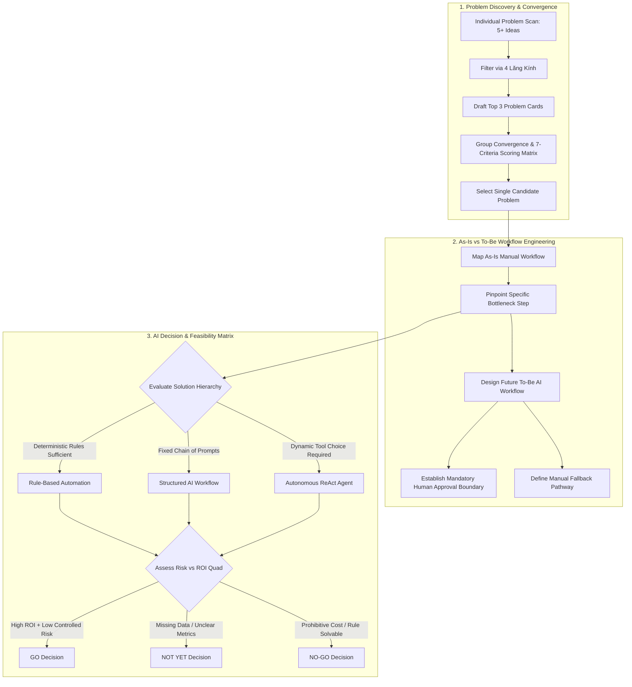
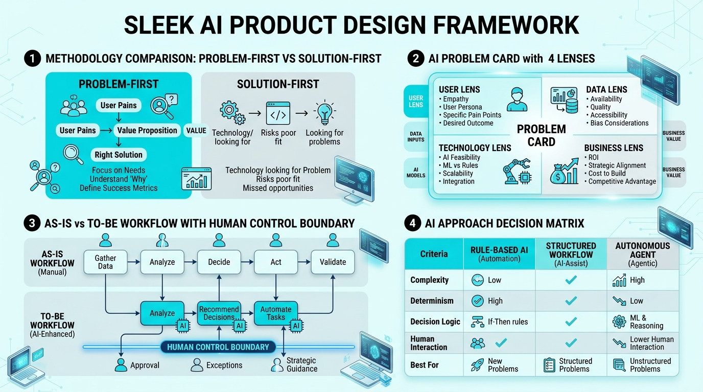

# K3 Day 02: AI Product Labs & Problem-First Framework

## 1. Executive Summary & Paradigm Shift

Day 02 of **K3 AI Engineering** transitions from technical API mechanics to AI product strategy and problem-first system design. A critical failure mode in enterprise AI adoption is **Solution-First Thinking**—starting with a trendy technology (e.g., "We must build a RAG chatbot") and retrofitting it onto vague user problems. 

Day 02 introduces the **Problem-First AI Design Paradigm**: starting with concrete human actors, existing operational friction, rigorous workflow mapping, explicit human control boundaries, and systematic evaluation of non-AI alternatives before committing to AI engineering.

---

## 2. Theoretical Foundations & Strategic Frameworks

### 2.1 Problem-First vs. Solution-First (AI-First) Paradigm

```
SOLUTION-FIRST (Anti-Pattern):
[Technology / Model] ──> [Look for Use Cases] ──> [Forced Integration] ──> [High Failure Risk]

PROBLEM-FIRST (Best Practice):
[Human Actor & Pain] ──> [As-Is Workflow Map] ──> [Bottleneck Identification] ──> [Evaluate Rules vs Workflow vs Agent]
```

#### The Hazards of Solution-First AI:
1. **Unnecessary Complexity**: Using LLMs to solve deterministic problems better handled by SQL queries or regex.
2. **Unbounded Operational Risk**: Exposing users to hallucination risks without defining human review checkpoints.
3. **Negative ROI**: High infrastructure and token costs yielding negligible latency or throughput gains.

---

### 2.2 4 Lăng Kính (4 Lenses) Problem Scanning Framework

To identify high-impact AI opportunities across operational workflows, problems are scanned through **4 Analytical Lenses**:

1. **Lặp lại (Repetitive)**: High-frequency routine tasks performed daily or weekly (e.g., copying status updates across systems, reformatting data).
2. **Tốn thời gian (Time-Consuming)**: Low-frequency but cognitive-heavy tasks that consume significant manual hours (e.g., summarizing multi-page compliance reports).
3. **AI có thể tốt hơn (AI-Augmented Potential)**: Tasks involving unstructured text, fuzzy intent interpretation, multi-source synthesis, or natural language extraction where classical software fails.
4. **Pain từ người khác (Stakeholder Friction)**: Downstream operational blockages, user complaints, delayed handoffs, or missed SLAs caused by manual bottlenecks.

---

### 2.3 Anatomy of a Structured Problem Card

A rigorous Problem Card decomposes a proposed initiative into 8 standardized components:

```
┌─────────────────────────────────────────────────────────────────────────────┐
│                            STRUCTURED PROBLEM CARD                          │
├─────────────────────────────────────────────────────────────────────────────┤
│ 1. 1-Sentence Problem Statement                                             │
│    "Target Actor X experiences Bottleneck Y during Activity Z, causing       │
│     Impact W."                                                              │
│                                                                             │
│ 2. Actor Definition & Context                                               │
│    Who is the primary operator? What is their background and workload?       │
│                                                                             │
│ 3. Current As-Is Workflow Steps                                             │
│    Detailed chronological step-by-step breakdown of manual process.         │
│                                                                             │
│ 4. Bottleneck Step Identification                                           │
│    The exact micro-step responsible for >50% of delay or cognitive load.    │
│                                                                             │
│ 5. Quantified Impact & Success Metrics                                      │
│    - Baseline Metric (Current state, e.g., 90 mins/report)                 │
│    - Target Metric (Desired state, e.g., 20 mins/report)                   │
│    - Measurement Method (How metrics will be logged and verified)           │
│                                                                             │
│ 6. Non-AI Alternative Baseline                                              │
│    Can standard scripts, SQL templates, or UI macros solve 80% of pain?     │
│                                                                             │
│ 7. AI Hypothesis & Solution Scope                                           │
│    Where specifically AI adds non-deterministic cognitive value.            │
│                                                                             │
│ 8. Initial Architecture Gut Check                                           │
│    Data availability, API feasibility, latency constraints, safety risks.   │
└─────────────────────────────────────────────────────────────────────────────┘
```

---

### 2.4 Workflow Framing: Human Control Boundaries & Fallbacks

Designing AI-augmented workflows (**To-Be Workflows**) requires defining explicit control interfaces:

- **Human Approval Boundary (Human-in-the-Loop / HITL)**: Mandatory review checkpoints where human operators inspect, edit, or sign off on AI outputs before downstream execution or external publishing.
- **Fallback Pathways**: Deterministic recovery routes when AI confidence is low, input data is malformed, or LLM invocation fails.

---

### 2.5 AI Suitability & Alternative Selection Framework

Before selecting an Autonomous Agent, product teams evaluate 4 levels of technical intervention:

```
Level 1: No-AI Baseline ──> Level 2: Rule Automation ──> Level 3: Structured Workflow ──> Level 4: Autonomous Agent
  (SQL / Standard UI)       (Regex / Scripts / IF-ELSE)    (Prompt Chain / LangChain)      (ReAct / Tool Routing)
```

| Technology Level | Operational Mechanism | Determinism | Failure Risk | Best Used For |
|---|---|---|---|---|
| **1. No-AI Baseline** | Manual process / simple UI templates | 100% | Zero model risk | Well-structured static tasks |
| **2. Rule Automation** | Scripts, SQL queries, RegEx rules | 100% | Zero model risk | Rigid data transformations & logic |
| **3. Structured Workflow** | Fixed multi-step LLM prompt chains | Medium-High | Low (Bounded) | Text generation, structured extraction |
| **4. Autonomous Agent** | Dynamic ReAct loops & tool routing | Variable | High (Unbounded) | Complex multi-step reasoning & tools |

> **Architectural Golden Rule**: Always choose the **simplest, lowest-level mechanism** that reliably meets the success metric. Do not deploy an Autonomous Agent when a Rule-Based script or Structured Prompt Chain is sufficient.

---

### 2.6 Decision Taxonomy: Go / Not Yet / No-Go

- **GO**: High feasibility, clear baseline metrics, verified ROI, manageable error risk, clear human approval boundary.
- **NOT YET**: Strong potential value, but blocked by missing training data, unverified API capabilities, or unclear failure tolerance.
- **NO-GO**: Problem can be solved cleanly with non-AI rules, error tolerance is zero (e.g. medical dosage calculations), or token costs exceed human manual labor cost.

---

## 3. End-to-End Problem & Solution Flowchart



---

## 4. Practical Lab Execution & Deliverable Case Study

### 4.1 4-Hour Lab Execution Schedule (Phase 0 - Phase 7)
- **Phase 0 (15')**: Review reference worked example (`02-deliverable-example.md`).
- **Phase 1 (25')**: Individual Problem Scan across 4 Lăng Kính (minimum 5 raw ideas scanned).
- **Phase 2 (35')**: Draft Top 3 Problem Cards with initial As-Is workflow steps.
- **Phase 3 (30')**: Group Convergence. Teams of 3–4 evaluate candidate cards against the 7-Criteria Scoring Matrix.
- **Phase 4 (30')**: Validation & Solution Research (mini user interviews & competitor analysis).
- **Phase 5 (45')**: As-Is / To-Be Workflow Mapping & Problem Statement refinement ($v0 \to v1$).
- **Phase 6 (25')**: Rule vs. Workflow vs. Agent Evaluation & Go / Not-Yet / No-Go Decision Matrix.
- **Phase 7 (15')**: Individual Reflection & Submission.

### 4.2 Group Scoring Matrix Criteria (7 Evaluation Vectors)
1. **Actor Clarity**: Is the primary human operator specifically identified? (1–5)
2. **Workflow Clarity**: Are As-Is steps cleanly mapped without vague leaps? (1–5)
3. **Evidence of Pain**: Is there concrete user friction or operational delay? (1–5)
4. **Measurable Impact**: Can baseline vs. target metrics be quantified? (1–5)
5. **Lab Feasibility**: Can a prototype be built within course bounds? (1–5)
6. **Comparability**: Can Rule vs. Workflow vs. Agent be clearly contrasted? (1–5)
7. **Domain Understanding**: Does the team possess subject matter knowledge? (1–5)

---

### 4.3 Deep Dive Deliverable Case Study: Weekly SaaS Report Aggregation

#### 1. Baseline Context
- **Actor**: Junior Product Manager (PM) in a mid-sized B2B SaaS company.
- **Task**: Synthesize weekly progress reports combining Jira sprint tickets, Google Sheets metrics, and Slack feedback for executive leadership.
- **Frequency**: Every Friday afternoon (Weekly).

#### 2. As-Is Workflow Breakdown (Total Time: 90 Minutes)
```
[Step 1: Export Jira] ──> [Step 2: Fetch Sheets] ──> [Step 3: Read Slack] ──> [Step 4: Copy to Docs] ──> [Step 5: Write Narrative] ──> [Step 6: Review] ──> [Step 7: Email]
     (10 mins)                 (10 mins)                 (15 mins)                (15 mins)               (25 mins BOTTLENECK)           (10 mins)           (5 mins)
```
- **Identified Bottleneck**: **Step 5 (Write Narrative)**. Synthesizing disparate qualitative notes into a cohesive 3-paragraph executive summary takes 25 minutes of intense manual effort and often causes delayed distributions.

#### 3. To-Be AI-Augmented Workflow (Total Time: 21 Minutes)
```
[Step 1: Auto Pull] ──> [Step 2: Structuring] ──> [Step 3: AI Narrative Draft] ──> [HUMAN BOUNDARY: PM Edit] ──> [Step 4: Auto Send]
     (2 mins)                (1 min)                     (1 min)                        (15 mins)                   (2 mins)
```

#### 4. Quantitative Impact & Success Metrics
- **Baseline Metric**: 90 minutes per weekly report.
- **Target Metric**: 21 minutes per weekly report (**76.6% reduction in manual effort**).
- **Measurement Method**: Time-tracking log over 4 consecutive weekly report cycles.

#### 5. AI Decision Evaluation Matrix
- **Rule-Based Option**: Insufficient. Rules cannot synthesize unstructured Slack text into coherent executive narrative paragraphs.
- **Autonomous Agent Option**: Over-engineered and high-risk. Giving an agent unmonitored email sending privileges introduces severe communication risk.
- **Selected Solution**: **Structured Workflow (Level 3)** with **Mandatory Human Approval Boundary**. AI drafts the narrative; human PM edits and approves before distribution.
- **Final Decision**: **GO**.

---

## 5. Visual Architecture & Swimlane Mockups

### 5.1 Generated Product Design Framework Image


### 5.2 Workflow Swimlane Comparison Mockup
```text
================================================================================
          AS-IS vs TO-BE WORKFLOW & HUMAN BOUNDARY SWIMLANE MOCKUP
================================================================================

[AS-IS MANUAL WORKFLOW] - Total Duration: 90 Mins
Jira/Sheets ──> Export Data (20m) ──> Copy to Docs (15m) ──> [BOTTLENECK: Write Draft (25m)] ──> Review & Format (25m) ──> Send (5m)

--------------------------------------------------------------------------------

[TO-BE AI-AUGMENTED WORKFLOW] - Total Duration: 21 Mins
Data Sources ──> [Auto Data Collector] ──> [Structured AI Prompt Chain] ──> [DRAFT GENERATED]
                                                                                  │
                                                                                  ▼
┌─────────────────────────────────────────────────────────────────────────────────┐
│                      MANDATORY HUMAN APPROVAL BOUNDARY                          │
│  Junior PM inspects draft, verifies metrics against source, edits wording (15m) │
└─────────────────────────────────────────────────────────────────────────────────┘
                                                                                  │
                                                                                  ▼
                                                                     [Approved Report Sent (2m)]
================================================================================
```

---

## 6. Related Notes & Knowledge Graph

- **Overview Index**: [[K3-Course-Overview|K3 Course Map of Content]]
- **Previous Day Module**: [[K3-Day01-LLM-API-Exploration|Day 01: LLM API Exploration & Foundation Patterns]]
- **Next Day Module**: [[K3-Day03-Chatbot-vs-ReAct-Agent|Day 03: Chatbot Baseline vs ReAct Agent]]
- **Core Product Concepts**:
  - [[K3-Day02-AI-Product-Labs|Problem-First Methodology]]
  - [[K3-Day02-AI-Product-Labs|4 Lăng Kính Problem Scanning]]
  - [[K3-Day02-AI-Product-Labs|As-Is and To-Be Workflows]]
  - [[K3-Day02-AI-Product-Labs|Human Approval Boundaries]]
  - [[K3-Day02-AI-Product-Labs|Rule vs Workflow vs Agent Framework]]
  - [[K3-Day02-AI-Product-Labs|Go Not-Yet No-Go Decision Criteria]]
