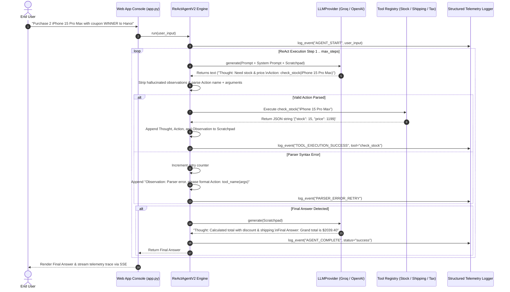
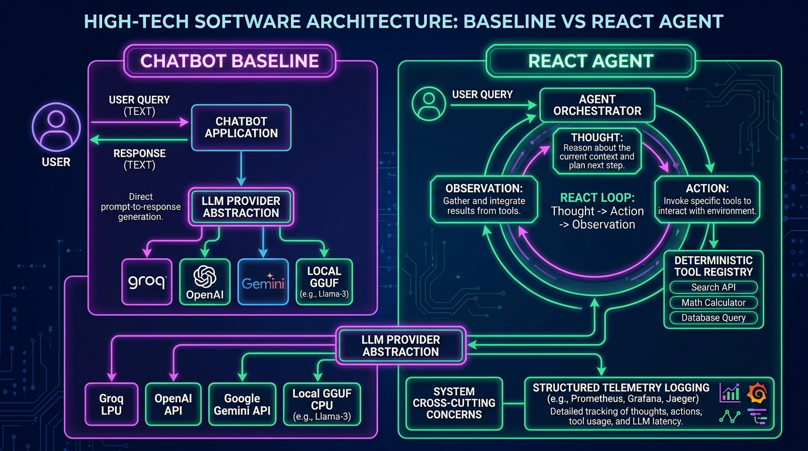

# K3 Day 03: Chatbot Baseline vs. ReAct Agent Architecture

## 1. Executive Summary & Overview

Day 03 of **K3 AI Engineering** marks the fundamental architectural transition from passive, single-turn LLM Chatbot Baselines to autonomous, multi-turn **ReAct (Reasoning + Acting)** Agent frameworks. While standard chatbots rely exclusively on parametric memory—leading to hallucinated real-time data, inventory errors, and inaccurate mathematical calculations—ReAct Agents combine explicit reasoning scratchpads with external tool invocation.

This module details the implementation of a vendor-agnostic **LLM Provider Abstraction Layer**, a deterministic **Tool Registry**, structured **JSON Telemetry Logging**, an empirical **Failure Mode Taxonomy**, and advanced **ReAct V2 Guardrails** (observation guarding, safe math pre-evaluation, and format self-correction).

---

## 2. Theoretical Foundations & Mathematical Formulations

### 2.1 Limitations of the Chatbot Baseline
A standard LLM Chatbot computes completions directly from prompt context and pre-trained weights:

$$y = f_{\theta}(x_{\text{prompt}})$$

#### Baseline Failure Modes in Dynamic Domains:
1. **Parametric Memory Stale Bounds**: Incapable of querying real-time databases (e.g., current product stock or live shipping rates).
2. **Arithmetic Hallucination**: Neural net token probabilities perform poorly on multi-digit multiplication, percentage discounts, or tax computations.
3. **Absence of Self-Correction**: If an initial assumption is wrong, the chatbot continues generating text based on the flawed context.

---

### 2.2 The ReAct (Reasoning + Acting) Loop Paradigm
Introduced by Yao et al. (2022), the ReAct framework interleaves explicit reasoning traces (**Thoughts**) with environment interactions (**Actions** and **Observations**):

$$\text{Thought}_t = f_{\theta}(\text{Context}, \text{History}_{<t})$$
$$\text{Action}_t = g(\text{Thought}_t) \implies \text{Tool}(a_t, \text{args}_t)$$
$$\text{Observation}_t = \text{Environment}(\text{Action}_t)$$

The execution loop repeats iteratively until the agent emits a special termination token or structured field: $\text{Final Answer}$.

```
                 ┌────────────────────────────────────────┐
                 │               USER QUERY               │
                 └───────────────────┬────────────────────┘
                                     │
                                     ▼
        ┌────────────────────────────────────────────────────────┐
   ┌───>│ THOUGHT: Analyze context & plan next logical step.     │
   │    └────────────────────────────┬───────────────────────────┘
   │                                 │
   │                                 ▼
   │    ┌────────────────────────────────────────────────────────┐
   │    │ ACTION: Invoke external tool: tool_name(parameters)    │
   │    └────────────────────────────┬───────────────────────────┘
   │                                 │
   │                                 ▼
   │    ┌────────────────────────────────────────────────────────┐
   │    │ OBSERVATION: Environment returns JSON result payload.  │
   │    └────────────────────────────┬───────────────────────────┘
   │                                 │
   └─────────────────────────────────┘ (Loop until task completion)
                                     │
                                     ▼
                 ┌────────────────────────────────────────┐
                 │  FINAL ANSWER: Render result to user.  │
                 └────────────────────────────────────────┘
```

---

### 2.3 LLM Provider Abstraction Layer
To prevent tight vendor lock-in to OpenAI or Groq SDKs, agent architectures wrap LLM calls in a polymorphic base class `LLMProvider`:

$$\text{Provider} \in \{ \text{OpenAIProvider}, \text{GroqProvider}, \text{GeminiProvider}, \text{LocalGGUFProvider} \}$$

This abstraction permits hot-swapping between high-speed cloud LPUs (e.g., Groq `llama-3.3-70b` running at >300 tokens/sec) and offline local CPU models (e.g., `Phi-3-mini-4k-instruct-q4.gguf` via `llama-cpp-python`).

---

### 2.4 Agent Failure Mode Taxonomy

During multi-turn execution, agents encounter 5 distinct failure categories:

```
┌─────────────────────────────────────────────────────────────────────────────┐
│                         AGENT FAILURE MODE TAXONOMY                         │
├─────────────────────────────────────────────────────────────────────────────┤
│ 1. Format / Parser Syntax Error                                             │
│    LLM generates invalid Action syntax (e.g., missing parentheses or quotes).  │
│                                                                             │
│ 2. Hallucinated Tool Error                                                  │
│    LLM attempts to invoke a non-existent tool function (e.g., search_google).│
│                                                                             │
│ 3. Argument Type / Expression Mismatch Error                                │
│    LLM passes unparsed string expressions into numeric function parameters. │
│                                                                             │
│ 4. Observation Hallucination                                                │
│    LLM fabricates fake Observation text in its response stream before       │
│    the real tool executes.                                                  │
│                                                                             │
│ 5. Step Limit Timeout                                                       │
│    ReAct loop reaches max_steps without converging on a Final Answer.       │
└─────────────────────────────────────────────────────────────────────────────┘
```

---

### 2.5 ReAct V2 Guardrails & Architectural Enhancements

To achieve 100% reliability on enterprise benchmarks, **ReAct Agent V2** implements 4 critical architectural guards:

1. **Observation Guarding**: Intercepts LLM text output streams and strips any hallucinated `Observation:` blocks generated prior to real tool execution.
2. **Safe Math Argument Pre-Evaluation**: Evaluates mathematical string expressions (e.g., converting `"2*0.5"` $\to$ `1.0`) via Python AST or RegEx before passing arguments to strictly typed tool functions.
3. **Format Self-Correction Feedback**: When a parser error occurs, the exact syntax error is injected back into the scratchpad history as an `Observation: Parser error: ...`, prompting the model to correct its output format in step $t+1$.
4. **Direct Knowledge Bypass Route**: Detects general non-tool queries (e.g. "What is Python?") and returns answers directly without spinning up unnecessary tool execution loops.

---

## 3. End-to-End ReAct Agent Execution Sequence



---

## 4. Code Patterns & Implementation Mechanics

### 4.1 Pluggable LLM Provider Base Class & Adapter
```python
from abc import ABC, abstractmethod
from typing import Dict, Any, Optional

class LLMProvider(ABC):
    """Abstract base class for all LLM providers."""
    
    @abstractmethod
    def generate(self, prompt: str, system_prompt: Optional[str] = None) -> Dict[str, Any]:
        """
        Executes text generation. Returns dict with 'content', 'tokens', and 'latency'.
        """
        pass

class GroqProvider(LLMProvider):
    """Fast Cloud LPU Provider using Groq SDK."""
    def __init__(self, model_name: str = "llama-3.3-70b-versatile"):
        import os
        from groq import Groq
        self.model_name = model_name
        self.client = Groq(api_key=os.getenv("GROQ_API_KEY"))

    def generate(self, prompt: str, system_prompt: Optional[str] = None) -> Dict[str, Any]:
        import time
        messages = []
        if system_prompt:
            messages.append({"role": "system", "content": system_prompt})
        messages.append({"role": "user", "content": prompt})

        start = time.time()
        response = self.client.chat.completions.create(
            model=self.model_name,
            messages=messages,
            temperature=0.1
        )
        latency = time.time() - start
        
        return {
            "content": response.choices[0].message.content or "",
            "tokens": response.usage.total_tokens if response.usage else 0,
            "latency": latency
        }
```

### 4.2 ReAct Agent V2 Core Reasoning Loop
```python
import re
import ast

class ReActAgentV2:
    def __init__(self, llm: LLMProvider, tool_registry: Dict[str, Any], max_steps: int = 5):
        self.llm = llm
        self.tools = tool_registry
        self.max_steps = max_steps
        self.scratchpad: list[str] = []

    def _sanitize_output(self, text: str) -> str:
        """Strip hallucinated Observation blocks generated by LLM."""
        return re.sub(r'Observation:.*$', '', text, flags=re.DOTALL | re.MULTILINE).strip()

    def _parse_action(self, text: str):
        """Extracts tool_name and raw arguments string."""
        match = re.search(r'Action:\s*([A-Za-z_]\w*)\((.*?)\)', text, re.DOTALL)
        if match:
            return match.group(1), match.group(2).strip()
        return None

    def _pre_eval_argument(self, arg_str: str) -> str:
        """Safely evaluates math expressions like '2*0.5' to '1.0'."""
        try:
            # Safely parse AST expressions without risk of code injection
            node = ast.parse(arg_str, mode='eval')
            if isinstance(node.body, (ast.BinOp, ast.UnaryOp, ast.Constant, ast.Num)):
                compiled = compile(node, '<string>', 'eval')
                return str(eval(compiled))
        except Exception:
            pass
        return arg_str

    def run(self, user_query: str) -> str:
        self.scratchpad = [f"Question: {user_query}"]
        
        for step in range(1, self.max_steps + 1):
            full_prompt = "\n".join(self.scratchpad)
            result = self.llm.generate(full_prompt, system_prompt=self.get_system_prompt())
            clean_output = self._sanitize_output(result["content"])

            # Check for Final Answer
            if "Final Answer:" in clean_output:
                final_text = clean_output.split("Final Answer:")[-1].strip()
                return final_text

            # Parse Action
            if action := self._parse_action(clean_output):
                tool_name, raw_args = action
                if tool_name in self.tools:
                    evaluated_args = self._pre_eval_argument(raw_args)
                    observation = self.tools[tool_name](evaluated_args)
                    self.scratchpad.extend([clean_output, f"Observation: {observation}"])
                else:
                    self.scratchpad.extend([clean_output, f"Observation: Tool '{tool_name}' not found."])
            else:
                self.scratchpad.extend([clean_output, "Observation: Format error: Action must be tool_name(args)."])

        return "Error: Maximum execution steps exceeded without reaching Final Answer."
```

---

### 4.3 Student Implementation Bug Case Studies (`REPORT_NguyenTuanAnh.md`)

During lab testing on the 6 e-commerce benchmark cases, student debugging highlighted two major regex and parsing bugs:

#### Bug 1: Argument Splitting Failure on Expression Strings
- **Problem**: Model produced `Action: calc_shipping(2*0.5, "Hanoi")`. V1 regex `re.findall(r'[\d.]+', raw_args)` split `2*0.5` into `["2", "0.5", "Hanoi"]`, raising `TypeError: calc_shipping() takes 2 positional arguments but 3 given`.
- **Fix**: Replaced raw string splitting with Python AST math pre-evaluation (`_pre_eval_argument`), simplifying `"2*0.5"` to `"1.0"` prior to function dispatch.

#### Bug 2: Empty Argument Tool Miss
- **Problem**: Model produced `Action: list_products()`. V1 regex `Action:\s*(\w+)\((.+?)\)` failed to match because `.+?` required at least 1 character inside parentheses.
- **Fix**: Updated regex to `Action:\s*([A-Za-z_]\w*)\((.*?)\)` using `*` (0 or more chars), enabling zero-argument tool calls.

---

## 5. Empirical Benchmark Results (Chatbot vs. ReAct V1 vs. ReAct V2)

### 5.1 Success Rate Metric Formula
$$\text{Success Rate (\%)} = \left( \frac{\text{Passed Benchmark Test Cases}}{\text{Total Test Cases}} \right) \times 100$$

### 5.2 Comparative Benchmark Performance (6 E-Commerce Test Cases)

| Test Case Scenario | Chatbot Baseline | ReAct Agent V1 | ReAct Agent V2 | Primary Failure Reason in Baseline/V1 |
|---|---|---|---|---|
| **1. Catalog Search** | PASS | PASS | PASS | Simple non-tool query |
| **2. Stock & Price Check** | **FAIL** | PASS | PASS | Chatbot hallucinated stock quantities |
| **3. Coupon Discount Calculation** | **FAIL** | PASS | PASS | Chatbot math hallucinated 15% discount |
| **4. Shipping Fee Location Lookup** | **FAIL** | PASS | PASS | Chatbot guessed static shipping fee |
| **5. Multi-item Tax & Total Bundle** | **FAIL** | **FAIL** (TypeError) | **PASS** | V1 failed on `2*0.5` parameter split |
| **6. Zero-arg Product List** | PASS | **FAIL** (Parse err) | **PASS** | V1 missed `list_products()` regex |
| **OVERALL SUCCESS RATE** | **50.0%** (3/6) | **83.3%** (5/6) | **100.0%** (6/6) | **V2 achieved 100% execution accuracy** |

---

## 6. System Visuals & Console Interface Mockup

### 6.1 Generated System Architecture Visual


### 6.2 Web Console SSE Streaming Trace Mockup
```text
================================================================================
            K3 DAY 03 REACT AGENT STREAMING CONSOLE (Flask + SSE)
================================================================================
[QUERY]: "Check stock for Laptop Pro and calculate express shipping to Da Nang."

[STEP 1]:
  Thought: I need to check the inventory status and price for Laptop Pro first.
  Action: check_stock("Laptop Pro")
  Observation: {"product": "Laptop Pro", "stock": 8, "price": 1299.00, "status": "AVAILABLE"}

[STEP 2]:
  Thought: Stock is available. Now I will calculate express shipping fee to Da Nang.
  Action: calc_shipping("Da Nang", "express")
  Observation: {"destination": "Da Nang", "method": "express", "fee": 15.00}

[STEP 3]:
  Thought: I have both stock status ($1299.00) and shipping fee ($15.00). Total is $1314.00.
  Final Answer: Laptop Pro is in stock (8 units available) at $1,299.00. Express shipping 
  to Da Nang is $15.00, making the total cost $1,314.00.

--------------------------------------------------------------------------------
[TELEMETRY TRACE LOG]:
- Provider: Groq (llama-3.3-70b) | Total Latency: 1.24s | TTFT: 180ms
- ReAct Loop Steps: 3 | Total Tokens: 642 | Tool Invocations: 2
================================================================================
```

---

## 7. Related Notes & Knowledge Graph

- **Overview Index**: [[K3-Course-Overview|K3 Course Map of Content]]
- **Previous Day Module**: [[K3-Day02-AI-Product-Labs|Day 02: AI Product Labs & Problem-First Framework]]
- **Next Day Module**: [[K3-Day04-Research-Agent-Tool-Eval|Day 04: Research Agent Tool Eval & Schema Engineering]]
- **Core Agentic Concepts**:
  - [[K3-Day03-Chatbot-vs-ReAct-Agent|ReAct Pattern]]
  - [[K3-Day03-Chatbot-vs-ReAct-Agent|Thought-Action-Observation Loop]]
  - [[K3-Day03-Chatbot-vs-ReAct-Agent|LLM Provider Abstraction]]
  - [[K3-Day03-Chatbot-vs-ReAct-Agent|Deterministic Tool Registry]]
  - [[K3-Day03-Chatbot-vs-ReAct-Agent|Agent Telemetry]]
  - [[K3-Day03-Chatbot-vs-ReAct-Agent|Agent Failure Taxonomy]]
  - [[K3-Day03-Chatbot-vs-ReAct-Agent|Tool Parameter Parsing]]
