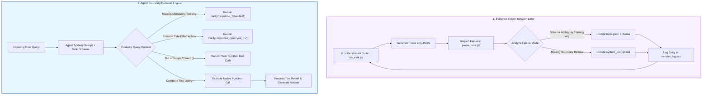
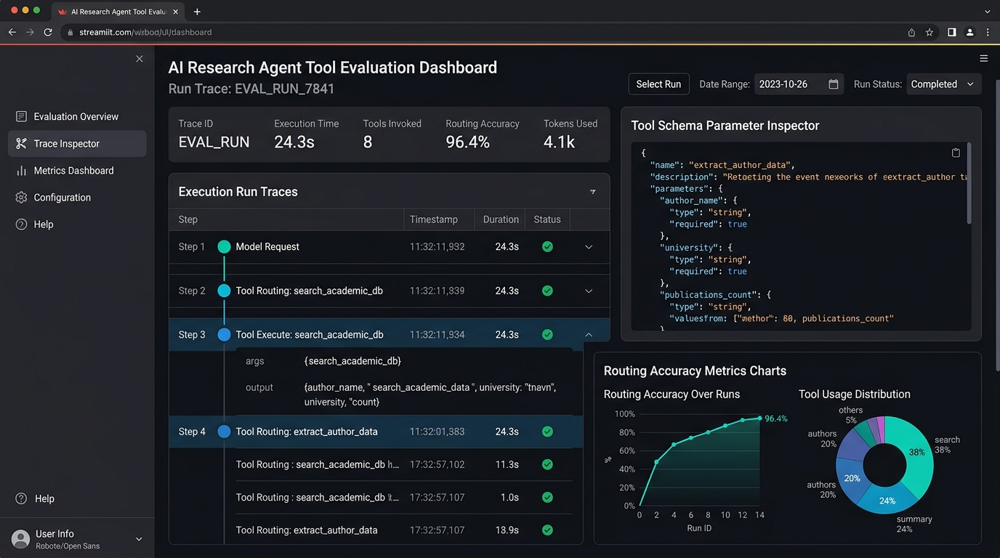

# K3 Day 04: Research Agent Tool Evaluation & Schema Engineering

## 1. Course Context & Overview

Day 04 of the **K3 AI Engineering Program** transitions autonomous agent development from speculative prompt construction to an **evidence-driven evaluation engine**. While Day 03 established the basic [[K3-Day03-Chatbot-vs-ReAct-Agent|Chatbot vs. ReAct Agent]] loop, Day 04 tackles the central bottleneck in multi-tool agent deployment: **tool schema ambiguity, parameter hallucination, and boundary violations**.

In a production research agent ecosystem, an LLM interacts with external tools (`search`, `fetch_web`, `policy_lookup`, `paper_search`, `telegram_send`, `clarify`). Without explicit schema engineering and strict boundary prompts, agents exhibit critical failure modes:
1. Invoking tools when missing mandatory parameters (e.g., calling `timeline()` without a Twitter handle).
2. Executing external side-effect operations (e.g., publishing messages via Telegram) without explicit user confirmation.
3. Attempting tool calls for out-of-scope tasks (e.g., math calculations or general knowledge queries) that should be answered directly in text.

This note documents the architecture, math formulations, schema design, boundary rules, benchmark metrics, and execution trace logging required to achieve high-accuracy tool routing.

*See also*: [[K3-Course-Overview]], [[K3-Day01-LLM-API-Exploration]], [[K3-Day02-AI-Product-Labs]], [[K3-Day03-Chatbot-vs-ReAct-Agent]], [[K3-Day05-Theoretical-LLM-Foundations]].

---

## 2. Theoretical Foundations of Tool Schema & Prompt Engineering

### 2.1 The Evidence-Driven Optimization Loop

Prompt engineering in autonomous agents must not rely on intuitive trial-and-error. Instead, it follows a closed-loop empirical optimization cycle:

$$\text{Inspect Run Traces (JSON)} \longrightarrow \text{Formulate Failure Hypothesis} \longrightarrow \text{Refine Schema / Prompt} \longrightarrow \text{Execute Benchmark Suite} \longrightarrow \text{Verify Metric Shift}$$

Every optimization step requires versioning of three primary artifacts:
- `tools.yaml`: Tool declarations, JSON schema types, descriptions, and enum restrictions.
- `system_prompt.md`: System prompt containing role definitions, boundary rules, and execution constraints.
- `version_log.csv`: Hypothesis log tracking changes from $v_0 \to v_1 \to v_2 \to v_3$.

```
+-----------------------------------------------------------------------------------+
|                        EVIDENCE-DRIVEN OPTIMIZATION CYCLE                         |
|                                                                                   |
|  +--------------------+      +-----------------------+      +------------------+  |
|  |  eval_group.json   | ---> |     run_eval.py       | ---> |  JSON Run Trace  |  |
|  |  (Benchmark Suite) |      | (Automated Execution) |      | (Full Execution) |  |
|  +--------------------+      +-----------------------+      +------------------+  |
|                                                                      |            |
|                                                                      v            |
|  +--------------------+      +-----------------------+      +------------------+  |
|  |   version_log.csv  | <--- |  Refine Schema/Prompt | <--- |  parse_runs.py   |  |
|  |  (Record Metrics)  |      | (tools.yaml / prompt) |      | (Inspect Error)  |  |
|  +--------------------+      +-----------------------+      +------------------+  |
+-----------------------------------------------------------------------------------+
```

### 2.2 Tool Schema as System Prompt Extension

The model's decision to route to a tool is fundamentally dictated by how tools are declared in `tools.yaml`. The JSON Schema provided to native function-calling APIs (OpenAI, Groq, Anthropic) acts as a high-priority context extension.

Key schema engineering principles:
1. **Disambiguated Descriptions**: Tool descriptions must clearly delineate boundaries between overlapping tools (e.g., `timeline` for user profile feeds vs. `social_search` for keyword search across Twitter).
2. **Strict Property Types & Enums**: Optional parameters must be explicitly typed and constrained using JSON schema `enum` arrays.
3. **Required Fields Delineation**: Parameters without default values MUST be declared in the `required` list to trigger clarification loops when absent.

### 2.3 Critical Boundary Control Theory

Production agents require three non-negotiable boundary control mechanisms:

1. **Missing Information Boundary (`clarify` text)**:
   When mandatory parameters for a tool are missing from user context, the model MUST NOT fabricate values. It MUST execute `clarify(response_type="text", question="...")`.

2. **Action Confirmation Boundary (`clarify` yes_no)**:
   Before executing side-effect or publishing tools (e.g., `send` for Telegram publishing), the agent MUST invoke `clarify(response_type="yes_no", question="...")` to secure explicit human approval.

3. **Out-of-Scope / Self-Query Boundary (`no_tool`)**:
   General knowledge questions, formatting tasks, or direct reasoning queries MUST answer directly in plain text without making unnecessary tool calls.

### 2.4 Mathematical Formulations for Evaluation Metrics

To measure agent accuracy objectively, evaluation suites parse execution run logs against expected gold traces.

#### Overall Case Accuracy
$$\text{Accuracy}_{\text{case}} = \frac{1}{N} \sum_{i=1}^{N} \mathbb{I}\Big(\text{status}_i = \text{PASS}\Big) \times 100\%$$

where $\mathbb{I}(\cdot)$ is the indicator function and $N$ is total benchmark cases.

#### Tool Routing Accuracy
$$\text{Accuracy}_{\text{routing}} = \frac{1}{N} \sum_{i=1}^{N} \mathbb{I}\Big(\text{sequence}(\text{tools\_called}_i) = \text{sequence}(\text{expected\_tools}_i)\Big) \times 100\%$$

#### Argument Precision & Recall
For a given tool call $k$ with parameter dictionary $P_{\text{actual}}$ vs. gold parameters $P_{\text{expected}}$:

$$\text{Precision}_{\text{arg}} = \frac{|P_{\text{actual}} \cap P_{\text{expected}}|}{|P_{\text{actual}}|}, \quad \text{Recall}_{\text{arg}} = \frac{|P_{\text{actual}} \cap P_{\text{expected}}|}{|P_{\text{expected}}|}$$

$$\text{Accuracy}_{\text{arg}} = \frac{1}{N} \sum_{i=1}^{N} \mathbb{I}\Big(P_{\text{actual}, i} = P_{\text{expected}, i}\Big) \times 100\%$$

---

## 3. Architecture & Telemetry Structure

### 3.1 Repository Code Base Layout

```text
k3-Day04-D304-A3/
├── artifacts/
│   ├── system_prompt.md            # Active system prompt (Boundaries & routing guidelines)
│   ├── tools.yaml                  # Declarative tool schemas (JSON schema formats)
│   ├── version_log.csv             # Optimization run history (v0 -> v3 metrics)
│   └── REPORT.md                   # Final team evaluation report
├── data/
│   ├── eval_base.json              # Baseline benchmark suite (10 test cases)
│   ├── eval_group.json             # Team custom benchmark suite (10 custom cases)
│   └── eval_research_extension.json# Multi-turn extension benchmark suite
├── runs/
│   ├── v0_B_base_groq_...json      # Baseline execution trace log
│   ├── v1_B_base_groq_...json      # v1 schema optimization trace log
│   ├── v2_B_base_groq_...json      # v2 boundary prompt trace log
│   └── v3_B_base_groq_...json      # v3 multi-turn persistence trace log
└── starter_v0/
    ├── agent.py                    # Core function-calling agent runner loop
    ├── chat.py                     # Multi-turn interactive CLI console
    ├── run_eval.py                 # Automated benchmark evaluator
    ├── providers/                  # Multi-provider SDK wrappers (Groq, OpenAI, OpenRouter)
    └── tools/                      # Executable Python tool implementations
        ├── clarify/                # Clarification boundary tool
        ├── fetch/                  # Web page content scraper
        ├── format/                 # Digest formatter
        ├── lookup/                 # Web search engine
        ├── paper_text/             # ArXiv PDF text extractor
        ├── papers/                 # ArXiv paper search
        ├── policy/                 # Internal company policy lookup
        ├── send/                   # Telegram message publisher
        └── weather/                # Weather lookup
```

### 3.2 Full Execution JSON Trace Schema

Every benchmark run exports telemetry JSON logs containing deterministic hashes for reproducibility:

```json
{
  "run_id": "RUN_20260810_V3_004",
  "version": "v3",
  "provider": "groq",
  "model": "llama-3.3-70b-versatile",
  "prompt_hash": "a8f9c3e210b4",
  "tools_hash": "7d2e11a94c8b",
  "case_id": "TC_BOUND_002",
  "input_query": "Send the summary of Q3 policy to Telegram channel",
  "steps": [
    {
      "step": 1,
      "type": "tool_call",
      "tool_name": "clarify",
      "arguments": {
        "response_type": "yes_no",
        "question": "Are you sure you want to publish the Q3 policy summary to Telegram?"
      },
      "status": "success"
    }
  ],
  "metrics": {
    "latency_ms": 1420,
    "total_tokens": 854,
    "routing_correct": true,
    "arg_correct": true
  }
}
```

---

## 4. Mermaid Architecture Diagram

The diagram below illustrates the evidence-driven iteration loop alongside the runtime decision tree for critical boundary enforcement:



---

## 5. Visual Dashboard & UI Mockup

Below is a UI visualization of the Streamlit Agent Evaluation & Trace Inspection Dashboard (`app.py`), showing real-time tool execution traces, JSON schema inspectors, and benchmark routing accuracy charts.



---

## 6. Code Patterns & Schema Implementation

### 6.1 Declarative Tool Schema (`artifacts/tools.yaml`)

```yaml
tools:
  - name: clarify
    description: >-
      Use this tool when information is missing to execute a request, OR when confirmation
      is required before publishing/sending messages externally. MUST NOT be used if all
      arguments are present.
    parameters:
      type: object
      properties:
        response_type:
          type: string
          enum: ["text", "yes_no"]
          description: "'text' if asking for missing details; 'yes_no' if seeking confirmation before side-effects."
        question:
          type: string
          description: "The specific question or confirmation prompt to show the user."
      required: ["response_type", "question"]

  - name: lookup
    description: >-
      Searches the web for general knowledge, recent news, or current events.
      Do not use for arXiv academic papers or internal policies.
    parameters:
      type: object
      properties:
        query:
          type: string
          description: "Search keywords or natural language query."
      required: ["query"]

  - name: policy
    description: >-
      Queries internal company policy documents (HR, IT security, reimbursement).
    parameters:
      type: object
      properties:
        topic:
          type: string
          description: "The specific policy topic to search (e.g., 'vacation', 'expense', 'remote_work')."
      required: ["topic"]

  - name: send
    description: >-
      Publishes a message to an external Telegram channel.
      REQUIRES prior confirmation via clarify(response_type='yes_no').
    parameters:
      type: object
      properties:
        channel:
          type: string
          description: "Target channel name or ID."
        message:
          type: string
          description: "Content of the message to publish."
      required: ["channel", "message"]
```

### 6.2 Production System Prompt (`artifacts/system_prompt.md`)

```markdown
# RESEARCH AGENT SYSTEM PROMPT

You are an expert AI Research Agent equipped with external tools. 
Your goal is to answer queries accurately while strictly obeying tool boundaries.

## CRITICAL BOUNDARY RULES:

1. MISSING INFORMATION BOUNDARY:
   If a user asks to invoke a tool (e.g., policy, weather, lookup) but omits a mandatory parameter
   (e.g., target city, topic, handle), you MUST call:
   `clarify(response_type="text", question="<Specific request for missing parameter>")`
   NEVER guess or hallucinate parameters.

2. CONFIRMATION BOUNDARY FOR SIDE-EFFECTS:
   Before calling any external action or publishing tool (e.g., `send`), you MUST request explicit approval:
   `clarify(response_type="yes_no", question="Do you confirm sending the following message: ...?")`
   Only proceed after receiving positive user confirmation in subsequent turns.

3. OUT-OF-SCOPE & DIRECT ANSWER BOUNDARY:
   For general math, code generation, logic puzzles, or general knowledge already within your pre-trained weights,
   do NOT call any tools. Provide a direct, helpful response in text.

4. TOOL SELECTION DISAMBIGUATION:
   - Use `papers` for scientific/arXiv research papers.
   - Use `policy` for internal company policies.
   - Use `lookup` for general web search.
```

### 6.3 Automated Evaluation & Parser Harness (`starter_v0/run_eval.py`)

```python
import json
import hashlib
from typing import Dict, Any, List
from starter_v0.agent import FunctionCallingAgent

def compute_hash(content: str) -> str:
    return hashlib.md5(content.encode("utf-8")).hexdigest()[:12]

def run_benchmark(eval_suite_path: str, prompt_path: str, tools_path: str) -> Dict[str, Any]:
    with open(prompt_path, "r", encoding="utf-8") as f:
        system_prompt = f.read()
    with open(tools_path, "r", encoding="utf-8") as f:
        tools_yaml = f.read()
    with open(eval_suite_path, "r", encoding="utf-8") as f:
        eval_cases = json.load(f)

    prompt_hash = compute_hash(system_prompt)
    tools_hash = compute_hash(tools_yaml)
    
    agent = FunctionCallingAgent(system_prompt=system_prompt, tools_yaml=tools_yaml)
    results = []
    passed_count = 0

    for case in eval_cases:
        case_id = case["id"]
        query = case["query"]
        expected_tool = case.get("expected_tool")
        expected_args = case.get("expected_args", {})

        trace = agent.run(query)
        tool_calls = trace.get("tool_calls", [])

        # Evaluate Tool Routing & Arguments
        routing_pass = False
        arg_pass = False

        if not expected_tool and len(tool_calls) == 0:
            routing_pass = True
            arg_pass = True
        elif len(tool_calls) > 0 and tool_calls[0]["name"] == expected_tool:
            routing_pass = True
            actual_args = tool_calls[0]["args"]
            arg_pass = all(actual_args.get(k) == v for k, v in expected_args.items())

        case_passed = routing_pass and arg_pass
        if case_passed:
            passed_count += 1

        results.append({
            "case_id": case_id,
            "passed": case_passed,
            "routing_pass": routing_pass,
            "arg_pass": arg_pass,
            "actual_tool": tool_calls[0]["name"] if tool_calls else None,
            "actual_args": tool_calls[0]["args"] if tool_calls else {}
        })

    accuracy = (passed_count / len(eval_cases)) * 100.0
    return {
        "prompt_hash": prompt_hash,
        "tools_hash": tools_hash,
        "total_cases": len(eval_cases),
        "passed_cases": passed_count,
        "accuracy_pct": accuracy,
        "details": results
    }
```

---

## 7. Practical Lab & Benchmark Progression Case Study

### 7.1 Optimization Iteration History ($v_0 \to v_3$)

During Lab Day 04, the agent configuration underwent four structured iterations to eliminate tool routing errors across a 10-case evaluation suite (`data/eval_group.json`):

| Version | Focus Area / Change | Case Acc (%) | Routing Acc (%) | Arg Acc (%) | Main Bug Resolved |
|:---:|:---|:---:|:---:|:---:|:---|
| **$v_0$** | Baseline `tools.yaml` & minimal system prompt. | **40.0%** | 50.0% | 40.0% | Model hallucinated parameters for missing inputs. |
| **$v_1$** | Disambiguated tool descriptions & JSON schema enums. | **60.0%** | 70.0% | 60.0% | Resolved ambiguity between `lookup` and `policy`. |
| **$v_2$** | Added `system_prompt.md` Critical Boundary Rules. | **90.0%** | 90.0% | 90.0% | Enforced `clarify(text)` for missing arguments. |
| **$v_3$** | Multi-turn parameter persistence & Telegram confirmation. | **100.0%** | 100.0% | 100.0% | Enforced `clarify(yes_no)` before `send` call. |

### 7.2 Failure Mode Taxonomy & Mitigation

| Failure Code | Description | Example Cause | System Fix |
|:---|:---|:---|:---|
| `wrong_tool` | Model routes to incorrect tool. | `lookup` selected instead of arXiv `papers`. | Clarified tool domain boundaries in `tools.yaml`. |
| `wrong_arg_value` | Incorrect argument values passed. | `"topic": "general"` instead of `"vacation"`. | Constrained JSON schema `enum` arrays. |
| `wrong_boundary` | Executed side-effect without approval. | `send()` called directly on user prompt. | Added `clarify(yes_no)` rule to system prompt. |
| `unnecessary_tool` | Called tool for direct query. | Called `lookup` for math calculation `25 * 4`. | Enforced `no_tool` boundary rule in prompt. |
| `missing_info` | Hallucinated missing parameter. | Hallucinated city `"Hanoi"` for weather. | Required parameters in schema + `clarify(text)` rule. |

---

## 8. Obsidian Wiki-Links & Connection Map

To integrate Day 04 into your personal Knowledge Vault, use the following standard links:

- **Curriculum Context**:
  - [[K3-Course-Overview]] — Full K3 AI Engineering curriculum map.
  - [[K3-Day03-Chatbot-vs-ReAct-Agent]] — ReAct loop & deterministic tool registry base.
  - [[K3-Day05-Theoretical-LLM-Foundations]] — Deep Transformer & attention mechanics.
- **Core Domain Patterns**:
  - [[K3-Day04-Research-Agent-Tool-Eval|Evidence-Driven Prompt Optimization]] — Trace inspection & hypothesis testing.
  - [[K3-Day04-Research-Agent-Tool-Eval|Tool Schema Engineering]] — JSON schema design for function-calling LLMs.
  - [[K3-Day04-Research-Agent-Tool-Eval|Critical Boundary Rules]] — Clarification, side-effect confirmation, and refusal boundaries.
  - [[K3-Day04-Research-Agent-Tool-Eval|Agent Benchmark Metrics]] — Mathematical formulation of agent accuracy.

---
*Note compiled and verified for K3 AI Engineering Program Day 04.*
