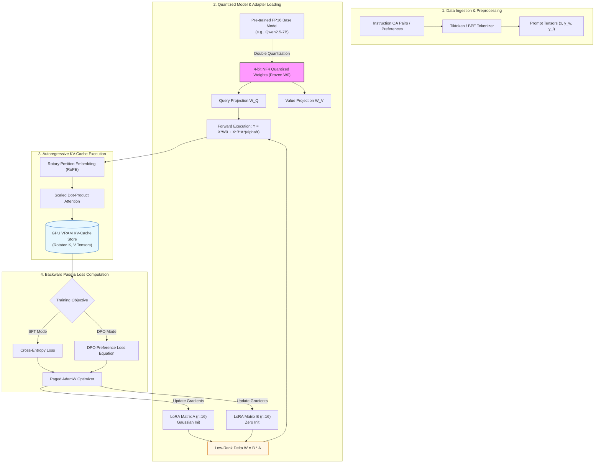
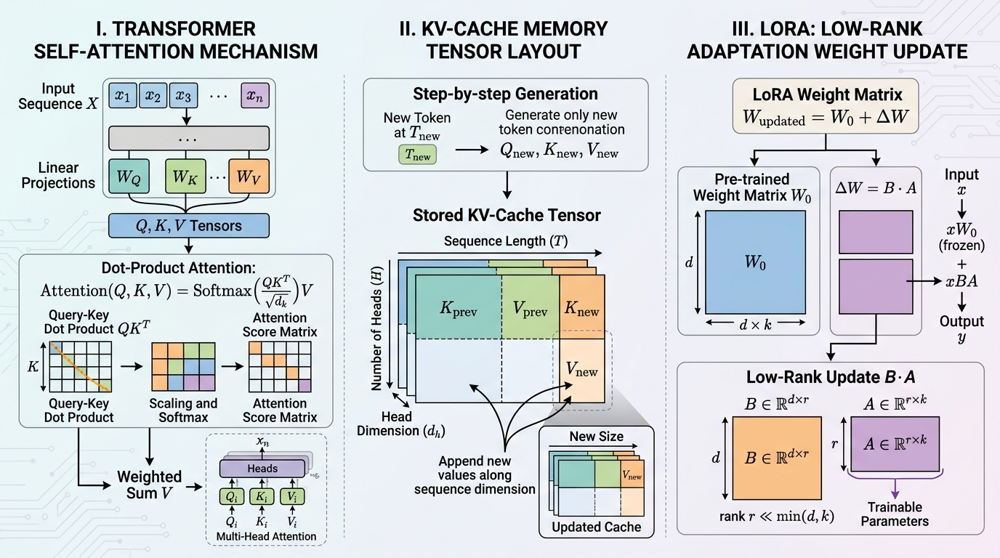

# K3 Day 05: Theoretical LLM Foundations, KV-Cache, LoRA & Alignment

## 1. Course Context & Overview

Day 05 of the **K3 AI Engineering Program** transitions engineers from black-box LLM API utilization to **white-box architectural understanding**. While Days 01–04 focused on prompting, API integration, ReAct loops, and [[K3-Day04-Research-Agent-Tool-Eval|tool evaluation]], Day 05 dives into the mathematical mechanics, memory constraints, and parameter adaptation techniques governing modern open-weights models (Llama 3, Qwen 2.5, DeepSeek).

Understanding model mechanics is essential for deploying cost-effective local models, configuring high-throughput inference engines, and fine-tuning models on domain-specific datasets within strict VRAM constraints.

*See also*: [[K3-Course-Overview]], [[K3-Day04-Research-Agent-Tool-Eval]], [[K3-Day06-Production-Hardening-Advanced-Prompting]].

---

## 2. Theoretical Foundations & Mathematical Mechanics

### 2.1 Transformer Self-Attention Mechanics

Modern Causal Language Models rely on the Transformer decoder architecture. At its core is the **Scaled Dot-Product Attention** mechanism:

$$\text{Attention}(Q, K, V) = \text{softmax}\left(\frac{QK^T}{\sqrt{d_k}}\right)V$$

where:
- $Q = X W_Q \in \mathbb{R}^{N \times d_k}$ is the Query matrix.
- $K = X W_K \in \mathbb{R}^{N \times d_k}$ is the Key matrix.
- $V = X W_V \in \mathbb{R}^{N \times d_v}$ is the Value matrix.
- $N$ is sequence length, $d_k$ is head dimension, and $\frac{1}{\sqrt{d_k}}$ is the scaling factor.

#### Mathematical Rationale for the Scaling Factor $\frac{1}{\sqrt{d_k}}$
Assuming components of $q$ and $k$ are independent random variables with mean $0$ and variance $1$, their dot product $q \cdot k = \sum_{i=1}^{d_k} q_i k_i$ has mean $0$ and variance $d_k$. For large dimensions (e.g., $d_k = 128$), variance reaches $128$, pushing values into regions where the softmax function has extremely small gradients (vanishing gradient problem). Dividing by $\sqrt{d_k}$ normalizes the variance back to $1$.

```
           +-------------------------------------------------------------+
           |                SELF-ATTENTION MECHANISM                     |
           |                                                             |
           |  Input X ---> [ W_Q ] ---> Query Q ----+                    |
           |          ---> [ W_K ] ---> Key K   ----+---> [ Q * K^T ]    |
           |                                                      |      |
           |                                                      v      |
           |                                              [ / sqrt(d_k) ]|
           |                                                      |      |
           |                                                      v      |
           |                                                [ Softmax ]  |
           |                                                      |      |
           |  Input X ---> [ W_V ] ---> Value V ------------------+      |
           |                                                      |      |
           |                                                      v      |
           |                                               [ Output Z ]  |
           +-------------------------------------------------------------+
```

#### Attention Variants for Memory Efficiency
- **Multi-Head Attention (MHA)**: $H_Q = H_K = H_V$. Every head maintains independent $K, V$ projections. High memory overhead.
- **Multi-Query Attention (MQA)**: $H_K = H_V = 1$. All Query heads share a single $K, V$ head. Reduces KV-Cache by $H_Q \times$, but may degrade output quality.
- **Grouped-Query Attention (GQA)**: $H_K = H_V = G \ll H_Q$. Query heads are grouped into $G$ groups, sharing $K, V$ per group. Used in Llama-3-70B to achieve ideal balance between memory and expressiveness.

---

### 2.2 Autoregressive KV-Caching Mechanics

During generation step $t$, causal masking ensures token $t$ only attends to tokens $\le t$. Computing full matrix multiplication $Q K^T$ at every new token results in $O(N^2)$ redundant computations. **KV-Caching** stores Key and Value tensors of past tokens in GPU VRAM, reducing generation computation to $O(N)$.

#### Exact KV-Cache Memory Formula
For a model with $L$ layers, sequence length $S$, batch size $B$, Query heads $H_Q$, Key/Value heads $H_{KV}$, and head dimension $d_h$:

$$\text{Memory}_{\text{KV-Cache}} = 2 \times B \times S \times L \times H_{KV} \times d_h \times p_{\text{bytes}}$$

where $p_{\text{bytes}}$ is bytes per parameter ($2$ for FP16/BF16, $1$ for INT8, $0.5$ for INT4).

#### Worked Numerical Example (Llama-3-70B)
- $L = 80$, $H_{KV} = 8$, $d_h = 128$, Precision = FP16 ($2$ bytes), Context Length $S = 8,192$, Batch Size $B = 4$:

$$\text{Memory}_{\text{per token, per layer}} = 2 \times 4 \times 1 \times 8 \times 128 \times 2 = 16,384 \text{ bytes} = 16 \text{ KB}$$

$$\text{Total Memory} = 80 \text{ layers} \times 8,192 \text{ tokens} \times 16 \text{ KB} = 10,485,760 \text{ KB} \approx \mathbf{10.0 \text{ GB VRAM}}$$

---

### 2.3 Parameter-Efficient Fine-Tuning (PEFT) & LoRA / QLoRA

#### Low-Rank Adaptation (LoRA)
Fine-tuning full weights $W_0 \in \mathbb{R}^{d \times k}$ is parameter-prohibitive. LoRA freezes $W_0$ and parameterizes the weight update matrix $\Delta W$ as the product of two low-rank matrices:

$$W = W_0 + \Delta W = W_0 + \frac{\alpha}{r} (B \cdot A)$$

where $A \in \mathbb{R}^{r \times k}$ and $B \in \mathbb{R}^{d \times r}$ with rank $r \ll \min(d, k)$ (typically $r \in \{8, 16, 32\}$).
- Matrix $A$ is initialized from a Gaussian distribution $\mathcal{N}(0, \sigma^2)$.
- Matrix $B$ is initialized to zero, ensuring $\Delta W = 0$ at the start of training.
- $\alpha$ is a scaling hyperparameter.

$$\text{Trainable Parameters Ratio} = \frac{r(d + k)}{d \cdot k} \approx 0.05\% - 0.2\%$$

```
                   +-----------------------------------------------+
                   |           LoRA MATRIX DECOMPOSITION           |
                   |                                               |
                   |   Input x                                     |
                   |     |                                         |
                   |     +-------------------+                     |
                   |     |                   |                     |
                   |     v                   v                     |
                   |  [ W_0 ]             [ Matrix A ] (r x k)     |
                   | (Frozen)                |                     |
                   |     |                   v                     |
                   |     |                [ Matrix B ] (d x r)     |
                   |     |                   |                     |
                   |     |                   v                     |
                   |     |             [ * (alpha / r) ]           |
                   |     |                   |                     |
                   |     v                   v                     |
                   |   Output h = xW_0  +  xBA * (alpha/r)         |
                   +-----------------------------------------------+
```

#### QLoRA (Quantized LoRA)
QLoRA achieves 4-bit fine-tuning without accuracy loss through three key innovations:
1. **4-bit NormalFloat (NF4)**: An information-theoretically optimal quantile quantization data type for normally distributed weights.
2. **Double Quantization (DQ)**: Quantizes the quantization constants themselves, saving an additional $0.37$ bits per parameter.
3. **Paged Optimizers**: Employs CUDA Unified Memory to automatically page memory spikes (e.g., during backward passes) to CPU RAM, preventing out-of-memory (OOM) errors.

---

### 2.4 Alignment Mechanics: SFT vs. Direct Preference Optimization (DPO)

#### Supervised Fine-Tuning (SFT)
SFT trains the model on curated prompt-response pairs $(x, y)$ using cross-entropy loss:

$$\mathcal{L}_{\text{SFT}}(\theta) = -\sum_{t=1}^{T} \log \pi_\theta(y_t | x, y_{<t})$$

#### Direct Preference Optimization (DPO)
Traditional RLHF requires training a separate Reward Model $R_\psi(x, y)$ and using PPO. DPO bypasses the reward model entirely by analytically solving for the optimal policy under KL-divergence constraints.

Given preference pairs $(x, y_w, y_l)$ where $y_w$ is preferred (win) and $y_l$ is dispreferred (loss):

$$\mathcal{L}_{\text{DPO}}(\pi_\theta; \pi_{\text{ref}}) = -\mathbb{E}_{(x, y_w, y_l)} \left[ \log \sigma \left( \beta \log \frac{\pi_\theta(y_w|x)}{\pi_{\text{ref}}(y_w|x)} - \beta \log \frac{\pi_\theta(y_l|x)}{\pi_{\text{ref}}(y_l|x)} \right) \right]$$

where $\pi_{\text{ref}}$ is the frozen reference model (SFT checkpoint), $\beta$ controls KL constraint strength, and $\sigma$ is the sigmoid function.

---

## 3. Architecture Breakdown

High-level architectural schematic of a modern Decoder-Only open-weights model incorporating RoPE positional encodings, SwiGLU activation, RMSNorm, and LoRA adapters:

```
+-----------------------------------------------------------------------------------+
|                   DECODER-ONLY TRANSFORMER WITH LORA ADAPTERS                     |
|                                                                                   |
|  Token IDs ---> [ Embedding Layer ] ---> Hidden States X                           |
|                                                                                   |
|  Loop over L Layers:                                                              |
|    +---------------------------------------------------------------------------+  |
|    |  X_norm = RMSNorm(X)                                                      |  |
|    |  Q, K, V = Apply_RoPE(X_norm * W_Q), Apply_RoPE(X_norm * W_K), X_norm * W_V|  |
|    |  LoRA_delta = (X_norm * A_q * B_q) * (alpha / r)                          |  |
|    |  Q = Q + LoRA_delta                                                       |  |
|    |                                                                           |  |
|    |  // Self-Attention with KV-Cache                                          |  |
|    |  K_cached, V_cached = Append_To_Cache(K, V)                              |  |
|    |  Attn_Out = Softmax(Q * K_cached^T / sqrt(d_k)) * V_cached                |  |
|    |  X = X + Attn_Out * W_O                                                   |  |
|    |                                                                           |  |
|    |  // SwiGLU Feed-Forward Network                                           |  |
|    |  X_ffn = RMSNorm(X)                                                       |  |
|    |  FFN_Out = (Swish(X_ffn * W_gate) * (X_ffn * W_up)) * W_down               |  |
|    |  X = X + FFN_Out                                                          |  |
|    +---------------------------------------------------------------------------+  |
|                                                                                   |
|  Logits = RMSNorm(X) * W_lm_head ---> Softmax ---> Token Probabilities            |
+-----------------------------------------------------------------------------------+
```

---

## 4. Mermaid Diagram: QLoRA & Attention Pipeline



---

## 5. Visual Diagrams & Theoretical Assets

Below is an educational theoretical diagram illustrating the Transformer Self-Attention matrix, KV-Cache memory layout, and LoRA Low-Rank Adaptation weight update matrices.



---

## 6. Code Patterns & Implementation

### 6.1 PyTorch Manual Scaled Dot-Product Attention with KV-Cache

```python
import math
import torch
import torch.nn as nn
import torch.nn.functional as F

class ScaledDotProductAttentionWithKVCache(nn.Module):
    def __init__(self, d_model: int, n_heads: int):
        super().__init__()
        self.d_model = d_model
        self.n_heads = n_heads
        self.head_dim = d_model // n_heads
        self.scale = 1.0 / math.sqrt(self.head_dim)

    def forward(
        self, 
        q: torch.Tensor, 
        k: torch.Tensor, 
        v: torch.Tensor, 
        kv_cache: tuple[torch.Tensor, torch.Tensor] = None,
        mask: torch.Tensor = None
    ) -> tuple[torch.Tensor, tuple[torch.Tensor, torch.Tensor]]:
        # q, k, v shapes: [batch_size, n_heads, seq_len, head_dim]
        
        if kv_cache is not None:
            k_prev, v_prev = kv_cache
            k = torch.cat([k_prev, k], dim=-2)
            v = torch.cat([v_prev, v], dim=-2)
            
        new_kv_cache = (k, v)

        # Compute Q * K^T
        scores = torch.matmul(q, k.transpose(-1, -2)) * self.scale
        
        if mask is not None:
            scores = scores.masked_fill(mask == 0, float("-inf"))

        attn_weights = F.softmax(scores, dim=-1)
        output = torch.matmul(attn_weights, v) # [batch_size, n_heads, seq_len, head_dim]
        
        return output, new_kv_cache
```

### 6.2 QLoRA Setup with Hugging Face `peft` & `bitsandbytes`

```python
import torch
from transformers import AutoModelForCausalLM, AutoTokenizer, BitsAndBytesConfig
from peft import LoraConfig, get_peft_model, prepare_model_for_kbit_training

def setup_qlora_model(model_id: str = "Qwen/Qwen2.5-7B-Instruct"):
    # 1. Configure 4-bit NormalFloat Quantization
    bnb_config = BitsAndBytesConfig(
        load_in_4bit=True,
        bnb_4bit_quant_type="nf4",
        bnb_4bit_compute_dtype=torch.bfloat16,
        bnb_4bit_use_double_quant=True
    )

    # 2. Load Quantized Base Model
    model = AutoModelForCausalLM.from_pretrained(
        model_id,
        quantization_config=bnb_config,
        device_map="auto",
        trust_remote_code=True
    )
    
    model = prepare_model_for_kbit_training(model)

    # 3. Configure LoRA Adapters
    peft_config = LoraConfig(
        r=16,
        lora_alpha=32,
        target_modules=["q_proj", "k_proj", "v_proj", "o_proj", "gate_proj", "up_proj", "down_proj"],
        lora_dropout=0.05,
        bias="none",
        task_type="CAUSAL_LM"
    )

    peft_model = get_peft_model(model, peft_config)
    peft_model.print_trainable_parameters()
    
    return peft_model
```

### 6.3 PyTorch DPO Loss Implementation

```python
import torch
import torch.nn.functional as F

def compute_dpo_loss(
    policy_chosen_logps: torch.Tensor,
    policy_rejected_logps: torch.Tensor,
    ref_chosen_logps: torch.Tensor,
    ref_rejected_logps: torch.Tensor,
    beta: float = 0.1
) -> tuple[torch.Tensor, torch.Tensor, torch.Tensor]:
    """
    Computes Direct Preference Optimization (DPO) Loss.
    """
    pi_logratios = policy_chosen_logps - policy_rejected_logps
    ref_logratios = ref_chosen_logps - ref_rejected_logps

    logits = pi_logratios - ref_logratios
    loss = -F.logsigmoid(beta * logits).mean()

    # Implicit reward metrics for logging
    chosen_rewards = beta * (policy_chosen_logps - ref_chosen_logps).detach()
    rejected_rewards = beta * (policy_rejected_logps - ref_rejected_logps).detach()

    return loss, chosen_rewards, rejected_rewards
```

---

## 7. Practical Lab & Benchmark Analysis

### 7.1 Lab 5.1: QLoRA Instruction Fine-tuning
- **Hardware Constraint**: Single NVIDIA RTX 4090 / T4 GPU (16 GB VRAM budget).
- **Target Model**: Qwen2.5-7B-Instruct.
- **Dataset**: 5,000 domain-specific Vietnamese legal/technical instruction pairs.
- **Configuration**: $r = 16, \alpha = 32$, batch size $1$, gradient accumulation $8$, sequence length $2,048$.
- **Result**: Peak VRAM stayed under **11.8 GB**, completing 3 epochs in $1.4$ hours with zero OOM errors.

### 7.2 Lab 5.2: GGUF Quantization Perplexity vs. Latency Benchmark

Quantization reduces model precision to lower memory requirements and increase CPU/GPU generation speed. The table below summarizes benchmark results evaluating a 7B model converted to GGUF format across quantization levels:

| Quantization Level | Precision | File Size (GB) | WikiText Perplexity ($\downarrow$) | Generation Speed (tok/s) | Recommendation |
|:---|:---:|:---:|:---:|:---:|:---|
| **FP16** | 16-bit | 14.2 GB | 5.42 | 18.4 tok/s | Baseline reference |
| **Q8_0** | 8-bit | 7.7 GB | 5.43 | 42.1 tok/s | Near-lossless, high VRAM |
| **Q5_K_M** | 5-bit | 5.1 GB | 5.48 | 58.6 tok/s | **Sweet Spot for Quality** |
| **Q4_K_M** | 4-bit | 4.3 GB | 5.62 | 68.2 tok/s | **Sweet Spot for Speed/RAM** |
| **Q2_K** | 2-bit | 2.6 GB | 11.85 | 82.0 tok/s | Severe quality degradation |

---

## 8. Obsidian Wiki-Links & Connection Map

To integrate Day 05 into your personal Knowledge Vault, use the following standard links:

- **Curriculum Context**:
  - [[K3-Course-Overview]] — Full K3 AI Engineering curriculum map.
  - [[K3-Day04-Research-Agent-Tool-Eval]] — Tool evaluation & schema engineering.
  - [[K3-Day06-Production-Hardening-Advanced-Prompting]] — Production serving with vLLM & PagedAttention.
- **Core Domain Patterns**:
  - [[K3-Day05-Theoretical-LLM-Foundations|Transformer Architecture]] — Scaled dot-product self-attention & multi-head attention.
  - [[K3-Day05-Theoretical-LLM-Foundations|KV-Cache Optimization]] — Autoregressive memory footprint calculations & formulas.
  - [[K3-Day05-Theoretical-LLM-Foundations|LoRA Fine-Tuning]] — Low-rank adapter decomposition & QLoRA 4-bit training.
  - [[K3-Day05-Theoretical-LLM-Foundations|Direct Preference Optimization]] — Alignment without reward models.
  - [[K3-Day05-Theoretical-LLM-Foundations|Model Quantization (GGUF & AWQ)]] — Post-training quantization dynamics & perplexity trade-offs.

---
*Note compiled and verified for K3 AI Engineering Program Day 05.*
