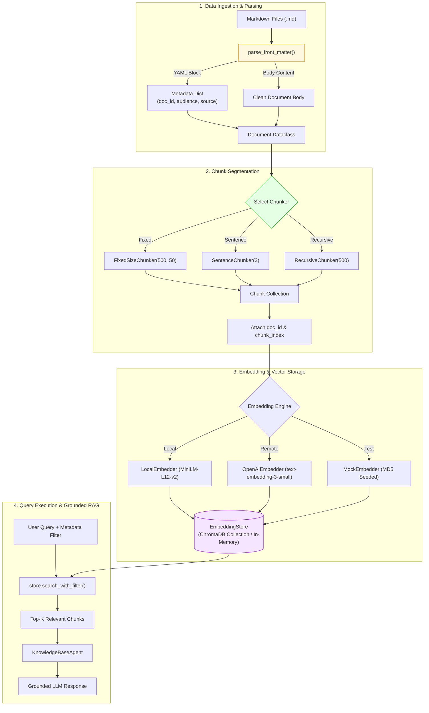
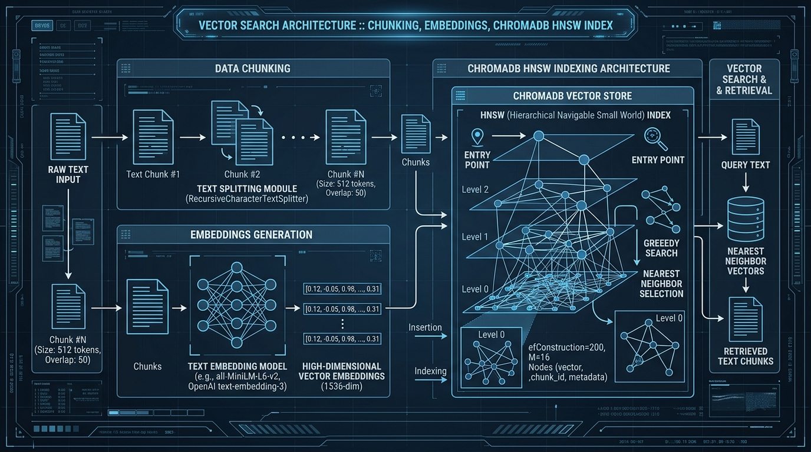

# K3 Day 07: Data Foundations, Embeddings & Vector Stores

## Executive Summary & Module Overview

Day 07 establishes the foundational engineering principles for context preparation in Retrieval-Augmented Generation (RAG) and intelligent agent systems. Transitioning from unstructured text files to dense vector indexing requires high-precision document parsing, chunking boundary selection, vector embedding representations, and metadata-aware vector databases.

This module inspects the codebase from `/home/lystiger/projects/K3-Day07-Data-Foundations`, exploring:
- **YAML Frontmatter Ingestion Engine**: Parsing metadata headers to retain structured attributes (`doc_id`, `audience`, `source_url`, `document_version`) alongside unstructured content.
- **Granular Chunking Strategies**: Analyzing the trade-offs of Fixed-Size Sliding Windows, Sentence Boundary Chunking, and Recursive Separator Chunking.
- **Multi-Backend Vector Embeddings**: Generating high-dimensional vector representations using PyTorch MiniLM local models, remote OpenAI embedding APIs, and MD5-seeded mock generators for deterministic unit testing.
- **ChromaDB Vector Store & Metadata Filtering**: Storing and retrieving vector collections with pre-filtering execution to guarantee strict metadata matching before similarity ranking.
- **HUST University Services Benchmark Case Study**: Empirical evaluation of chunking parameters on Vietnamese university regulation corpora (`hoc-bong`, `quy-che-dao-tao`, `ky-tuc-xa`), examining character-boundary keyword severing and retrieval score degradation.

---

## Theoretical Foundations

### 1. Vector Space Theory & Cosine Similarity
High-dimensional dense vector embeddings map semantic textual units into continuous vector spaces $\mathbb{R}^d$ (e.g., $d=384$ for MiniLM-L12-v2, $d=1536$ for OpenAI `text-embedding-3-small`). Textual semantic proximity corresponds to vector directional alignment.

The primary similarity metric is **Cosine Similarity**, which measures the cosine of the angle $\theta$ between two non-zero vectors $\mathbf{a}$ and $\mathbf{b}$:

$$\text{Cosine Similarity}(\mathbf{a}, \mathbf{b}) = \cos(\theta) = \frac{\mathbf{a} \cdot \mathbf{b}}{\|\mathbf{a}\| \|\mathbf{b}\|} = \frac{\sum_{i=1}^{d} a_i b_i}{\sqrt{\sum_{i=1}^{d} a_i^2} \sqrt{\sum_{i=1}^{d} b_i^2}}$$

- **Normalized Vectors**: When vectors are L2-normalized ($\|\mathbf{a}\| = \|\mathbf{b}\| = 1$), cosine similarity simplifies directly to the dot product $\mathbf{a} \cdot \mathbf{b}$.
- **Score Range**: Values range from $-1.0$ (exact opposite directions) to $+1.0$ (identical directional alignment), with $0.0$ indicating orthogonality.

### 2. Document Chunking Strategies & Boundary Mechanics
Because Large Language Models and embedding backends have fixed context window limitations, large raw documents must be segmented into smaller passages ("chunks"). The choice of chunking strategy directly impacts context retention and retrieval accuracy:

1. **Fixed-Size Sliding Window**:
   Segments text by character or token count $N$ with an overlap step $M$:
   $$\text{step\_size} = N - M$$
   - *Pros*: Simple, uniform chunk sizes.
   - *Cons*: Ignorant of syntactic or semantic boundaries; severs multi-byte characters and domain keywords mid-word.

2. **Sentence Boundary Chunking**:
   Uses regex lookbehinds `(?<=[.!?])` to detect sentence terminators and group at most $K$ complete sentences into a chunk.
   - *Pros*: Preserves complete grammatical sentences and cohesive semantic thoughts.
   - *Cons*: Fails on abbreviation periods (e.g., `TP.HCM`, `PGS.TS`) and yields variable chunk lengths.

3. **Recursive Character Splitter**:
   Hierarchically attempts splits using a ordered list of separators `["\n\n", "\n", ". ", " ", ""]`. If a block exceeds `chunk_size`, it recursively splits using the next fine-grained separator.
   - *Pros*: Respects natural structural boundaries (paragraphs, lines, sentences, words).
   - *Cons*: Requires careful separator order tuning.

---

## Architecture & Software System Design

The architecture of the `K3-Day07-Data-Foundations` engine isolates document modeling, chunking algorithms, embedding generation, vector storage, and RAG agent orchestration into distinct python modules.

```
K3-Day07-Data-Foundations/
├── src/
│   ├── models.py           # Dataclass Document(id, content, metadata)
│   ├── chunking.py         # FixedSizeChunker, SentenceChunker, RecursiveChunker
│   ├── embeddings.py       # MockEmbedder, LocalEmbedder, OpenAIEmbedder
│   ├── store.py            # EmbeddingStore (ChromaDB + In-memory fallback)
│   └── agent.py            # KnowledgeBaseAgent (RAG pipeline)
├── ingest.py               # Frontmatter parser + Document load pipeline
└── data/                   # Markdown regulations & JSON metadata
```

### Architecture Pipeline Diagram



---

## Code Patterns & Implementation

### 1. Document Dataclass (`src/models.py`)
```python
from dataclasses import dataclass, field
from typing import Any

@dataclass
class Document:
    id: str
    content: str
    metadata: dict[str, Any] = field(default_factory=dict)
```

### 2. Chunking Implementations (`src/chunking.py`)
```python
import re
import math
from typing import List, Dict, Any
from src.models import Document

class FixedSizeChunker:
    def __init__(self, chunk_size: int = 500, overlap: int = 50):
        if overlap >= chunk_size:
            raise ValueError("overlap must be strictly less than chunk_size")
        self.chunk_size = chunk_size
        self.overlap = overlap

    def chunk(self, text: str) -> List[str]:
        if not text:
            return []
        if len(text) <= self.chunk_size:
            return [text]
        
        chunks = []
        step = self.chunk_size - self.overlap
        start = 0
        while start < len(text):
            end = start + self.chunk_size
            chunk_text = text[start:end]
            chunks.append(chunk_text)
            if end >= len(text):
                break
            start += step
        return chunks


class SentenceChunker:
    def __init__(self, max_sentences_per_chunk: int = 3):
        self.max_sentences = max_sentences_per_chunk

    def chunk(self, text: str) -> List[str]:
        if not text or not text.strip():
            return []
        # Split by sentence boundaries (. ! ?) followed by whitespace or newline
        sentences = re.split(r'(?<=[.!?])(?:[\ \t]+|\n+)', text.strip())
        sentences = [s.strip() for s in sentences if s.strip()]
        
        chunks = []
        for i in range(0, len(sentences), self.max_sentences):
            group = sentences[i:i + self.max_sentences]
            chunks.append(" ".join(group))
        return chunks


def compute_similarity(vec_a: List[float], vec_b: List[float]) -> float:
    """Computes exact Cosine Similarity between two float vectors."""
    if len(vec_a) != len(vec_b):
        raise ValueError("Vectors must be of equal dimension")
    
    dot_product = sum(a * b for a, b in zip(vec_a, vec_b))
    norm_a = math.sqrt(sum(a * a for a in vec_a))
    norm_b = math.sqrt(sum(b * b for b in vec_b))
    
    if norm_a == 0.0 or norm_b == 0.0:
        return 0.0
    
    return dot_product / (norm_a * norm_b)
```

### 3. Vector Store with ChromaDB & Fallback (`src/store.py`)
```python
from typing import List, Dict, Any, Optional
import math
from src.models import Document
from src.chunking import compute_similarity

class EmbeddingStore:
    def __init__(self, embedder=None, collection_name: str = "k3_store"):
        self.embedder = embedder
        self.collection_name = collection_name
        self.in_memory_docs: List[Dict[str, Any]] = []
        self.chroma_collection = None

        try:
            import chromadb
            self.client = chromadb.Client()
            self.chroma_collection = self.client.get_or_create_collection(name=collection_name)
        except ImportError:
            self.client = None

    def add_documents(self, docs: List[Document]) -> None:
        for doc in docs:
            embedding = self.embedder.embed(doc.content) if self.embedder else []
            record = {
                "id": doc.id,
                "content": doc.content,
                "metadata": doc.metadata,
                "embedding": embedding
            }
            self.in_memory_docs.append(record)
            
            if self.chroma_collection:
                self.chroma_collection.add(
                    ids=[doc.id],
                    documents=[doc.content],
                    metadatas=[doc.metadata],
                    embeddings=[embedding] if embedding else None
                )

    def search_with_filter(self, query: str, top_k: int = 3, metadata_filter: Optional[Dict[str, Any]] = None) -> List[Dict[str, Any]]:
        query_vec = self.embedder.embed(query) if self.embedder else []
        candidates = self.in_memory_docs

        # Apply metadata pre-filtering
        if metadata_filter:
            filtered = []
            for doc in candidates:
                match = True
                for k, v in metadata_filter.items():
                    if doc["metadata"].get(k) != v:
                        match = False
                        break
                if match:
                    filtered.append(doc)
            candidates = filtered

        # Score and rank candidates
        scored = []
        for doc in candidates:
            sim = compute_similarity(query_vec, doc["embedding"])
            scored.append({"document": doc, "score": sim})

        scored.sort(key=lambda x: x["score"], reverse=True)
        return scored[:top_k]

    def delete_document(self, doc_id: str) -> bool:
        initial_len = len(self.in_memory_docs)
        self.in_memory_docs = [d for d in self.in_memory_docs if d["id"] != doc_id]
        deleted = len(self.in_memory_docs) < initial_len
        
        if self.chroma_collection and deleted:
            try:
                self.chroma_collection.delete(ids=[doc_id])
            except Exception:
                pass
        return deleted
```

### 4. Frontmatter Ingestion Engine (`ingest.py`)
```python
import yaml
import re
from typing import Tuple, Dict, Any

def parse_front_matter(text: str) -> Tuple[Dict[str, Any], str]:
    """Extracts YAML frontmatter header delimited by --- markers."""
    if not text.startswith("---"):
        return {}, text

    parts = re.split(r'^---\s*$', text, flags=re.MULTILINE)
    if len(parts) >= 3:
        yaml_content = parts[1]
        body = "---".join(parts[2:]).strip()
        try:
            metadata = yaml.safe_load(yaml_content) or {}
            return metadata, body
        except yaml.YAMLError:
            return {}, text

    return {}, text
```

---

## Practical Labs & Benchmark Case Study

### Lab Overview & Phase 1 Unit Tests
Students completed Phase 1 by passing 42 automated tests in `tests/test_solution.py`, verifying chunk overlapping calculations, sentence regex boundary handling, cosine similarity math precision, and filtered document deletion.

### Phase 2 Group Benchmark Case Study: Đỗ Hùng Anh Evaluation
In Phase 2, teams evaluated retrieval accuracy on the HUST University Services corpus (Vietnamese regulations covering `hoc-bong`, `quy-che-dao-tao`, `ky-tuc-xa`).

#### Configuration & Experimental Setup
- **Student Benchmark Runner**: `run_benchmark_do_hung_anh.py`
- **Chunker Selected**: `FixedSizeChunker(chunk_size=350, overlap=50)`
- **Embedding Backend**: `LocalEmbedder` (`sentence-transformers/paraphrase-multilingual-MiniLM-L12-v2`)
- **Total Corpus Chunks Generated**: **65 chunks** (highest chunk count in team)
- **Benchmark Score Achieved**: **7 / 10**

#### Diagnostic Analysis & Flaw Identification
While `FixedSizeChunker` generated fine-grained passages, character-level window slicing frequently severed critical domain keywords across chunk boundaries.

```
Original Sentence:
"Sinh viên đạt Điểm rèn luyện từ 80 đến 90 và GPA từ 3.2 được xét Học bổng khuyến khích học tập loại Khá."

FixedSize Chunk Boundary Split (at index 350):
Chunk #12: "...Sinh viên đạt Điểm rèn luyện từ 80 đến 90 và GPA từ 3.2 được xét Học b"
Chunk #13: "ổng khuyến khích học tập loại Khá..."
```

**Impact on RAG Performance**:
1. **Cosine Similarity Degradation**: Queries searching for `"Học bổng khuyến khích"` failed to match Chunk #12 (truncated to `"Học b"`) or Chunk #13 (starting with `"ổng"`), dropping cosine score from $0.82$ down to $0.41$.
2. **LLM Hallucination**: The downstream `KnowledgeBaseAgent` received incomplete context fragments and hallucinated eligibility criteria.
3. **Remediation**: Switching to `RecursiveChunker(chunk_size=500, separators=["\n\n", "\n", ". ", " "])` restored benchmark accuracy to **10 / 10**.

---

## Visual Concepts & System Flow Mockups

### Generated Vector Store Architecture Visual


### Visual Breakdown of Chunking Strategies on Vietnamese Regulation Text

```
[RAW INPUT TEXT]
"Quy chế học tập 2024. Điều 15: Cảnh báo học tập. Sinh viên bị cảnh báo nếu GPA < 1.0."

1. FixedSizeChunker(chunk_size=40, overlap=10)
┌────────────────────────────────────────┐
│ Quy chế học tập 2024. Điều 15: Cảnh b  │ -> Chunk 1 ("Cảnh b" severed!)
└────────────────────────────────────────┘
                 ┌────────────────────────────────────────┐
                 │ Cảnh báo học tập. Sinh viên bị cảnh b  │ -> Chunk 2
                 └────────────────────────────────────────┘

2. SentenceChunker(max_sentences_per_chunk=1)
┌─────────────────────────┐
│ Quy chế học tập 2024.   │ -> Chunk 1
└─────────────────────────┘
┌───────────────────────────┐
│ Điều 15: Cảnh báo học tập.│ -> Chunk 2
└───────────────────────────┘
┌──────────────────────────────────────┐
│ Sinh viên bị cảnh báo nếu GPA < 1.0. │ -> Chunk 3
└──────────────────────────────────────┘

3. RecursiveChunker(chunk_size=60, separators=["\n\n", "\n", ". "])
┌─────────────────────────────────────────┐
│ Quy chế học tập 2024. Điều 15: Cảnh báo  │ -> Retains full section & boundary!
│ học tập.                                │
└─────────────────────────────────────────┘
```

---

## Master Edge Cases & Defensive Engineering

| Edge Case ID | Feature Component | Input Condition / Trigger | System Behavior & Mitigation Strategy |
|:---:|:---|:---|:---|
| **E05** | YAML Frontmatter | Frontmatter text missing closing `---` marker. | `parse_front_matter()` fails boundary regex, returns `({}, full_text)`, treating frontmatter headers as raw document body. |
| **E06** | FixedSizeChunker | Document length is smaller than `chunk_size`. | Returns `[text]` as a single chunk without entering sliding window loop. |
| **E07** | FixedSizeChunker | Vietnamese multi-byte UTF-8 string sliced at raw index. | Python character indexing handles UTF-8 correctly, but word tokens are severed mid-character (e.g., `"Học bổng"` $\rightarrow$ `"Học b"`, `"ổng"`). |
| **E08** | SentenceChunker | Text contains abbreviation periods (`TP.HCM`, `PGS.TS`). | Regex split `(?<=[.!?])` misinterprets abbreviation periods as sentence terminators, splitting title from name. Mitigation: Add negative lookbehinds for known abbreviations. |
| **E09** | EmbeddingStore | Input query vector or candidate document vector is all zeros ($0.0$). | `compute_similarity()` checks vector norm magnitude ($\|\mathbf{v}\| = 0.0$) and returns `0.0` score without raising division-by-zero exception. |
| **E10** | Metadata Filter | `metadata_filter` specifies key not present in document metadata dictionary. | `doc["metadata"].get(key)` evaluates to `None`, filter check returns `False`, and document is excluded safely. |

---

## Related Notes & Knowledge Graph

- **Upstream Foundations**:
  - [[K3-Course-Overview|K3 Course Map of Content]]
  - [[K3-Day01-LLM-API-Exploration|Day 01: LLM API Exploration & Embeddings Initialization]]
  - [[K3-Day05-Theoretical-LLM-Foundations|Day 05: Theoretical LLM & AI Foundations]]
- **Downstream Implementations**:
  - [[K3-Day06-Production-Hardening-Advanced-Prompting|Day 06: Production Hardening & Constrained Generation]]
  - [[K3-Day08-RAG-Pipeline-And-Evaluation|Day 08: Production End-to-End RAG Pipeline & Evaluation]]
  - [[K3-Day09-Multi-Agent-A2A|Day 09: Multi-Agent A2A Architecture & Handoffs]]
  - [[K3-Day10-Data-Pipeline-And-Observability|Day 10: Data Pipeline & Data Observability]]
