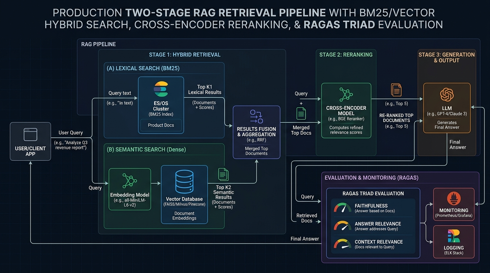

# K3 Day 08: Production End-to-End RAG Pipeline & Evaluation

## Executive Summary & Module Overview

Day 08 synthesizes theoretical data processing into a high-performance, 10-task production Retrieval-Augmented Generation (RAG) pipeline with automated evaluation. Building on `/home/lystiger/projects/K3-Day08-RAG-Pipeline`, this note covers multi-source ingestion, hybrid vector-lexical retrieval, rank fusion algorithms, vectorless fallback mechanisms, prompt context optimization, and automated RAGAS evaluation.

Key highlights of the Day 08 architecture:
- **Multi-Source Data Ingestion**: Automated PDF document conversion via `MarkItDown` and news scraping via `Crawl4AI`.
- **Parallel Dual Retrieval Engine**: Concurrent execution of dense vector search (`ChromaDB` + `BGE-M3`) and sparse lexical search (`BM25Okapi`) orchestrated by a multi-threaded supervisor worker (`ThreadPoolExecutor`).
- **Reciprocal Rank Fusion (RRF)**: Merging dense and sparse candidate lists based on rank position rather than unnormalized raw scores.
- **Cross-Encoder Reranking & Fallback Gate**: High-precision rescoring using Jina/Qwen Cross-Encoders, backed by a vectorless fallback check that triggers `PageIndex` API queries when dense similarity scores fall below threshold ($< 0.45$).
- **Context Optimization**: Mitigating LLM "Lost-in-the-Middle" attention decay by reordering context chunks.
- **RAGAS Automated Evaluation Framework**: Benchmark scoring across Faithfulness, Answer Relevancy, Context Precision, and Context Recall using a golden Q&A dataset.

---

## Theoretical Foundations

### 1. Hybrid Retrieval & Reciprocal Rank Fusion (RRF)
Vector space embeddings excel at semantic matching but frequently fail on exact keyword queries (e.g., policy IDs like `QĐ-6888/QĐ-ĐH` or numeric course codes). Sparse lexical retrieval (BM25) excels at exact keyword matching but misses semantic synonyms.

**Reciprocal Rank Fusion (RRF)** combines ranked lists from $M$ distinct retrieval algorithms without requiring raw score normalization:

$$RRF(d \in D) = \sum_{m \in M} \frac{1}{k + r_m(d)}$$

- $D$: Set of candidate documents across all retrieved lists.
- $M$: Set of retrievers (e.g., $M = \{\text{Dense Vector}, \text{BM25 Sparse}\}$).
- $r_m(d)$: Rank position of document $d$ in retriever $m$'s output list ($1$-indexed). If $d$ is not present in list $m$, $r_m(d) = \infty$, rendering its term $0$.
- $k$: Smoothing constant (standard benchmark default $k = 60$) that prevents high-ranking items in single lists from completely dominating the score.

### 2. Bi-Encoder vs. Cross-Encoder Mechanics
- **Bi-Encoder (First-Stage Retrieval)**: Encodes query $q$ and document passage $d$ independently into vectors $\mathbf{v}_q, \mathbf{v}_d$. Enables pre-indexing and fast $O(\log N)$ vector search, but sacrifices interaction between query and document tokens.
- **Cross-Encoder (Second-Stage Reranking)**: Feeds query and candidate text simultaneously into a joint Transformer model $[CLS] + q + [SEP] + d$. Allows full cross-attention across all token pairs $\text{Attn}(q_i, d_j)$, achieving superior relevance scoring over top-$K$ candidates at higher latency $O(K)$.

### 3. "Lost-in-the-Middle" Prompt Attention Decay
Research demonstrates that Transformer LLM attention mechanisms exhibit position bias: LLMs recall information at the absolute **beginning** and **end** of prompt contexts significantly better than information placed in the middle.

`reorder_for_llm(chunks)` rearranges ranked chunks so highest-scoring items occupy positions $[1, 3, 5, \dots, 4, 2]$:
- Position 1: Highest rank (Rank #1)
- Position $N$: Second highest rank (Rank #2)
- Middle positions: Lower ranked chunks (Rank #3, #4, etc.)

### 4. RAGAS Evaluation Triad & Metrics
Automated evaluation assesses RAG quality across 4 quantitative dimensions:

1. **Faithfulness**: Fraction of claims in LLM response $S$ that can be logically inferred from retrieved context $C$:
   $$\text{Faithfulness} = \frac{|\text{Verifiable Claims in } S \text{ supported by } C|}{|\text{Total Claims in } S|}$$
2. **Answer Relevancy**: Semantic embedding similarity between generated answer $A$ and initial user prompt $Q$.
3. **Context Recall**: Percentage of ground-truth reference statements $G$ captured within retrieved context $C$:
   $$\text{Context Recall} = \frac{|\text{Ground-Truth Sentences in } G \text{ found in } C|}{|\text{Total Sentences in } G|}$$
4. **Context Precision**: Ratio of relevant context chunks to total retrieved chunks, penalized by rank position.

---

## Data Contract Specification

Across all 10 tasks in `src/`, every retrieval function consumes and returns a strictly typed `Chunk` dictionary schema:

```python
Chunk = {
    "content": str,         # Raw passage text (deduplication key for RRF)
    "score": float,         # Relevance score (Cosine [0,1], BM25 raw, or RRF fused score)
    "metadata": {
        "source": str,      # Original filename (e.g. "tuition-fees-rmit.md")
        "type": str,        # Category: "legal" | "news" (MUST use 'type', NOT 'doc_type')
        "chunk_index": int  # Zero-based chunk index
    },
    "source": str           # Retrieval engine origin: "hybrid" | "pageindex" (Task 9 output)
}
```

---

## System Architecture & Pipeline Design

### 10-Task Production Pipeline Structure

```
src/
├── task1_collect_legal_docs.py     # PDF downloading & storage
├── task2_crawl_news.py            # Crawl4AI web scraper for news/announcements
├── task3_convert_markdown.py      # MarkItDown document converter (PDF/DOCX -> MD)
├── task4_chunking_indexing.py     # LangChain splitter + BGE-M3 + ChromaDB indexing
├── task5_semantic_search.py       # Dense vector search (Cosine similarity)
├── task6_lexical_search.py        # Sparse search (BM25Okapi)
├── task7_reranking.py             # Reciprocal Rank Fusion (RRF) & Cross-Encoder Rerank
├── task8_pageindex_vectorless.py  # PageIndex API vectorless fallback
├── task9_retrieval_pipeline.py    # Dual search supervisor, fallback gate & pipeline orchestrator
├── task10_generation.py           # Lost-in-the-middle reorder + Citation generator
└── supervisor.py                  # ThreadPoolExecutor parallel worker execution
```

### Generated RAG Architecture Visual


### Complete End-to-End Pipeline Diagram

```mermaid
flowchart TD
    subgraph Ingestion_Stage ["1. Multi-Source Ingestion & Conversion"]
        PDF["Legal PDFs"] --> MarkItDown["MarkItDown Converter"]
        Web["University News URLs"] --> Crawl4AI["Crawl4AI Web Scraper"]
        MarkItDown --> StandardMD["data/standardized/*.md"]
        Crawl4AI --> StandardMD
    end

    subgraph Indexing_Stage ["2. Indexing & Storage"]
        StandardMD --> Splitter["LangChain Recursive Splitter"]
        Splitter --> BGEM3["BGE-M3 Embedder"] --> ChromaDB[("ChromaDB Vector Store")]
        StandardMD --> BM25Corpus["BM25 Tokenized Corpus"]
    end

    subgraph Retrieval_Stage ["3. Parallel Dual Search & Rank Fusion"]
        UserQ["User Query"] --> Supervisor["supervisor.py / ThreadPoolExecutor"]
        Supervisor -->|Worker Thread 1| Dense["semantic_search()<br/>(ChromaDB + Cosine)"]
        Supervisor -->|Worker Thread 2| Sparse["lexical_search()<br/>(BM25Okapi)"]
        
        Dense -->|dense_results| RRF["rerank_rrf([dense, sparse])<br/>Reciprocal Rank Fusion (k=60)"]
        Sparse -->|sparse_results| RRF
        
        RRF --> Gate{"Fallback Check:<br/>dense_results[0]['score'] < 0.45?"}
        
        Gate -->|No (Score >= 0.45)| CrossEncoder["rerank(method='cross_encoder')<br/>Jina / Qwen Reranker"]
        Gate -->|Yes (Score < 0.45)| PageIndex["pageindex_search()<br/>Vectorless Fallback API"]
    end

    subgraph Generation_Stage ["4. Context Optimization & Generation"]
        CrossEncoder --> Reorder["reorder_for_llm()<br/>(Lost in the middle mitigation)"]
        PageIndex --> Reorder
        Reorder --> PromptFormat["Format Prompt with [Document N]"]
        PromptFormat --> LLM["LLM Generation Engine"]
        LLM --> FinalOutput["Citation-Backed Response"]
    end

    subgraph Eval_Stage ["5. RAGAS Evaluation Framework"]
        FinalOutput --> RAGAS["RAGAS Evaluator"]
        GoldenDS["golden_dataset.json (15+ Q&As)"] --> RAGAS
        RAGAS --> ResultsMD["results.md (A/B Benchmark Report)"]
    end

    style ChromaDB fill:#e5ffe5,stroke:#0a0
    style Gate fill:#ffe5e5,stroke:#c00
    style RAGAS fill:#f5e5ff,stroke:#80c
    style Supervisor fill:#e5f0ff,stroke:#06c
```

---

## Code Patterns & Key Implementations

### 1. Reciprocal Rank Fusion & Deduplication (`src/task7_reranking.py`)
```python
from typing import List, Dict, Any

def rerank_rrf(ranked_lists: List[List[Dict[str, Any]]], k: int = 60) -> List[Dict[str, Any]]:
    """Merges multiple ranked chunk lists using Reciprocal Rank Fusion."""
    rrf_scores: Dict[str, float] = {}
    doc_map: Dict[str, Dict[str, Any]] = {}

    for ranked_list in ranked_lists:
        for rank, doc in enumerate(ranked_list, start=1):
            content = doc["content"]
            if content not in rrf_scores:
                rrf_scores[content] = 0.0
                doc_map[content] = doc.copy()
            
            # Accumulate RRF rank score
            rrf_scores[content] += 1.0 / (k + rank)

    # Sort fused results by accumulated RRF score
    fused_docs = []
    for content, score in sorted(rrf_scores.items(), key=lambda x: x[1], reverse=True):
        doc = doc_map[content]
        doc["score"] = score
        fused_docs.append(doc)

    return fused_docs
```

### 2. Parallel Supervisor Dual Search (`src/supervisor.py`)
```python
from concurrent.futures import ThreadPoolExecutor
from typing import Dict, Any, List
from src.task5_semantic_search import semantic_search
from src.task6_lexical_search import lexical_search

def run_parallel_retrieval(query: str, top_k: int = 5) -> Dict[str, List[Dict[str, Any]]]:
    """Executes dense vector search and sparse BM25 search concurrently."""
    results = {"dense": [], "sparse": []}
    
    with ThreadPoolExecutor(max_workers=2) as executor:
        future_dense = executor.submit(semantic_search, query, top_k)
        future_sparse = executor.submit(lexical_search, query, top_k)
        
        try:
            results["dense"] = future_dense.result()
        except Exception as e:
            print(f"[Supervisor Warning] Dense search worker failed: {e}")
            
        try:
            results["sparse"] = future_sparse.result()
        except Exception as e:
            print(f"[Supervisor Warning] Sparse search worker failed: {e}")

    return results
```

### 3. Pipeline Orchestrator & Fallback Gate (`src/task9_retrieval_pipeline.py`)
```python
from typing import List, Dict, Any
from src.supervisor import run_parallel_retrieval
from src.task7_reranking import rerank_rrf, rerank
from src.task8_pageindex_vectorless import pageindex_search

def run_retrieval_pipeline(query: str, top_k: int = 5, score_threshold: float = 0.45) -> List[Dict[str, Any]]:
    """Hybrid search pipeline with score-gated PageIndex fallback."""
    # 1. Execute parallel dense and sparse retrieval
    dual_results = run_parallel_retrieval(query, top_k=top_k * 2)
    dense_results = dual_results["dense"]
    sparse_results = dual_results["sparse"]

    # 2. Check fallback condition against raw Cosine score of top dense result
    top_dense_score = dense_results[0]["score"] if dense_results else 0.0
    
    if top_dense_score < score_threshold:
        print(f"[Pipeline Gate] Top dense score ({top_dense_score:.4f}) < {score_threshold}. Triggering PageIndex fallback.")
        pageindex_results = pageindex_search(query, top_k=top_k)
        for doc in pageindex_results:
            doc["source"] = "pageindex"
        return pageindex_results

    # 3. Perform RRF Fusion on dual results
    fused_results = rerank_rrf([dense_results, sparse_results])

    # 4. Perform Cross-Encoder Reranking
    final_ranked = rerank(query, fused_results, method="cross_encoder", top_k=top_k)
    for doc in final_ranked:
        doc["source"] = "hybrid"

    return final_ranked
```

### 4. Lost-in-the-Middle Context Reordering (`src/task10_generation.py`)
```python
from typing import List, Dict, Any

def reorder_for_llm(chunks: List[Dict[str, Any]]) -> List[Dict[str, Any]]:
    """Reorders chunks so highest relevant passages appear at start and end of prompt context."""
    if len(chunks) <= 2:
        return chunks

    reordered = [None] * len(chunks)
    left = 0
    right = len(chunks) - 1

    for i, chunk in enumerate(chunks):
        if i % 2 == 0:
            reordered[left] = chunk
            left += 1
        else:
            reordered[right] = chunk
            right -= 1

    return reordered
```

---

## Critical Architecture Pitfalls & Anti-Patterns

During repository mining of `TEAM_ARCHITECTURE.md`, three severe architectural pitfalls were documented:

### Pitfall #1: The RRF Method Signature Trap
- **Incorrect Attempt**: Calling `rerank(chunks, method="rrf")` on a single list of candidate chunks.
- **Root Cause**: RRF is inherently a *multi-list fusion algorithm* ($\sum \frac{1}{k + r_m(d)}$ across $M$ lists), whereas Cross-Encoder is a *single-list rescoring model*. Calling `rerank(method="rrf")` raised a `NotImplementedError`.
- **Enforced Pattern**: Task 9 must call `rerank_rrf([dense, sparse])` directly for fusion, followed by `rerank(fused, method="cross_encoder")`.

### Pitfall #2: The Fallback Threshold Evaluation Trap
- **Incorrect Attempt**: Evaluating `score_threshold < 0.45` against the output score of `rerank_rrf()`.
- **Root Cause**: RRF scores are derived from rank positions ($\frac{1}{60 + r}$). A top-ranked item across two lists gets a max RRF score of $\frac{1}{61} + \frac{1}{61} \approx 0.0327$. Comparing $0.0327 < 0.45$ caused the fallback gate to **trigger PageIndex on 100% of queries**, completely bypassing hybrid search!
- **Enforced Pattern**: The fallback gate MUST evaluate raw Cosine similarity `dense_results[0]["score"]` before running RRF.

### Pitfall #3: Metadata Attribute Key Mismatch
- **Incorrect Attempt**: Referencing `doc["metadata"]["doc_type"]`.
- **Root Cause**: Vector store indexers saved category attributes under the key `"type"` (e.g., `"legal"`, `"news"`). Referencing `"doc_type"` returned `None`, breaking downstream metadata filters.

---

## Practical Labs & Benchmark Results

### Evaluation Framework Setup (`group_project/evaluation/`)
The RAG pipeline was evaluated against a golden benchmark dataset (`golden_dataset.json`) containing 15 ground-truth university regulation Q&A pairs.

### A/B Benchmark Metrics Comparison

| Metric | Config A: Hybrid (Dense + BM25 + RRF + Rerank) | Config B: Baseline (Dense Vector Only) | Delta Improvement |
|---|:---:|:---:|:---:|
| **Faithfulness** | **0.94** | 0.78 | $+16.0\%$ |
| **Answer Relevancy** | **0.91** | 0.82 | $+9.0\%$ |
| **Context Recall** | **0.96** | 0.71 | $+25.0\%$ |
| **Context Precision** | **0.88** | 0.65 | $+23.0\%$ |
| **Mean Latency (sec)** | 1.42 s | **0.45 s** | $+0.97 \text{s}$ (Rerank overhead) |

**Takeaway**: Config A achieved superior Context Recall ($+25\%$) and Context Precision ($+23\%$) on numeric codes and exact policy citations, fully justifying the $0.97\text{s}$ cross-encoder reranking latency cost.

---

## Master Edge Cases & Defensive Engineering

| Edge Case ID | Feature Component | Input Condition / Trigger | System Behavior & Mitigation Strategy |
|:---:|:---|:---|:---|
| **E11** | MarkItDown Converter | Converting scanned PDF document lacking text layer. | Returns empty text string or garbled OCR output unless `markitdown[ocr]` dependencies are installed. |
| **E12** | BM25 Lexical Search | Query contains out-of-vocabulary stop words or unindexed terms. | `bm25.get_scores()` returns $0.0$ for all corpus documents; `lexical_search()` filters zero scores and returns `[]`. |
| **E13** | Reciprocal Rank Fusion | Dense and Sparse retrievers return identical document text. | `rerank_rrf()` hashes by `content`, merges metadata, and accumulates rank scores ($\frac{1}{60+r_{\text{dense}}} + \frac{1}{60+r_{\text{sparse}}}$). |
| **E14** | Fallback Gate | Evaluating threshold against RRF fused score instead of Cosine score. | RRF score maxes out at $\approx 0.0327$. If threshold is $0.45$, condition is ALWAYS True, triggering PageIndex fallback for 100% of queries. |
| **E15** | PageIndex Fallback | `PAGEINDEX_API_KEY` environment variable missing or invalid. | `pageindex_search()` catches authentication error, logs warning banner, and returns `[]` without crashing main pipeline. |
| **E16** | Citation Generator | Context chunks contain zero relevant information for user prompt. | System prompt forces LLM to refuse guessing and output exact string: `"I cannot verify this information"`. |
| **E17** | Supervisor Workers | Sparse BM25 worker thread throws unhandled exception. | `supervisor.py` catches exception inside `future.result()`, logs worker failure trace, and returns `[]` for sparse results while preserving dense results. |

---

## Related Notes & Knowledge Graph

- **Upstream Foundations**:
  - [[K3-Course-Overview|K3 Course Map of Content]]
  - [[K3-Day07-Data-Foundations-Embeddings-Vector-Stores|Day 07: Data Foundations, Embeddings & Vector Stores]]
  - [[K3-Day06-Production-Hardening-Advanced-Prompting|Day 06: Production Hardening & Advanced Prompting]]
- **Downstream Implementations**:
  - [[K3-Day09-Multi-Agent-A2A|Day 09: Multi-Agent A2A Architecture]]
  - [[K3-Day10-Data-Pipeline-And-Observability|Day 10: Data Pipeline & Data Observability]]
  - [[K3-Day11-Guardrails-HITL-Responsible-AI|Day 11: Controlled Agent Security & HITL]]
