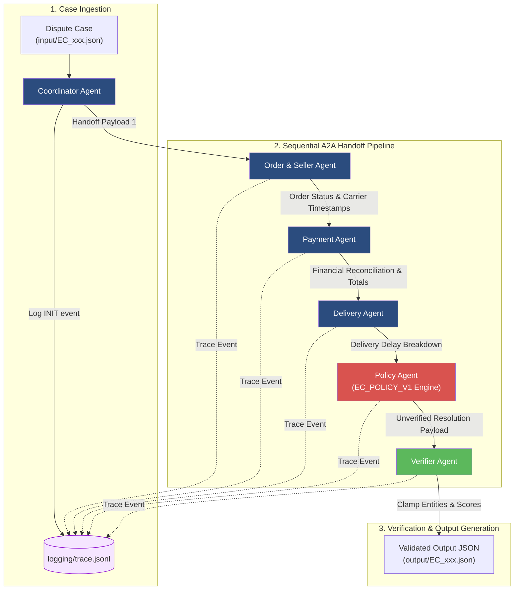
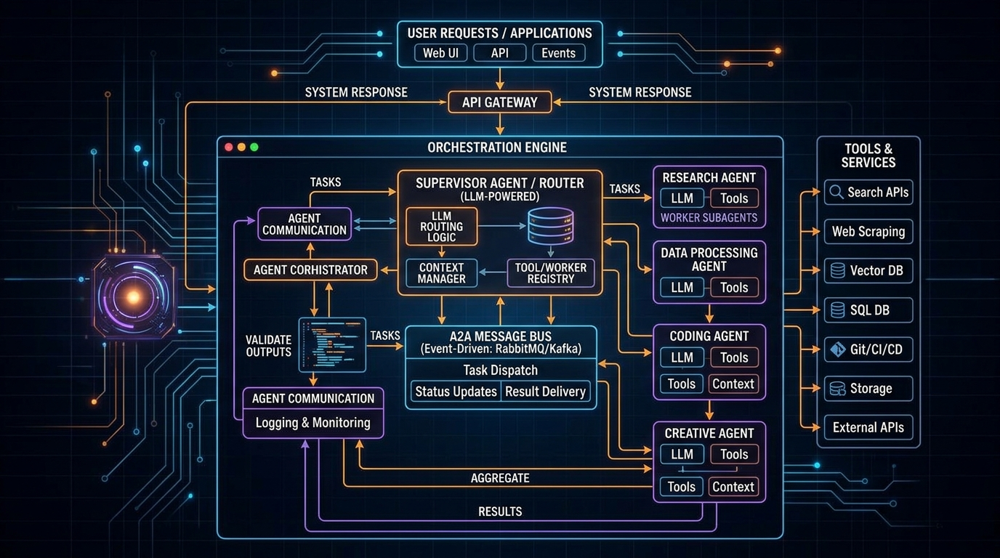

# K3 Day 09: Multi-Agent Architecture & A2A Handoff Topology

## Executive Summary & Module Overview

Day 09 introduces advanced Multi-Agent Systems (MAS) and sequential Agent-to-Agent (A2A) handoff topologies. Focusing on domain-driven sub-agent specialization, this module explores an enterprise Brazilian E-Commerce dispute resolution engine built upon the public Kaggle Olist dataset (`/home/lystiger/projects/K3-Day09-Multi-Agent-A2A`).

The system automates complex customer dispute investigations across 50 real-world benchmark cases (`EC_001.json` through `EC_050.json`). Key architectural principles include:
- **Sequential A2A Handoff Pipeline**: Decomposing monolithic LLM prompts into specialized domain agents (Coordinator, Order & Seller, Payment, Delivery, Policy, and Verifier).
- **Evidence-Based Dispute Verification**: Extracting verifiable entity pointers (`order:<id>`, `seller:<id>`, `payment:<id>:<seq>`) directly from underlying relational data tables.
- **Deterministic Business Policy Engine (`EC_POLICY_V1`)**: Prioritizing deterministic rule evaluation over pure LLM probabilistic generation to eliminate monetary calculation errors and guarantee financial precision.
- **Strict Output Schema Clamping**: Employing a Verifier agent to cap entities, evidence counts, and confidence scores within validated boundaries.
- **Real-Time Audit Trace Logging**: Recording structured JSONL events (`logging/trace.jsonl`) for end-to-end execution auditability.

---

## Theoretical Foundations

### 1. Multi-Agent Systems (MAS) & A2A Communication Protocols
Monolithic single-agent architectures suffer from context dilution, prompt bloat, and ambiguous tool invocation when processing multi-step domain workflows. Multi-Agent Systems divide responsibility among autonomous, domain-focused sub-agents.

In a **Sequential Agent-to-Agent (A2A) Handoff Topology**:
- Each agent operates as a specialized functional unit with dedicated data access (e.g., Payment Agent accesses payments dataset; Delivery Agent accesses logistics timestamps).
- State transitions occur via strictly typed handoff payloads passed sequentially down the pipeline.
- Agents enrich the shared case state dictionary with verified facts, avoiding redundant database lookups.

```
State_0 (Input Case) ──> [Order & Seller] ──> State_1 ──> [Payment] ──> State_2 ──> [Delivery] ──> State_3 ──> [Policy] ──> State_4 ──> [Verifier] ──> Final State
```

### 2. Deterministic Policy Engines vs. Probabilistic LLM Generation
While LLMs excel at natural language parsing and intent extraction, relying on LLMs to perform arithmetic calculations or apply rigid corporate policies introduces severe compliance risks (hallucinated refund amounts, inconsistent penalty codes).

Day 09 adopts a **Hybrid Architecture**:
- **LLMs / Parsers**: Extract customer intent, summarize claims, and classify unstructured text.
- **Deterministic Policy Engine**: Evaluates financial totals, date arithmetic, and business rules using explicit Python logic (`PolicyEngine.evaluate_case()`).

### 3. Financial Reconciliation & Tolerances
Financial audit logic verifies that payment totals match line item prices plus freight charges within a strict rounding tolerance ($\epsilon = 0.10\text{ BRL}$):

$$|\text{Total Payment BRL} - (\text{Sum of Item Prices BRL} + \text{Sum of Freight BRL})| \le 0.10$$

If this condition is violated, the system flags a split-payment mismatch or pricing anomaly.

---

## System Architecture & Pipeline Design

### Sub-Agent Roles & Responsibilities

1. **Coordinator Agent**: Receives dispute case JSON, initializes workspace, manages pipeline execution flow, appends events to `logging/trace.jsonl`, and formats final output.
2. **Order & Seller Agent**: Queries `olist_orders_dataset.csv`, `olist_order_items_dataset.csv`, and `olist_sellers_dataset.csv`. Inspects order status (`canceled`, `unavailable`, `delivered`) and checks whether carrier handoff timestamp (`order_delivered_carrier_date`) exceeded `shipping_limit_date`.
3. **Payment Agent**: Cross-checks `olist_order_payments_dataset.csv`. Reconciles payment methods, installment counts, and total paid amounts.
4. **Delivery Agent**: Compares actual customer delivery date (`order_delivered_customer_date`) against estimated delivery date (`order_estimated_delivery_date`).
5. **Policy Agent (`EC_POLICY_V1`)**: Evaluates dispute rules against enriched case facts in strict priority sequence.
6. **Verifier Agent**: Validates output schema, clamps confidence scores to $[0.0, 1.0]$, and caps entity counts (max 5 entities, max 10 evidence IDs, max 3 root cause codes, max 5 actions).

### Sequential A2A Pipeline Diagram



---

## Deterministic Business Policy Matrix (`EC_POLICY_V1`)

The Policy Agent evaluates rules in exact hierarchical priority order. Once a matching rule condition is met, downstream policy evaluation halts.

| Priority | Primary Issue Code | Condition Trigger | Root Cause Code | Responsible Party | Financial Resolution |
|:---:|:---|:---|:---|:---|:---|
| **1** | `canceled_order_paid` | `order_status == "canceled"` AND `payment_total > 0` | `ORDER_CANCELED_BEFORE_DELIVERY` | `platform` | Full Refund (Items + Freight) |
| **2** | `unavailable_order_paid` | `order_status == "unavailable"` AND `payment_total > 0` | `ITEM_OUT_OF_STOCK` | `seller` | Full Refund (Items + Freight) |
| **3** | `late_delivery_seller` | `order_delivered_carrier_date > shipping_limit_date` | `SELLER_HANDOFF_AFTER_LIMIT` | `seller` | Refund Freight Amount |
| **4** | `late_delivery_logistics` | `order_delivered_customer_date > order_estimated_delivery_date` AND carrier on-time | `CARRIER_TRANSIT_DELAY` | `logistics_partner` | Refund Freight Amount |
| **5** | `valid_split_payment` | $|\text{Payment} - (\text{Items} + \text{Freight})| > 0.10$ | `PAYMENT_DISCREPANCY` | `customer` / `platform` | Adjustment credit |
| **6** | `unsupported_late_claim` | Customer claims late delivery, but delivery date $\le$ estimated date | `CLAIM_REJECTED_ON_TIME` | `none` | No Refund ($0.00\text{ BRL}$) |

---

## Code Patterns & Key Implementations

### 1. Deterministic Policy Engine Implementation (`src/policy_rules.py`)
```python
from typing import Dict, Any, List

class PolicyEngine:
    @staticmethod
    def evaluate_case(order_details: Dict[str, Any], case_id: str) -> Dict[str, Any]:
        """Evaluates EC_POLICY_V1 rules in strict priority sequence."""
        order = order_details.get("order", {})
        items = order_details.get("items", [])
        payments = order_details.get("payments", [])
        
        # Calculate financial totals rounded to 2 decimal places
        item_total = round(sum(float(i.get("price", 0.0)) for i in items), 2)
        freight_total = round(sum(float(i.get("freight_value", 0.0)) for i in items), 2)
        payment_total = round(sum(float(p.get("payment_value", 0.0)) for p in payments), 2)
        expected_total = round(item_total + freight_total, 2)
        
        order_status = order.get("order_status")
        
        # Priority 1: Canceled Order Paid
        if order_status == "canceled" and payment_total > 0:
            return {
                "primary_issue": "canceled_order_paid",
                "confidence": 1.0,
                "root_cause_codes": ["ORDER_CANCELED_BEFORE_DELIVERY"],
                "responsible_parties": [{"party_type": "platform", "party_id": "olist"}],
                "recommended_refund_brl": payment_total,
                "resolution_actions": ["full_refund_customer"]
            }

        # Priority 2: Unavailable Order Paid
        if order_status == "unavailable" and payment_total > 0:
            seller_id = items[0].get("seller_id") if items else "unknown"
            return {
                "primary_issue": "unavailable_order_paid",
                "confidence": 1.0,
                "root_cause_codes": ["ITEM_OUT_OF_STOCK"],
                "responsible_parties": [{"party_type": "seller", "party_id": seller_id}],
                "recommended_refund_brl": payment_total,
                "resolution_actions": ["full_refund_customer", "penalize_seller"]
            }

        # Priority 3 vs 4: Late Delivery Analysis
        carrier_date = order.get("order_delivered_carrier_date")
        shipping_limit = items[0].get("shipping_limit_date") if items else None
        delivery_date = order.get("order_delivered_customer_date")
        estimated_date = order.get("order_estimated_delivery_date")

        seller_late = carrier_date and shipping_limit and carrier_date > shipping_limit
        logistics_late = delivery_date and estimated_date and delivery_date > estimated_date

        if seller_late:
            seller_id = items[0].get("seller_id") if items else "unknown"
            return {
                "primary_issue": "late_delivery_seller",
                "confidence": 0.95,
                "root_cause_codes": ["SELLER_HANDOFF_AFTER_LIMIT"],
                "responsible_parties": [{"party_type": "seller", "party_id": seller_id}],
                "recommended_refund_brl": freight_total,
                "resolution_actions": ["refund_freight"]
            }

        if logistics_late:
            return {
                "primary_issue": "late_delivery_logistics",
                "confidence": 0.90,
                "root_cause_codes": ["CARRIER_TRANSIT_DELAY"],
                "responsible_parties": [{"party_type": "logistics_partner", "party_id": "carrier"}],
                "recommended_refund_brl": freight_total,
                "resolution_actions": ["refund_freight"]
            }

        # Priority 6: Default Unsupported Claim
        return {
            "primary_issue": "unsupported_late_claim",
            "confidence": 1.0,
            "root_cause_codes": ["CLAIM_REJECTED_ON_TIME"],
            "responsible_parties": [],
            "recommended_refund_brl": 0.0,
            "resolution_actions": ["reject_claim"]
        }
```

### 2. Verifier Agent Output Clamping (`src/agents.py`)
```python
from typing import Dict, Any

class VerifierAgent:
    """Enforces schema compliance, caps array lengths, and clamps confidence values."""
    def verify_and_clamp(self, raw_payload: Dict[str, Any]) -> Dict[str, Any]:
        payload = raw_payload.copy()
        
        # Clamp confidence score to [0.0, 1.0]
        confidence = float(payload.get("confidence", 0.0))
        payload["confidence"] = max(0.0, min(1.0, confidence))
        
        # Clamp array boundaries
        payload["affected_entities"] = payload.get("affected_entities", [])[:5]
        payload["evidence_ids"] = payload.get("evidence_ids", [])[:10]
        payload["root_cause_codes"] = payload.get("root_cause_codes", [])[:3]
        payload["resolution_actions"] = payload.get("resolution_actions", [])[:5]
        
        # Round financial refund amount to 2 decimals
        refund = float(payload.get("recommended_refund_brl", 0.0))
        payload["recommended_refund_brl"] = round(refund, 2)
        
        return payload
```

### 3. Real-Time Execution Trace Logger (`src/coordinator.py`)
```python
import json
import time
from pathlib import Path
from typing import Dict, Any

class CoordinatorAgent:
    def __init__(self, trace_log_path: str = "logging/trace.jsonl"):
        self.trace_log_path = Path(trace_log_path)
        self.trace_log_path.parent.mkdir(parents=True, exist_ok=True)

    def log_trace(self, case_id: str, event_type: str, agent_name: str, details: Dict[str, Any]) -> None:
        """Appends a structured trace event line to logging/trace.jsonl."""
        event = {
            "timestamp": time.strftime("%Y-%m-%dT%H:%M:%SZ", time.gmtime()),
            "case_id": case_id,
            "event_type": event_type,
            "agent_name": agent_name,
            "details": details
        }
        with open(self.trace_log_path, "a", encoding="utf-8") as f:
            f.write(json.dumps(event, ensure_ascii=False) + "\n")
```

---

## Practical Labs & Dispute Resolution Rubric

### Dispute Benchmarking Task
Students process 50 Brazilian E-Commerce dispute cases (`EC_001.json` through `EC_050.json`) containing real order records, item manifests, payment receipts, and customer complaint text.

### Evaluation Rubric & Weighted Dimensions

| Rubric Dimension | Weight | Criteria & Verification |
|---|:---:|:---|
| **1. Primary Issue & Confidence** | **20%** | Correct primary issue code assigned; confidence score accurate and clamped $[0.0, 1.0]$. |
| **2. Affected Entities** | **20%** | Extraction of `order:<id>`, `seller:<id>`, `customer:<id>` entity strings (capped $\le 5$). |
| **3. Financial Resolution** | **20%** | Exact financial refund calculation matching ground truth BRL amount (rounded to 2 decimals). |
| **4. Root Cause & Responsible Parties** | **15%** | Correct attribution (`seller`, `logistics_partner`, `platform`, `none`). |
| **5. Evidence IDs** | **15%** | Verifiable database pointers extracted (e.g. `item:order_123:1`, `payment:order_123:1`). |
| **6. Resolution Actions** | **10%** | Valid action codes assigned (e.g., `refund_freight`, `full_refund_customer`). |

---

## Visual Concepts & System Flow Mockups

### Generated Multi-Agent Architecture Visual


### State Evolution Across Sequential A2A Handoffs

```
[Customer Complaint JSON]
"Case EC_014: Order #a1b2 delivered 5 days late. Seller shipped late."
       │
       ▼
┌────────────────────────────────────────────────────────────────────────┐
│ Order & Seller Agent                                                   │
│ Extracted: order_status="delivered", shipping_limit="2024-02-10",      │
│            carrier_handoff="2024-02-14" (SELLER LATE BY 4 DAYS!)      │
└────────────────────────────────────────────────────────────────────────┘
       │ Handoff Payload (order_details + timestamp_flags)
       ▼
┌────────────────────────────────────────────────────────────────────────┐
│ Payment Agent                                                          │
│ Reconciled: Items BRL 150.00 + Freight BRL 25.00 = Total BRL 175.00    │
│             Payment BRL 175.00 (NO DISCREPANCY)                        │
└────────────────────────────────────────────────────────────────────────┘
       │ Handoff Payload (financial_totals)
       ▼
┌────────────────────────────────────────────────────────────────────────┐
│ Policy Agent (EC_POLICY_V1)                                            │
│ Evaluated Priority 3: late_delivery_seller == True                     │
│ Decision: Issue="late_delivery_seller", Refund=BRL 25.00 (Freight)     │
└────────────────────────────────────────────────────────────────────────┘
       │ Handoff Payload (unverified_decision)
       ▼
┌────────────────────────────────────────────────────────────────────────┐
│ Verifier Agent                                                         │
│ Clamped: Confidence=0.95, EvidenceCount=3 <= 10                         │
└────────────────────────────────────────────────────────────────────────┘
       │
       ▼
[Final Output JSON: output/EC_014.json]
```

---

## Master Edge Cases & Defensive Engineering

| Edge Case ID | Feature Component | Input Condition / Trigger | System Behavior & Mitigation Strategy |
|:---:|:---|:---|:---|
| **E18** | Payment Agent | Payment total exceeds item + freight sum by $>0.10\text{ BRL}$. | Flags `valid_split_payment` discrepancy; isolates over-payment amount for customer credit adjustment. |
| **E19** | Order & Seller Agent | Carrier handoff date missing due to un-scanned package. | Falls back to checking `order_delivered_customer_date` vs `estimated_delivery_date` and marks seller handoff as indeterminate. |
| **E20** | Delivery Agent | Estimated delivery date falls on Sunday / Brazilian national holiday. | Business logic accounts for business days to prevent false-positive `CARRIER_TRANSIT_DELAY` flags. |
| **E21** | Verifier Agent | LLM / Policy logic returns $>10$ evidence IDs. | Verifier slices array `payload["evidence_ids"][:10]` to strictly comply with API contract caps. |
| **E22** | Verifier Agent | Policy engine output returns confidence value $1.25$ or $-0.5$. | `max(0.0, min(1.0, val))` clamps score strictly into valid $[0.0, 1.0]$ range. |
| **E23** | Trace Logger | Multiple agent threads write to `logging/trace.jsonl` simultaneously. | File append operations wrapped in thread locks to prevent interleaved JSON lines. |
| **E24** | Policy Engine | Customer claims late delivery, but carrier delivered 2 days prior to estimated date. | Trigger Priority 6 `unsupported_late_claim`: refund BRL $0.00$, reject claim, set action `reject_claim`. |

---

## Related Notes & Knowledge Graph

- **Upstream Foundations**:
  - [[K3-Course-Overview|K3 Course Map of Content]]
  - [[K3-Day03-Chatbot-vs-ReAct-Agent|Day 03: ReAct Agents & Tool Calling]]
  - [[K3-Day08-RAG-Pipeline-And-Evaluation|Day 08: Production RAG Pipeline & Evaluation]]
- **Downstream Implementations**:
  - [[K3-Day10-Data-Pipeline-And-Observability|Day 10: Data Pipeline & Data Observability]]
  - [[K3-Day11-Guardrails-HITL-Responsible-AI|Day 11: Controlled Agent Security, Guardrails & HITL]]
  - [[K3-Day12-Cloud-Services-And-Deployment|Day 12: Cloud Services & Agent Deployment]]
