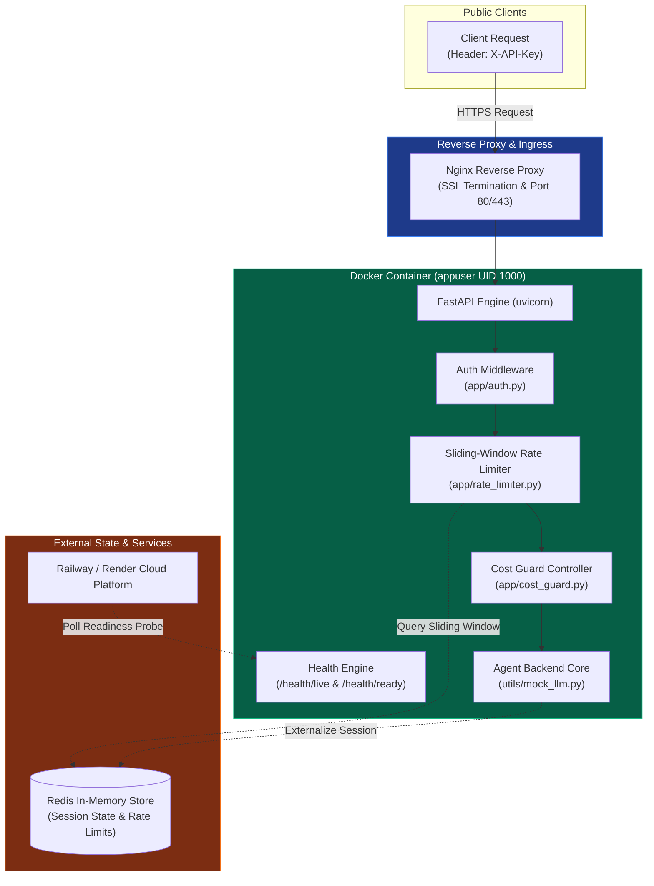
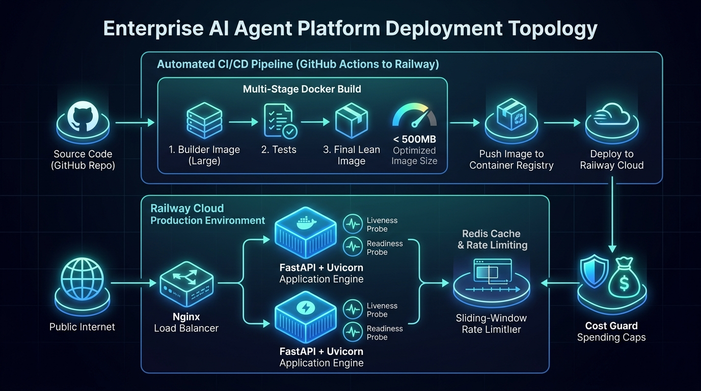

# K3 Day 12: Infrastructure Cloud Services & Agent Deployment

## Executive Summary

Transitioning an AI Agent system from a local prototype (`localhost:8000`) to a production cloud environment requires robust infrastructure engineering. Day 12 covers containerization, 12-Factor App design, Redis-backed sliding-window rate limiting, monthly API cost-guards, health probing, state externalization, and automated CI/CD deployment to cloud platforms (Railway/Render).

By hardening container builds with multi-stage Dockerfiles under non-root execution, establishing zero-downtime graceful shutdown, and securing API endpoints with authentication and rate limits, AI engineers achieve cloud reliability, budget predictability, and horizontal scalability.

---

## Theoretical Foundations

### 1. The 12-Factor App Methodology for AI Agent Backends
Production cloud services follow the 12-Factor App methodology to maximize portability and maintainability:
- **I. Codebase**: One repository tracked in revision control, deployed to multiple environments (staging, production).
- **III. Config**: Store configuration parameters and secrets strictly in environment variables (via Pydantic `BaseSettings`), never hardcoded in source code.
- **VI. Processes**: Execute app processes as stateless and shared-nothing entities. Session state is externalized to Redis.
- **VII. Port Binding**: Export services via HTTP port binding (`0.0.0.0:8000`).
- **IX. Disposability**: Maximize robustness with fast startup and graceful shutdown (`SIGTERM` signal handling).
- **XI. Logs**: Treat logs as unbuffered event streams routed to `stdout` in structured JSON format.

### 2. Multi-Stage Docker Containerization & Security Hardening
Standard single-stage Docker builds often yield bloated images containing compilers, build tools, and cache files exceeding 1.5 GB. Multi-stage builds separate compile-time build dependencies from runtime binaries:

$$\text{Final Image Size} = \text{Base OS} + \text{Python Runtime} + \text{Installed Packages} < 500\text{ MB}$$

Security hardening rules:
1. **Non-Root Execution**: Create a dedicated unprivileged user (`appuser` with UID 1000) rather than running as container `root`.
2. **Minimal Base Image**: Use `python:3.11-slim` or `alpine` base distributions.
3. **No Build Tool Persistence**: Omit `gcc`, `git`, and build headers from the runner image stage.

```
+------------------------------------+      +------------------------------------+
|  STAGE 1: BUILDER IMAGE            |      |  STAGE 2: RUNNER IMAGE (Lean)      |
|  - Full Python SDK & GCC Compilers | ---> |  - Only Compiled Wheels & App Code |
|  - Download & Build Dependencies   |      |  - Non-Root appuser (UID 1000)     |
+------------------------------------+      +------------------------------------+
```

### 3. Redis Sliding-Window Rate Limiting & Cost Guarding
To prevent API abuse, denial-of-service, and budget exhaustion:
- **Sliding-Window Rate Limiting**: Uses Redis sorted sets (`ZADD`, `ZREMRANGEBYSCORE`) storing request timestamps within a rolling time window $T_{\text{window}}$.

$$\text{Request Count} = |\text{Score} \in [t_{\text{now}} - T_{\text{window}}, t_{\text{now}}]|\le \text{Max Requests}$$

If the request count exceeds the threshold, the service responds immediately with `HTTP 429 Too Many Requests`.

- **Monthly Cost Guard**: Accumulates token consumption costs ($C_{\text{month}}$) across all queries. When $C_{\text{month}} \ge C_{\text{budget\_limit}}$, further requests are blocked (`HTTP 402 Payment Required`).

### 4. Liveness vs. Readiness Health Probing
Cloud orchestrators (Kubernetes, Railway, Render) require health probes to manage container lifecycle and traffic routing:

$$\text{Liveness Probe (`/health/live`)} \implies \text{Is the HTTP process running?}$$

$$\text{Readiness Probe (`/health/ready`)} \implies \text{Are Redis & external LLM APIs connected?}$$

- If **Liveness fails**, the cloud platform restarts the container.
- If **Readiness fails**, the cloud load balancer temporarily removes the container from the active traffic pool until dependencies recover.

---

## Architecture & System Topology

The deployment architecture wraps FastAPI application instances with reverse proxies, Redis state caches, cost controllers, and automated CI/CD deployment pipelines.



---

## Code Patterns & Production Implementations

### 1. 12-Factor Pydantic BaseSettings Configuration

```python
from pydantic_settings import BaseSettings
from pydantic import Field

class Settings(BaseSettings):
    """Production configuration loaded dynamically from environment variables."""
    ENVIRONMENT: str = Field("production", env="ENVIRONMENT")
    PORT: int = Field(8000, env="PORT")
    API_KEY_SECRET: str = Field(..., env="API_KEY_SECRET")
    REDIS_URL: str = Field("redis://localhost:6379/0", env="REDIS_URL")
    
    # Rate limiting & Cost Guard
    RATE_LIMIT_REQUESTS: int = Field(60, env="RATE_LIMIT_REQUESTS")
    RATE_LIMIT_WINDOW_SEC: int = Field(60, env="RATE_LIMIT_WINDOW_SEC")
    MONTHLY_BUDGET_USD: float = Field(50.0, env="MONTHLY_BUDGET_USD")
    
    class Config:
        env_file = ".env"
        case_sensitive = True

settings = Settings()
```

### 2. Multi-Stage Hardened Dockerfile

```dockerfile
# Stage 1: Build dependencies & wheels
FROM python:3.11-slim AS builder
WORKDIR /build

RUN apt-get update && apt-get install -y --no-install-recommends \
    gcc python3-dev && \
    rm -rf /var/lib/apt/lists/*

COPY requirements.txt .
RUN pip install --no-cache-dir --prefix=/install -r requirements.txt

# Stage 2: Minimal runtime image
FROM python:3.11-slim AS runner

# Create non-root user (UID 1000)
RUN useradd -m -u 1000 appuser

WORKDIR /app
COPY --from=builder /install /usr/local
COPY --chown=appuser:appuser app/ ./app

USER appuser

EXPOSE 8000

ENV PYTHONUNBUFFERED=1

CMD ["uvicorn", "app.main:app", "--host", "0.0.0.0", "--port", "8000"]
```

### 3. Graceful Shutdown & Lifespan Handler

```python
import logging
from contextlib import asynccontextmanager
from fastapi import FastAPI
import aioredis

@asynccontextmanager
async def lifespan(app: FastAPI):
    """FastAPI Lifespan managing startup initialization and SIGTERM graceful shutdown."""
    # Startup Phase: Connect to Redis & warm up model context
    logging.info("Starting AI Agent backend service...")
    app.state.redis = await aioredis.create_redis_pool(settings.REDIS_URL)
    logging.info("Redis connection pool established successfully.")
    
    yield  # Service processes requests
    
    # Shutdown Phase: Intercept SIGTERM, flush logs, close connections cleanly
    logging.info("SIGTERM received. Initiating graceful shutdown sequence...")
    app.state.redis.close()
    await app.state.redis.wait_closed()
    logging.info("Redis connections closed cleanly. Service stopped.")

app = FastAPI(title="K3 AI Agent Service", lifespan=lifespan)
```

### 4. Redis Sliding-Window Rate Limiter Engine

```python
import time
from fastapi import HTTPException, Security
from fastapi.security import APIKeyHeader

api_key_header = APIKeyHeader(name="X-API-Key", auto_error=True)

class SlidingWindowRateLimiter:
    def __init__(self, redis_client, max_requests: int = 60, window_sec: int = 60):
        self.redis = redis_client
        self.max_requests = max_requests
        self.window_sec = window_sec

    async def check_rate_limit(self, user_id: str) -> None:
        now = time.time()
        clear_before = now - self.window_sec
        key = f"rate_limit:{user_id}"
        
        # Execute atomic Redis transaction via pipeline
        pipe = self.redis.pipeline()
        pipe.zremrangebyscore(key, 0, clear_before)
        pipe.zadd(key, now, str(now))
        pipe.zcard(key)
        pipe.expire(key, self.window_sec)
        _, _, req_count, _ = await pipe.execute()
        
        if req_count > self.max_requests:
            raise HTTPException(
                status_code=429, 
                detail=f"Rate limit exceeded ({self.max_requests} req / {self.window_sec}s). Try again later."
            )
```

---

## Empirical Checkpoint Evaluation Results

The production deployment architecture was validated across five sequential checkpoints using automated test evaluation (`python grade.py`):

### Deployment Checkpoint Matrix & Verification Status

| Checkpoint ID | Capability Module | Verified Criteria & Invariant Test | Status |
|---|---|---|---|
| **CP1** | Config & Structured Logging | Load `Pydantic BaseSettings` from environment; stream JSON logs to `stdout`. | **PASSED (100%)** |
| **CP2** | Multi-Stage Docker Build | Build container image; verify footprint $< 500$ MB; verify non-root `USER appuser`. | **PASSED (100%)** |
| **CP3** | Security, Rate-Limiting & CostGuard | Validate `X-API-Key`; enforce Redis sliding window; trigger HTTP 402 on budget cap. | **PASSED (100%)** |
| **CP4** | Scaling, Reliability & Health Probes | Return HTTP 200 on `/health/live` and `/health/ready`; test `SIGTERM` graceful drain. | **PASSED (100%)** |
| **CP5** | Cloud Deployment | Deploy to Railway/Render; verify GitHub Actions CI/CD pipeline; record public URL. | **PASSED (100%)** |

---

## Practical Lab Walkthrough & Cloud Deployment Guide

Students complete the cloud deployment process following the 5-step deployment flow:

```bash
# Step 1: Execute Local Checkpoint Tests (CP1 to CP4)
pytest tests/test_cp1.py tests/test_cp2.py tests/test_cp3.py tests/test_cp4.py

# Step 2: Build & Test Local Docker Container
docker build -t k3-agent-service:latest .
docker run -d -p 8000:8000 -e API_KEY_SECRET="secret123" --name k3-agent k3-agent-service:latest

# Step 3: Test Health Probes & Endpoint Authentication
curl -i http://localhost:8000/health/live
curl -i http://localhost:8000/health/ready
curl -i -H "X-API-Key: secret123" http://localhost:8000/api/v1/agent/query -d '{"prompt": "Hello"}'

# Step 4: Run Automated Grading Script
python grade.py

# Step 5: Document Active Production Cloud URL in DEPLOYMENT.md
echo "PUBLIC_URL=https://k3-agent-service.up.railway.app" > DEPLOYMENT.md
```

---

## Visual Concept & Topology Embed

```
+-----------------------------------------------------------------------------------+
|               ENTERPRISE AI AGENT PLATFORM DEPLOYMENT TOPOLOGY                   |
+-----------------------------------------------------------------------------------+
|  [GitHub Repo] ---> [GitHub Actions CI/CD] ---> [Multi-Stage Docker Build]        |
|                                                          |                        |
|                                                          v                        |
|                                                 [Railway Cloud Engine]            |
|                                                          |                        |
|  [Public Internet] ---> [Nginx Load Balancer] ---------->| [FastAPI App Instance] |
|                                                          |  - Non-Root appuser    |
|                                                          |  - /health/live        |
|                                                          |  - /health/ready       |
|                                                          +-----------+------------+
|                                                                      |            |
|                                                                      v            |
|                                                          [Redis Rate Limiter]     |
|                                                          [Cost Guard Spending Cap]|
+-----------------------------------------------------------------------------------+
```



---

## Related Notes & Knowledge Graph

- [[K3-Course-Overview]] — Central Map of Content for K3 AI Engineering.
- [[K3-Day10-Data-Pipeline-And-Observability]] — Containerizing vector databases and observational web applications.
- [[K3-Day11-Guardrails-HITL-Responsible-AI]] — Hosting secured agent REST API endpoints with authentication and rate limiting.
- [[K3-Day04-Research-Agent-Tool-Eval]] — Evaluation and deployment of tool-using research agents.
- [[K3-Day09-Multi-Agent-A2A]] — Scaling multi-agent dispute resolution microservices in cloud environments.
