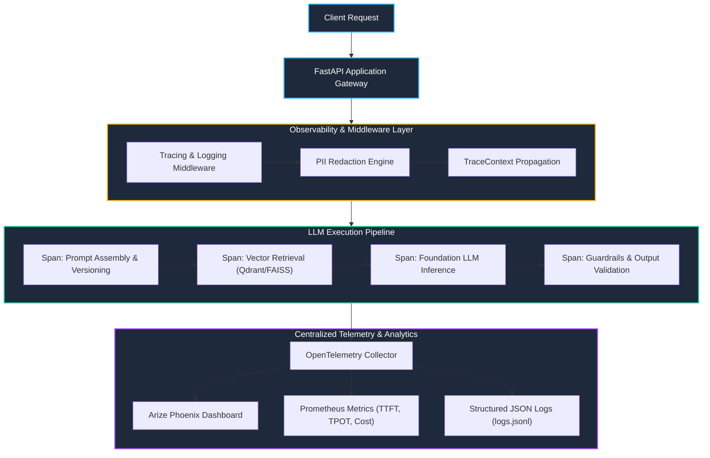

# K3 Day 13: Distributed LLM Observability, Tracing & Production Telemetry

## 1. Executive Overview & The Observability Imperative

Moving AI applications from proof-of-concept to production introduces severe non-determinism. Unlike traditional software where failure produces explicit stack traces, LLM failures manifest silently: hallucinated outputs, degraded retrieval relevance, context truncation, token cost spikes, and high tail latency.

Day 13 establishes the end-to-end telemetry architecture for AI systems, integrating **OpenTelemetry (OTel)** spans, structured JSON event logging, PII sanitization middlewares, and real-time Service Level Objectives (SLOs).

---

## 2. Distributed Tracing & Observability Architecture

The diagram below illustrates the end-to-end distributed tracing pipeline from API ingress to centralized telemetry backends (Arize Phoenix / OpenTelemetry Collector).



---

## 3. Core Service Level Indicators (SLIs) & Mathematical Metrics

Modern AI telemetry tracks four vital dimensions: Latency, Throughput, Cost, and Quality.

### 3.1 Latency Metrics (TTFT & TPOT)
1. **Time-to-First-Token (TTFT)**: The latency from request dispatch until the first token stream is received by the client (dominated by prompt pre-fill and network overhead):
   $$	ext{TTFT} = t_{	ext{first\_token}} - t_{	ext{request\_start}}$$
2. **Time-per-Output-Token (TPOT)**: The average generation latency per emitted token during the autoregressive decode phase:
   $$	ext{TPOT} = rac{t_{	ext{stream\_end}} - t_{	ext{first\_token}}}{N_{	ext{output\_tokens}} - 1}$$
3. **Total Round-Trip Latency ($T_{	ext{total}}$)**:
   $$T_{	ext{total}} = 	ext{TTFT} + (N_{	ext{output\_tokens}} - 1) \cdot 	ext{TPOT}$$

### 3.2 Token Cost & Economics
Total operational expenditure per inference call:
$$	ext{Cost} = (N_{	ext{prompt}} \cdot P_{	ext{input}}) + (N_{	ext{completion}} \cdot P_{	ext{output}})$$
where $P_{	ext{input}}$ and $P_{	ext{output}}$ represent per-token pricing for input and output tokens respectively.

---

## 4. Structured JSON Logging Schema & PII Masking

To ensure production compliance (GDPR, HIPAA, NIST AI RMF), all raw inputs and outputs must pass through automated PII filters prior to disk persistence.

### Standardized Telemetry Schema
```json
{
  "timestamp": "2026-08-25T09:30:00Z",
  "trace_id": "4bf92f3577b34da6a3ce929d0e0e4736",
  "span_id": "00f067aa0ba902b7",
  "parent_span_id": "5fb397be34d23b0f",
  "prompt_version": "v2.1.0",
  "model": "gpt-4o-mini",
  "metrics": {
    "prompt_tokens": 420,
    "completion_tokens": 128,
    "total_latency_ms": 680,
    "ttft_ms": 195,
    "tpot_ms": 3.78,
    "cost_usd": 0.000142
  },
  "attributes": {
    "user_id_hash": "e3b0c44298fc1c149afbf4c8996fb924",
    "pii_detected": false,
    "guardrails_passed": true
  }
}
```

---

## 5. Incident Detection & Real-Time Alerting Rules

Production observability systems must define explicit alerting thresholds:
- **SLO 1 (Availability)**: 99.5% of requests succeed without HTTP 5xx or unhandled exceptions.
- **SLO 2 (Latency)**: P95 TTFT $\le 800	ext{ ms}$; P99 Total Latency $\le 3000	ext{ ms}$.
- **SLO 3 (Drift & Error Rate)**: Fallback generator invocation rate $< 2.0\%$.

---

## 6. Related Notes & Master Index
- [[K3-Course-Overview|K3 Course Master Map of Content]]
- [[K3-Day10-Data-Pipeline-And-Observability|K3 Day 10: Data Pipelines & LLM Observability]]
- [[K3-Day14-AI-Evaluation-Benchmarking|K3 Day 14: AI Evaluation & Benchmarking]]
- [[Track2-Day22-LLMOps-Prompt-Versioning-LangSmith-Guardrails|Track 2 Day 22: LLMOps & LangSmith]]
