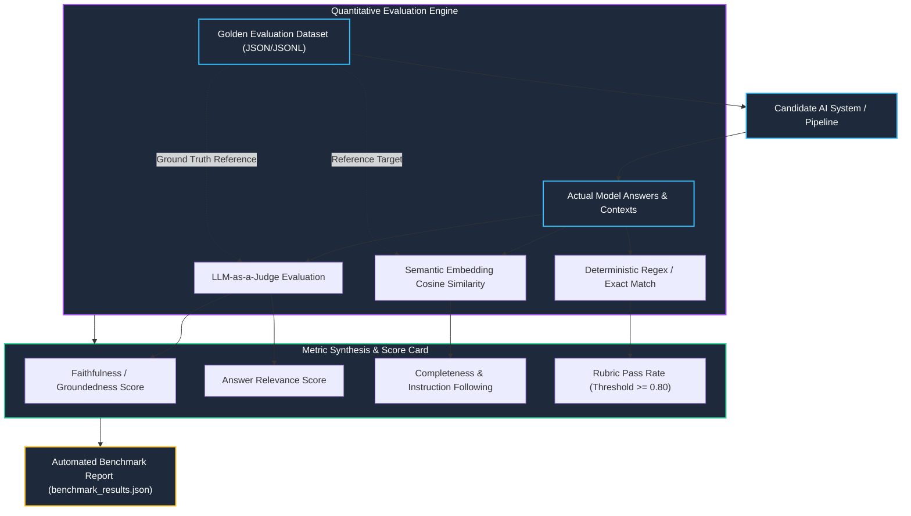

# K3 Day 14: AI Evaluation, Golden Datasets & LLM-as-a-Judge Benchmarking

## 1. Executive Overview

Without rigorous, reproducible evaluation, prompt engineering and model modifications are mere guesswork. Day 14 covers the construction of **Golden Evaluation Datasets**, automated evaluation harnesses, quantitative metric computation, and the **LLM-as-a-Judge** methodology.

---

## 2. Evaluation System Architecture & Execution Flow

The flowchart below demonstrates the automated benchmarking pipeline comparing candidate outputs against verified golden test sets using multi-judge arbitration.



---

## 3. Golden Dataset Engineering & Quality Assurance

A Golden Dataset must reflect diverse production scenarios:
1. **Factoid Queries**: Direct factual retrieval with single unambiguous answer.
2. **Multi-hop Reasoning**: Queries requiring synthesis across multiple chunks or documents.
3. **Adversarial / Out-of-Domain**: Unanswerable or trick queries testing hallucination resistance.
4. **Format-Constrained**: Queries demanding strict JSON/table structured responses.

### Golden Record Schema
```json
{
  "id": "eval_042",
  "question": "What is the formula for Reciprocal Rank Fusion (RRF)?",
  "ground_truth": "RRF_Score(d) = sum(1 / (k + rank_m(d))) where k is a smoothing constant.",
  "expected_sources": ["doc_rag_retrieval.md"],
  "evaluation_criteria": {
    "must_include": ["1 / (k + rank)", "smoothing constant"],
    "prohibited_terms": ["cosine multiplication"],
    "minimum_faithfulness": 0.85
  }
}
```

---

## 4. LLM-as-a-Judge Formulations & Bias Mitigation

Using powerful foundation models (GPT-4o, Claude 3.5 Sonnet, Gemini 1.5 Pro) as automated evaluators enables nuanced, qualitative evaluation at scale.

### Judge Bias Taxonomy & Mitigations
| Bias Type | Manifestation | Mitigation Strategy |
| :--- | :--- | :--- |
| **Position Bias** | Model favors candidate answer presented first in pairwise comparison | Swap position order (A/B and B/A) and require consistent wins |
| **Verbosity Bias** | Model rewards lengthy, verbose responses over concise ones | Penalize word count in prompt rubric; evaluate conciseness explicitly |
| **Self-Enhancement** | Model scores responses generated by its own model family higher | Use multi-model judge ensembles (e.g. Claude + GPT + Gemini) |

---

## 5. Related Notes & Master Index
- [[K3-Course-Overview|K3 Course Master Map of Content]]
- [[K3-Day08-RAG-Pipeline-And-Evaluation|K3 Day 08: Production RAG & Evaluation]]
- [[K3-Day13-Observability-Telemetry-Metrics|K3 Day 13: Observability & Telemetry]]
- [[Track2-Day22-LLMOps-Prompt-Versioning-LangSmith-Guardrails|Track 2 Day 22: LLMOps & LangSmith]]
