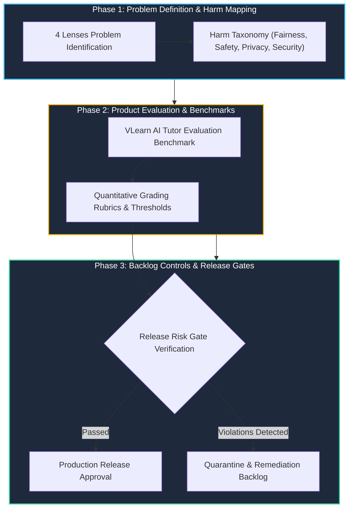

# Track 1: AI Product Management, Evaluation & Responsible AI Governance

## 1. Executive Overview

**Track 1 (AI Product Management & Responsible AI Governance)** focuses on defining, validating, and governing production AI applications from a Product Owner (PO) and Product Manager (PM) perspective.

Key areas include end-to-end AI Product Evaluation (VLearn AI Tutor benchmark), **Responsible AI in Production**, **Harm Mapping**, backlog safety controls, and automated release gates.

---

## 2. Responsible AI Product Lifecycle

---

## 3. Harm Taxonomy & Safety Mitigation Matrix

| Harm Category | Production Risk | Mitigation & Release Gate |
| :--- | :--- | :--- |
| **Privacy & PII** | User sensitive data leaked in model completions | Automated Presidio PII scrubbing & Regex maskers |
| **Toxicity & Abuse** | Toxic, hate-speech or unsafe recommendations | Llama Guard / NeMo Guardrail input-output filters |
| **Hallucination** | Incorrect medical, legal, or financial advice | RAG Triad Groundedness score $\ge 0.85$ |
| **Security & Injection** | Jailbreaking and system prompt leakage | Strict schema validation, Delimiter isolation & CoT obfuscation |

---

## 4. Related Notes & Master Index
- [[K3-Course-Overview|K3 Course Master Map of Content]]
- [[K3-Day02-AI-Product-Labs|K3 Day 02: AI Product Labs]]
- [[K3-Day11-Guardrails-HITL-Responsible-AI|K3 Day 11: Guardrails & Responsible AI]]
- [[VinUni-AI20k-Curriculum-Schedule|VinUni-AI20k Master Schedule]]
