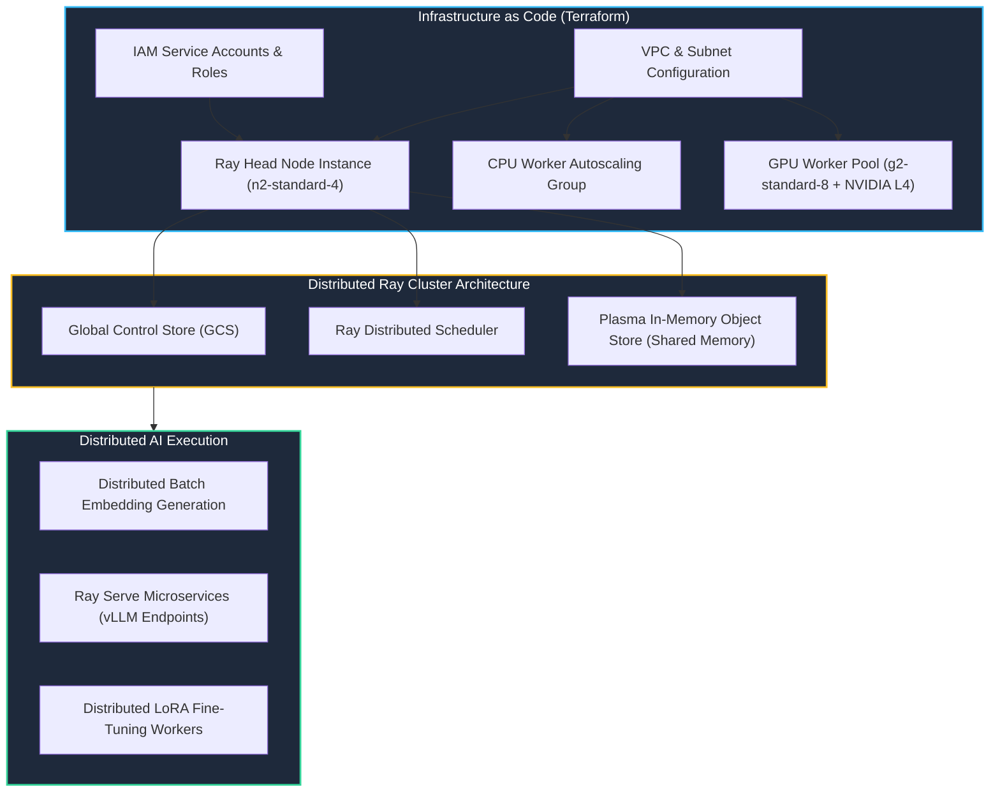

# Track 2 Day 16: Cloud AI Infrastructure, GPU Clusters & Distributed Ray Workloads

## 1. Executive Overview

Specialized AI systems demand dedicated computing infrastructure. Day 16 transitions from single-node local execution to distributed cloud infrastructure orchestration using **Terraform (IaC)**, **Ray Core/Serve**, and GPU hardware acceleration (NVIDIA A100 / L4 / T4).

---

## 2. Distributed Cloud Compute Topology

The architecture diagram illustrates a scalable cloud Ray cluster orchestrated via Terraform on GCP/AWS.



---

## 3. Infrastructure as Code (Terraform) Provisioning

Automated infrastructure provisioning prevents configuration drift and guarantees reproducible GPU environments.

### Core Terraform Resource Configuration
```hcl
resource "google_compute_instance" "ray_gpu_worker" {
  name         = "ray-worker-gpu-01"
  machine_type = "g2-standard-8"
  zone         = "us-central1-a"

  guest_accelerator {
    type  = "nvidia-l4"
    count = 1
  }

  scheduling {
    on_host_maintenance = "TERMINATE"
  }

  boot_disk {
    initialize_params {
      image = "projects/deeplearning-platform-release/global/images/family/common-cu121-debian-11"
      size  = 100
      type  = "pd-ssd"
    }
  }

  metadata_startup_script = file("${path.module}/user_data_gpu.sh")
}
```

---

## 4. Ray Distributed Actor & Task Paradigm

Ray enables seamless scaling from a single Python function to thousands of distributed nodes:
- `@ray.remote`: Transforms standard functions into stateless distributed tasks executed asynchronously.
- `@ray.remote(num_gpus=1)`: Provisions and pins dedicated GPU hardware acceleration to actor instances.
- `ray.put()` / `ray.get()`: Zero-copy in-memory object sharing via the Plasma store, bypassing costly serialization bottlenecks.

---

## 5. Related Notes & Master Index
- [[K3-Course-Overview|K3 Course Master Map of Content]]
- [[K3-Day12-Cloud-Services-And-Deployment|K3 Day 12: Cloud Services & Deployment]]
- [[Track2-Day17-Data-Pipelines-ETL-Stream-Batch|Track 2 Day 17: Data Pipelines & ETL]]
- [[Track2-Day20-Model-Serving-Inference-Optimization|Track 2 Day 20: Model Serving Optimization]]
