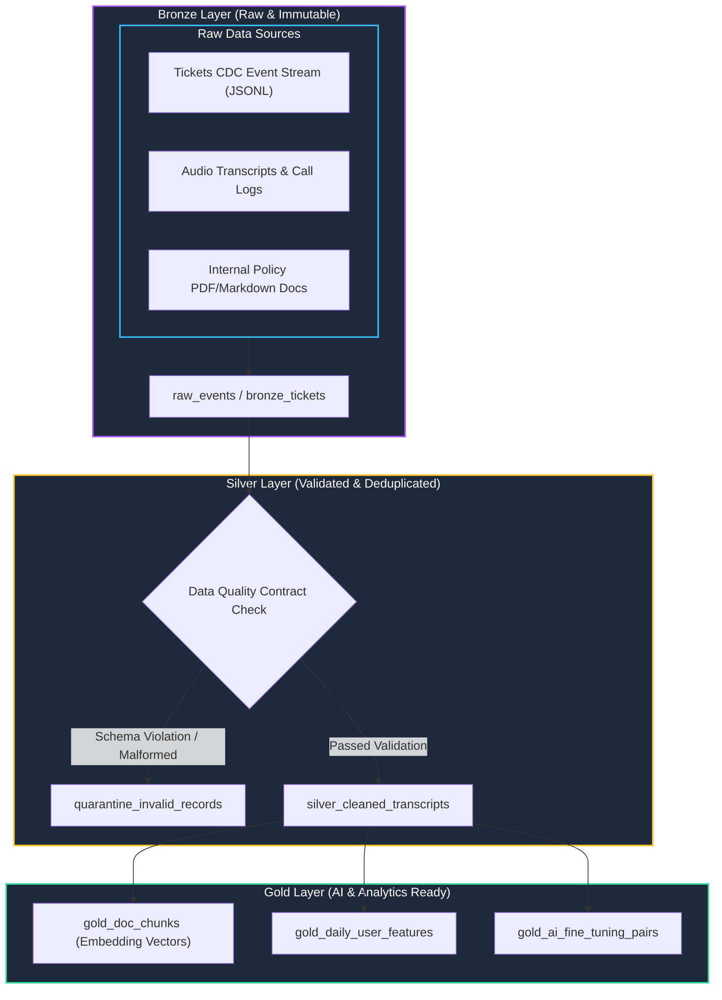

# Track 2 Day 17: Enterprise Data Pipelines, CDC & Unstructured AI Ingestion

## 1. Executive Overview

High-quality AI models and RAG systems require reliable, resilient data pipelines. Day 17 implements an enterprise-grade **Medallion Data Architecture** (Bronze $
ightarrow$ Silver $
ightarrow$ Gold) supporting streaming Change Data Capture (CDC), batch document ingestion, data quality contracts, quarantine tables, and OLAP processing via **DuckDB** and **dbt**.

---

## 2. Medallion Ingestion Architecture

The flowchart below traces raw data ingestion through validation filters, deduplication, and transformation into AI-ready Gold datasets.



---

## 3. High-Performance Ingestion with DuckDB & SQL Transforms

DuckDB provides vectorized, zero-overhead analytical querying directly over JSONL and Parquet files without requiring heavy database clusters.

### CDC Ingestion and Deduplication SQL Pattern
```sql
-- Deduplicate CDC stream and capture latest state by ticket_id
CREATE TABLE silver_tickets AS
WITH ranked_events AS (
    SELECT 
        ticket_id,
        customer_id,
        status,
        priority,
        updated_at,
        payload,
        ROW_NUMBER() OVER (
            PARTITION BY ticket_id 
            ORDER BY updated_at DESC, event_seq DESC
        ) AS rank_idx
    FROM bronze_tickets_raw
    WHERE ticket_id IS NOT NULL AND status IN ('OPEN', 'RESOLVED', 'CLOSED')
)
SELECT 
    ticket_id,
    customer_id,
    status,
    priority,
    updated_at,
    payload
FROM ranked_events
WHERE rank_idx = 1;
```

---

## 4. Data Quality Gates & Crash Resilience Testing

To ensure that bad data never contaminates downstream AI models, the pipeline enforces automated invariants:
- **Zero Schema Bleed**: Records with malformed JSON or unparseable timestamps route directly to `quarantine_records`.
- **Idempotent Ingestion**: Re-running the pipeline multiple times produces identical state without duplicate records.
- **Crash Recovery**: Transactions commit atomically; interrupted runs rollback without leaving dirty records.

---

## 5. Related Notes & Master Index
- [[K3-Course-Overview|K3 Course Master Map of Content]]
- [[K3-Day07-Data-Foundations-Embeddings-Vector-Stores|K3 Day 07: Data Foundations & Vector Stores]]
- [[Track2-Day18-Lakehouse-Architecture-Iceberg-Delta|Track 2 Day 18: Lakehouse & Open Table Formats]]
- [[Track2-Day19-Vector-Feature-Stores-Hybrid-Search-Feast|Track 2 Day 19: Vector Feature Stores]]
