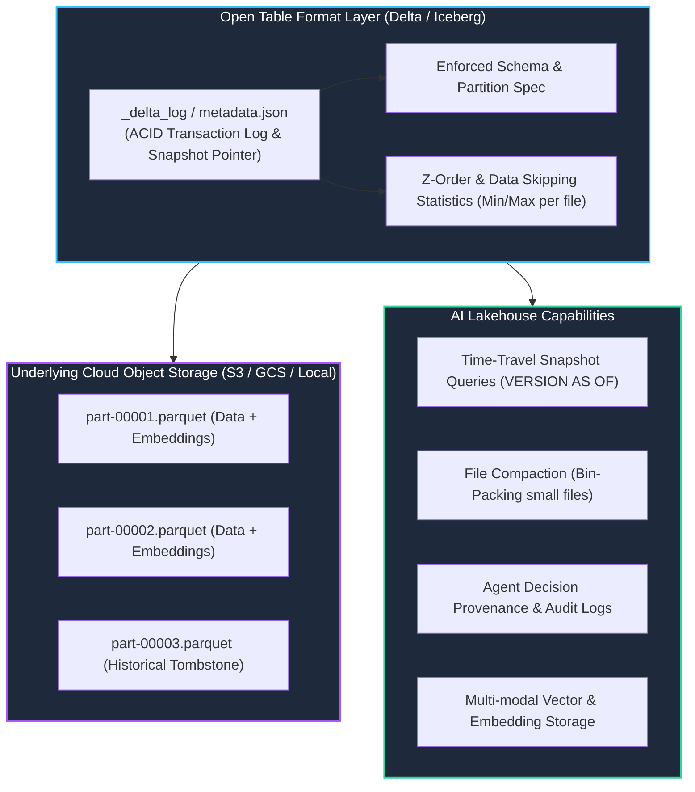

# Track 2 Day 18: Open Table Formats & Lakehouse Architecture (Iceberg & Delta Lake)

## 1. Executive Overview

Traditional data lakes built on raw object stores (S3/GCS) suffer from lack of ACID transactions, difficult schema evolution, slow file listing, and lack of reproducible time-travel snapshots.

Day 18 explores modern **Open Table Formats** (**Delta Lake** and **Apache Iceberg**), enabling ACID guarantees, time-travel reproducibility for AI training datasets, file compaction, and multi-modal vector table integration.

---

## 2. Lakehouse Metadata & Transaction Architecture

The diagram illustrates how Delta Lake and Apache Iceberg maintain transaction logs above immutable Parquet data files.



---

## 3. ACID Guarantees & Time-Travel Reproducibility

For AI and ML systems, data reproducibility is critical: if a model was trained on data as of version 4, retraining or auditing requires exact state reproduction.

### Time-Travel Query Syntax (Delta / PySpark)
```python
# Read dataset at exact historical version snapshot
df_v2 = spark.read.format("delta").option("versionAsOf", 2).load("/lakehouse/gold_ai_dataset")

# Read dataset as of a specific timestamp in the past
df_ts = spark.read.format("delta").option("timestampAsOf", "2026-08-18 10:00:00").load("/lakehouse/gold_ai_dataset")
```

---

## 4. Performance Tuning: Compaction & Z-Ordering

Small files degrade read throughput on cloud object storage.
- **Compaction (`OPTIMIZE`)**: Merges thousands of small micro-batch parquet files into optimal ~512MB–1GB files.
- **Z-Order Indexing**: Multidimensional clustering algorithm that co-locates related data along multiple columns (e.g. `embedding_cluster`, `created_date`) to maximize partition and file pruning during queries.

---

## 5. Related Notes & Master Index
- [[K3-Course-Overview|K3 Course Master Map of Content]]
- [[Track2-Day17-Data-Pipelines-ETL-Stream-Batch|Track 2 Day 17: Data Pipelines & ETL]]
- [[Track2-Day19-Vector-Feature-Stores-Hybrid-Search-Feast|Track 2 Day 19: Vector Feature Stores]]
- [[Track2-Day21-CICD-for-AI-Systems-DVC-MLflow|Track 2 Day 21: CI/CD for AI Systems]]
