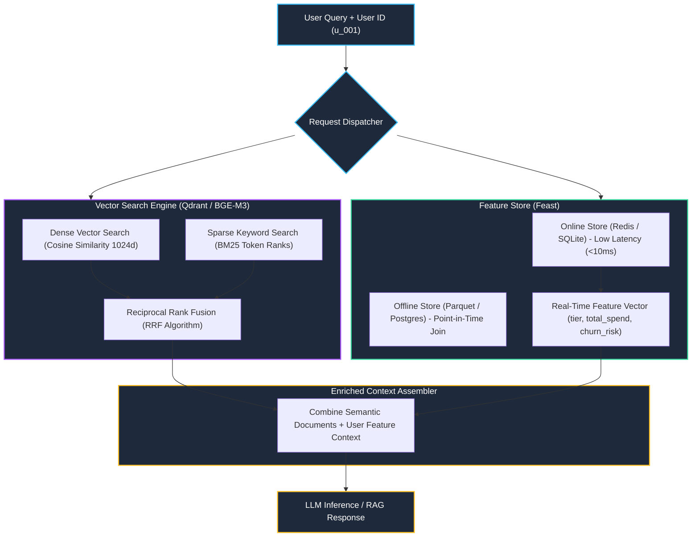

# Track 2 Day 19: High-Throughput Vector Feature Stores & Hybrid Search (Qdrant & Feast)

## 1. Executive Overview

Modern production AI architectures require uniting unstructured semantic embeddings with structured, real-time feature context. Day 19 combines **Qdrant Vector Database** (executing BM25 + dense hybrid search) with **Feast Feature Store** (providing point-in-time correct historical features and sub-10ms online key-value retrieval).

---

## 2. Dual-Engine Retrieval Architecture

The diagram illustrates how queries query dense/sparse vector indices while concurrently enriching prompts with real-time user context from Feast.

---

## 3. Reciprocal Rank Fusion (RRF) Mathematical Implementation

Hybrid search merges ranked lists from disparate retrieval methods (BM25 keyword rank and Dense semantic vector rank) without requiring score normalization:

$$RRF\_Score(d) = \sum_{m \in M} rac{1}{k + r_m(d)}$$
where $M = \{	ext{BM25}, 	ext{Dense}\}$, $k = 60$ is the standard smoothing constant, and $r_m(d)$ is the 1-based rank index of document $d$ within retriever $m$.

---

## 4. Feast Feature Store & Point-in-Time (PIT) Joins

To avoid data leakage during model training and ensure zero training-serving skew:
- **`get_historical_features()`**: Executes an AS-OF point-in-time join, matching training entity timestamps with historical feature values.
- **`get_online_features()`**: Directly queries the in-memory/Redis key-value store with $P99 < 10	ext{ ms}$.

---

## 5. Related Notes & Master Index
- [[K3-Course-Overview|K3 Course Master Map of Content]]
- [[K3-Day07-Data-Foundations-Embeddings-Vector-Stores|K3 Day 07: Data Foundations & Vector Stores]]
- [[Track2-Day18-Lakehouse-Architecture-Iceberg-Delta|Track 2 Day 18: Lakehouse & Open Table Formats]]
- [[Track2-Day20-Model-Serving-Inference-Optimization|Track 2 Day 20: Model Serving Optimization]]
