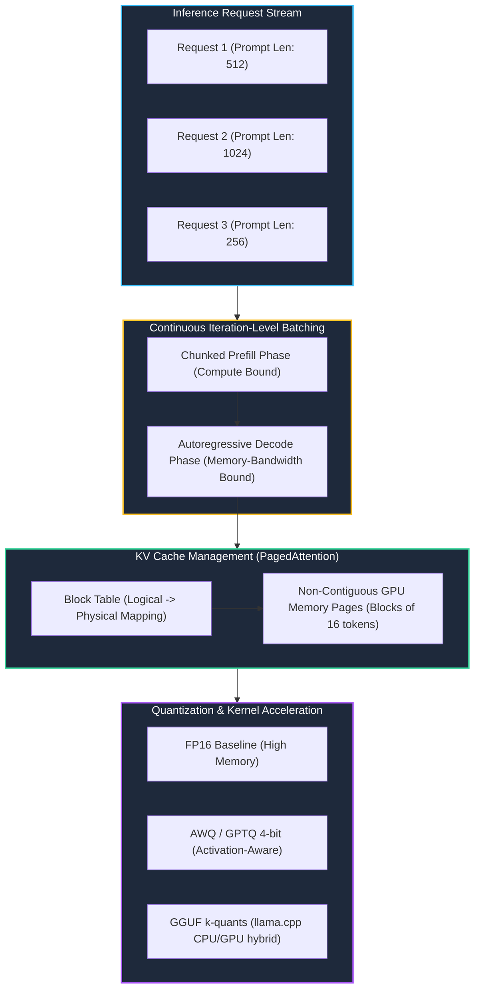

# Track 2 Day 20: High-Performance Model Serving & Inference Optimization

## 1. Executive Overview

Deploying LLMs in production requires maximizing throughput (tokens/second) while minimizing operational latency and GPU memory overhead. Day 20 covers high-throughput inference engines (**`vLLM`**, **`llama.cpp`**, **Triton**), memory management via **PagedAttention**, weight quantization (GGUF, AWQ, FP8), and empirical latency benchmarking (TTFT, TPOT, P50/P95/P99).

---

## 2. Inference Engine Architecture & Memory Management

The diagram contrasts standard continuous KV-cache fragmentation against vLLM PagedAttention virtual memory management.

---

## 3. Core Inference Performance Dimensions

1. **Pre-fill Phase (Compute Bound)**:
   Processes the full input prompt simultaneously using parallel matrix multiplication ($GEMM$).
2. **Decode Phase (Memory Bandwidth Bound)**:
   Generates one token at a time sequentially. Throughput is limited by the rate at which GPU weights and the KV-cache can be loaded into SRAM ($GEMV$).
3. **Continuous Iteration-Level Batching**:
   Rather than waiting for the slowest sequence in a batch to finish (static batching), new requests immediately enter the iteration loop as finished requests depart, increasing throughput by up to $4	imes$.

---

## 4. Quantization Matrix & Trade-offs

| Quantization Method | Precision | VRAM Reduction | Perplexity Degradation | Optimal Hardware |
| :--- | :---: | :---: | :---: | :--- |
| **FP16 / BF16** | 16-bit | Baseline (100%) | Zero | High-end GPUs (A100/H100) |
| **FP8 (E4M3)** | 8-bit | ~50% reduction | $< 0.5\%$ | NVIDIA Hopper / Ada Lovelace |
| **AWQ / GPTQ** | 4-bit | ~70% reduction | Minimal ($< 1\%$) | NVIDIA Turing, Ampere, Ada |
| **GGUF (Q4_K_M)** | 4-bit | ~72% reduction | Low | Apple Silicon / CPU / Low-end GPU |

---

## 5. Related Notes & Master Index
- [[K3-Course-Overview|K3 Course Master Map of Content]]
- [[K3-Day05-Theoretical-LLM-Foundations|K3 Day 05: Theoretical LLM Foundations]]
- [[Track2-Day16-Cloud-AI-Infrastructure-Ray|Track 2 Day 16: Cloud AI Infrastructure]]
- [[Track2-Day21-CICD-for-AI-Systems-DVC-MLflow|Track 2 Day 21: CI/CD for AI Systems]]
