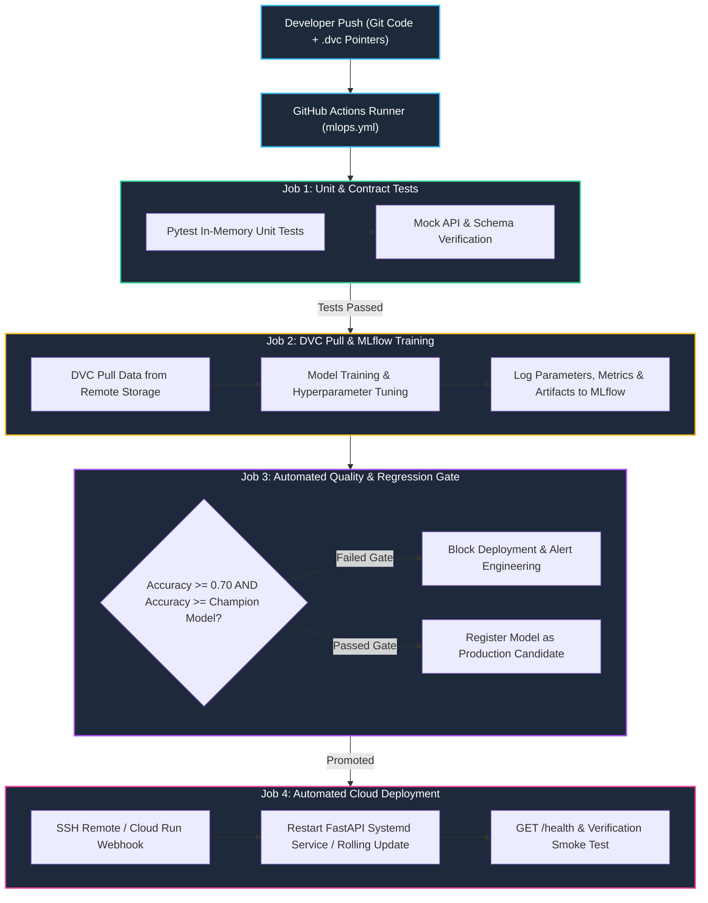

# Track 2 Day 21: Production CI/CD for AI Systems, DVC & Automated Release Gates

## 1. Executive Overview

Traditional software CI/CD tests only code. In AI systems, software behavior depends equally on **Code**, **Data**, and **Model Weights**.

Day 21 constructs an end-to-end automated MLOps CI/CD pipeline integrating **Git** (code), **DVC** (data/model versioning), **MLflow** (experiment tracking & model registry), **GitHub Actions** (CI runner), automated evaluation release gates ($	ext{Accuracy} \ge 0.70$), and continuous zero-downtime deployment to production FastAPI endpoints.

---

## 2. End-to-End MLOps CI/CD Pipeline Architecture

The workflow below illustrates the 4 sequential CI/CD stages triggered automatically on every git push or pull request.



---

## 3. Data & Model Versioning with DVC

DVC stores small pointer files (`.dvc`) in Git while offloading massive datasets and weights to cloud storage (S3, GCS, DagsHub).

### Typical DVC Configuration
```yaml
stages:
  train:
    cmd: python src/train.py
    deps:
      - src/train.py
      - data/train_phase1.csv.dvc
      - params.yaml
    params:
      - train.n_estimators
      - train.max_depth
    outs:
      - models/model.pkl
    metrics:
      - outputs/metrics.json:
          cache: false
```

---

## 4. Automated Release Gate Evaluation

Deployment scripts execute strict conditional gates:
1. **Absolute Performance Gate**: Candidate model accuracy must satisfy $	ext{Accuracy} \ge 0.70$.
2. **Relative Regression Gate**: Candidate accuracy must equal or exceed currently deployed production champion model ($\Delta 	ext{Acc} \ge 0.00$).
3. **Data Drift Gate**: Feature distribution Kolmogorov-Smirnov test $p	ext{-value} > 0.05$.

---

## 5. Related Notes & Master Index
- [[K3-Course-Overview|K3 Course Master Map of Content]]
- [[K3-Day12-Cloud-Services-And-Deployment|K3 Day 12: Cloud Services & Deployment]]
- [[Track2-Day20-Model-Serving-Inference-Optimization|Track 2 Day 20: Model Serving Optimization]]
- [[Track2-Day22-LLMOps-Prompt-Versioning-LangSmith-Guardrails|Track 2 Day 22: LLMOps & LangSmith]]
