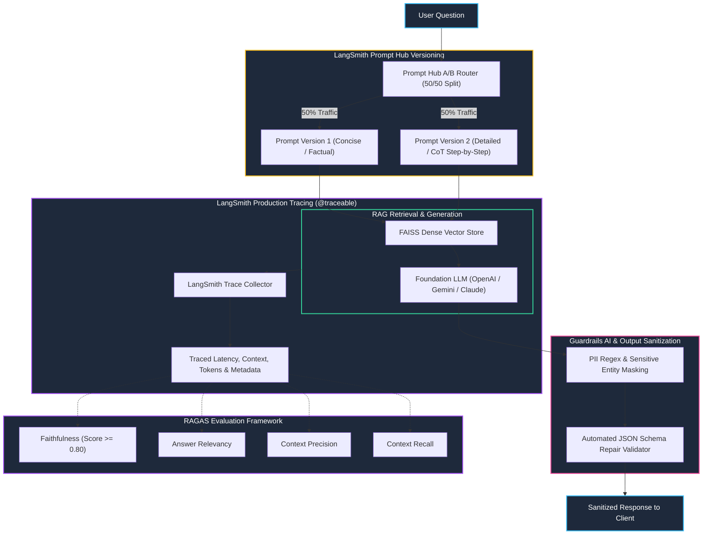

# Track 2 Day 22: LLMOps, Prompt Hub Versioning, RAGAS & Guardrails AI

## 1. Executive Overview

LLMOps expands traditional MLOps to handle non-deterministic foundation models, dynamic prompt management, automated RAG evaluation, and output guardrails.

Day 22 completes the Track 2 curriculum by building a production LLM platform integrating **LangChain LCEL**, **LangSmith Distributed Tracing**, **Prompt Hub Versioning & A/B Routing**, **RAGAS Quantitative Evaluation** (Faithfulness, Answer Relevancy, Context Precision/Recall), and **Guardrails AI** (PII redaction & automated JSON schema correction).

---

## 2. Production LLMOps Lifecycle Architecture

The architecture diagram outlines the runtime flow from client request through Prompt Hub A/B routing, vector retrieval, LangSmith tracing, and Guardrails validation.



---

## 3. LangSmith Tracing with `@traceable`

LangSmith enables granular span-level inspection into every step of complex chains:
```python
from langsmith import traceable

@traceable(name="execute_rag_pipeline", run_type="chain")
def run_rag(question: str, prompt_version: str):
    docs = retriever.invoke(question)
    prompt = prompt_hub.pull(prompt_version)
    response = llm.invoke(prompt.format(context=docs, question=question))
    return response.content
```

---

## 4. Quantitative RAG Evaluation (RAGAS Metrics)

RAGAS provides 4 industry-standard quantitative metrics:
1. **Faithfulness**: Proportion of statements in the answer that can be directly inferred from the retrieved context:
   $$	ext{Faithfulness} = rac{|	ext{Verified Claims from Context}|}{|	ext{Total Claims in Answer}|} \ge 0.80$$
2. **Answer Relevancy**: Semantic cosine similarity between original user question and generated answer.
3. **Context Precision**: Signal-to-noise ratio of relevant chunks ranked at top positions.
4. **Context Recall**: Extent to which retrieved context covers all ground-truth reference points.

---

## 5. Guardrails AI: Automated JSON Repair & PII Masking

- **PII Validator**: Automatically redacts emails, phone numbers, and API keys (`[REDACTED_EMAIL]`).
- **JSON Format Validator**: Catches truncated JSON, missing closing braces, and unquoted keys, automatically self-repairing or triggering schema-constrained re-prompting.

---

## 6. Related Notes & Master Index
- [[K3-Course-Overview|K3 Course Master Map of Content]]
- [[K3-Day06-Production-Hardening-Advanced-Prompting|K3 Day 06: Production Hardening & Prompting]]
- [[K3-Day08-RAG-Pipeline-And-Evaluation|K3 Day 08: Production RAG & Evaluation]]
- [[K3-Day13-Observability-Telemetry-Metrics|K3 Day 13: Observability & Telemetry]]
- [[Track2-Day21-CICD-for-AI-Systems-DVC-MLflow|Track 2 Day 21: CI/CD for AI Systems]]
