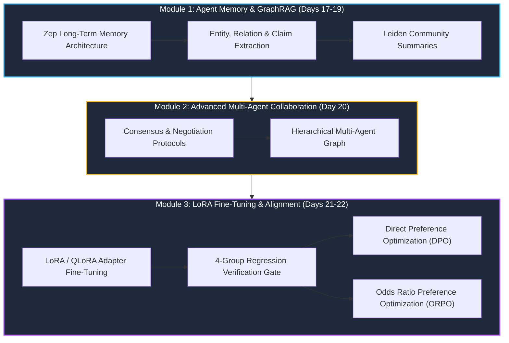

# Track 3: Advanced AI Systems — GraphRAG, Agent Memory, LoRA & DPO/ORPO Alignment

## 1. Executive Overview

**Track 3 (Advanced AI & Model Alignment)** explores the cutting edge of modern AI engineering: constructing persistent knowledge graph memory, advanced **GraphRAG** retrieval, parameter-efficient fine-tuning (**LoRA / QLoRA**), and preference alignment algorithms (**Direct Preference Optimization (DPO)** and **Odds Ratio Preference Optimization (ORPO)**).

---

## 2. Track 3 Curriculum Topology

---

## 3. GraphRAG: Hierarchical Knowledge Graphs vs Flat Dense Vectors

Standard dense vector search fails on holistic, global questions across large corpora (e.g. *"What are the main themes across all 50 customer interviews?"*).

GraphRAG solves this by:
1. Extracting entities, relationships, and claims using LLMs.
2. Clustering the graph into hierarchical communities using the **Leiden algorithm**.
3. Pre-generating summarization reports for every community level.
4. Answering global queries by synthesizing community summaries.

---

## 4. Model Alignment: DPO vs ORPO Mathematical Formulations

### 4.1 Direct Preference Optimization (DPO)
DPO eliminates the need for training a separate reward model by directly optimizing the language model policy on preferred ($y_w$) vs rejected ($y_l$) completions:

$$\mathcal{L}_{	ext{DPO}}(	heta; \pi_{	ext{ref}}) = -\mathbb{E}_{(x, y_w, y_l) \sim \mathcal{D}} \left[ \log \sigma \left( eta \log rac{\pi_	heta(y_w|x)}{\pi_{	ext{ref}}(y_w|x)} - eta \log rac{\pi_	heta(y_l|x)}{\pi_{	ext{ref}}(y_l|x)} 
ight) 
ight]$$

### 4.2 Odds Ratio Preference Optimization (ORPO)
ORPO unifies Supervised Fine-Tuning (SFT) and preference alignment into a single training step without requiring a reference model ($\pi_{	ext{ref}}$):

$$\mathcal{L}_{	ext{ORPO}}(	heta) = \mathcal{L}_{	ext{SFT}}(	heta) + \lambda \cdot \mathcal{L}_{	ext{OR}}(	heta)$$

---

## 5. Related Notes & Master Index
- [[K3-Course-Overview|K3 Course Master Map of Content]]
- [[K3-Day05-Theoretical-LLM-Foundations|K3 Day 05: Theoretical LLM Foundations]]
- [[K3-Day08-RAG-Pipeline-And-Evaluation|K3 Day 08: Production RAG & Evaluation]]
- [[VinUni-AI20k-Curriculum-Schedule|VinUni-AI20k Master Schedule]]
