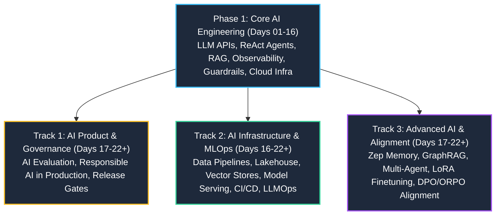

# VinUni-AI20k: Master Curriculum & Repository Schedule Tracker

> [!NOTE]
> **Automated Sync Telemetry**  
> **Last Checked:** `2026-08-25 09:30:53`  
> **Total GitHub Repositories Monitored:** `61`  
> **Local Clones in `~/projects`:** `15`

This document tracks all curriculum releases, lab assignments, and active tracks for the **VinUni-AI20k** AI Engineering program across **Cohort 3 (K3)** and **Cohort 4 (K4)**.

---

## Curriculum Multi-Track Architecture

---

## Phase 1: Core AI Engineering Foundations
*Total Repositories: 35*

| Repository Name | Cohort / Stage | Local Status | Description | Last Updated |
| :--- | :--- | :---: | :--- | :--- |
| [K3-Day01-LLM-API-Exploration](https://github.com/VinUni-AI20k/K3-Day01-LLM-API-Exploration) | `Day 01` | ☁️ Upstream | — | 2026-08-23 |
| [K4-Day01-LLM-API-Exploration](https://github.com/VinUni-AI20k/K4-Day01-LLM-API-Exploration) | `Day 01` | ☁️ Upstream | — | 2026-08-19 |
| [K3-Day02-AI-Product-Labs](https://github.com/VinUni-AI20k/K3-Day02-AI-Product-Labs) | `Day 02` | ☁️ Upstream | — | 2026-08-09 |
| [K4-Day02-AI-Product-Labs](https://github.com/VinUni-AI20k/K4-Day02-AI-Product-Labs) | `Day 02` | ☁️ Upstream | — | 2026-07-26 |
| [Day-3-Lab-Chatbot-vs-react-agent-E402](https://github.com/VinUni-AI20k/Day-3-Lab-Chatbot-vs-react-agent-E402) | `Day 03` | ☁️ Upstream | — | 2026-08-20 |
| [Day03-Lab-Chatbot-vs-react-agent](https://github.com/VinUni-AI20k/Day03-Lab-Chatbot-vs-react-agent) | `Day 03` | ☁️ Upstream | — | 2026-07-28 |
| [K3-Day03-Lab-Chatbot-vs-react-agent-E403](https://github.com/VinUni-AI20k/K3-Day03-Lab-Chatbot-vs-react-agent-E403) | `Day 03` | ☁️ Upstream | — | 2026-07-28 |
| [K4-Day03-Lab-Chatbot-vs-react-agent-E403](https://github.com/VinUni-AI20k/K4-Day03-Lab-Chatbot-vs-react-agent-E403) | `Day 03` | ☁️ Upstream | — | 2026-07-28 |
| [day03-cohorts34-chatbot-agentic-agent](https://github.com/VinUni-AI20k/day03-cohorts34-chatbot-agentic-agent) | `Day 03` | ☁️ Upstream | — | 2026-07-29 |
| [Day04-Assignment-AgentTriage](https://github.com/VinUni-AI20k/Day04-Assignment-AgentTriage) | `Day 04` | ☁️ Upstream | AICB Phase 1 · Day 4 — Prompt Engineering & Tool Calling. Auto-graded assignment: write a system prompt + 2 tool contracts for a student-services triage agent. Runs zero-key. | 2026-07-29 |
| [Day04-C401-Prompt-Engineering-Tool-Calling-Labs-student-k3](https://github.com/VinUni-AI20k/Day04-C401-Prompt-Engineering-Tool-Calling-Labs-student-k3) | `Day 04` | ☁️ Upstream | Day 04 C401 Prompt Engineering & Tool Calling Labs — student cohort K3 (morning) | 2026-07-29 |
| [Day04-C401-Prompt-Engineering-Tool-Calling-Labs-student-k4](https://github.com/VinUni-AI20k/Day04-C401-Prompt-Engineering-Tool-Calling-Labs-student-k4) | `Day 04` | ☁️ Upstream | Day 04 C401 Prompt Engineering & Tool Calling Labs — student cohort K4 (afternoon) | 2026-07-29 |
| [day04-cohorts34-prompt-engineering-tool-calling](https://github.com/VinUni-AI20k/day04-cohorts34-prompt-engineering-tool-calling) | `Day 04` | ☁️ Upstream | — | 2026-07-28 |
| [phase2-day5-multi-agent-lab](https://github.com/VinUni-AI20k/phase2-day5-multi-agent-lab) | `Day 05` | ☁️ Upstream | — | 2026-08-19 |
| [K3-Day07-Data-Foundations](https://github.com/VinUni-AI20k/K3-Day07-Data-Foundations) | `Day 07` | ✅ Cloned (`K3-Day07-Data-Foundations`) | Lab 7 — Data Foundations (Embedding & Vector Store) · biến thể K3: Dịch vụ đại học | 2026-08-03 |
| [K4-Day07-Data-Foundations](https://github.com/VinUni-AI20k/K4-Day07-Data-Foundations) | `Day 07` | ☁️ Upstream | Lab 7 — Data Foundations (Embedding & Vector Store) · biến thể K4: Chính sách e-commerce | 2026-08-17 |
| [K3-Day08-RAG-Pipeline](https://github.com/VinUni-AI20k/K3-Day08-RAG-Pipeline) | `Day 08` | ✅ Cloned (`K3-Day08-RAG-Pipeline`) | — | 2026-08-04 |
| [K4-Day08-RAG-Pipeline](https://github.com/VinUni-AI20k/K4-Day08-RAG-Pipeline) | `Day 08` | ☁️ Upstream | — | 2026-08-04 |
| [K3-Day9-Multi-Agent-A2A](https://github.com/VinUni-AI20k/K3-Day9-Multi-Agent-A2A) | `Day 09` | ✅ Cloned (`K3-Day09-Multi-Agent-A2A`) | — | 2026-08-05 |
| [K4-Day9-Multi-Agent-A2A](https://github.com/VinUni-AI20k/K4-Day9-Multi-Agent-A2A) | `Day 09` | ☁️ Upstream | — | 2026-08-05 |
| [day09-inclass-activity](https://github.com/VinUni-AI20k/day09-inclass-activity) | `Day 09` | ☁️ Upstream | — | 2026-08-04 |
| [K3_Day10_Data-Pipeline-Data-Observability](https://github.com/VinUni-AI20k/K3_Day10_Data-Pipeline-Data-Observability) | `Day 10` | ☁️ Upstream | — | 2026-08-06 |
| [K4_Day10_Data-Pipeline-Data-Observability](https://github.com/VinUni-AI20k/K4_Day10_Data-Pipeline-Data-Observability) | `Day 10` | ☁️ Upstream | — | 2026-08-06 |
| [day10-inclass-activity](https://github.com/VinUni-AI20k/day10-inclass-activity) | `Day 10` | ☁️ Upstream | — | 2026-08-04 |
| [Day12-inclass-activity-cloud-and-deployment](https://github.com/VinUni-AI20k/Day12-inclass-activity-cloud-and-deployment) | `Day 12` | ☁️ Upstream | — | 2026-08-10 |
| [K3-Day12-Cloud-Services-And-Deployment](https://github.com/VinUni-AI20k/K3-Day12-Cloud-Services-And-Deployment) | `Day 12` | ✅ Cloned (`K3-Day12-Cloud-Services-And-Deployment`) | — | 2026-08-10 |
| [K4-Day12-Cloud-Services-And-Deployment](https://github.com/VinUni-AI20k/K4-Day12-Cloud-Services-And-Deployment) | `Day 12` | ☁️ Upstream | — | 2026-08-10 |
| [batch04-day12_cloud_infras_and_deployment](https://github.com/VinUni-AI20k/batch04-day12_cloud_infras_and_deployment) | `Day 12` | ☁️ Upstream | — | 2026-08-19 |
| [day12-cohorts34-cloud-deployment](https://github.com/VinUni-AI20k/day12-cohorts34-cloud-deployment) | `Day 12` | ☁️ Upstream | — | 2026-08-09 |
| [Day13-K3-Observability](https://github.com/VinUni-AI20k/Day13-K3-Observability) | `Day 13` | ✅ Cloned (`Day13-K3-Observability-HaiXom18hChieuNay-`) | — | 2026-08-11 |
| [Day13-K4-Observability](https://github.com/VinUni-AI20k/Day13-K4-Observability) | `Day 13` | ☁️ Upstream | — | 2026-08-11 |
| [day13-k3-monitoring-llmops](https://github.com/VinUni-AI20k/day13-k3-monitoring-llmops) | `Day 13` | ☁️ Upstream | — | 2026-08-11 |
| [K3_Day14_AI_Evaluation](https://github.com/VinUni-AI20k/K3_Day14_AI_Evaluation) | `Day 14` | ✅ Cloned (`K3_Day14_AI_Evaluation`) | — | 2026-08-12 |
| [K4_Day14_AI_Evaluation](https://github.com/VinUni-AI20k/K4_Day14_AI_Evaluation) | `Day 14` | ☁️ Upstream | — | 2026-08-12 |
| [K34-Day18-Production-RAG](https://github.com/VinUni-AI20k/K34-Day18-Production-RAG) | `Day 18` | ☁️ Upstream | — | 2026-08-18 |

---

## Track 2: AI Infrastructure & MLOps
*Total Repositories: 8*

| Repository Name | Cohort / Stage | Local Status | Description | Last Updated |
| :--- | :--- | :---: | :--- | :--- |
| [Day16-Track2-Assignment](https://github.com/VinUni-AI20k/Day16-Track2-Assignment) | `Day 16` | ✅ Cloned (`Day16-Track2-Assignment`) | Cloud AI infrastructure | 2026-08-13 |
| [Day17-Track2-DataPipeline](https://github.com/VinUni-AI20k/Day17-Track2-DataPipeline) | `Day 17` | ✅ Cloned (`Day17-Track2-DataPipeline`) | — | 2026-08-16 |
| [Day18-Track2-Lakehouse-Lab](https://github.com/VinUni-AI20k/Day18-Track2-Lakehouse-Lab) | `Day 18` | ✅ Cloned (`Day18-Track2-Lakehouse-Lab`) | Day18-Track2-Lakehouse-Lab | 2026-08-18 |
| [Day19-Track2-VectorFeatureStore-Lab](https://github.com/VinUni-AI20k/Day19-Track2-VectorFeatureStore-Lab) | `Day 19` | ✅ Cloned (`Day19-Track2-VectorFeatureStore-Lab`) | Day19-Track2-VectorFeatureStore-Lab | 2026-08-18 |
| [Day20-Track2-ModelServing-Lab](https://github.com/VinUni-AI20k/Day20-Track2-ModelServing-Lab) | `Day 20` | ✅ Cloned (`Day20-Track2-ModelServing-Lab`) | Day20-Track2-ModelServing-Lab | 2026-08-19 |
| [K3-Track2-Day21-CI-CD-for-AI-Systems](https://github.com/VinUni-AI20k/K3-Track2-Day21-CI-CD-for-AI-Systems) | `Day 21` | ✅ Cloned (`K3-Track2-Day21-CI-CD-for-AI-Systems`) | — | 2026-08-21 |
| [K4-Track2-Day21-CI-CD-for-AI-Systems](https://github.com/VinUni-AI20k/K4-Track2-Day21-CI-CD-for-AI-Systems) | `Day 21` | ☁️ Upstream | — | 2026-08-21 |
| [Day22-Track2-LLMops-Prompt-versioning](https://github.com/VinUni-AI20k/Day22-Track2-LLMops-Prompt-versioning) | `Day 22` | ✅ Cloned (`Day22-Track2-LLMops-Prompt-versioning`) | — | 2026-08-24 |

---

## Track 3: Advanced AI & Model Alignment
*Total Repositories: 9*

| Repository Name | Cohort / Stage | Local Status | Description | Last Updated |
| :--- | :--- | :---: | :--- | :--- |
| [Day17-Track3-ZepMemory4Agent](https://github.com/VinUni-AI20k/Day17-Track3-ZepMemory4Agent) | `Day 17` | ☁️ Upstream | — | 2026-08-16 |
| [Day19-Track3-GraphRAG](https://github.com/VinUni-AI20k/Day19-Track3-GraphRAG) | `Day 19` | ☁️ Upstream | — | 2026-08-19 |
| [Day21-Track3-Finetuning-Lab](https://github.com/VinUni-AI20k/Day21-Track3-Finetuning-Lab) | `Day 21` | ☁️ Upstream | VinUni AICB · Day 21 Track 3 · LoRA fine-tuning lab — three frozen baselines + a four-group regression gate. Sibling of Day22-Track3-DPO-Alignment-Lab. | 2026-08-21 |
| [K3-Track3-Day22-DPO-ORPO-Alignment](https://github.com/VinUni-AI20k/K3-Track3-Day22-DPO-ORPO-Alignment) | `Day 22` | ☁️ Upstream | — | 2026-08-24 |
| [K4-Track3-Day22-DPO-ORPO-Alignment](https://github.com/VinUni-AI20k/K4-Track3-Day22-DPO-ORPO-Alignment) | `Day 22` | ☁️ Upstream | — | 2026-08-24 |
| [K3-Track3-Lab19-GraphRAG](https://github.com/VinUni-AI20k/K3-Track3-Lab19-GraphRAG) | `Lab 19` | ☁️ Upstream | Cohort 3 - Track 3 - Lab19 - GraphRAG | 2026-08-19 |
| [K4-Track3-Lab19-GraphRAG](https://github.com/VinUni-AI20k/K4-Track3-Lab19-GraphRAG) | `Lab 19` | ☁️ Upstream | Cohort 4 -Track3 - Lab19 - GraphRAG | 2026-08-19 |
| [VinUni-AI20k-K3-Track3-Lab20-MultiAgent](https://github.com/VinUni-AI20k/VinUni-AI20k-K3-Track3-Lab20-MultiAgent) | `Lab 20` | ☁️ Upstream | Cohort 3 - Track 3 - Lab20 - MultiAgent | 2026-08-20 |
| [VinUni-AI20k-K4-Track3-Lab20-MultiAgent](https://github.com/VinUni-AI20k/VinUni-AI20k-K4-Track3-Lab20-MultiAgent) | `Lab 20` | ☁️ Upstream | — | 2026-08-20 |

---

## Track 1: AI Product Management & Evaluation
*Total Repositories: 5*

| Repository Name | Cohort / Stage | Local Status | Description | Last Updated |
| :--- | :--- | :---: | :--- | :--- |
| [K3-Day-11-Guardrails-HITL-Responsible-AI](https://github.com/VinUni-AI20k/K3-Day-11-Guardrails-HITL-Responsible-AI) | `Day 11` | ✅ Cloned (`K3-Day-11-Guardrails-HITL-Responsible-AI`) | — | 2026-08-06 |
| [K4-Day-11-Guardrails-HITL-Responsible-AI](https://github.com/VinUni-AI20k/K4-Day-11-Guardrails-HITL-Responsible-AI) | `Day 11` | ☁️ Upstream | — | 2026-08-07 |
| [day11-cohort3-guardrails-hitl-responsible-ai](https://github.com/VinUni-AI20k/day11-cohort3-guardrails-hitl-responsible-ai) | `Day 11` | ☁️ Upstream | — | 2026-08-09 |
| [K3-Track1-Day20-21-AI-Evaluation](https://github.com/VinUni-AI20k/K3-Track1-Day20-21-AI-Evaluation) | `Day 20` | ☁️ Upstream | K3 Track 1 · Day 20-21 — AI Evaluation capstone: VLearn AI Tutor eval-kit | 2026-08-20 |
| [Day22-Responsible-AI-Production-Lab](https://github.com/VinUni-AI20k/Day22-Responsible-AI-Production-Lab) | `Day 22` | ☁️ Upstream | Day 22 PM/PO lab: Responsible AI in Production with evidence, harm mapping, backlog controls and release gates. | 2026-08-24 |

---

## Competitions & Hackathons
*Total Repositories: 4*

| Repository Name | Cohort / Stage | Local Status | Description | Last Updated |
| :--- | :--- | :---: | :--- | :--- |
| [Batch03-K3-AI-Product-Hackathon](https://github.com/VinUni-AI20k/Batch03-K3-AI-Product-Hackathon) | `Events & Arenas` | ✅ Cloned (`Batch03-K3-AI-Product-Hackathon-TeamLuaDao`) | Batch 03 Mini Hackathon AI (Khoá 3) — SPEC → Prototype → Demo | 2026-07-30 |
| [Batch03-K4-AI-Product-Hackathon](https://github.com/VinUni-AI20k/Batch03-K4-AI-Product-Hackathon) | `Events & Arenas` | ☁️ Upstream | Batch 03 Mini Hackathon AI (Khoá 4) — SPEC → Prototype → Demo | 2026-07-30 |
| [D302-VibeCoding-Competition](https://github.com/VinUni-AI20k/D302-VibeCoding-Competition) | `Events & Arenas` | ☁️ Upstream | — | 2026-08-12 |
| [Day16-AgentArena-Student](https://github.com/VinUni-AI20k/Day16-AgentArena-Student) | `Events & Arenas` | ☁️ Upstream | Day 16 — Agent Arena: lab thi đấu 120 phút (bộ đề sinh viên) | 2026-08-14 |

---

## General & In-Class Activities
*Total Repositories: 0*

| Repository Name | Cohort / Stage | Local Status | Description | Last Updated |
| :--- | :--- | :---: | :--- | :--- |

---

## Related Notes & Vault MOC
- [[K3-Course-Overview|K3 AI Engineering Master MOC]]
- [[Learning Dashboard|Master Learning Dashboard]]
- [[AI Engineering Roadmap|AI Engineering Roadmap]]
- [[MLOps Roadmap|MLOps Roadmap]]
